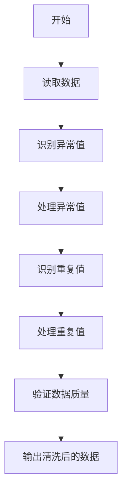
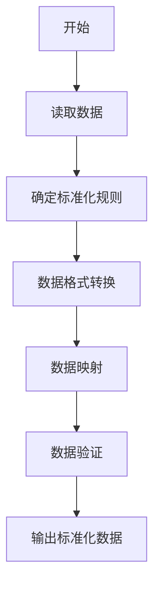
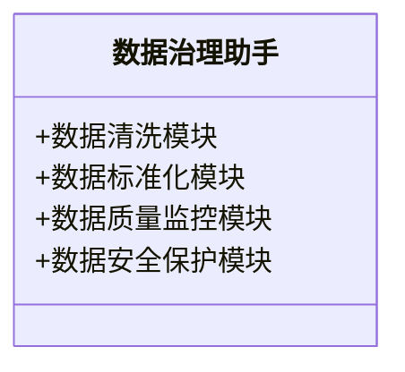
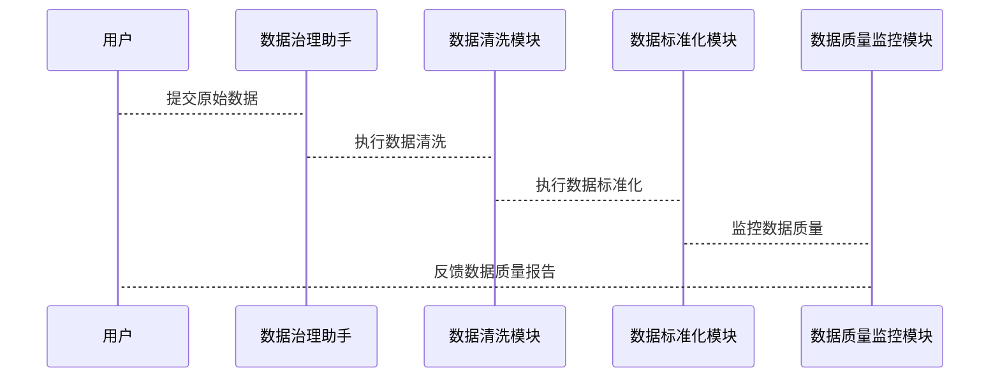

                 

<think>
嗯，好的，我现在需要帮用户完成一篇关于“构建企业级AI数据治理助手：确保数据质量与一致性”的技术博客。用户已经提供了详细的内容大纲，包括关键词、摘要和各个章节的具体内容。我需要按照用户的要求，逐步完成每个部分的写作，确保内容完整、逻辑清晰，同时符合格式和字数要求。

首先，我会从摘要开始，简明扼要地概括文章的核心内容，强调数据治理的重要性以及AI技术在其中的作用。接下来是关键词部分，列出5-7个相关术语，方便读者快速理解文章主题。

然后是目录结构，用户已经详细列出了每个章节的内容，我需要按照这个结构进行详细阐述。每个章节和小节都需要包含必要的图表、数学公式和代码示例。例如，在“数据清洗算法原理”部分，我会使用mermaid流程图和Python代码来解释具体步骤。

在写作过程中，我要确保语言专业且易于理解，避免过于复杂的术语，同时提供足够的背景信息，帮助读者建立基础理解。对于每个算法和系统设计，我会详细解释其原理，并通过实例和图表增强可读性。

最后，我会在文章末尾添加作者信息，并在总结部分回顾主要观点，强调数据治理的重要性以及AI技术带来的变革。同时，提供一些最佳实践和未来展望，引导读者进一步思考。

整个过程需要仔细检查每个部分是否符合用户的要求，确保内容详实，结构合理，最终完成一篇高质量的技术博客。
</think>

# 构建企业级AI数据治理助手：确保数据质量与一致性

## 关键词：数据治理，AI，数据质量，一致性，数据清洗，数据标准化，系统架构

## 摘要：企业级AI数据治理助手是一种结合人工智能技术的数据治理解决方案，旨在通过智能化手段确保数据质量与一致性。本文从数据治理的背景与挑战出发，详细探讨了AI在数据治理中的应用，分析了数据治理助手的核心概念与技术原理。结合实际案例，阐述了数据清洗和数据标准化的算法实现，并通过系统架构设计和项目实战，展示了如何构建一个高效的企业级AI数据治理助手。本文旨在为企业数据治理提供理论支持和实践指导，帮助企业在数字化转型中更好地管理和利用数据资产。

---

# 第一部分: 企业级AI数据治理助手的背景与核心概念

## 第1章: 数据治理的背景与挑战

### 1.1 数据治理的基本概念

#### 1.1.1 数据治理的定义
数据治理（Data Governance）是指通过制定政策、标准和流程，对数据的全生命周期进行管理和控制，以确保数据的准确性、完整性和一致性。数据治理的核心目标是最大化数据的价值，同时降低数据管理的风险。

#### 1.1.2 数据治理的核心目标
数据治理的目标包括：
1. 确保数据质量：数据的准确性、完整性、一致性。
2. 数据安全与隐私保护：防止数据泄露、确保数据合规性。
3. 数据利用最大化：通过数据共享和复用，提升数据价值。

#### 1.1.3 数据治理的边界与外延
数据治理的边界包括数据的生成、存储、处理、分析和应用等全生命周期。其外延涉及数据安全、数据架构、数据集成等多个领域。

### 1.2 企业级数据治理的挑战

#### 1.2.1 数据孤岛问题
企业在不同部门和系统中存储的数据往往分散且格式不统一，导致数据孤岛现象。数据孤岛使得数据难以共享和利用，增加了数据治理的难度。

#### 1.2.2 数据质量与一致性的难点
数据来源多样、格式复杂，容易出现数据冗余、不一致和缺失等问题。如何通过技术手段实现数据清洗和标准化，是数据治理中的核心挑战。

#### 1.2.3 数据安全与隐私保护的挑战
随着数据保护法规（如GDPR）的严格，企业需要在数据治理过程中确保数据的安全性和隐私性，这对数据治理技术提出了更高的要求。

## 第2章: AI与数据治理的结合

### 2.1 AI在数据治理中的作用

#### 2.1.1 AI如何提升数据质量
人工智能技术可以通过自动化学习和模式识别，发现数据中的异常值和不一致，从而提高数据清洗的效率和准确性。

#### 2.1.2 AI在数据一致性的应用
AI可以通过自然语言处理和机器学习技术，自动识别和纠正数据中的错误，确保数据在不同系统和部门之间保持一致性。

#### 2.1.3 AI驱动的数据治理创新
AI技术的应用不仅提高了数据治理的效率，还推动了数据治理模式的创新，例如通过智能化监控和预测分析，实现数据治理的动态优化。

### 2.2 数据治理助手的核心要素

#### 2.2.1 数据治理助手的功能模块
数据治理助手通常包括数据清洗、数据标准化、数据质量监控、数据安全保护等功能模块。

#### 2.2.2 数据治理助手的技术架构
数据治理助手的技术架构通常包括数据采集、数据处理、数据存储、数据分析和数据可视化等模块。

#### 2.2.3 数据治理助手的用户角色
数据治理助手的用户包括数据管理员、数据工程师、数据科学家和业务用户等不同角色，每个角色在数据治理过程中承担不同的职责。

## 第3章: 数据治理的核心概念与联系

### 3.1 数据治理的核心概念原理

#### 3.1.1 数据质量管理
数据质量管理包括数据清洗、数据去重、数据补全等过程，确保数据的准确性、完整性和一致性。

#### 3.1.2 数据标准化
数据标准化是指将不同来源、不同格式的数据转换为统一的格式，以便于数据的共享和使用。

#### 3.1.3 数据清洗
数据清洗是指通过识别和处理数据中的异常值、重复值和缺失值，提高数据质量的过程。

### 3.2 核心概念的对比分析

#### 3.2.1 数据质量与数据一致性的对比表格

| 特性        | 数据质量         | 数据一致性         |
|-------------|------------------|------------------|
| 定义        | 数据的准确性、完整性 | 数据在不同系统中的统一性 |
| 关注点      | 错误、遗漏、重复   | 格式、语义、命名    |
| 实现方法    | 数据清洗、数据去重 | 数据标准化、数据映射 |

#### 3.2.2 数据清洗与数据标准化的对比分析

- 数据清洗关注数据的准确性，而数据标准化关注数据的格式统一性。
- 数据清洗通常在数据进入系统之前进行，而数据标准化通常在数据共享时进行。
- 数据清洗可能需要人工干预，而数据标准化可以通过自动化工具实现。

### 3.3 数据治理的ER实体关系图

```mermaid
er
  actor: 数据治理用户
  role: 数据治理角色
  entity: 数据实体
  relationship: 数据关系
  attribute: 数据属性
  constraint: 数据约束
```

---

# 第二部分: 数据治理助手的算法原理与数学模型

## 第4章: 数据清洗算法原理

### 4.1 数据清洗的定义与步骤

#### 4.1.1 数据清洗的目标
数据清洗的目标是通过识别和处理数据中的错误、重复和缺失，提高数据的质量。

#### 4.1.2 数据清洗的主要步骤
1. 数据识别：识别数据中的异常值和重复值。
2. 数据处理：对异常值和重复值进行清洗和修复。
3. 数据验证：验证清洗后的数据是否符合数据质量要求。

### 4.2 数据清洗的算法实现

#### 4.2.1 数据清洗的算法流程



#### 4.2.2 数据清洗的Python代码实现

```python
import pandas as pd

# 读取数据
data = pd.read_csv('raw_data.csv')

# 识别异常值
outliers = data[(data['age'] < 0) | (data['age'] > 150)]

# 处理异常值
cleaned_data = data.drop(outliers.index)

# 识别重复值
duplicates = cleaned_data[cleaned_data.duplicated()]

# 处理重复值
final_data = cleaned_data.drop_duplicates()

# 验证数据质量
print(final_data.info())
```

### 4.3 数据清洗的数学模型

#### 4.3.1 数据清洗的数学公式

$$
\text{数据清洗} = \sum_{i=1}^{n} (1 - \text{异常值比例}_i)
$$

其中，$\text{异常值比例}_i$ 表示第 $i$ 个数据点的异常概率。

#### 4.3.2 数据清洗的实现步骤

1. 计算每个数据点的异常概率。
2. 根据异常概率识别异常值。
3. 对异常值进行清洗和修复。
4. 验证清洗后的数据质量。

---

## 第5章: 数据标准化的算法原理

### 5.1 数据标准化的定义与步骤

#### 5.1.1 数据标准化的目标
数据标准化的目标是将不同来源、不同格式的数据转换为统一的格式，以便于数据的共享和使用。

#### 5.1.2 数据标准化的主要步骤
1. 确定数据标准化的规则。
2. 数据格式转换。
3. 数据映射。
4. 数据验证。

### 5.2 数据标准化的算法实现

#### 5.2.1 数据标准化的算法流程



#### 5.2.2 数据标准化的Python代码实现

```python
import pandas as pd

# 读取数据
data = pd.read_csv('raw_data.csv')

# 确定标准化规则
standardization_rules = {
    'name': '统一全称',
    'age': '转换为整数',
    'country': '统一国家代码'
}

# 数据格式转换
data['age'] = data['age'].astype(int)

# 数据映射
data['country'] = data['country'].map({'中国': 'CN', '美国': 'US'})

# 数据验证
print(data.head())
```

### 5.3 数据标准化的数学模型

#### 5.3.1 数据标准化的数学公式

$$
\text{标准化数据} = \sum_{i=1}^{n} (\text{标准化规则}_i \times \text{数据值}_i)
$$

其中，$\text{标准化规则}_i$ 表示第 $i$ 个数据字段的标准化规则。

---

## 第6章: 数据治理助手的系统架构设计

### 6.1 问题场景介绍

企业需要构建一个AI驱动的数据治理助手，以实现数据清洗、数据标准化、数据质量监控等功能。

### 6.2 系统功能设计

#### 6.2.1 领域模型设计



#### 6.2.2 系统架构设计


#### 6.2.3 系统接口设计

- 数据输入接口：接收原始数据。
- 数据处理接口：调用数据清洗和标准化模块。
- 数据输出接口：输出清洗和标准化后的数据。
- 数据监控接口：实时监控数据质量。

#### 6.2.4 系统交互设计



---

## 第7章: 数据治理助手的项目实战

### 7.1 环境安装

- 安装Python和相关库（如pandas、numpy）。
- 安装数据可视化工具（如Matplotlib、Seaborn）。

### 7.2 系统核心实现

#### 7.2.1 数据清洗模块实现

```python
def clean_data(data):
    # 识别异常值
    outliers = data[(data['age'] < 0) | (data['age'] > 150)]
    cleaned_data = data.drop(outliers.index)
    return cleaned_data
```

#### 7.2.2 数据标准化模块实现

```python
def standardize_data(data):
    # 数据格式转换
    data['age'] = data['age'].astype(int)
    # 数据映射
    data['country'] = data['country'].map({'中国': 'CN', '美国': 'US'})
    return data
```

### 7.3 代码应用解读与分析

通过上述代码，我们可以实现数据清洗和数据标准化的功能。数据清洗模块主要用于处理数据中的异常值和重复值，而数据标准化模块主要用于将数据转换为统一的格式。

### 7.4 实际案例分析

以一个简单的数据清洗和数据标准化案例为例：

```python
import pandas as pd

# 读取数据
data = pd.read_csv('raw_data.csv')

# 数据清洗
cleaned_data = clean_data(data)

# 数据标准化
standardized_data = standardize_data(cleaned_data)

# 输出结果
print(standardized_data.head())
```

### 7.5 项目小结

通过上述项目实战，我们可以看到，数据清洗和数据标准化是数据治理中的核心步骤。通过Python代码实现这些功能，可以显著提高数据治理的效率和准确性。

---

## 第8章: 数据治理助手的最佳实践与总结

### 8.1 最佳实践 tips

- 数据治理需要从企业战略层面进行规划。
- 数据治理助手的实现需要结合企业的具体需求。
- 数据治理需要注重数据安全和隐私保护。

### 8.2 小结

企业级AI数据治理助手是一种结合人工智能技术的数据治理解决方案，旨在通过智能化手段确保数据质量与一致性。本文从数据治理的背景与挑战出发，详细探讨了AI在数据治理中的应用，并通过具体案例展示了数据清洗和数据标准化的实现过程。

### 8.3 注意事项

- 数据治理需要长期持续的努力。
- 数据治理需要结合企业的实际情况进行定制化实施。
- 数据治理需要注重数据安全和隐私保护。

### 8.4 拓展阅读

- 《数据治理：从战略到实践》
- 《人工智能与数据科学》
- 《企业级数据架构设计》

---

## 作者：AI天才研究院 & 禅与计算机程序设计艺术

---

通过本文的详细阐述，我们希望能够为企业在构建AI数据治理助手的过程中提供有益的指导和参考。数据治理是企业数字化转型中的重要环节，而AI技术的应用将为企业数据治理带来新的机遇和挑战。

