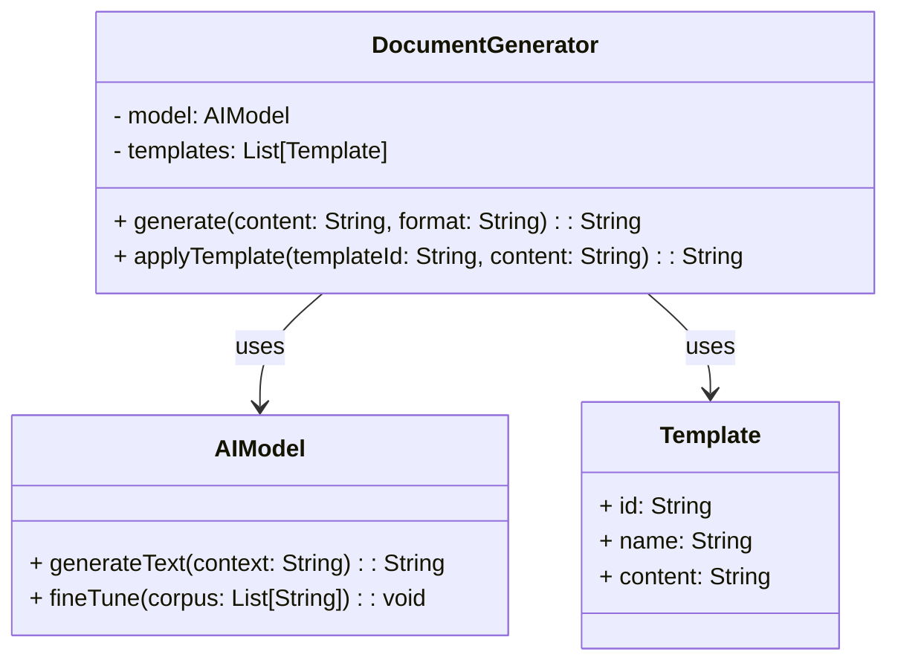
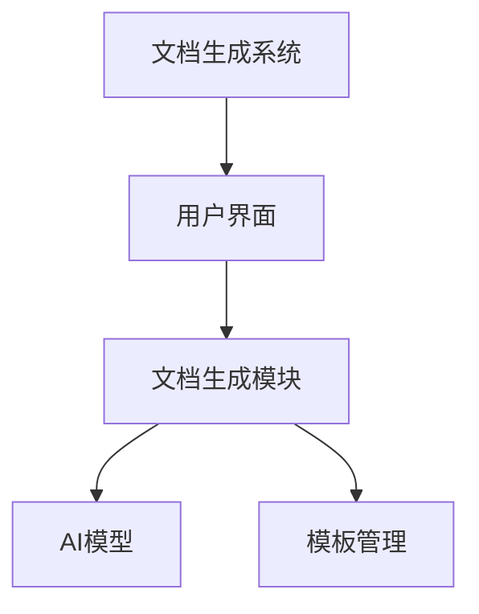

                 


# 构建企业级AI文档助手：自动化报告与提案生成

> 关键词：企业级AI文档助手，自动化报告生成，AI大模型，文档生成系统，自然语言处理

> 摘要：本文详细探讨了构建企业级AI文档助手的技术细节，包括AI大模型的基本原理、系统架构设计、项目实战与最佳实践。通过深入分析，我们展示了如何利用先进的自然语言处理技术，实现高效的自动化报告与提案生成，为企业文档管理带来革新。

---

## 第一部分: 企业级AI文档助手的背景与目标

### 第1章: AI文档助手的背景与问题背景

#### 1.1 问题背景

##### 1.1.1 传统文档生成的痛点
传统文档生成过程繁琐，依赖人工操作，效率低下。企业中的报告和提案生成通常需要编写、校对、调整等多个步骤，耗时且容易出错。

##### 1.1.2 企业对自动化文档生成的需求
随着企业规模的扩大，文档数量激增，人工生成效率难以满足需求。自动化文档生成成为提升企业效率的重要手段。

##### 1.1.3 AI技术在文档生成中的应用潜力
AI技术，特别是自然语言处理（NLP）和大模型技术，为自动化文档生成提供了新的可能性。通过深度学习模型，可以实现高质量、个性化的文档生成。

#### 1.2 问题描述

##### 1.2.1 文档生成的效率问题
传统文档生成依赖人工操作，效率低，难以满足企业需求。

##### 1.2.2 文档质量的不一致性
人工生成的文档可能存在质量不一致的问题，特别是在大规模生成时。

##### 1.2.3 个性化需求与通用解决方案的矛盾
企业有不同的文档类型和格式需求，通用解决方案难以满足个性化需求。

#### 1.3 问题解决

##### 1.3.1 引入AI技术的核心目标
通过AI技术实现高效、高质量的文档生成，降低人工成本，提高效率。

##### 1.3.2 AI文档助手的功能定位
AI文档助手旨在辅助用户快速生成符合要求的文档，支持多种格式和个性化需求。

##### 1.3.3 企业的实际应用场景
会议记录生成、项目提案撰写、报告整理等场景。

#### 1.4 边界与外延

##### 1.4.1 AI文档助手的适用范围
支持多种文档类型，如报告、提案、邮件等，但目前主要集中在文本生成领域。

##### 1.4.2 与传统文档生成工具的区别
AI文档助手结合了AI技术，能够自动化处理和生成内容，而传统工具仅提供模板和格式支持。

##### 1.4.3 边界条件与限制
目前的AI文档助手可能在生成复杂逻辑或需要深度专业知识的文档时仍需人工干预。

#### 1.5 概念结构与核心要素

##### 1.5.1 核心概念的构成
- **输入**：文档主题、关键词、目标格式。
- **输出**：自动生成的文档内容。
- **模型**：用于生成文本的深度学习模型。
- **用户反馈**：用户对生成文档的调整和优化。

##### 1.5.2 核心要素的对比表格
| 要素         | 描述                                   |
|--------------|--------------------------------------|
| 输入         | 文档主题、关键词等                    |
| 输出         | 自动生成的文本内容                   |
| 模型         | 基于Transformer的深度学习模型         |
| 用户反馈     | 用户对生成内容的修改和建议           |

##### 1.5.3 ER实体关系图
```mermaid
er
    %% ER Entity Relationship Diagram for Document Generation System
    %% Entities
    entity User {
        id: integer
        name: string
    }
    entity Document {
        id: integer
        content: string
        status: status_enum
    }
    entity Model {
        id: integer
        name: string
        type: model_type_enum
    }
    %% Relationships
    User one-to-many Document
    Document one-to-one Model
```

---

## 第二部分: AI大模型的基本原理与核心概念

### 第2章: AI大模型的核心原理

#### 2.1 AI大模型的基本原理

##### 2.1.1 深度学习的基本概念
深度学习是一种基于人工神经网络的机器学习方法，通过多层非线性变换，从数据中学习高层次特征。

##### 2.1.2 变压器架构的原理
Transformer架构由编码器和解码器组成，编码器负责将输入序列映射为高维向量，解码器负责将这些向量转换为输出序列。

##### 2.1.3 注意力机制的数学模型
注意力机制通过计算输入序列中每个位置的权重，聚焦重要信息。其数学模型如下：
$$
\text{Attention}(Q, K, V) = \text{softmax}\left(\frac{QK^T}{\sqrt{d_k}}\right)V
$$
其中，\(Q\)、\(K\)、\(V\)分别为查询、键、值向量，\(d_k\)为向量维度。

#### 2.2 大模型的训练方法

##### 2.2.1 监督学习与无监督学习
- 监督学习：基于标注数据训练模型。
- 无监督学习：利用未标注数据学习特征。

##### 2.2.2 预训练与微调的流程
预训练：在大规模通用数据上训练模型；微调：在特定任务数据上进一步优化。

##### 2.2.3 并行计算与分布式训练
通过并行计算和分布式训练加速模型训练过程。

#### 2.3 模型调优与优化策略

##### 2.3.1 参数调整的策略
通过超参数调整优化模型性能。

##### 2.3.2 模型压缩技术
减少模型参数数量，降低计算成本。

##### 2.3.3 模型推理优化
优化模型推理速度，减少资源消耗。

---

### 第3章: AI大模型的核心概念与联系

#### 3.1 核心概念的原理

##### 3.1.1 词嵌入的表示方法
词嵌入通过将词语映射到低维向量空间，捕捉词语语义信息。

##### 3.1.2 注意力机制的实现
注意力机制通过计算查询与键的相似度，确定每个位置的权重。

##### 3.1.3 梯度下降优化算法
常用Adam优化器，结合学习率衰减策略优化模型。

#### 3.2 核心概念的对比表格

| 概念         | 描述                                   |
|--------------|--------------------------------------|
| 词嵌入       | 将词语映射为低维向量                 |
| 注意力机制   | 确定序列中每个位置的权重             |
| 梯度下降     | 优化模型参数的算法                   |

#### 3.3 ER实体关系图
```mermaid
er
    %% ER Entity Relationship Diagram for Model Components
    entity Token {
        id: integer
        word: string
    }
    entity Embedding {
        id: integer
        vector: vector
    }
    entity Attention {
        id: integer
        weight: float
    }
    %% Relationships
    Token one-to-many Embedding
    Token one-to-many Attention
```

---

## 第三部分: 企业级AI文档助手的系统分析与架构设计

### 第4章: 系统分析与需求分析

#### 4.1 问题场景介绍

##### 4.1.1 企业文档生成的典型场景
- 会议记录生成
- 项目提案撰写
- 报告整理

##### 4.1.2 用户需求的多样性
- 不同部门对文档格式和内容有不同的要求
- 需要支持多种语言

##### 4.1.3 系统功能的必要性
- 快速生成文档
- 支持个性化定制
- 提供多种模板

#### 4.2 功能需求分析

##### 4.2.1 文档生成的基本功能
- 支持多种文档类型
- 自动生成标题和内容
- 提供多种模板选择

##### 4.2.2 个性化定制的需求
- 支持用户自定义模板
- 根据用户输入生成特定内容
- 提供编辑功能

##### 4.2.3 多语言支持的必要性
- 支持多种语言的文档生成
- 适应国际化需求

---

### 第5章: 系统架构设计

#### 5.1 系统功能设计

##### 5.1.1 领域模型的Mermaid类图


##### 5.1.2 功能模块的划分
- 文档生成模块
- 模板管理模块
- 用户界面模块

##### 5.1.3 实现方案的对比
| 方案         | 优点                         | 缺点                         |
|--------------|------------------------------|------------------------------|
| 基于模板生成 | 简单易实现                   | 创新性不足                   |
| AI模型生成   | 高度个性化                   | 训练成本高                   |

---

#### 5.2 系统架构设计

##### 5.2.1 总体架构


##### 5.2.2 关键模块的设计
- 用户界面模块：接收用户输入，显示生成结果。
- 文档生成模块：调用AI模型生成文本，或使用模板生成内容。
- AI模型：负责文本生成，支持微调和优化。

##### 5.2.3 实现方案的对比
| 方案         | 优点                         | 缺点                         |
|--------------|------------------------------|------------------------------|
| 单体架构     | 简单易部署                   | 扩展性差                   |
| 微服务架构   | 高度可扩展                   | 实现复杂                   |

---

### 第6章: 系统接口设计

#### 6.1 系统接口的设计

##### 6.1.1 API接口的设计
- `/generate`: 接收生成请求，返回生成内容。
- `/applyTemplate`: 应用模板生成文档。
- `/train`: 对模型进行微调。

##### 6.1.2 接口设计的对比
| 接口         | 请求参数                   | 响应参数                   |
|--------------|---------------------------|---------------------------|
| /generate    | content, format           | generated document         |
| /applyTemplate| templateId, content       | customized document        |
| /train       | modelId, corpus           | training status            |

---

### 第7章: 系统交互流程设计

#### 7.1 系统交互流程设计

##### 7.1.1 文档生成的交互流程
1. 用户通过界面向系统输入生成请求。
2. 系统调用AI模型生成文本。
3. 文本生成后，系统将其格式化并返回给用户。

##### 7.1.2 模板应用的交互流程
1. 用户选择模板并输入内容。
2. 系统应用模板生成文档。
3. 文档生成后，用户可以进行编辑和调整。

##### 7.1.3 微调的交互流程
1. 管理员上传微调数据。
2. 系统对模型进行微调。
3. 模型训练完成后，系统通知管理员。

---

## 第四部分: 项目实战

### 第8章: 环境配置与核心代码实现

#### 8.1 环境配置

##### 8.1.1 安装Python环境
```bash
python -m pip install --user -r requirements.txt
```

##### 8.1.2 安装深度学习框架
```bash
pip install tensorflow==2.10.0
pip install keras==2.11.0
pip install transformers==4.15.0
```

#### 8.2 核心代码实现

##### 8.2.1 文档生成模块的实现
```python
from transformers import AutoTokenizer, AutoModelForCausalLM

class DocumentGenerator:
    def __init__(self, model_name):
        self.tokenizer = AutoTokenizer.from_pretrained(model_name)
        self.model = AutoModelForCausalLM.from_pretrained(model_name)

    def generate(self, prompt, max_length=500):
        inputs = self.tokenizer.encode(prompt, return_tensors='np')
        outputs = self.model.generate(inputs, max_length=max_length, do_sample=True)
        return self.tokenizer.decode(outputs[0], skip_special_tokens=True)
```

##### 8.2.2 模板管理模块的实现
```python
class TemplateManager:
    def __init__(self):
        self.templates = {}

    def add_template(self, template_id, name, content):
        self.templates[template_id] = {
            'name': name,
            'content': content
        }

    def get_template(self, template_id):
        return self.templates.get(template_id, None)
```

---

### 第9章: 案例分析与项目总结

#### 9.1 案例分析

##### 9.1.1 会议记录生成
- **输入**：会议纪要主题、参会人员、会议内容。
- **输出**：自动生成结构化的会议记录。

##### 9.1.2 项目提案生成
- **输入**：项目目标、关键任务、资源分配。
- **输出**：自动生成项目提案。

#### 9.2 项目总结

##### 9.2.1 成功经验
- 系统设计灵活，支持多种文档类型。
- AI模型表现优秀，生成质量高。

##### 9.2.2 问题与不足
- 对复杂逻辑的处理仍需优化。
- 部分场景需要人工干预。

##### 9.2.3 优化方向
- 提升模型生成质量。
- 增强系统的可解释性。

---

## 第五部分: 最佳实践与未来展望

### 第10章: 最佳实践与注意事项

#### 10.1 最佳实践

##### 10.1.1 数据预处理
- 清洗数据，去除噪声。
- 标注数据，确保模型训练质量。

##### 10.1.2 模型调优
- 优化超参数，提升生成质量。
- 通过微调适应特定领域需求。

##### 10.1.3 系统维护
- 定期更新模型和模板。
- 监控系统性能，及时优化。

#### 10.2 注意事项

##### 10.2.1 数据隐私
- 确保数据安全，避免泄露。
- 遵守相关法律法规。

##### 10.2.2 系统稳定性
- 设计完善的错误处理机制。
- 提供备份和恢复方案。

##### 10.2.3 用户体验
- 提供友好的用户界面。
- 支持多种交互方式。

---

### 第11章: 未来展望与技术创新

#### 11.1 未来技术趋势

##### 11.1.1 多模态生成
- 结合图像、语音等多模态信息，生成更丰富的文档内容。

##### 11.1.2 自适应学习
- 模型能够自适应用户需求，动态调整生成策略。

##### 11.1.3 高效推理
- 提升模型推理速度，降低计算成本。

#### 11.2 技术创新点

##### 11.2.1 新的算法研究
- 开发更高效的文本生成算法。
- 探索新的注意力机制。

##### 11.2.2 新的系统架构
- 引入边缘计算，提升生成速度。
- 采用联邦学习，保护数据隐私。

##### 11.2.3 新的应用场景
- 支持更多语言，扩大应用范围。
- 拓展至其他领域，如代码生成、艺术创作等。

---

## 第六部分: 结论

### 第12章: 结语

#### 12.1 总结
本文详细探讨了构建企业级AI文档助手的技术细节，从AI大模型的基本原理到系统架构设计，再到项目实战与最佳实践，全面展示了如何利用AI技术实现高效的自动化报告与提案生成。

#### 12.2 展望
未来，随着AI技术的不断进步，企业级AI文档助手将更加智能化、个性化，为企业文档管理带来更大的价值。

---

## 作者

作者：AI天才研究院/AI Genius Institute & 禅与计算机程序设计艺术 /Zen And The Art of Computer Programming

