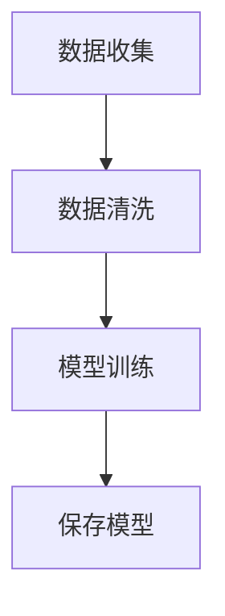
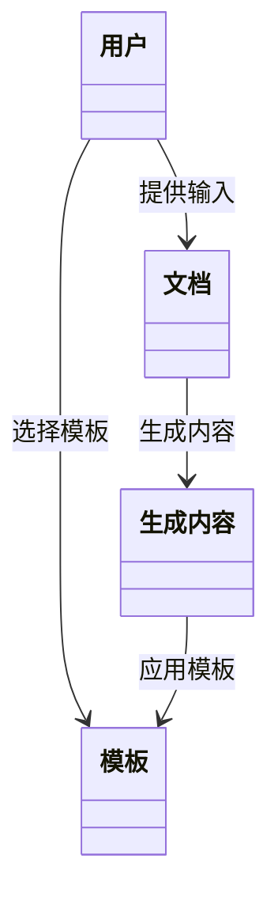
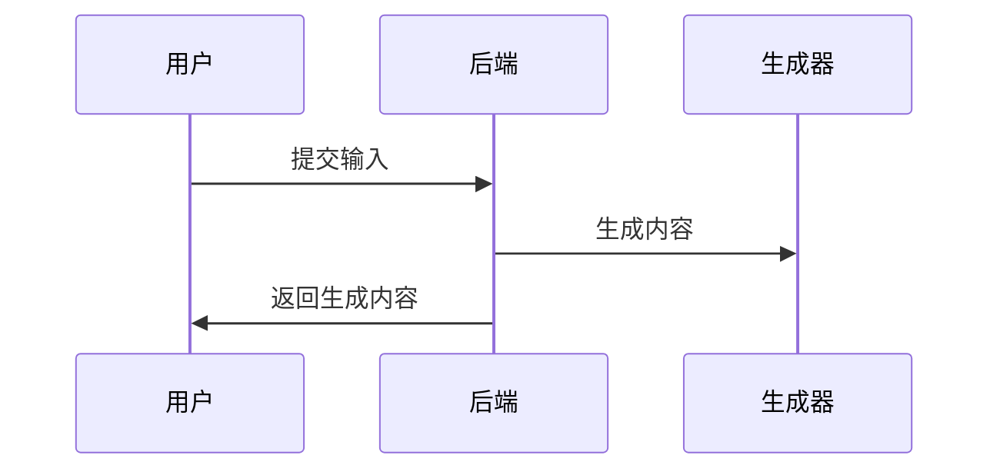

                 


# 构建企业级AI文档助手：自动生成报告与提案

## 关键词：AI文档助手，自然语言处理，机器学习，文档生成，企业级应用

## 摘要：本文详细探讨了如何利用AI技术构建企业级文档助手，实现自动生成报告与提案。从问题背景、核心概念到算法原理、系统架构，再到项目实战和最佳实践，全面解析了构建AI文档助手的关键步骤和方法。

---

## 第1章：背景介绍

### 1.1 问题背景
#### 1.1.1 企业文档处理的痛点
在企业中，文档处理是一项耗时且复杂的任务。员工需要手动编写报告、提案、会议记录等，效率低下且容易出错。传统方法依赖模板，但灵活性不足，难以满足多样化的需求。

#### 1.1.2 AI技术在文档处理中的潜力
AI技术，特别是自然语言处理（NLP）和生成式模型，为自动化文档生成提供了新的可能性。AI文档助手可以通过理解和分析输入内容，自动生成高质量的报告和提案，显著提高效率。

#### 1.1.3 企业级AI文档助手的定义与目标
企业级AI文档助手是一种基于AI的工具，旨在通过自动化方式生成专业文档。其目标是帮助员工从繁琐的文档工作中解放出来，提升生产力和质量。

### 1.2 问题描述
#### 1.2.1 文档生成的复杂性
文档生成需要考虑内容的逻辑性、语言的准确性和格式的规范性，传统方法难以高效完成。

#### 1.2.2 传统文档处理的低效性
手动编写文档不仅耗时，还容易出错，且难以快速适应变化的需求。

#### 1.2.3 企业对自动化文档处理的需求
企业需要高效、智能的工具来生成标准化的文档，以应对快速变化的商业环境。

### 1.3 问题解决
#### 1.3.1 AI技术如何解决文档生成问题
AI通过自然语言处理和生成模型，可以理解上下文并生成符合要求的文本，显著提高文档生成效率。

#### 1.3.2 自然语言处理在文档生成中的应用
NLP技术使AI能够理解输入内容的语义，生成连贯且相关的文本。

#### 1.3.3 企业级AI文档助手的核心功能
包括文档解析、内容生成、格式转换、模板管理等核心功能。

### 1.4 边界与外延
#### 1.4.1 企业级AI文档助手的边界
明确AI文档助手的功能范围，如不涉及文件存储或外部数据源的管理。

#### 1.4.2 企业级AI文档助手的核心要素组成
包括输入解析、内容生成、格式转换、模板管理、反馈优化等关键组成部分。

---

## 第2章：核心概念与联系

### 2.1 核心概念原理
#### 2.1.1 自然语言处理模型
介绍主流的NLP模型，如BERT、GPT等，及其在文档生成中的应用。

#### 2.1.2 机器学习算法
讨论监督学习、无监督学习和强化学习在文档生成中的作用。

### 2.2 概念属性特征对比
#### 2.2.1 不同模型的特征对比
使用表格对比不同NLP模型的优缺点，如GPT、BERT、GPT-2等。

### 2.3 ER实体关系图
使用Mermaid流程图展示系统实体关系，如用户、文档、模板等。

```mermaid
er
  actor 用户
  entity 文档
  entity 模板
  entity 生成内容
  用户 --> 文档: 提供输入
  用户 --> 模板: 选择模板
  文档 --> 生成内容: 生成内容
  生成内容 --> 模板: 应用模板
```

---

## 第3章：算法原理讲解

### 3.1 预训练与微调
#### 3.1.1 预训练过程
使用Mermaid流程图展示预训练步骤，如数据收集、模型训练等。



#### 3.1.2 微调过程
展示基于特定任务的微调步骤，如任务特定的数据增强和参数调整。

### 3.2 生成式模型
#### 3.2.1 GPT模型原理
解释GPT的生成机制，包括解码过程和损失函数。

### 3.3 代码实现
#### 3.3.1 模型训练代码
提供训练生成式模型的Python代码示例。

```python
import torch
import torch.nn as nn

class Generator(nn.Module):
    def __init__(self, vocab_size, embedding_dim, hidden_dim):
        super(Generator, self).__init__()
        self.embedding = nn.Embedding(vocab_size, embedding_dim)
        self.rnn = nn.RNN(embedding_dim, hidden_dim, batch_first=True)
        self.fc = nn.Linear(hidden_dim, vocab_size)
        
    def forward(self, input, hidden):
        embedded = self.embedding(input)
        output, hidden = self.rnn(embedded, hidden)
        output = self.fc(output.view(-1, hidden_dim))
        return output, hidden

model = Generator(vocab_size=10000, embedding_dim=256, hidden_dim=512)
```

---

## 第4章：系统分析与架构设计

### 4.1 项目介绍
#### 4.1.1 项目背景
介绍构建企业级AI文档助手的背景和目标。

### 4.2 系统功能设计
#### 4.2.1 领域模型
使用Mermaid类图展示系统的主要实体和它们之间的关系。



#### 4.2.2 系统架构
展示系统架构的分层结构，包括前端、后端和数据库。


### 4.3 接口设计
#### 4.3.1 接口描述
定义API接口，如RESTful API，用于接收输入、处理请求和返回生成内容。

### 4.4 交互流程图
展示用户与系统之间的交互流程。



---

## 第5章：项目实战

### 5.1 环境安装
#### 5.1.1 安装Python和相关库
列出所需的Python库，如`torch`、`transformers`等，并提供安装命令。

### 5.2 核心代码实现
#### 5.2.1 文档解析代码
提供解析输入文档的Python代码示例。

```python
import docx

def parse_docx(file_path):
    doc = docx.Document(file_path)
    content = '\n'.join([paragraph.text for paragraph in doc.paragraphs])
    return content

content = parse_docx('input.docx')
```

#### 5.2.2 内容生成代码
展示如何使用预训练模型生成内容。

```python
from transformers import GPT2LMHeadModel, GPT2Tokenizer

tokenizer = GPT2Tokenizer.from_pretrained('gpt2')
model = GPT2LMHeadModel.from_pretrained('gpt2')

input = "请根据以下内容生成报告："
inputs = tokenizer(input, return_tensors='np')
output = model.generate(inputs.input_ids, max_length=500)
print(tokenizer.decode(output[0], skip_special_tokens=True))
```

### 5.3 代码解读与分析
解释代码的功能和实现细节，帮助读者理解如何构建AI文档助手。

### 5.4 实际案例分析
通过具体案例分析，展示AI文档助手的实际应用和效果。

---

## 第6章：最佳实践与总结

### 6.1 最佳实践
#### 6.1.1 模型选择与优化
建议选择合适的模型并进行调优。

#### 6.1.2 数据质量与多样性
强调高质量和多样化数据的重要性。

#### 6.1.3 系统性能优化
提供优化系统性能的建议，如缓存机制和并行处理。

### 6.2 小结
总结全文内容，强调构建企业级AI文档助手的重要性和实现方法。

### 6.3 注意事项
提醒读者在实际应用中需要注意的问题，如数据隐私和模型泛化能力。

### 6.4 拓展阅读
推荐相关书籍和论文，供读者进一步学习。

---

## 作者：AI天才研究院/AI Genius Institute & 禅与计算机程序设计艺术 /Zen And The Art of Computer Programming

---

这篇文章系统地介绍了构建企业级AI文档助手的关键步骤和方法，从理论到实践，为读者提供了全面的指导。通过详细的代码示例和系统架构设计，帮助读者理解并实现高效的文档生成系统。

