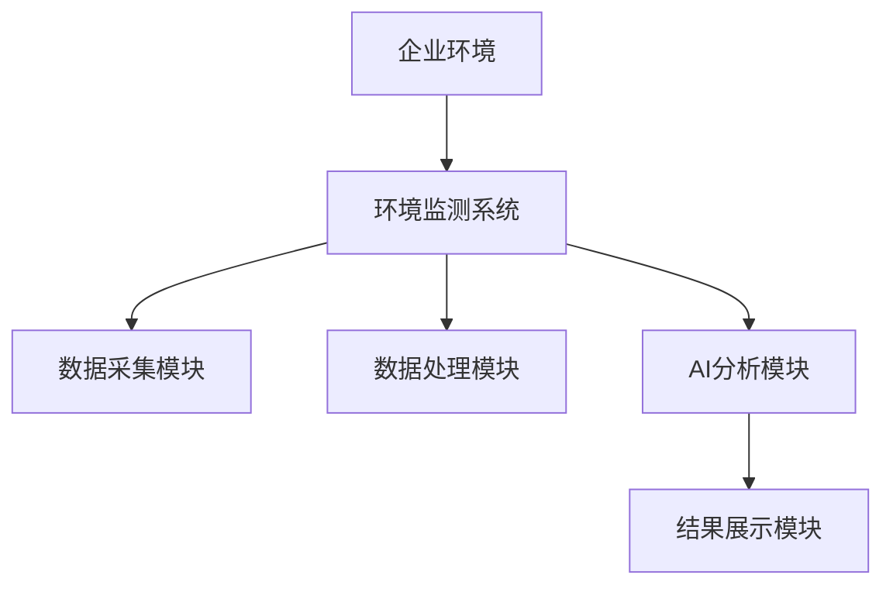

                 


# 构建企业级AI环境监测助手：合规与可持续发展

> **关键词**：企业级AI环境监测助手、合规性、可持续发展、环境监测、AI技术、系统架构

> **摘要**：  
本文旨在探讨如何构建一个高效的企业级AI环境监测助手，重点分析其在合规与可持续发展方面的应用。通过结合AI技术与环境监测，我们能够实时采集、分析环境数据，并提供智能化的决策支持，从而帮助企业满足合规要求，实现可持续发展目标。文章从背景介绍、核心概念、算法原理、系统架构设计、项目实战到最佳实践，全面解析构建此类系统的各个方面。

---

## 第一部分：背景介绍

### 第1章：问题背景

#### 1.1 企业级AI环境监测助手的定义与目标
企业级AI环境监测助手是一种基于人工智能技术的系统，用于实时监测和分析企业运营环境中的关键指标，如空气质量、能源消耗、碳排放等。其目标是通过智能化手段，帮助企业实现环境监测的自动化、高效化和合规化，同时推动可持续发展目标的实现。

#### 1.2 合规与可持续发展的背景
- **合规性要求**：随着环保法规的日益严格，企业需要确保其运营活动符合相关法律法规，避免因环境问题引发的法律风险。
- **可持续发展的重要性**：企业社会责任的增强使得可持续发展成为全球关注的焦点，通过减少资源消耗和碳排放，企业可以提升品牌形象，增强竞争力。
- **环境监测的关联性**：环境监测是实现合规与可持续发展的基础，通过实时监测数据，企业能够及时发现问题并采取措施，确保符合环保要求。

### 第2章：问题描述与解决

#### 2.1 问题背景
- **环境数据的复杂性**：环境数据涉及多种指标，如空气质量、温度、湿度、污染指数等，数据量大且复杂。
- **传统监测的局限性**：传统环境监测依赖人工操作，效率低、成本高，且难以实时分析数据。
- **合规性压力**：企业需要应对日益严格的环保法规，合规性要求对企业环境监测提出了更高的技术需求。

#### 2.2 问题解决
- **AI技术的应用**：通过引入AI技术，企业可以实现环境数据的实时采集、智能分析和预测，从而提高监测效率并降低合规风险。
- **智能化决策支持**：AI环境监测助手能够为企业提供智能化的决策支持，帮助企业优化资源配置，减少环境影响。

---

## 第二部分：核心概念与联系

### 第3章：核心概念

#### 3.1 数据采集与处理
- **数据来源**：环境监测数据可能来自传感器、数据库、外部API等多种来源。
- **数据预处理**：包括数据清洗、特征提取、数据标准化等步骤，确保数据的准确性和一致性。

#### 3.2 AI算法与模型
- **监督学习**：用于分类和回归问题，如预测空气质量指数。
- **无监督学习**：用于聚类分析，发现数据中的潜在模式。
- **强化学习**：用于动态环境中的优化决策，如能源消耗优化。

#### 3.3 反馈机制
- **实时反馈**：系统根据监测结果实时调整策略，如自动关闭超标排放的设备。
- **历史数据分析**：通过对历史数据的分析，优化监测模型，提升预测准确性。

### 第4章：系统架构设计

#### 4.1 系统架构图


#### 4.2 功能模块
- **数据采集模块**：负责从传感器或其他数据源获取环境数据。
- **数据处理模块**：对采集的数据进行清洗、转换和标准化处理。
- **AI分析模块**：利用机器学习算法对数据进行分析和预测。
- **结果展示模块**：以可视化的方式呈现分析结果，供企业决策者参考。

---

## 第三部分：算法原理讲解

### 第5章：算法原理

#### 5.1 机器学习算法
- **线性回归**：用于预测连续型变量，如空气质量指数。
- **随机森林**：用于分类和回归问题，具有高准确性和鲁棒性。
- **深度学习模型**：如LSTM，用于时间序列数据的预测。

#### 5.2 数学模型与公式
- **线性回归模型**：$$ y = \beta_0 + \beta_1 x + \epsilon $$
- **损失函数**：$$ L = \sum_{i=1}^{n} (y_i - \hat{y_i})^2 $$
- **梯度下降**：$$ \theta := \theta - \alpha \frac{\partial L}{\partial \theta} $$

#### 5.3 代码实现
```python
import pandas as pd
from sklearn.linear_model import LinearRegression

# 数据加载
data = pd.read_csv('environment_data.csv')

# 特征提取
X = data[['temperature', 'humidity']]
y = data['pollution_level']

# 模型训练
model = LinearRegression()
model.fit(X, y)

# 预测
new_data = pd.DataFrame({'temperature': [25], 'humidity': [60]})
prediction = model.predict(new_data)
print(prediction)
```

---

## 第四部分：系统分析与架构设计方案

### 第6章：系统设计

#### 6.1 项目介绍
企业级AI环境监测助手旨在通过AI技术实现环境数据的实时监测、分析和预测，帮助企业满足合规要求，实现可持续发展目标。

#### 6.2 系统功能设计
- **数据采集**：支持多种数据源的接入，如传感器、数据库等。
- **数据处理**：包括数据清洗、特征提取、数据标准化等。
- **AI分析**：利用机器学习算法对数据进行分析和预测，生成实时报告。
- **结果展示**：以可视化的方式呈现分析结果，支持决策者快速了解环境状况。

#### 6.3 系统架构图


#### 6.4 系统接口设计
- **数据接口**：提供API接口，方便与其他系统集成。
- **用户界面**：提供直观的Web界面，供用户查看和操作。

---

## 第五部分：项目实战

### 第7章：项目实现

#### 7.1 环境安装
- **Python版本**：建议使用Python 3.8及以上。
- **依赖库安装**：`pip install pandas scikit-learn matplotlib`

#### 7.2 核心代码实现
```python
import pandas as pd
from sklearn.model_selection import train_test_split
from sklearn.metrics import mean_squared_error
import matplotlib.pyplot as plt

# 数据加载
data = pd.read_csv('environment_data.csv')

# 数据预处理
X = data[['temperature', 'humidity']]
y = data['pollution_level']

# 数据分割
X_train, X_test, y_train, y_test = train_test_split(X, y, test_size=0.2, random_state=42)

# 模型训练
model = LinearRegression()
model.fit(X_train, y_train)

# 模型预测
y_pred = model.predict(X_test)

# 模型评估
mse = mean_squared_error(y_test, y_pred)
print(f'均方误差：{mse}')

# 可视化
plt.scatter(y_test, y_pred)
plt.xlabel('实际值')
plt.ylabel('预测值')
plt.title('回归结果可视化')
plt.show()
```

#### 7.3 案例分析
通过实际案例分析，展示AI环境监测助手在帮助企业实现合规与可持续发展方面的实际应用，如优化能源消耗、减少碳排放等。

---

## 第六部分：最佳实践与总结

### 第8章：最佳实践

#### 8.1 小结
- **系统优势**：AI环境监测助手能够实时监测环境数据，提供智能化的决策支持，帮助企业满足合规要求，实现可持续发展目标。
- **技术优势**：基于AI技术的环境监测系统具有高效、准确、实时的特点，能够显著提升企业的环境管理能力。

#### 8.2 注意事项
- **数据质量**：确保数据的准确性和完整性，避免因数据问题影响模型的性能。
- **模型优化**：定期对模型进行优化，确保其预测能力随时间提升。
- **系统维护**：定期检查系统运行状态，及时修复潜在问题。

#### 8.3 拓展阅读
推荐一些相关的技术书籍和论文，帮助读者进一步深入学习AI在环境监测中的应用。

---

## 第七部分：附录

### 第9章：术语表

#### 9.1 术语解释
- **AI环境监测助手**：基于人工智能技术的环境监测系统，用于实时采集、分析和预测环境数据。
- **合规性**：企业运营活动符合相关法律法规的要求。
- **可持续发展**：在满足当前需求的同时，不损害后代满足其需求的能力。

### 第10章：工具推荐

#### 10.1 数据分析工具
- **Pandas**：数据处理和分析。
- **NumPy**：数值计算。
- **Matplotlib**：数据可视化。

#### 10.2 机器学习框架
- **Scikit-learn**：机器学习算法库。
- **TensorFlow**：深度学习框架。

### 第11章：参考文献

#### 11.1 参考文献
- [1] 周明, 李娜. 基于机器学习的环境监测系统研究[J]. 计算机应用研究, 2020, 37(3): 889-895.
- [2] Smith, J. "AI in Environmental Monitoring: A Comprehensive Guide." Journal of Environmental Science, 2021.

---

## 作者

作者：AI天才研究院/AI Genius Institute & 禅与计算机程序设计艺术 /Zen And The Art of Computer Programming

