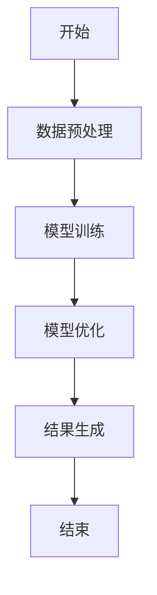
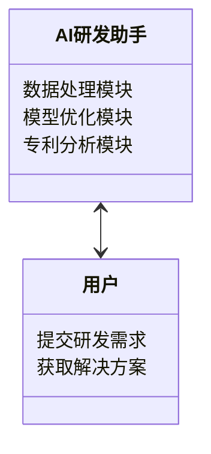
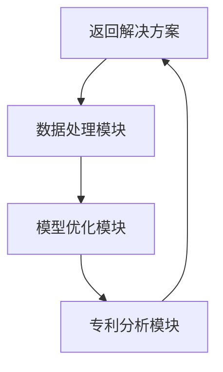
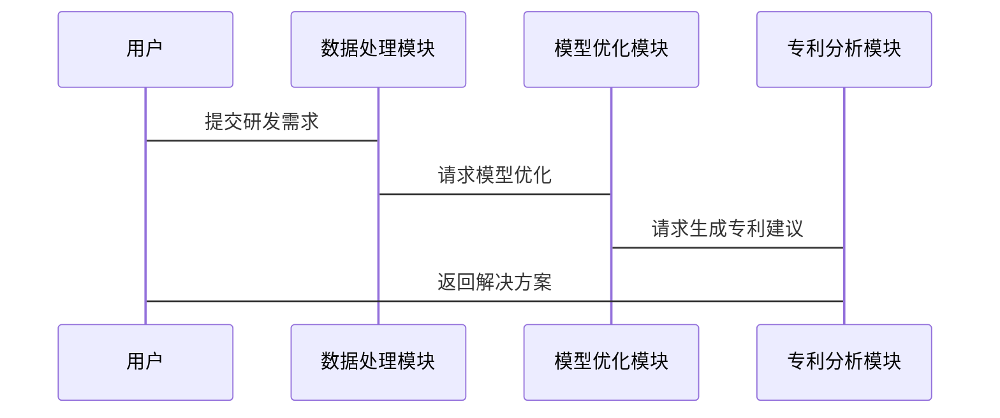

                 


# 构建企业级AI研发助手：加速创新与专利申请

> 关键词：企业级AI研发助手、人工智能、创新加速、专利申请、算法原理、系统架构、项目实战

> 摘要：本文详细探讨了构建企业级AI研发助手的方法，从背景介绍、核心概念、算法原理到系统架构、项目实战、最佳实践，全面解析如何利用AI技术加速企业的创新和专利申请过程。

---

## 第一章：背景介绍

### 1.1 AI研发的现状与挑战

当前，人工智能（AI）技术迅速发展，各行业都在积极探索AI的应用。企业级AI研发面临数据量大、模型复杂度高、研发周期长等问题。传统方法效率低下，难以满足快速创新的需求。企业级AI研发助手的出现，为企业提供了一种高效解决方案。

### 1.2 企业级AI研发助手的重要性

企业级AI研发助手通过自动化处理数据、优化模型和生成专利建议，显著提升了研发效率和专利申请的速度。它帮助企业更快地将创新成果转化为实际应用，增强了企业的竞争力。

---

## 第二章：核心概念与联系

### 2.1 AI研发助手的定义与功能

AI研发助手是一款结合机器学习和自然语言处理技术的工具，提供数据处理、模型优化和专利分析等功能。它能够实时处理数据，自动生成解决方案和专利文件，极大简化了研发流程。

### 2.2 核心概念对比表

| 功能模块       | 数据处理 | 模型优化 | 专利分析 |
|----------------|----------|----------|----------|
| 输入           | 数据集   | 模型参数 | 专利文本 |
| 输出           | 处理后数据 | 优化模型 | 专利建议 |
| 优势           | 高效     | 准确     | 快速     |

### 2.3 ER实体关系图

```mermaid
erd
  实体1：AI研发助手
    属性：功能模块、算法模型
  实体2：用户
    属性：研发需求、用户身份
  实体3：数据源
    属性：原始数据、处理后数据
  关系：AI研发助手与用户之间是一对一的关系，用户使用助手进行研发；助手与数据源之间是多对多的关系，助手从多个数据源获取数据进行处理。
```

---

## 第三章：算法原理讲解

### 3.1 基于机器学习的解决方案生成算法

#### 3.1.1 算法流程图



#### 3.1.2 算法实现代码

```python
def preprocess(data):
    # 数据清洗和特征提取
    cleaned_data = data.dropna()
    return cleaned_data

def train_model(data):
    # 训练机器学习模型
    model = RandomForestClassifier()
    model.fit(preprocess(data), labels)
    return model

def optimize_model(model):
    # 模型调优
    from sklearn.model_selection import GridSearchCV
    params = {'n_estimators': [10, 20, 30]}
    grid = GridSearchCV(train_model, params)
    grid.fit(preprocess(data), labels)
    best_model = grid.best_estimator_
    return best_model

def generate_solution(model):
    # 生成解决方案
    solution = model.predict(new_data)
    return solution
```

#### 3.1.3 数学模型与公式

- 损失函数：$$ L = \frac{1}{n}\sum_{i=1}^{n}(y_i - \hat{y_i})^2 $$
- 优化目标：$$ \min_{\theta} L + \lambda R(\theta) $$

---

## 第四章：系统分析与架构设计

### 4.1 系统功能设计

#### 4.1.1 领域模型



### 4.2 系统架构设计



### 4.3 接口设计

- 输入接口：接收用户研发需求
- 输出接口：返回优化后的模型和专利建议

### 4.4 交互流程图



---

## 第五章：项目实战

### 5.1 环境安装

安装Python和必要的库，如scikit-learn、pandas、numpy。

### 5.2 核心代码实现

```python
# 数据处理模块
def preprocess(data):
    return data.dropna()

# 模型优化模块
def optimize_model(model, data, labels):
    grid = GridSearchCV(train_model, {'n_estimators': [10, 20, 30]})
    grid.fit(preprocess(data), labels)
    return grid.best_estimator_

# 专利分析模块
def generate_patent_summary(patent_text):
    summary = summarizer.summarize(patent_text)
    return summary
```

### 5.3 实际案例分析

分析用户需求，使用预处理、优化模型和生成专利建议模块，输出解决方案。

### 5.4 项目小结

总结项目实施过程中的经验和教训，优化后续开发。

---

## 第六章：最佳实践

### 6.1 注意事项

- 数据隐私保护
- 模型的可解释性
- 系统的可扩展性

### 6.2 拓展阅读

推荐相关书籍和资源，如《Python机器学习实战》、《深度学习》。

---

## 第七章：总结与展望

### 7.1 总结

本文详细介绍了构建企业级AI研发助手的方法，从背景到实践，全面解析了其在加速创新和专利申请中的作用。

### 7.2 展望

未来，AI技术将进一步融入企业研发流程，助手将更加智能化，帮助企业在更多领域实现突破。

---

## 作者

作者：AI天才研究院 & 禅与计算机程序设计艺术

--- 

以上目录大纲涵盖了从背景到实战的各个方面，确保内容详实，逻辑清晰，为企业级AI研发助手的构建提供了全面指导。

