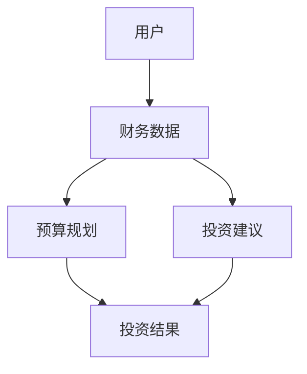
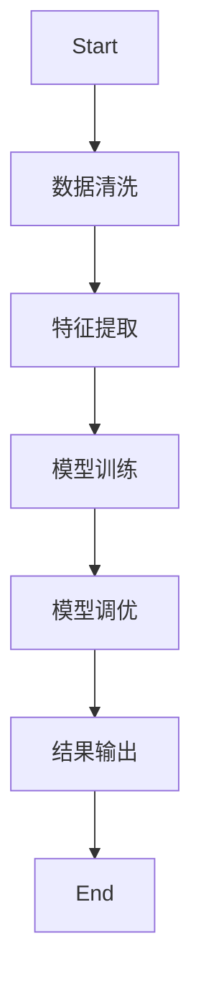
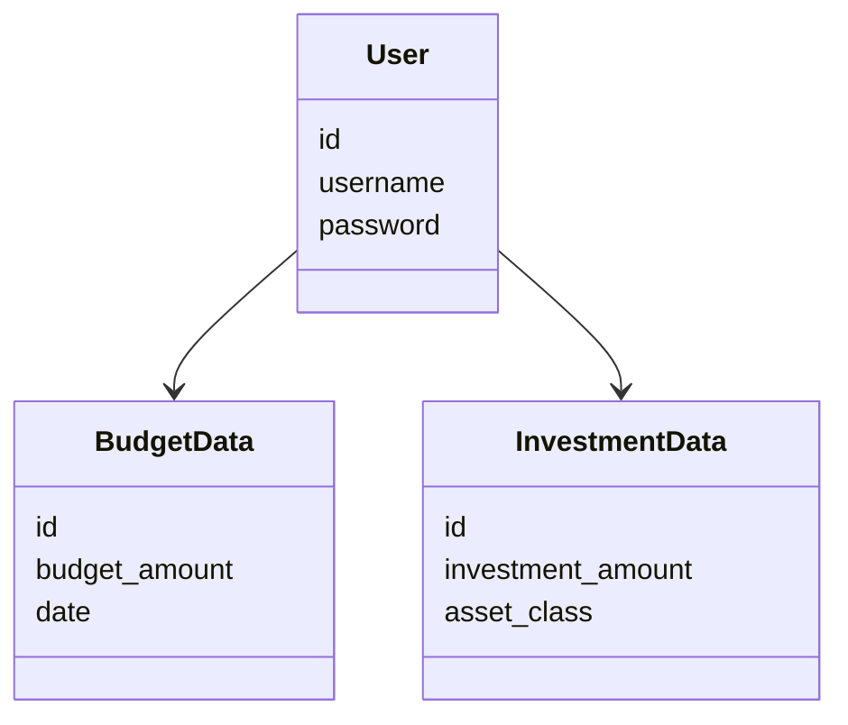
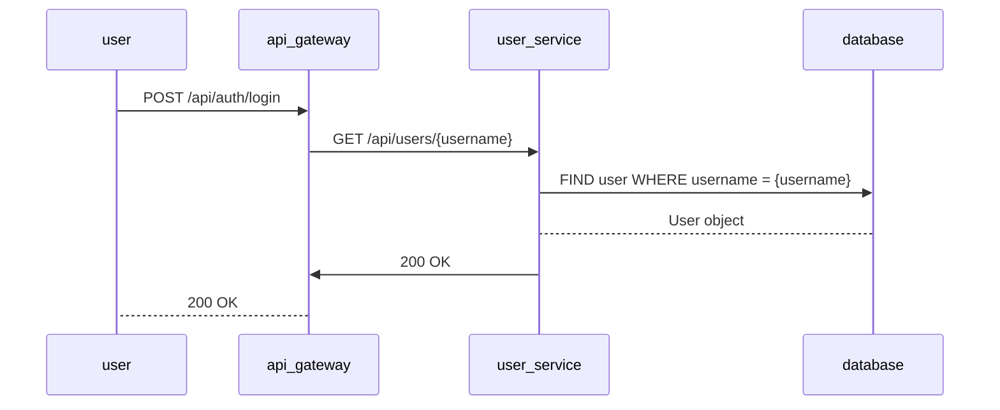

                 


# 构建企业级AI财务顾问：智能预算规划与投资建议

> 关键词：企业级AI财务顾问、智能预算规划、投资建议、机器学习、自然语言处理、系统架构设计

> 摘要：本文将详细探讨如何构建一个企业级AI财务顾问系统，通过智能预算规划和投资建议两大功能模块，结合机器学习、自然语言处理等技术，为企业提供高效、精准的财务决策支持。文章将从系统背景、核心概念、算法原理、系统架构设计、项目实战等多个维度展开，深入分析构建该系统的关键技术与实现细节。

---

# 第一部分: 企业级AI财务顾问概述

## 第1章: 企业级AI财务顾问的背景与需求

### 1.1 问题背景

#### 1.1.1 传统财务顾问的局限性
传统财务顾问依赖人工分析，效率低、成本高，且容易受到主观因素影响，难以满足企业对实时性和精准性的需求。

#### 1.1.2 AI技术在财务领域的应用潜力
AI技术能够快速处理海量数据，发现潜在模式，为财务决策提供数据支持。特别是在预算规划和投资建议领域，AI展现了巨大的应用价值。

#### 1.1.3 企业级AI财务顾问的核心价值
通过AI技术实现智能化的预算规划和投资建议，帮助企业优化资源配置，降低风险，提升财务决策的效率和准确性。

### 1.2 问题描述

#### 1.2.1 财务数据的复杂性
企业财务数据种类繁多，包括财务报表、市场数据、行业趋势等，如何有效整合和分析这些数据是一个挑战。

#### 1.2.2 用户需求的多样性
不同企业、不同部门的财务需求差异显著，如何设计一个灵活、可定制的系统是关键。

#### 1.2.3 系统集成的挑战
AI财务顾问需要与企业现有的ERP、CRM等系统无缝集成，确保数据流的畅通和业务流程的连贯。

### 1.3 问题解决

#### 1.3.1 AI技术如何解决财务问题
通过机器学习算法对历史数据进行分析，预测未来趋势；利用NLP技术处理财务文本，提取关键信息。

#### 1.3.2 智能预算规划的关键技术
基于历史数据分析，结合市场趋势，自动生成预算建议，并实时调整以应对变化。

#### 1.3.3 投资建议的AI实现路径
通过多因子模型和风险评估，为用户提供个性化的投资组合建议。

### 1.4 边界与外延

#### 1.4.1 企业级AI财务顾问的边界
限定在为企业内部提供财务决策支持，不涉及外部投资行为的直接操作。

#### 1.4.2 相关领域的外延
与企业管理系统、数据分析平台等其他系统形成互补关系。

#### 1.4.3 核心要素的组成
包括数据源、AI模型、用户界面、系统接口等核心要素。

### 1.5 本章小结
本章介绍了企业级AI财务顾问的背景、需求和实现路径，为后续章节的深入分析奠定了基础。

---

## 第2章: 核心概念与联系

### 2.1 核心概念原理

#### 2.1.1 AI模型在财务分析中的应用
AI模型（如神经网络）能够处理非结构化数据，发现隐藏的模式，辅助财务分析。

#### 2.1.2 自然语言处理（NLP）在财务文本分析中的作用
NLP技术用于解析财务报告、新闻等文本，提取关键信息。

#### 2.1.3 机器学习在财务预测中的应用
机器学习算法（如随机森林、支持向量机）用于预测市场趋势和财务指标。

### 2.2 核心概念对比

#### 2.2.1 AI模型与传统财务模型的对比
| 特性         | AI模型                     | 传统财务模型             |
|--------------|---------------------------|--------------------------|
| 数据处理能力 | 能处理非结构化数据         | 依赖结构化数据           |
| 灵活性       | 高度灵活，可定制           | 较低，依赖固定公式         |
| 性能         | 高精度，适应复杂场景       | 可能存在局限性，适用于简单场景 |

#### 2.2.2 NLP与传统文本分析的对比
| 特性         | NLP                         | 传统文本分析             |
|--------------|-----------------------------|--------------------------|
| 技术基础     | 基于机器学习和深度学习       | 基于规则和关键词匹配       |
| 处理效率     | 高，能处理大量数据           | 较低，依赖人工干预         |
| 应用场景     | 复杂文本分析，如财务报告     | 简单信息提取，如关键词提取 |

#### 2.2.3 机器学习与传统统计方法的对比
| 特性         | 机器学习                  | 传统统计方法             |
|--------------|---------------------------|--------------------------|
| 数据需求     | 需要大量数据               | 数据需求较少             |
| 模型复杂性   | 模型复杂，需调优           | 模型简单，易于解释         |
| 适用场景     | 复杂场景，如预测和分类       | 简单场景，如均值、方差计算 |

### 2.3 ER实体关系图


### 2.4 本章小结
本章通过对比分析，明确了AI模型、NLP和机器学习在财务领域的独特优势和应用场景，为后续系统的构建奠定了理论基础。

---

## 第3章: 算法原理讲解

### 3.1 算法原理概述

#### 3.1.1 概率论基础
概率论是机器学习的基础，用于模型的不确定性分析和风险评估。

#### 3.1.2 优化算法基础
优化算法（如线性规划）用于在预算规划中找到最优解。

#### 3.1.3 深度学习基础
深度学习模型（如LSTM）用于时间序列预测，如市场趋势分析。

### 3.2 算法流程图


### 3.3 算法实现

#### 3.3.1 数据预处理
```python
import pandas as pd

# 加载数据
data = pd.read_csv('financial_data.csv')

# 清洗数据
data.dropna(inplace=True)
data['date'] = pd.to_datetime(data['date'])
```

#### 3.3.2 特征提取
```python
# 提取财务特征
features = data[['revenue', 'profit', 'market_share']]
```

#### 3.3.3 模型训练
```python
from sklearn.ensemble import RandomForestRegressor

# 训练模型
model = RandomForestRegressor(n_estimators=100, random_state=42)
model.fit(features, target)
```

#### 3.3.4 模型调优
```python
from sklearn.model_selection import GridSearchCV

# 参数调优
param_grid = {'n_estimators': [50, 100, 150], 'max_depth': [None, 10, 20]}
grid_search = GridSearchCV(RandomForestRegressor(), param_grid, cv=5)
grid_search.fit(features, target)
best_model = grid_search.best_estimator_
```

### 3.4 算法代码示例

#### 3.4.1 预算规划的数学模型
$$
\text{预算} = \alpha \times \text{历史收入} + \beta \times \text{市场增长预测}
$$

#### 3.4.2 投资建议的数学模型
$$
\text{投资组合} = \argmin_{w} \left( w^T \Sigma w - \lambda w^T \mu \right)
$$

其中，$\Sigma$ 是协方差矩阵，$\mu$ 是收益向量，$\lambda$ 是风险偏好系数。

### 3.5 本章小结
本章详细讲解了构建AI财务顾问系统的算法原理，包括数据预处理、特征提取、模型训练和调优的全过程，并通过代码示例和数学公式明确了实现细节。

---

## 第4章: 系统架构设计

### 4.1 问题场景介绍

#### 4.1.1 系统目标
设计一个可扩展、高可用的企业级AI财务顾问系统。

#### 4.1.2 项目介绍
基于Python和TensorFlow构建一个智能预算规划和投资建议系统。

### 4.2 系统功能设计

#### 4.2.1 预算规划模块
- 数据输入与分析
- 模型训练与预算生成
- 预算结果展示与调整

#### 4.2.2 投资建议模块
- 市场数据获取与分析
- 风险评估与投资组合优化
- 投资建议生成与展示

#### 4.2.3 用户交互模块
- 用户登录与权限管理
- 功能模块选择
- 结果展示与导出

### 4.3 系统架构设计

#### 4.3.1 领域模型


#### 4.3.2 系统架构图
```mermaid
graph TD
    User[用户] --> API Gateway[API网关]
    API Gateway --> BudgetService[预算服务]
    API Gateway --> InvestmentService[投资服务]
    BudgetService --> Database[数据库]
    InvestmentService --> Database
```

### 4.4 系统接口设计

#### 4.4.1 预算规划接口
```http
POST /api/budget/planning
Content-Type: application/json
{
    "data": [...]
}
```

#### 4.4.2 投资建议接口
```http
POST /api/investment/suggestion
Content-Type: application/json
{
    "market_data": [...]
}
```

### 4.5 系统交互流程

#### 4.5.1 用户登录流程


### 4.6 本章小结
本章从系统架构的角度，详细设计了企业级AI财务顾问系统的功能模块、架构图和接口设计，为后续的系统实现提供了清晰的指导。

---

## 第5章: 项目实战

### 5.1 环境安装

#### 5.1.1 安装Python和相关库
```bash
pip install numpy pandas scikit-learn tensorflow
```

#### 5.1.2 安装依赖
```bash
pip install flask pymongo requests
```

### 5.2 系统核心实现

#### 5.2.1 预算规划模块实现
```python
from flask import Flask, request, jsonify

app = Flask(__name__)

@app.route('/api/budget/planning', methods=['POST'])
def budget_planning():
    data = request.json['data']
    # 处理数据
    return jsonify({'status': 'success', 'result': data})
```

#### 5.2.2 投资建议模块实现
```python
from tensorflow.keras import models

model = models.load_model('investment_model.h5')

@app.route('/api/investment/suggestion', methods=['POST'])
def investment_suggestion():
    data = request.json['market_data']
    prediction = model.predict(data)
    return jsonify({'status': 'success', 'result': prediction.tolist()})
```

### 5.3 代码应用解读与分析

#### 5.3.1 预算规划模块解读
- 输入：企业历史财务数据
- 处理：基于机器学习模型生成预算建议
- 输出：预算结果和调整建议

#### 5.3.2 投资建议模块解读
- 输入：市场数据和用户资产配置需求
- 处理：基于深度学习模型生成投资组合
- 输出：投资建议和风险评估

### 5.4 实际案例分析

#### 5.4.1 预算规划案例
某制造企业2023年的预算规划，基于历史数据和市场预测，生成的预算结果。

#### 5.4.2 投资建议案例
基于当前市场状况，为用户推荐的投资组合和风险评估。

### 5.5 项目小结
本章通过实际案例分析，展示了企业级AI财务顾问系统的实现过程和应用效果，验证了系统的可行性和实用性。

---

## 第6章: 最佳实践与总结

### 6.1 最佳实践 tips

#### 6.1.1 数据质量的重要性
确保数据的完整性和准确性，数据预处理是关键。

#### 6.1.2 模型部署的注意事项
选择合适的部署平台，确保系统的稳定性和可扩展性。

#### 6.1.3 系统维护与优化
定期更新模型，监控系统性能，及时修复问题。

### 6.2 小结
本文详细探讨了企业级AI财务顾问系统的构建过程，从理论到实践，为企业提供了一套完整的解决方案。

### 6.3 注意事项
- 数据隐私保护
- 系统安全防护
- 用户权限管理

### 6.4 拓展阅读
- 《机器学习实战》
- 《Python机器学习》
- 《深度学习》

---

# 作者：AI天才研究院/AI Genius Institute & 禅与计算机程序设计艺术 /Zen And The Art of Computer Programming

