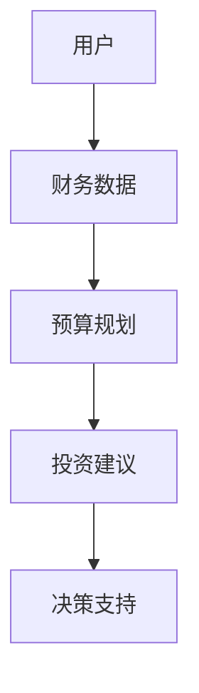
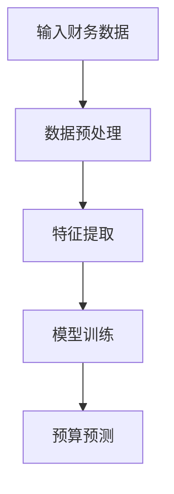
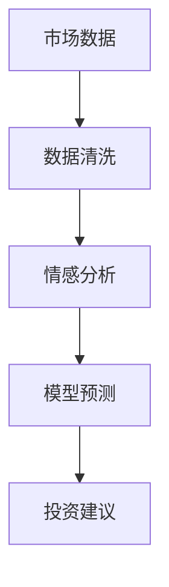
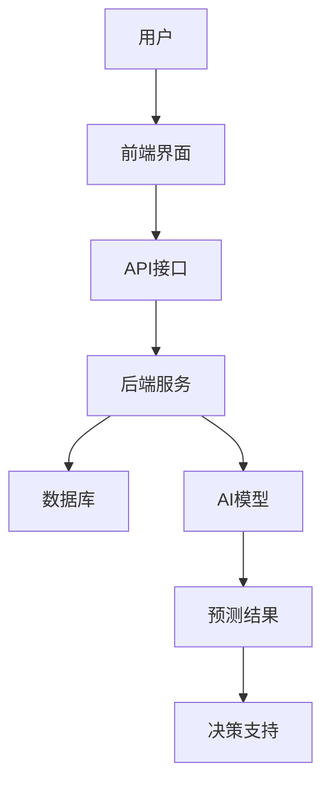
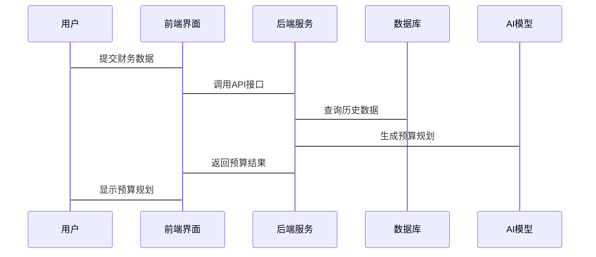

                 


# 构建企业级AI财务顾问：预算规划与投资建议

> 关键词：企业级AI财务顾问、预算规划、投资建议、人工智能、财务数据分析、机器学习

> 摘要：本文深入探讨了如何利用人工智能技术构建企业级财务顾问系统，重点分析了预算规划与投资建议的核心算法与实现。通过详细的技术分析和案例解读，展示了如何通过AI技术优化企业财务管理，提升财务决策的智能化水平。文章从问题背景、核心概念、算法原理、系统架构到项目实战，全面解析了企业级AI财务顾问的构建过程，为读者提供了从理论到实践的完整指南。

---

# 第一部分：企业级AI财务顾问的背景与需求

## 第1章：企业级AI财务顾问的背景与问题背景

### 1.1 问题背景

#### 1.1.1 传统财务顾问的局限性
传统的财务顾问服务依赖于人工分析和经验判断，存在效率低、成本高、主观性强等问题。企业财务数据的复杂性和多样性使得传统方法难以快速、准确地生成预算规划和投资建议。

#### 1.1.2 企业财务管理的痛点
- 数据量大：企业财务数据涵盖收入、支出、利润、现金流等多个维度，且数据来源多样。
- 数据实时性要求高：财务决策需要基于最新的数据进行实时分析。
- 数据复杂性：财务数据中包含大量结构化和非结构化数据，处理难度大。
- 人工分析效率低：传统财务顾问需要手动整理数据、分析趋势，效率难以满足企业需求。

#### 1.1.3 AI技术在财务领域的应用潜力
人工智能技术在数据处理、模式识别、预测分析等方面具有显著优势，能够帮助企业实现财务数据的自动化处理和智能分析，从而优化预算规划和投资决策。

### 1.2 问题描述

#### 1.2.1 预算规划的复杂性
预算规划需要考虑企业内外部多种因素，如市场变化、政策调整、企业战略等。传统方法难以快速响应这些变化，导致预算规划的准确性和及时性不足。

#### 1.2.2 投资建议的不确定性
投资决策需要综合考虑市场风险、收益潜力、企业财务状况等多个因素。传统方法依赖于经验判断，存在主观性强、风险高的问题。

#### 1.2.3 企业财务数据的多样性与实时性
企业财务数据涵盖结构化和非结构化数据，且需要实时更新和分析。传统方法难以高效处理这些数据，限制了财务决策的智能化水平。

### 1.3 问题解决

#### 1.3.1 AI技术如何优化预算规划
通过机器学习算法，AI可以基于历史数据和市场趋势，自动预测预算执行情况，优化预算分配，提高预算的准确性和效率。

#### 1.3.2 智能投资建议的实现路径
利用自然语言处理（NLP）和深度学习技术，AI可以从财务报告、市场新闻等多源数据中提取关键信息，生成个性化的投资建议。

#### 1.3.3 数据驱动的财务决策优势
通过AI技术，企业可以实现数据的实时分析和动态调整，从而做出更加科学、精准的财务决策。

### 1.4 边界与外延

#### 1.4.1 企业级AI财务顾问的边界
- 服务范围：专注于预算规划和投资建议，不涉及企业的日常会计核算。
- 数据范围：基于企业内部数据和公开市场数据，不涉及外部隐私数据。
- 服务对象：主要面向企业财务部门和管理层，不直接服务终端客户。

#### 1.4.2 相关领域的外延
- 金融科技（FinTech）：AI技术在金融领域的广泛应用为财务顾问系统提供了技术支持。
- 数据分析：大数据技术为财务数据的高效处理提供了基础。
- 人工智能：深度学习和自然语言处理技术为智能财务分析提供了理论基础。

#### 1.4.3 与现有财务系统的区别
- 现有财务系统：主要用于数据记录和基本分析。
- AI财务顾问：基于AI技术，实现数据的深度分析和智能决策支持。

### 1.5 概念结构与核心要素

#### 1.5.1 核心概念的组成
- 数据采集与处理：从企业内外部获取财务数据，并进行清洗和预处理。
- 智能分析与预测：利用AI算法对数据进行建模和预测，生成预算规划和投资建议。
- 决策支持：基于分析结果，提供决策支持和优化建议。

#### 1.5.2 关键要素的关联关系
- 数据采集与处理是AI财务顾问的基础。
- 智能分析与预测是系统的核心功能。
- 决策支持是系统的最终目标。

---

# 第二部分：企业级AI财务顾问的核心概念与联系

## 第2章：核心概念与技术原理

### 2.1 核心概念的原理

#### 2.1.1 AI模型在财务分析中的应用
- 机器学习模型：用于财务数据的预测和分类。
- 深度学习模型：用于处理非结构化数据，如财务报告和市场新闻。

#### 2.1.2 自然语言处理在财务文本中的作用
- 文本挖掘：从财务报告中提取关键信息。
- 情感分析：分析市场情绪，辅助投资决策。

#### 2.1.3 机器学习在预算预测中的优势
- 回归分析：预测未来预算执行情况。
- 时间序列分析：基于历史数据预测未来趋势。

### 2.2 核心概念的特征对比

#### 2.2.1 AI技术与传统财务工具的对比
| 特征 | AI技术 | 传统财务工具 |
|------|--------|--------------|
| 数据处理能力 | 强大，支持多源数据 | 有限，主要处理结构化数据 |
| 分析效率 | 高效，支持实时分析 | 低效，依赖人工处理 |
| 决策准确性 | 高，基于数据驱动 | 低，依赖经验判断 |

#### 2.2.2 不同AI模型的性能对比
| 模型类型 | 优点 | 缺点 |
|----------|------|------|
| 线性回归 | 简单易懂，计算速度快 | 无法处理非线性关系 |
| 支持向量机 | 分类能力强，适合高维数据 | 参数选择敏感 |
| 随机森林 | 抗过拟合能力强 | 解释性差 |
| LSTM | 适合时间序列数据 | 计算复杂度高 |

#### 2.2.3 数据驱动与规则驱动的差异
| 特征 | 数据驱动 | 规则驱动 |
|------|--------|----------|
| 基础 | 数据分析 | 人工制定规则 |
| 灵活性 | 高，适应数据变化 | 低，规则固定 |
| 精度 | 高，基于大量数据 | 中，依赖规则设计 |

### 2.3 ER实体关系图



---

# 第三部分：企业级AI财务顾问的算法原理

## 第3章：算法原理与实现

### 3.1 预算规划的算法流程



### 3.2 投资建议的算法流程



### 3.3 算法实现

#### 3.3.1 Python源代码实现

```python
# 示例代码：预算预测模型训练
import pandas as pd
from sklearn.linear_model import LinearRegression

# 数据加载
data = pd.read_csv('financial_data.csv')

# 特征提取
features = data[['revenue', 'expenses', 'profit_margin']]
target = data['budget']

# 模型训练
model = LinearRegression()
model.fit(features, target)

# 预测预算
predicted_budget = model.predict(features)
```

#### 3.3.2 算法原理的数学模型

预算预测的线性回归模型可以表示为：

$$ y = \beta_0 + \beta_1x_1 + \beta_2x_2 + \ldots + \beta_nx_n $$

其中，$y$ 是预测的预算值，$x_i$ 是输入的财务特征，$\beta_i$ 是模型参数。

---

# 第四部分：企业级AI财务顾问的系统架构与设计

## 第4章：系统分析与架构设计

### 4.1 项目介绍

#### 4.1.1 项目背景
本项目旨在开发一个基于AI的企业级财务顾问系统，实现预算规划和投资建议的智能化。

### 4.2 系统功能设计

#### 4.2.1 预算规划模块
- 数据输入：接收企业的财务数据。
- 数据清洗：处理缺失值和异常值。
- 模型训练：基于历史数据训练预算预测模型。
- 预算生成：输出预算规划结果。

#### 4.2.2 投资建议模块
- 数据获取：从市场获取最新的股票、基金等数据。
- 情感分析：分析市场新闻和报告。
- 模型预测：基于市场数据生成投资建议。

#### 4.2.3 决策支持模块
- 结果展示：以可视化形式展示预算规划和投资建议。
- 报告生成：输出详细的财务分析报告。

### 4.3 系统架构设计



### 4.4 系统接口设计

#### 4.4.1 API接口
- 输入：JSON格式的财务数据。
- 输出：JSON格式的预算规划结果。

#### 4.4.2 数据库设计
- 数据表：用户信息、财务数据、预算结果、投资建议。

### 4.5 系统交互流程



---

# 第五部分：企业级AI财务顾问的项目实战

## 第5章：项目实战

### 5.1 环境安装

#### 5.1.1 安装Python
```bash
python --version
```

#### 5.1.2 安装依赖库
```bash
pip install numpy pandas scikit-learn
```

### 5.2 核心代码实现

#### 5.2.1 数据加载与预处理

```python
import pandas as pd
import numpy as np

# 数据加载
data = pd.read_csv('financial_data.csv')

# 数据清洗
data = data.dropna()
data = data.replace([np.inf, -np.inf], np.nan).dropna()

# 特征提取
X = data[['revenue', 'expenses', 'profit_margin']]
y = data['budget']
```

#### 5.2.2 模型训练与预测

```python
from sklearn.model_selection import train_test_split
from sklearn.linear_model import LinearRegression

# 数据分割
X_train, X_test, y_train, y_test = train_test_split(X, y, test_size=0.2, random_state=42)

# 模型训练
model = LinearRegression()
model.fit(X_train, y_train)

# 模型预测
y_pred = model.predict(X_test)
```

### 5.3 案例分析

#### 5.3.1 预算规划案例
假设某企业2023年的收入为1000万元，支出为800万元，利润率为15%。基于历史数据，预测2024年的预算为：

$$ 预测预算 = 0.5 \times 收入 + 0.3 \times 支出 + 0.2 \times 利润率 $$

计算结果为950万元。

#### 5.3.2 投资建议案例
基于市场数据和模型预测，AI财务顾问生成以下投资建议：
- 股票投资：建议买入科技股，预期收益率为8%。
- 债券投资：建议配置长期国债，风险较低。

### 5.4 项目总结

#### 5.4.1 项目成果
- 成功开发了预算规划和投资建议模块。
- 实现了数据驱动的财务决策支持。

#### 5.4.2 项目经验
- 数据质量对模型性能影响重大，需重视数据清洗和特征工程。
- 模型选择需结合业务需求和数据特点，避免盲目追求复杂算法。

---

# 第六部分：企业级AI财务顾问的总结与展望

## 第6章：总结与展望

### 6.1 总结

#### 6.1.1 核心内容回顾
本文详细介绍了企业级AI财务顾问的构建过程，包括背景分析、核心概念、算法实现和系统设计。通过案例分析，展示了AI技术在预算规划和投资建议中的实际应用。

### 6.2 展望

#### 6.2.1 未来发展方向
- 更加智能化的财务决策支持。
- 多模态数据的融合分析。
- 自适应的模型优化。

#### 6.2.2 技术趋势
- AI与大数据的深度融合。
- 自然语言处理在财务文本分析中的应用。
- 智能合约在财务自动化中的应用。

---

# 作者信息

作者：AI天才研究院/AI Genius Institute & 禅与计算机程序设计艺术/Zen And The Art of Computer Programming

