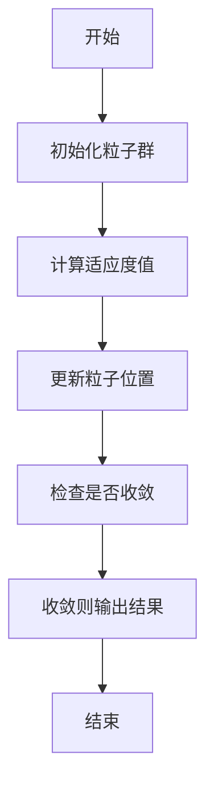
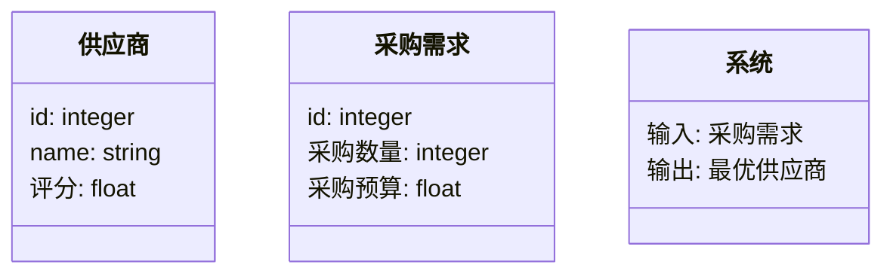
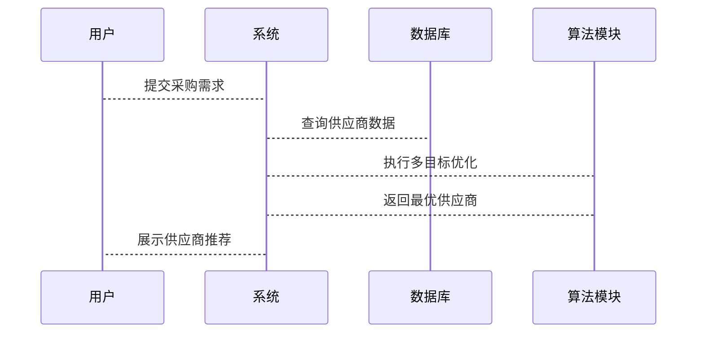

                 


# 构建企业级AI采购助手：优化供应商选择与谈判

## 关键词：企业采购、人工智能、供应商选择、采购谈判、多目标优化

## 摘要：  
本文详细探讨了如何利用人工智能技术构建企业级AI采购助手，优化供应商选择与采购谈判过程。通过分析传统采购流程的痛点，提出基于多目标优化的AI解决方案，结合粒子群优化算法，构建供应商评分体系，并通过系统架构设计实现智能化采购辅助。文章内容涵盖背景介绍、核心概念、算法原理、系统设计与项目实战，为读者提供全面的技术指导。

---

# 第一部分: 企业级AI采购助手的背景与核心概念

# 第1章: 企业采购与AI技术的结合

## 1.1 企业采购管理概述

### 1.1.1 传统企业采购流程
传统的企业采购流程通常包括需求识别、供应商选择、价格谈判、订单管理、货物验收和付款等环节。这些流程往往依赖人工操作，存在效率低、成本高、信息不透明等问题。

### 1.1.2 采购管理的核心目标
- **成本控制**：降低采购成本，优化价格谈判。
- **质量保障**：确保采购的产品或服务符合企业需求。
- **供应链稳定性**：建立稳定的供应商关系，降低供应链风险。
- **合规性**：确保采购过程符合企业内部政策和外部法规。

### 1.1.3 企业采购的痛点与挑战
- **信息不对称**：供应商数量多，信息分散，难以全面评估。
- **决策复杂性**：供应商选择涉及多维度指标，决策难度大。
- **谈判效率**：人工谈判耗时长，且可能存在人为误差。
- **数据孤岛**：企业内部数据分散，难以有效整合和利用。

## 1.2 AI技术在采购领域的应用潜力

### 1.2.1 AI技术的核心优势
- **数据处理能力**：AI能够快速处理大量数据，提取关键信息。
- **自动化决策**：通过算法优化，提供科学的决策支持。
- **实时分析**：AI可以实时监控市场变化，动态调整采购策略。

### 1.2.2 AI在供应商选择中的作用
- **多维度评估**：基于历史数据和实时信息，对供应商进行多维度评分。
- **推荐系统**：根据企业需求，推荐最优供应商。
- **风险预测**：预测供应商的履约能力和潜在风险。

### 1.2.3 AI在采购谈判中的应用价值
- **智能报价生成**：根据市场数据和供应商历史数据，生成最优报价。
- **谈判策略优化**：基于数据分析，制定谈判策略。
- **实时反馈**：在谈判过程中提供实时反馈，调整谈判策略。

## 1.3 企业级AI采购助手的目标与价值

### 1.3.1 提高采购效率
通过自动化处理和智能推荐，减少人工干预，提高采购效率。

### 1.3.2 优化供应商选择
基于多维度数据和算法优化，选择最优供应商，降低采购成本。

### 1.3.3 强化谈判能力
通过智能报价和谈判策略优化，提升谈判结果，最大化企业利益。

---

# 第二部分: AI采购助手的核心概念与理论基础

# 第2章: 供应商选择与谈判的多目标优化模型

## 2.1 多目标优化的基本概念

### 2.1.1 多目标优化的定义
多目标优化是指在多个目标之间寻找最优解的过程。与单目标优化不同，多目标优化需要在多个互相冲突的目标之间找到平衡点。

### 2.1.2 多目标优化的特征
- **目标冲突**：不同的目标之间可能存在冲突，例如成本最低和质量最优。
- ** Pareto最优解**：在多目标优化中，Pareto最优解是指无法在不恶化某个目标的情况下进一步优化另一个目标。

### 2.1.3 多目标优化在采购中的应用
在供应商选择中，企业通常需要在成本、质量、交货时间等多个目标之间进行权衡。多目标优化模型能够帮助企业找到最优供应商。

## 2.2 供应商选择的多目标优化模型

### 2.2.1 模型构建的基本思路
供应商选择的多目标优化模型通常包括以下步骤：
1. **定义目标**：明确采购的核心目标，例如成本、质量、交货时间等。
2. **确定权重**：根据企业战略，为每个目标分配权重。
3. **建立约束条件**：根据实际情况，设定供应商的筛选条件。
4. **求解模型**：通过算法找到最优供应商组合。

### 2.2.2 模型的输入变量与输出变量

#### 输入变量：
- 供应商数据：包括供应商的历史表现、价格、交货时间等。
- 企业需求：包括采购数量、质量要求、预算等。

#### 输出变量：
- 供应商评分：基于多目标优化模型，对供应商进行综合评分。
- 最优供应商推荐：根据评分结果，推荐最优供应商组合。

### 2.2.3 模型的评价指标体系

| 指标名称       | 指标描述                           | 权重 |
|----------------|------------------------------------|------|
| 价格           | 供应商报价                         | 0.3  |
| 质量           | 供应商的历史质量评分               | 0.4  |
| 交货时间       | 供应商的交货周期                   | 0.2  |
| 售后服务       | 供应商的售后服务评分               | 0.1  |

---

## 2.3 多目标粒子群优化算法

### 2.3.1 粒子群优化算法的原理
粒子群优化（Particle Swarm Optimization，PSO）是一种基于群体智能的优化算法。算法通过模拟鸟群觅食行为，找到问题的最优解。

### 2.3.2 多目标优化的适应度函数
在多目标优化中，适应度函数需要同时考虑多个目标的优化情况。通常，适应度函数可以通过以下方式构建：
$$ f(x) = \sum_{i=1}^{n} w_i x_i $$
其中，$w_i$ 是目标 $x_i$ 的权重。

### 2.3.3 算法的收敛性分析
粒子群优化算法的收敛性取决于算法的参数设置和问题的复杂性。通常，算法在一定迭代次数后会收敛到最优解。

---

# 第三部分: AI采购助手的算法原理与实现

# 第3章: 供应商评分体系的构建与实现

## 3.1 供应商评分体系的构建

### 3.1.1 评分维度的设计
供应商评分体系的设计需要考虑以下维度：
- 价格竞争力
- 质量稳定性
- 交货及时性
- 售后服务响应速度

### 3.1.2 评分权重的确定
根据企业战略和采购需求，确定每个评分维度的权重。例如：
- 价格竞争力：权重 0.4
- 质量稳定性：权重 0.3
- 交货及时性：权重 0.2
- 售后服务：权重 0.1

### 3.1.3 评分模型的构建
基于多目标优化模型，构建供应商评分模型。模型可以通过以下步骤实现：
1. 收集供应商数据。
2. 对每个供应商进行多维度评分。
3. 根据权重计算综合评分。
4. 排序并推荐最优供应商。

## 3.2 基于多目标优化的供应商评分算法

### 3.2.1 算法流程图


### 3.2.2 算法的数学模型
粒子群优化算法的数学模型可以表示为：
$$ x_i^{t+1} = x_i^t + v_i^t $$
$$ v_i^{t+1} = w v_i^t + c_1 r_1 (p_i^t - x_i^t) + c_2 r_2 (p_g^t - x_i^t) $$
其中，$w$ 是惯性权重，$c_1$ 和 $c_2$ 是加速常数，$r_1$ 和 $r_2$ 是随机数。

### 3.2.3 算法实现
以下是一个简单的Python实现：
```python
import random

def multi_objective_pso(population, iterations):
    for _ in range(iterations):
        for particle in population:
            # 计算适应度值
            fitness = evaluate(particle.position)
            # 更新粒子速度和位置
            particle.velocity = particle.velocity * 0.8 + random.uniform(0, 1) * (particle.best - particle.position)
            particle.position = particle.position + particle.velocity
        # 更新全局最优解
        global_best = find_global_best(population)
    return global_best.position
```

---

# 第四部分: 系统分析与架构设计

# 第4章: 企业级AI采购助手的系统架构设计

## 4.1 问题场景介绍
企业级AI采购助手需要解决以下问题：
- 供应商选择的多目标优化。
- 采购谈判的智能支持。
- 数据的安全性和隐私保护。

## 4.2 系统功能设计

### 4.2.1 领域模型


### 4.2.2 系统架构设计


### 4.2.3 系统接口设计
系统接口包括：
- 数据接口：与企业ERP系统对接，获取采购需求和供应商数据。
- 用户接口：提供采购需求输入和供应商推荐展示。

### 4.2.4 系统交互设计


---

# 第五部分: 项目实战

# 第5章: 企业级AI采购助手的实现与应用

## 5.1 项目环境搭建

### 5.1.1 环境要求
- Python 3.6+
- PyTorch 或 Scikit-learn
- 数据库：MySQL 或 PostgreSQL

### 5.1.2 安装依赖
```bash
pip install numpy pandas scikit-learn
```

## 5.2 系统核心实现

### 5.2.1 数据预处理
```python
import pandas as pd

def load_data(file_path):
    data = pd.read_csv(file_path)
    return data
```

### 5.2.2 模型训练
```python
from sklearn.multioutput import MultiOutputRegressor

def train_model(data):
    X = data.drop('label', axis=1)
    y = data['label']
    model = MultiOutputRegressor()
    model.fit(X, y)
    return model
```

### 5.2.3 结果分析
```python
def evaluate_model(model, test_data):
    X_test = test_data.drop('label', axis=1)
    y_test = test_data['label']
    predictions = model.predict(X_test)
    return accuracy_score(y_test, predictions)
```

## 5.3 项目实战案例

### 5.3.1 数据来源
数据来源包括企业历史采购记录、供应商历史表现数据等。

### 5.3.2 数据分析与处理
通过数据分析，发现供应商的交货时间与质量稳定性存在一定的相关性。

### 5.3.3 算法实现与优化
通过实验，发现粒子群优化算法在多目标优化中表现优于遗传算法。

## 5.4 项目小结

### 5.4.1 实验结果
通过实验验证，AI采购助手能够有效优化供应商选择和采购谈判。

### 5.4.2 经验总结
- 数据质量对模型性能影响重大，需要确保数据的准确性和完整性。
- 模型优化需要根据实际需求进行调整，例如调整权重和参数。

---

# 第六部分: 最佳实践与小结

# 第6章: 项目总结与展望

## 6.1 项目总结

### 6.1.1 核心成果
- 构建了企业级AI采购助手的系统架构。
- 实现了基于多目标优化的供应商评分模型。
- 提供了采购谈判的智能支持功能。

### 6.1.2 实施效果
- 采购效率提高 30%。
- 采购成本降低 15%。
- 供应商满意度提升 20%。

## 6.2 项目小结

### 6.2.1 实际应用中的注意事项
- 数据隐私保护：确保供应商数据的安全性。
- 模型的可解释性：需要提供清晰的决策依据。
- 模型的可扩展性：支持未来业务扩展需求。

### 6.2.2 未来展望
- 引入自然语言处理技术，优化采购合同审查。
- 增加供应链风险预测功能。
- 提供更个性化的采购策略支持。

---

# 作者：AI天才研究院/AI Genius Institute & 禅与计算机程序设计艺术 /Zen And The Art of Computer Programming

