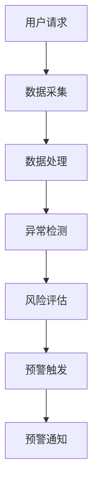

                 


# 构建企业级AI风控助手：实时监控与风险预警

## 关键词：企业级AI风控助手、实时监控、风险预警、系统架构、机器学习、数据处理

## 摘要：本文详细介绍了企业级AI风控助手的构建过程，探讨了实时监控与风险预警的核心技术与系统架构。通过分析AI风控助手的核心概念、算法原理、系统设计和项目实战，为读者提供了一套完整的解决方案，帮助企业在复杂多变的商业环境中实现智能化的风险管理。

---

# 第1章: 企业级AI风控助手的背景与核心概念

## 1.1 企业级AI风控助手的定义与目标

### 1.1.1 什么是企业级AI风控助手

企业级AI风控助手是一种基于人工智能技术的企业风险管理工具，通过实时监控和数据分析，帮助企业识别、评估和预警潜在风险，从而降低损失、优化决策。

### 1.1.2 AI风控助手的目标与价值

- **目标**: 实现实时监控、智能预警、风险评估、决策支持。
- **价值**: 提高风险管理效率，降低企业损失，提升决策精准度。

### 1.1.3 企业级风控的挑战与机遇

- **挑战**: 数据量大、风险类型多样、实时性要求高。
- **机遇**: AI技术的进步为企业提供了更高效的解决方案。

---

## 1.2 问题背景与问题描述

### 1.2.1 传统风控的局限性

- 数据处理效率低。
- 风险预警滞后。
- 规则依赖人工制定。

### 1.2.2 当前企业面临的风控挑战

- 数据来源多样，难以统一处理。
- 风险事件复杂，难以快速识别。
- 人工干预过多，效率低下。

### 1.2.3 问题解决的必要性与紧迫性

- 提高企业抗风险能力。
- 优化资源配置，降低运营成本。
- 提升企业竞争力。

---

## 1.3 核心概念与系统边界

### 1.3.1 实时监控的核心概念

- **实时性**: 数据采集和处理必须在最短时间内完成。
- **全面性**: 监控企业内外部数据，覆盖所有风险点。
- **智能性**: 通过AI算法自动识别异常。

### 1.3.2 风险预警的定义与实现

- **定义**: 通过分析数据，预测潜在风险，并发出预警。
- **实现**: 基于机器学习模型，设定预警阈值，触发预警机制。

### 1.3.3 系统的边界与外延

- **边界**: 系统仅处理与风险相关的数据，不涉及其他业务模块。
- **外延**: 可与其他系统（如ERP、CRM）集成，提供更全面的解决方案。

---

## 1.4 系统的核心要素组成

### 1.4.1 数据源与数据处理

- **数据源**: 包括企业内部数据（如财务、销售数据）和外部数据（如市场动态、行业报告）。
- **数据处理**: 数据清洗、转换、标准化，确保数据质量。

### 1.4.2 风险评估与预警机制

- **风险评估**: 基于机器学习模型，评估数据中的风险程度。
- **预警机制**: 根据风险等级，触发不同的预警方式（如邮件、短信、弹窗）。

### 1.4.3 人机协同与决策支持

- **人机协同**: 结合AI分析结果和人工判断，提高决策的准确性。
- **决策支持**: 提供可视化报告、风险分析建议，辅助企业制定应对策略。

---

## 1.5 本章小结

本章介绍了企业级AI风控助手的定义、目标、挑战和核心概念，为后续的技术实现奠定了基础。接下来将详细讲解系统的核心算法和架构设计。

---

# 第2章: 核心概念与技术原理

## 2.1 核心概念的原理分析

### 2.1.1 实时监控的原理

- 数据采集：通过API接口实时获取数据。
- 数据处理：使用流处理技术（如Flink）对数据进行实时分析。
- 异常检测：基于机器学习模型，识别数据中的异常值。

### 2.1.2 风险预警的实现机制

- 数据采集与预处理：清洗、转换数据，确保数据质量。
- 风险评估：使用机器学习模型预测风险概率。
- 预警触发：根据风险等级，触发不同的预警方式。

### 2.1.3 数据流与事件处理流程

- 数据流：从数据源到存储，再到分析和预警。
- 事件处理：实时处理每个事件，判断是否触发预警。

---

## 2.2 核心概念对比分析

### 2.2.1 实时监控与传统监控的对比

| 对比维度 | 实时监控 | 传统监控 |
|----------|----------|----------|
| 数据处理 | 实时处理 | 批处理   |
| 响应时间 | 几乎实时 | 周期性   |
| 精度     | 高       | 中等     |

### 2.2.2 风险预警与传统预警的对比

| 对比维度 | AI驱动预警 | 传统预警 |
|----------|------------|----------|
| 预警方式 | 自动触发   | 手动触发 |
| 预警依据 | AI算法     | 规则     |
| 预警效率 | 高         | 低       |

### 2.2.3 AI驱动与规则驱动的对比

| 对比维度 | AI驱动 | 规则驱动 |
|----------|--------|----------|
| 决策方式 | 自动学习 | 手动制定 |
| 灵活性   | 高      | 低       |
| 适应性   | 强      | 弱       |

---

## 2.3 系统的ER实体关系图

```mermaid
er
    entity: 用户
    entity: 风险事件
    entity: 监控指标
    entity: 预警规则
    entity: 历史数据
    用户 --> 风险事件: 查询
    用户 --> 预警规则: 设置规则
    风险事件 --> 监控指标: 关联指标
    监控指标 --> 历史数据: 基于历史数据计算
    风险事件 --> 预警规则: 触发预警
```

---

## 2.4 本章小结

本章通过对比分析和ER图，详细讲解了企业级AI风控助手的核心概念和技术原理。接下来将深入探讨系统的算法原理和架构设计。

---

# 第3章: 算法原理与实现

## 3.1 异常检测算法原理

### 3.1.1 异常检测的定义与作用

- **定义**: 识别数据中的异常值或异常行为。
- **作用**: 发现潜在风险，提前预警。

### 3.1.2 异常检测算法的实现步骤

1. 数据预处理：清洗、标准化。
2. 选择算法：基于机器学习的孤立森林（Isolation Forest）或基于统计的方法（如Z-score）。
3. 训练模型：使用训练数据训练模型。
4. 预测与评估：测试模型性能，调整参数。

### 3.1.3 异常检测的数学模型

$$ Isolation\ Forest\ 模型用于识别异常值。通过构建随机树，将数据隔离成孤立的区域。$$

---

## 3.2 风险评估算法原理

### 3.2.1 风险评估的定义与作用

- **定义**: 评估数据中的风险程度。
- **作用**: 为风险预警提供依据。

### 3.2.2 风险评估算法的实现步骤

1. 数据预处理：清洗、转换。
2. 特征提取：提取关键特征（如交易金额、频率）。
3. 选择算法：使用逻辑回归（Logistic Regression）或随机森林（Random Forest）。
4. 训练模型：基于历史数据训练模型。
5. 预测与评估：测试模型性能，调整参数。

### 3.2.3 风险评估的数学模型

$$ 风险概率计算公式：P(risk) = \frac{1}{1 + e^{- (w \cdot x + b)}} $$

其中，$w$ 是权重，$x$ 是特征向量，$b$ 是偏置。

---

## 3.3 本章小结

本章详细讲解了异常检测和风险评估的算法原理，为后续的系统设计奠定了基础。

---

# 第4章: 系统分析与架构设计

## 4.1 系统功能设计

### 4.1.1 系统功能模块划分

- 数据采集模块：实时采集数据。
- 数据处理模块：清洗、转换数据。
- 异常检测模块：识别异常值。
- 风险评估模块：评估风险程度。
- 预警触发模块：根据风险等级触发预警。

### 4.1.2 系统功能流程图



---

## 4.2 系统架构设计

### 4.2.1 系统架构图


---

## 4.3 系统接口设计

### 4.3.1 API接口定义

- 数据采集接口：`GET /api/data`
- 异常检测接口：`POST /api/anomaly`
- 风险评估接口：`POST /api/risk`

### 4.3.2 接口交互流程

```mermaid
sequence
    用户 --> API网关: 发起请求
    API网关 --> 后端服务: 处理请求
    后端服务 --> 数据库: 查询数据
    后端服务 --> 机器学习模型: 调用模型
    机器学习模型 --> 后端服务: 返回结果
    后端服务 --> 用户: 返回响应
```

---

## 4.4 本章小结

本章通过系统功能设计和架构设计，详细讲解了企业级AI风控助手的实现方案。

---

# 第5章: 项目实战与案例分析

## 5.1 环境安装与配置

### 5.1.1 环境要求

- 操作系统：Linux/Windows/MacOS
- Python版本：3.6+
- 依赖库：NumPy、Pandas、Scikit-learn、Flink

### 5.1.2 环境配置

1. 安装Python依赖：
   ```bash
   pip install numpy pandas scikit-learn
   ```

2. 安装Flink：
   ```bash
   https://flink.apache.org/downloads.html
   ```

---

## 5.2 系统核心代码实现

### 5.2.1 数据采集模块

```python
import requests

def fetch_data(api_url):
    response = requests.get(api_url)
    return response.json()
```

### 5.2.2 数据处理模块

```python
import pandas as pd

def preprocess(data):
    df = pd.DataFrame(data)
    df.dropna(inplace=True)
    return df
```

### 5.2.3 异常检测模块

```python
from sklearn.ensemble import IsolationForest

def detect_anomaly(X):
    model = IsolationForest(random_state=42)
    model.fit(X)
    return model.predict(X)
```

### 5.2.4 风险评估模块

```python
from sklearn.linear_model import LogisticRegression

def assess_risk(X_test):
    model = LogisticRegression()
    model.fit(X_train, y_train)
    return model.predict_proba(X_test)
```

---

## 5.3 实际案例分析

### 5.3.1 案例背景

某企业发现销售额突然下降，希望通过AI风控助手找出潜在风险。

### 5.3.2 数据分析与处理

1. 数据采集：获取最近三个月的销售数据。
2. 数据处理：清洗、标准化。
3. 异常检测：发现某地区的销售数据异常下降。
4. 风险评估：预测该地区销售额下降的风险等级为高。

### 5.3.3 预警触发

- 风险等级：高。
- 预警方式：邮件和短信通知相关人员。

---

## 5.4 本章小结

本章通过实际案例分析，详细讲解了企业级AI风控助手的项目实战过程。

---

# 第6章: 总结与展望

## 6.1 总结

本文详细介绍了企业级AI风控助手的构建过程，包括核心概念、算法原理、系统架构和项目实战。通过AI技术的应用，企业可以实现更高效、更智能的风险管理。

---

## 6.2 展望

未来，随着AI技术的不断发展，企业级AI风控助手将更加智能化、自动化。可以通过引入更先进的算法（如深度学习）、优化系统架构，进一步提升系统的实时性和准确性。

---

## 6.3 注意事项与最佳实践

1. **数据安全**: 注意保护企业的敏感数据，防止数据泄露。
2. **模型更新**: 定期更新机器学习模型，确保模型的有效性。
3. **系统维护**: 定期检查系统运行状态，及时修复问题。

---

## 6.4 拓展阅读

- 《机器学习实战》
- 《深度学习》
- 《实时数据处理艺术》

---

# 作者：AI天才研究院/AI Genius Institute & 禅与计算机程序设计艺术 /Zen And The Art of Computer Programming

---

通过以上目录结构，您可以逐步展开每个章节的内容，撰写完整的技术博客文章。每个章节都需要详细展开，确保内容完整且符合技术深度要求。

