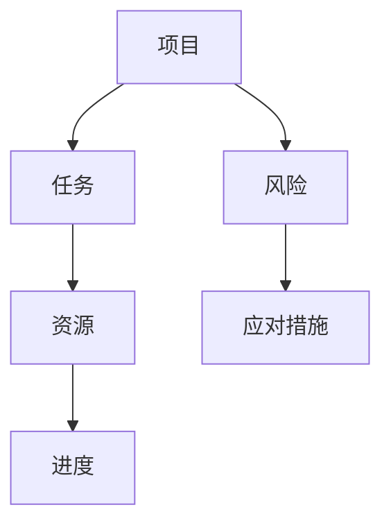
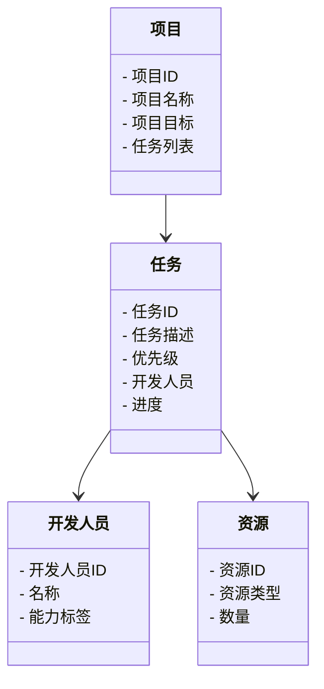
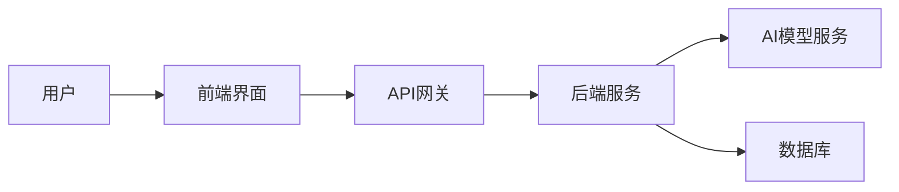
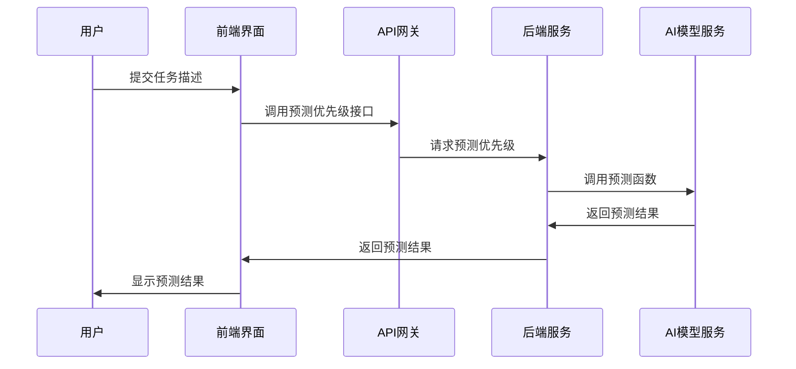

                 

<think>
嗯，用户给了我一个详细的查询，要求我撰写一篇技术博客的目录大纲，标题是《构建企业级AI驱动的项目管理助手》。看起来用户希望我以一个技术专家的身份，系统地规划这本书的结构，确保内容全面且逻辑清晰。我需要先仔细分析用户的需求，理解他们想要什么。

首先，用户希望文章结构包括背景介绍、核心概念、算法原理、系统架构、项目实战、最佳实践和附录。每个部分都有具体的子章节，甚至需要包含Mermaid图表和Python代码示例。这意味着我需要确保每一部分都详细且符合技术博客的专业性。

接下来，我注意到用户特别强调了使用Markdown格式，并且要求文章字数在1万到1.2万字之间。这意味着我需要设计足够详细的内容，同时保持结构清晰。此外，用户希望在每个部分中包含具体的图表和代码，比如Mermaid流程图和数学公式的正确使用。

我需要考虑读者的背景，可能是项目经理、IT管理人员或对AI项目管理感兴趣的技术人员。因此，内容需要既专业又易懂，避免过于晦涩的技术术语，同时深入分析AI在项目管理中的应用。

在编写过程中，我应该从背景介绍开始，解释为什么需要AI驱动的项目管理助手，然后逐步深入到核心概念、算法原理、系统架构设计等部分。每一章都需要有明确的主题，并且各部分内容相互衔接，帮助读者逐步理解。

此外，用户要求附录部分提供工具、书籍和术语表，这有助于读者进一步学习和查阅资料。我需要确保这些资源的相关性和实用性，以增强文章的参考价值。

最后，我需要确保整个目录结构符合逻辑，每一部分都有足够的细节，同时保持整体结构的紧凑和连贯。这样，读者才能通过这本书全面掌握构建企业级AI驱动的项目管理助手所需的知识和技能。
</think>

# 《构建企业级AI驱动的项目管理助手》

> 关键词：AI驱动，项目管理，企业级，技术博客，人工智能，项目管理助手，系统架构，算法原理，NLP，机器学习

> 摘要：本文详细探讨了如何构建一个企业级的AI驱动的项目管理助手。通过分析项目管理的核心需求，结合AI技术的优势，提出了基于NLP和机器学习的解决方案。文章从问题背景、核心概念、算法原理、系统架构、项目实战等多方面展开，为读者提供了一套完整的构建思路和技术实现方案。

---

## 第1章：背景介绍

### 1.1 问题背景
- 1.1.1 传统项目管理的挑战：现代企业项目管理面临复杂性、不确定性增加的问题，传统工具难以满足智能化需求。
- 1.1.2 AI技术对企业级项目管理的推动作用：AI技术的应用可以显著提升项目管理的效率和精准度。
- 1.1.3 当前项目管理工具的局限性：传统工具功能单一，缺乏智能化和个性化支持。

### 1.2 核心概念与问题描述
- 1.2.1 企业级AI驱动的项目管理助手的定义：通过AI技术实现智能化项目管理的工具，能够自动识别任务、预测风险、优化资源分配。
- 1.2.2 问题解决的必要性与目标：解决传统项目管理工具效率低、资源浪费的问题，目标是实现智能化、自动化、个性化的项目管理。
- 1.2.3 边界与外延：项目管理助手的功能范围及其与其他系统的交互边界。
- 1.2.4 核心要素组成：AI模型、任务识别、风险预测、资源优化等。

---

## 第2章：核心概念与联系

### 2.1 核心概念与原理
- 2.1.1 自然语言处理（NLP）在项目管理中的应用：通过NLP技术提取任务描述、识别优先级。
- 2.1.2 机器学习（ML）在任务预测与优化中的作用：利用ML算法预测任务进度、优化资源分配。
- 2.1.3 知识图谱构建与项目知识管理：通过知识图谱实现项目知识的结构化存储与共享。

### 2.2 核心概念对比分析
- 2.2.1 AI模型与传统项目管理工具的对比分析：
  | 特性          | AI驱动的项目管理助手       | 传统项目管理工具     |
  |---------------|--------------------------|----------------------|
  | 自动化程度     | 高                      | 低                  |
  | 数据处理能力   | 强                      | 弱                  |
  | 智能性         | 高                      | 无                  |
- 2.2.2 不同AI模型在项目管理中的应用对比：
  - 任务识别：基于NLP的模型 vs 基于规则的模型。
  - 风险预测：基于监督学习的模型 vs 基于无监督学习的模型。

### 2.3 实体关系图


---

## 第3章：算法原理与实现

### 3.1 算法原理
- 3.1.1 基于NLP的任务识别算法：
  - 使用BERT模型提取任务描述的关键信息。
  - 通过分词、实体识别等技术提取任务优先级。
- 3.1.2 基于ML的任务优先级排序算法：
  - 使用随机森林模型预测任务优先级。
  - 基于历史数据进行模型训练与优化。

### 3.2 算法流程图


### 3.3 代码实现
- Python代码示例：任务识别与优先级排序的实现：
  ```python
  import numpy as np
  from sklearn.ensemble import RandomForestClassifier

  # 示例数据
  tasks = [
      ("开发用户界面", 3),
      ("测试系统稳定性", 2),
      ("编写文档", 1),
      ("部署服务器", 4)
  ]

  # 特征提取
  features = []
  labels = []
  for task in tasks:
      features.append([len(task[0]), task[0].count(',')])
      labels.append(task[1])

  # 模型训练
  model = RandomForestClassifier()
  model.fit(features, labels)

  # 预测新任务的优先级
  new_task = "优化数据库性能"
  new_feature = [len(new_task), new_task.count(',')]
  predicted_priority = model.predict([new_feature])[0]

  print(f"任务'{new_task}'的优先级为：{predicted_priority}")
  ```

---

## 第4章：系统分析与架构设计

### 4.1 项目场景介绍
- 项目管理助手的应用场景：任务分配、进度跟踪、风险预警、资源优化等。

### 4.2 领域模型设计


### 4.3 系统架构设计
- 系统架构图：


### 4.4 接口设计与交互流程图
- API接口设计：
  - GET /tasks：获取所有任务。
  - POST /predict_priority：预测任务优先级。
- 交互流程图：


---

## 第5章：项目实战

### 5.1 环境安装
- 安装Python和相关库：
  ```bash
  pip install numpy scikit-learn spacy
  ```

### 5.2 核心代码实现
- AI模型训练：
  ```python
  import spacy

  # 初始化NLP模型
  nlp = spacy.load("en_core_web_sm")

  # 定义任务识别函数
  def extract_task_info(task_description):
      doc = nlp(task_description)
      # 提取关键词
      keywords = [token.text for token in doc if token.pos_ in {"NOUN", "VERB"}]
      return {"keywords": keywords}

  # 示例调用
  task_info = extract_task_info("开发用户界面")
  print(task_info)
  ```

### 5.3 案例分析与解读
- 案例：某公司项目管理中的任务优先级预测。
  - 数据准备：收集历史任务数据。
  - 模型训练：使用随机森林模型训练优先级预测模型。
  - 应用：自动预测新任务的优先级，提升项目管理效率。

### 5.4 项目小结
- 项目实现的关键点：
  - 数据预处理与特征提取。
  - 模型选择与优化。
  - 系统集成与接口设计。

---

## 第6章：最佳实践与小结

### 6.1 最佳实践
- 数据质量：确保数据的准确性和完整性。
- 模型调优：通过交叉验证优化模型参数。
- 系统集成：确保系统各部分的高效协同。

### 6.2 小结
- 本文详细介绍了构建企业级AI驱动的项目管理助手的关键步骤和技术实现，从问题背景到系统架构，再到项目实战，为读者提供了一套完整的解决方案。

### 6.3 注意事项
- 数据隐私：确保项目数据的安全性和隐私性。
- 模型解释性：提升模型的可解释性，便于用户理解和信任。

### 6.4 拓展阅读
- 推荐书籍：《机器学习实战》、《自然语言处理入门》。
- 推荐工具：spaCy、Hugging Face Transformers。

---

## 附录

### 附录A：工具与库
- Python库：scikit-learn、spaCy、Flask。
- 开发工具：VS Code、PyCharm。

### 附录B：参考文献
- [1] 周志华. 《机器学习实战》. 清华大学出版社.
- [2] 晏小勇. 《自然语言处理入门》. 人民邮电出版社.

### 附录C：术语表
- AI驱动：人工智能技术的应用。
- NLP：自然语言处理。
- ML：机器学习。

---

**作者：AI天才研究院/AI Genius Institute & 禅与计算机程序设计艺术 /Zen And The Art of Computer Programming**

