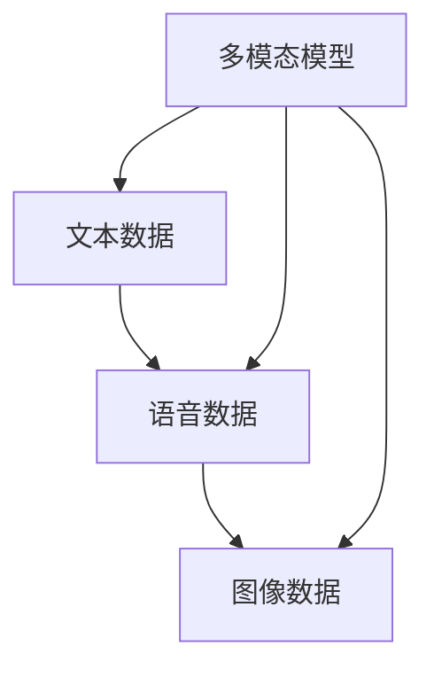
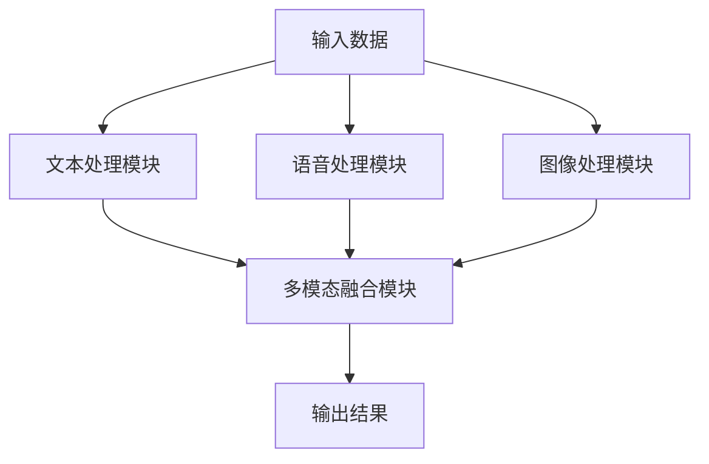
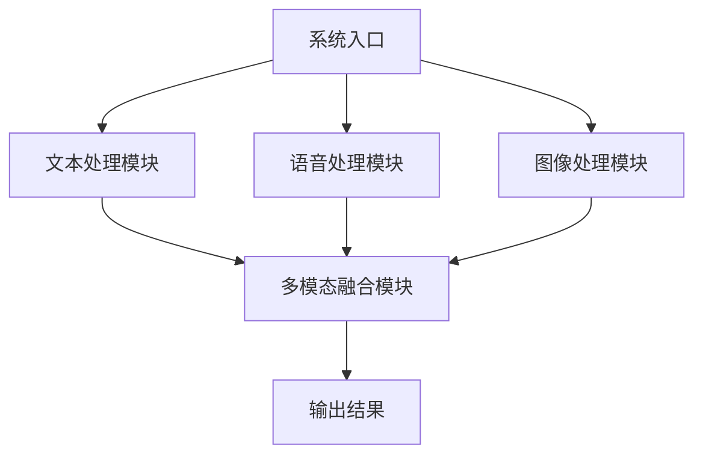
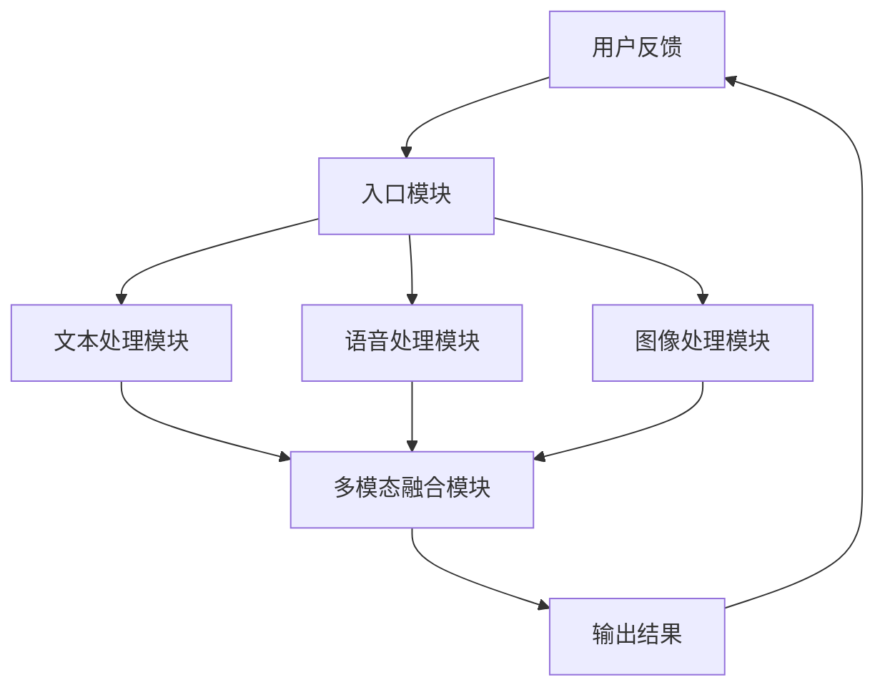

                 

<think>
嗯，我现在需要帮用户设计一本名为《构建企业级多模态AI Agent：整合文本、语音与图像》的书籍目录大纲。首先，我得理解这本书的主题是什么。多模态AI Agent整合了文本、语音和图像，这在企业级应用中应该是挺复杂的，涉及到多个技术领域。

用户给的示例中，软件2.0的书被分成了七章，结构挺清晰的。我应该参考这个结构，看看能不能套用到当前的书名上。首先，我需要确定这本书的核心章节内容，确保涵盖背景介绍、核心概念、算法原理、系统架构、项目实战以及最佳实践等部分。

背景介绍部分，应该包括多模态AI Agent的背景、问题背景、问题描述，以及整合文本、语音和图像的意义。这部分需要让读者明白为什么需要构建这样的系统，以及它在企业中的应用价值。

接下来是核心概念与联系，这部分需要详细讲解多模态AI Agent的原理，可能包括各个模态的处理流程，如何融合这些信息，以及它们之间的关系。可能需要使用Mermaid图来展示实体关系和架构，这样更直观。

然后是算法原理，这部分需要详细讲解相关的数学模型和公式。比如，可能涉及到多模态融合的方法，比如注意力机制或者多模态对比学习。我需要找到合适的数学模型，用LaTeX公式表示，并通过例子来说明这些算法如何工作。

系统分析与架构设计是关键部分，需要介绍项目背景，设计系统功能，可能用领域模型类图来展示各个模块之间的关系。系统架构设计可能需要画出分层架构图，展示数据流、服务调用等。接口设计和交互流程图也很重要，确保系统的各个部分协同工作。

项目实战部分，需要提供具体的实现步骤，包括环境安装、核心代码实现、代码解读和案例分析。这部分要详细，让读者能够跟着步骤一步步构建自己的系统。

最后，最佳实践部分需要总结经验，给出小结、注意事项和拓展阅读建议，帮助读者更好地理解和应用所学内容。

现在，我需要把这些部分整合成一个结构清晰的目录。确保每一章都有足够的细节，细化到三级目录。同时，注意总字数不要超过2000字，保持简洁。

可能的章节安排如下：

1. 背景与概述：介绍多模态AI Agent的基本概念和背景。
2. 核心概念与原理：详细讲解各个模态的处理和融合方法。
3. 算法原理：涉及数学模型和公式，用Mermaid图展示流程。
4. 系统架构设计：用类图和架构图展示系统结构。
5. 项目实战：提供具体的实现步骤和代码。
6. 最佳实践：总结经验，给出注意事项和拓展阅读。

每个章节下再细分小节，确保内容完整且逻辑清晰。例如，在算法原理部分，可以分小节讲解文本处理、语音处理、图像处理，以及多模态融合的方法。

我需要确保每一章都有足够的深度，同时保持整体结构的连贯性。可能还需要检查是否有遗漏的关键点，比如系统的扩展性、可维护性，以及实际应用中的挑战。

最后，整理这些思考，形成一个符合用户要求的目录大纲，确保覆盖所有必要的部分，并且结构合理，内容详尽。
</think>

# 《构建企业级多模态AI Agent：整合文本、语音与图像》

## 关键词：多模态AI Agent，文本处理，语音处理，图像处理，系统架构设计，企业级应用

## 摘要：本文章深入探讨构建企业级多模态AI Agent的整合文本、语音与图像的技术细节。通过分析多模态数据的处理流程、融合方法及系统架构设计，结合实际案例，详细阐述了从理论到实践的全过程，为读者提供全面的技术指导。

---

## 第一部分：背景与概述

### 第1章：多模态AI Agent的背景与问题描述

#### 1.1 多模态AI Agent的背景
- 1.1.1 人工智能与多模态技术的发展
- 1.1.2 多模态AI Agent的定义与特点
- 1.1.3 企业级应用中的多模态AI Agent

#### 1.2 问题背景与需求分析
- 1.2.1 当前企业AI应用的痛点
- 1.2.2 多模态整合的必要性
- 1.2.3 企业级AI Agent的目标与价值

#### 1.3 多模态AI Agent的核心要素
- 1.3.1 文本、语音与图像的整合
- 1.3.2 多模态数据处理的挑战
- 1.3.3 企业级AI Agent的架构特点

---

## 第二部分：核心概念与原理

### 第2章：多模态AI Agent的核心概念与联系

#### 2.1 多模态数据处理原理
- 2.1.1 文本、语音与图像的处理流程
- 2.1.2 多模态数据融合方法
- 2.1.3 多模态数据的关联性分析

#### 2.2 多模态AI Agent的实体关系图


#### 2.3 多模态AI Agent的架构设计


---

## 第三部分：算法原理

### 第3章：多模态数据融合算法

#### 3.1 多模态融合的基本方法
- 3.1.1 基于注意力机制的多模态融合
  - 使用Mermaid图展示注意力机制的流程
  - 用LaTeX公式表示注意力机制的数学模型：
    $$
    \alpha_i = \text{softmax}(\frac{q \cdot k_i}{\sqrt{d}})
    $$
  - 示例说明注意力机制如何在多模态融合中应用

- 3.1.2 基于对比学习的多模态融合
  - 使用Mermaid图展示对比学习的流程
  - 用LaTeX公式表示对比学习的数学模型：
    $$
    \text{loss} = -\log(\text{sim}(x, y))
    $$
  - 示例说明对比学习如何促进多模态数据的融合

---

## 第四部分：系统分析与架构设计

### 第4章：系统架构设计与实现

#### 4.1 项目背景与需求分析
- 4.1.1 项目目标
- 4.1.2 项目需求
- 4.1.3 项目约束

#### 4.2 系统功能设计
- 4.2.1 文本处理模块
  - 接收文本输入，进行分词、情感分析等处理
- 4.2.2 语音处理模块
  - 接收语音输入，进行语音识别和语调分析
- 4.2.3 图像处理模块
  - 接收图像输入，进行目标检测和图像分类
- 4.2.4 多模态融合模块
  - 综合分析文本、语音和图像信息，输出结果

#### 4.3 系统架构设计


#### 4.4 接口设计与交互流程
- 4.4.1 接口设计
  - 文本处理接口：RESTful API
  - 语音处理接口：WebSocket实时通信
  - 图像处理接口：文件上传接口
- 4.4.2 交互流程图


---

## 第五部分：项目实战

### 第5章：多模态AI Agent的实现与应用

#### 5.1 环境安装与配置
- 5.1.1 安装Python环境
- 5.1.2 安装必要的库（如TensorFlow、PyTorch、OpenCV等）
- 5.1.3 配置开发环境（如Jupyter Notebook）

#### 5.2 核心代码实现
- 5.2.1 文本处理模块实现
  ```python
  def text_process(text):
      # 分词处理
      words = tokenizer(text)
      return words
  ```

- 5.2.2 语音处理模块实现
  ```python
  def speech_process(audio_file):
      # 语音识别
      text = recognize(audio_file)
      return text
  ```

- 5.2.3 图像处理模块实现
  ```python
  def image_process(image_file):
      # 目标检测
      result = detect(image_file)
      return result
  ```

- 5.2.4 多模态融合模块实现
  ```python
  def multimodal_fusion(text, speech, image):
      # 融合处理
      fusion_result = model.predict([text, speech, image])
      return fusion_result
  ```

#### 5.3 代码解读与分析
- 5.3.1 文本处理模块的实现细节
- 5.3.2 语音处理模块的实现细节
- 5.3.3 图像处理模块的实现细节
- 5.3.4 多模态融合模块的实现细节

#### 5.4 实际案例分析
- 5.4.1 案例背景介绍
- 5.4.2 数据预处理步骤
- 5.4.3 系统实现过程
- 5.4.4 实验结果与分析

#### 5.5 项目总结与优化
- 5.5.1 项目成果
- 5.5.2 项目优化建议
- 5.5.3 项目局限性分析

---

## 第六部分：最佳实践

### 第6章：多模态AI Agent的优化与拓展

#### 6.1 最佳实践 tips
- 6.1.1 系统设计中的注意事项
- 6.1.2 开发中的常见问题及解决方案
- 6.1.3 系统部署与维护建议

#### 6.2 小结与总结
- 6.2.1 本文的核心内容回顾
- 6.2.2 未来研究方向展望

#### 6.3 注意事项与风险提示
- 6.3.1 开发中的潜在风险
- 6.3.2 系统维护中的常见问题
- 6.3.3 优化中的关键点

#### 6.4 拓展阅读与学习资源
- 6.4.1 推荐的书籍与论文
- 6.4.2 开源项目与工具推荐
- 6.4.3 技术社区与论坛推荐

---

## 作者：AI天才研究院/AI Genius Institute & 禅与计算机程序设计艺术 /Zen And The Art of Computer Programming

