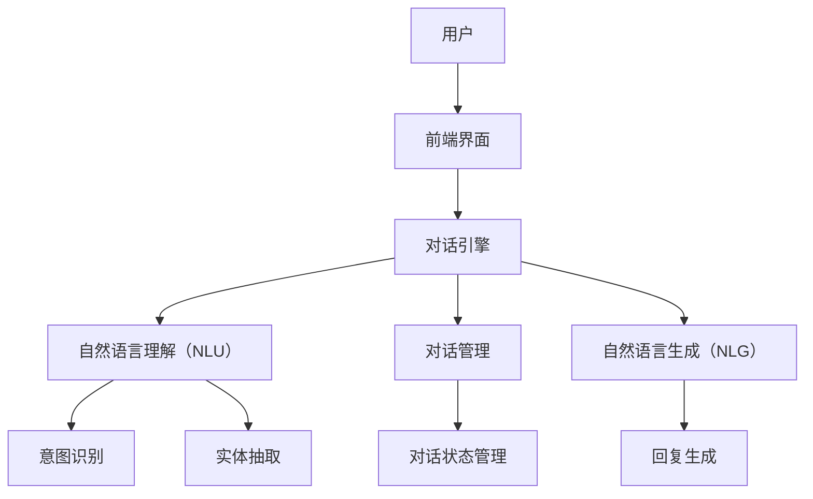
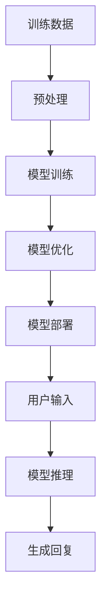
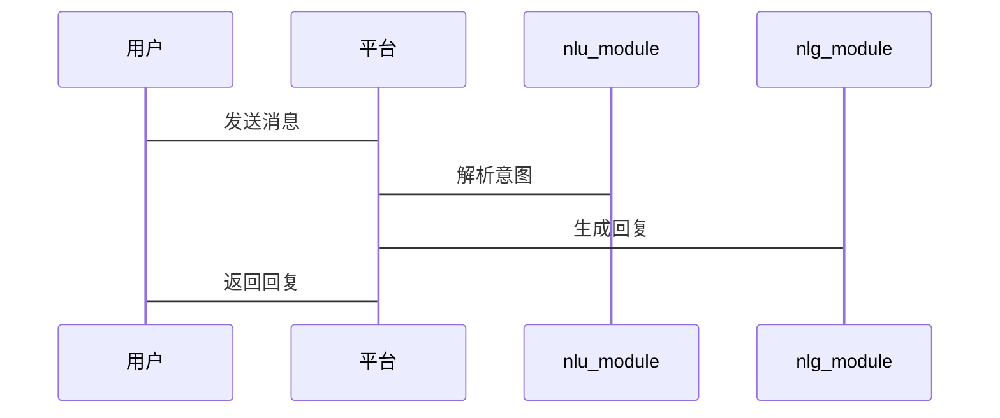

                 


# 构建企业级对话式AI平台：提升内外部沟通效率

## 关键词：
企业级对话式AI，内部沟通效率，外部沟通效率，NLP，机器学习，系统架构设计

## 摘要：
本文详细探讨了如何构建一个高效的企业级对话式AI平台，以提升企业内外部沟通效率。从背景分析到系统设计，再到项目实战，全面覆盖了构建该平台所需的关键技术和架构。通过本文，读者可以系统地了解对话式AI的核心原理、算法实现、系统架构以及实际应用案例。

---

# 第一部分：构建企业级对话式AI平台的背景与核心概念

## 第1章：对话式AI平台的背景与问题背景

### 1.1 问题背景

#### 1.1.1 企业内外部沟通效率的痛点
企业在日常运营中，内部部门之间的沟通效率低下，导致项目延误和资源浪费。同时，与外部客户的沟通也存在信息传递不畅、响应速度慢等问题。传统的邮件、会议和即时通讯工具虽然在一定程度上解决了这些问题，但仍然无法满足现代企业对高效沟通的需求。

#### 1.1.2 对话式AI在企业沟通中的潜在价值
对话式AI（Chat AI）能够通过自然语言处理技术，实现智能化的对话交互，为企业提供实时、精准的沟通支持。它不仅可以自动化处理常见的咨询和问题，还能通过学习和优化提升对话质量，从而显著提升内外部沟通效率。

#### 1.1.3 当前市场中对话式AI平台的现状与挑战
当前市场上已涌现出许多对话式AI平台，但大多数平台主要面向消费者市场，缺乏对企业级需求的深度支持。企业级对话式AI平台需要具备高可用性、可扩展性和安全性，同时要能够与企业现有的业务系统无缝集成。

### 1.2 问题描述

#### 1.2.1 传统沟通方式的低效性分析
传统沟通方式依赖于人工操作，存在以下问题：
- 信息传递延迟：员工需要通过多级审批或多次会议才能解决问题。
- 信息碎片化：各部门之间的信息分散，难以形成统一的视图。
- 响应速度慢：客户在寻求帮助时，可能需要等待数小时甚至数天才能得到回复。

#### 1.2.2 对话式AI在提升沟通效率中的作用
对话式AI通过自动化处理对话内容，能够实时响应用户需求，减少信息传递延迟。同时，它可以通过历史数据学习，不断优化对话策略，提供更精准的服务。

#### 1.2.3 企业级平台的核心目标与边界
企业级对话式AI平台的核心目标是通过智能化对话交互，提升企业内外部的沟通效率。其边界包括：
- 内部员工之间的沟通优化。
- 与外部客户或合作伙伴的对话支持。
- 与其他企业系统的集成（如CRM、ERP等）。

### 1.3 问题解决

#### 1.3.1 对话式AI平台的解决方案概述
通过构建企业级对话式AI平台，企业可以实现：
- 自动化处理常见问题，减少人工干预。
- 提供7×24小时实时对话支持。
- 集成企业内部系统，实现数据共享与协同。

#### 1.3.2 企业级平台的构建目标与关键成功因素
构建目标：
- 提供智能化的对话交互能力。
- 支持多语言、多渠道的对话方式。
- 确保平台的高可用性和安全性。

成功因素：
- 数据质量：高质量的训练数据是对话式AI的核心。
- 技术选型：选择适合的算法和框架。
- 业务理解：深入理解企业的业务需求。

#### 1.3.3 对话式AI平台的边界与外延
平台的边界：
- 不处理企业内部的敏感数据。
- 不直接参与企业的核心业务决策。

平台的外延：
- 与其他企业系统的集成（如CRM、ERP）。
- 对外提供API接口，供第三方开发者使用。

### 1.4 核心概念与联系

#### 1.4.1 对话式AI的核心概念与原理
对话式AI通过自然语言处理（NLP）技术，实现对用户输入的解析和生成。其核心概念包括：
- 意图识别：识别用户的需求类型。
- 实体抽取：提取对话中的关键信息。
- 对话生成：根据上下文生成合适的回复。

#### 1.4.2 对话式AI与传统AI的对比分析
| 特性         | 对话式AI                     | 传统AI                       |
|--------------|------------------------------|----------------------------|
| 应用场景     | 实时对话交互                 | 任务处理                     |
| 输入方式     | 文本或语音                   | 结构化数据                   |
| 响应方式     | 实时反馈                     | 异步处理                     |

#### 1.4.3 对话式AI平台的实体关系图（ER图）
```mermaid
er
    title 实体关系图
    class User {
        id: int
        name: string
        role: string
    }
    class Message {
        id: int
        content: string
        timestamp: datetime
    }
    class Dialog {
        id: int
        user_id: int
        message_id: int
        status: string
    }
    User --> Message: 发送
    Message --> Dialog: 属于
    User --> Dialog: 参与
```

---

## 第2章：对话式AI的核心原理与技术架构

### 2.1 对话式AI的原理与流程

#### 2.1.1 对话式AI的基本工作流程
1. 用户输入对话内容。
2. 平台解析用户的意图和实体。
3. 生成合适的回复。
4. 返回回复给用户。

#### 2.1.2 基于NLP的意图识别与实体抽取
- **意图识别**：使用词袋模型、TF-IDF或深度学习模型（如CNN、RNN）进行分类。
- **实体抽取**：通过正向最大匹配法、分词工具（如jieba）或命名实体识别（NER）模型提取关键信息。

#### 2.1.3 基于机器学习的对话生成与优化
- 对话生成：使用生成式模型（如GPT、Transformer）生成回复。
- 对话优化：通过强化学习或基于规则的方法优化回复质量。

### 2.2 对话式AI的技术架构

#### 2.2.1 对话式AI的系统架构图


#### 2.2.2 对话式AI的核心模块与功能
| 模块         | 功能描述                     |
|--------------|------------------------------|
| 前端界面     | 提供用户对话的入口           |
| 对话引擎     | 管理对话流程和状态           |
| NLU模块      | 解析用户的意图和实体         |
| NLG模块      | 生成对话回复                 |
| 对话管理模块  | 维护对话上下文和状态         |

#### 2.2.3 对话式AI的训练与推理流程


### 2.3 对话式AI的关键算法与数学模型

#### 2.3.1 对话式AI的核心算法
- **意图识别算法**：基于词袋模型的分类算法。
- **实体抽取算法**：基于CRF的命名实体识别。
- **对话生成算法**：基于Transformer的生成模型。

#### 2.3.2 对话式AI的数学模型与公式
- **注意力机制（Attention）**：
  $$\text{Attention}(Q, K, V) = \text{softmax}(\frac{QK^T}{\sqrt{d_k}})V$$

- **生成式模型（如GPT）**：
  $$P(y|x) = \prod_{i=1}^{n} P(y_i | y_{<i}, x)$$

---

## 第3章：企业级对话式AI平台的系统设计与实现

### 3.1 企业级对话式AI平台的系统架构

#### 3.1.1 项目介绍
本项目旨在构建一个支持企业内外部沟通的对话式AI平台，提供智能化的对话交互能力。

#### 3.1.2 系统功能设计
- **用户管理**：支持企业内部员工和外部用户的注册与管理。
- **对话管理**：维护对话历史和上下文。
- **知识库管理**：提供企业知识库的查询与更新功能。

#### 3.1.3 系统架构设计


#### 3.1.4 系统接口设计
- **API接口**：
  - `/api/v1/dialog/start`：启动对话。
  - `/api/v1/dialog/send`：发送消息。
  - `/api/v1/dialog/end`：结束对话。

#### 3.1.5 系统交互设计


---

## 第4章：对话式AI平台的项目实战

### 4.1 环境安装与配置

#### 4.1.1 安装Python
```bash
# 安装Python
sudo apt-get install python3 python3-pip
```

#### 4.1.2 安装依赖库
```bash
pip install numpy pandas scikit-learn transformers
```

### 4.2 系统核心实现

#### 4.2.1 对话引擎实现
```python
class DialogEngine:
    def __init__(self):
        self.nlu = NLUProcessor()
        self.nlg = NLGProcessor()
    
    def process_message(self, message):
        intent = self.nlu.get_intent(message)
        entities = self.nlu.get_entities(message)
        response = self.nlg.generate_response(intent, entities)
        return response
```

#### 4.2.2 NLU模块实现
```python
class NLUProcessor:
    def __init__(self):
        self.tokenizer = Tokenizer()
    
    def get_intent(self, message):
        # 实现意图识别逻辑
        pass
    
    def get_entities(self, message):
        # 实体抽取逻辑
        pass
```

### 4.3 案例分析与实现

#### 4.3.1 案例分析
假设用户输入：“我需要安排一个会议。”
- 意图识别：安排会议。
- 实体抽取：无。

#### 4.3.2 实现细节
```python
# 对话引擎实现
engine = DialogEngine()
message = "我需要安排一个会议。"
response = engine.process_message(message)
print(response)  # 输出：您可以选择任意时间安排会议。
```

---

## 第5章：最佳实践与总结

### 5.1 最佳实践

#### 5.1.1 数据质量管理
确保训练数据的多样性和质量，避免偏见和错误。

#### 5.1.2 模型优化
定期更新模型，优化对话生成策略。

### 5.2 小结
通过构建企业级对话式AI平台，企业可以显著提升内外部沟通效率，同时降低运营成本。

### 5.3 注意事项
- 数据安全：确保用户数据的隐私和安全。
- 系统稳定性：确保平台的高可用性和容错能力。
- 用户体验：提供友好的对话界面和反馈机制。

### 5.4 拓展阅读
- 《Deep Learning》：Ian Goodfellow
- 《Natural Language Processing with PyTorch》：Tianhui Ma, et al.

---

# 作者

**作者：AI天才研究院/AI Genius Institute & 禅与计算机程序设计艺术/Zen And The Art of Computer Programming**

