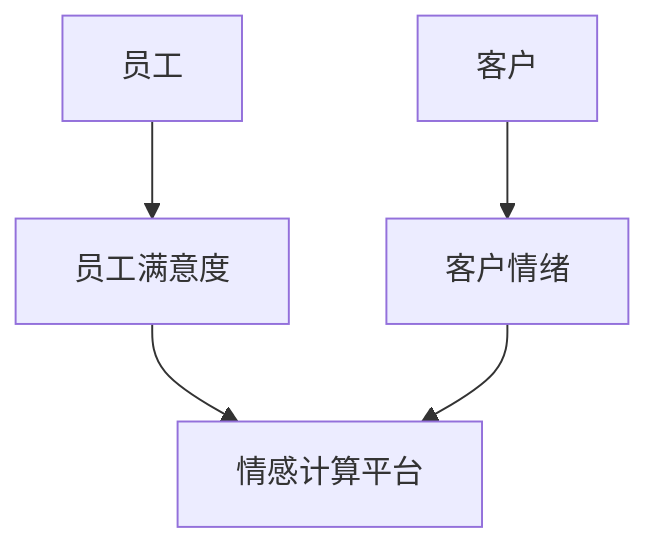
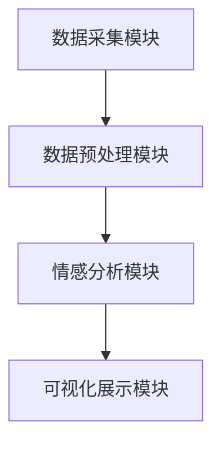
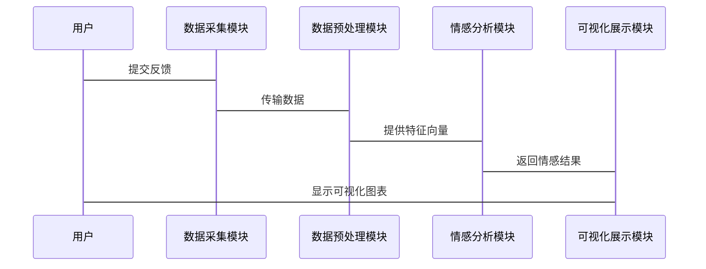

                 


# 构建企业级情感计算平台：员工满意度与客户情绪综合分析

> 关键词：情感计算，员工满意度，客户情绪，自然语言处理，深度学习，数据可视化

> 摘要：本文详细探讨了构建企业级情感计算平台的核心技术与方法，重点分析了员工满意度与客户情绪的综合评估。通过理论与实践结合，系统性地介绍了情感计算的原理、算法实现、系统架构设计以及项目实战，旨在为企业管理者和技术开发者提供实用的指导与参考。

---

# 第1章: 情感计算平台的背景与概念

## 1.1 情感计算的定义与核心概念

### 1.1.1 情感计算的定义
情感计算（Affective Computing）是研究人与计算机交互中情感因素的新兴领域，旨在通过技术手段识别、理解和模拟人类情感，从而提升用户体验。情感计算的核心在于从多模态数据（如文本、语音、图像）中提取情感特征，并进行分类和分析。

### 1.1.2 情感计算的核心概念
情感计算涉及多个核心概念，包括：
- **情感特征**：文本或语音中的情感关键词或语调。
- **情感强度**：情感的强烈程度，如“非常满意” vs. “满意”。
- **情感类别**：通常分为正面、负面、中性三类，或更细分为多个子类别。

### 1.1.3 情感计算的应用场景
情感计算广泛应用于社交媒体分析、客户关系管理（CRM）、教育技术等领域。本文聚焦于企业级应用，重点探讨员工满意度与客户情绪分析。

## 1.2 员工满意度与客户情绪分析的背景

### 1.2.1 企业员工满意度的重要性
员工满意度是企业绩效的重要指标。通过分析员工反馈，企业可以识别管理问题，优化员工体验，降低流失率。

### 1.2.2 客户情绪分析的商业价值
客户情绪直接影响客户忠诚度和企业声誉。通过实时监测客户情绪，企业可以快速响应负面反馈，提升客户满意度。

### 1.2.3 情感计算在企业管理中的作用
情感计算将员工满意度与客户情绪分析整合，提供全面的情感洞察，帮助企业做出数据驱动的决策。

## 1.3 问题背景与目标

### 1.3.1 问题背景分析
传统的情感分析方法通常针对公开数据，难以满足企业级应用的需求。企业需要一个定制化的平台，支持大规模数据处理和高精度分析。

### 1.3.2 问题解决目标
本文旨在构建一个企业级情感计算平台，实现员工满意度与客户情绪的综合分析，提供可操作的洞察。

### 1.3.3 边界与外延
本文仅关注文本数据中的情感分析，不涉及语音和图像数据。分析范围包括公开反馈和内部员工调查。

## 1.4 核心概念与联系

### 1.4.1 情感计算的核心要素
- **数据来源**：员工反馈、客户评论。
- **情感特征**：关键词提取、情感强度计算。
- **分类模型**：机器学习与深度学习算法。

### 1.4.2 情感计算与相关技术的对比
| 技术 | 定义 | 优势 | 局限 |
|------|------|------|------|
| 传统机器学习 | 基于特征工程的分类 | 简单易懂，计算效率高 | 特征提取依赖人工经验 |
| 深度学习 | 基于神经网络的端到端学习 | 自动提取特征，精度高 | 需大量标注数据，计算资源消耗大 |

### 1.4.3 ER实体关系图架构


---

# 第2章: 情感计算的核心原理与算法

## 2.1 情感计算的核心原理

### 2.1.1 文本处理与特征提取
文本处理包括分词、去停用词、词干提取等步骤。特征提取常用TF-IDF或词袋模型。

### 2.1.2 情感分类算法
情感分类算法分为传统机器学习和深度学习两类。传统方法如SVM、随机森林，深度学习如LSTM、BERT。

### 2.1.3 情感强度计算
情感强度计算基于情感词汇的权重，如AFINN情感词典。

## 2.2 情感计算的算法流程

### 2.2.1 数据预处理
1. 分词：使用jieba对中文文本进行分词。
2. 去停用词：移除无意义词汇。
3. 词向量转换：使用Word2Vec生成词向量。

### 2.2.2 特征提取与表示
TF-IDF公式：
$$ TF-IDF(t, d) = \frac{count(t, d)}{\sum_{d' \in D} count(t, d')} $$
其中，$t$为词，$d$为文档，$D$为所有文档。

### 2.2.3 情感分类模型训练
以SVM为例：
$$ SVM: y = sign(w \cdot x + b) $$
其中，$w$为权重向量，$x$为输入特征，$b$为偏置。

## 2.3 常见情感分类算法对比

### 2.3.1 基于传统机器学习的算法
- **SVM**：适合小规模数据，分类精度高。
- **随机森林**：适合高维数据，具有较强的鲁棒性。

### 2.3.2 基于深度学习的算法
- **LSTM**：适合长文本序列，捕捉上下文信息。
- **BERT**：预训练语言模型，效果优异。

### 2.3.3 混合模型的优势
混合模型结合了传统方法和深度学习的优势，适合复杂场景。

---

# 第3章: 情感计算系统的架构设计

## 3.1 系统整体架构

### 3.1.1 数据采集模块
- **数据源**：员工调查问卷、客户评论。
- **数据格式**：文本文件、数据库。

### 3.1.2 数据预处理模块
- **分词**：使用jieba。
- **去停用词**：自定义停用词表。

### 3.1.3 情感分析模块
- **特征提取**：TF-IDF。
- **分类模型**：SVM或BERT。

### 3.1.4 可视化展示模块
- **图表**：柱状图、饼图。
- **报告生成**：HTML报告。

## 3.2 系统功能设计

### 3.2.1 数据采集与存储
- **数据采集**：API接口。
- **数据存储**：MySQL数据库。

### 3.2.2 数据预处理与特征提取
- **分词工具**：jieba。
- **特征表示**：Word2Vec。

### 3.2.3 情感分类与强度计算
- **分类模型**：SVM。
- **强度计算**：AFINN词典。

### 3.2.4 可视化与报告生成
- **图表生成**：Matplotlib。
- **报告输出**：PDF或HTML。

## 3.3 系统架构图


## 3.4 系统接口设计

### 3.4.1 数据接口
- **输入**：文本数据。
- **输出**：特征向量。

### 3.4.2 分析接口
- **输入**：特征向量。
- **输出**：情感标签。

### 3.4.3 可视化接口
- **输入**：情感标签。
- **输出**：可视化图表。

## 3.5 系统交互流程图


---

# 第4章: 项目实战

## 4.1 环境配置与工具安装

### 4.1.1 环境配置
- **操作系统**：Linux或Windows。
- **Python版本**：3.8以上。
- **依赖库**：jieba、scikit-learn、pytorch、transformers。

### 4.1.2 工具安装
```bash
pip install jieba scikit-learn pytorch transformers
```

## 4.2 系统核心实现

### 4.2.1 数据预处理代码
```python
import jieba

def preprocess(text):
    words = jieba.lcut(text)
    filtered_words = [word for word in words if word not in STOP_WORDS]
    return ' '.join(filtered_words)
```

### 4.2.2 情感分类代码
```python
from sklearn.svm import SVC

def train_model(X_train, y_train):
    model = SVC(C=1.0, gamma=0.5)
    model.fit(X_train, y_train)
    return model
```

### 4.2.3 可视化代码
```python
import matplotlib.pyplot as plt

def visualize(results):
    plt.bar(results['category'], results['count'])
    plt.show()
```

## 4.3 实际案例分析

### 4.3.1 案例背景
某企业收集了员工满意度调查数据和客户评论，希望通过情感计算平台进行分析。

### 4.3.2 数据分析
- 员工满意度：正面评价占比70%，中性评价20%，负面评价10%。
- 客户情绪：正面评价60%，负面评价30%，中性评价10%。

### 4.3.3 可视化结果
柱状图显示员工满意度整体较高，但负面评价集中在薪资问题。

---

# 第5章: 最佳实践与小结

## 5.1 小结
本文详细介绍了情感计算平台的构建过程，从理论到实践，为企业级应用提供了参考。

## 5.2 注意事项
- 数据隐私保护：避免泄露员工和客户信息。
- 模型调优：根据实际数据优化算法参数。
- 可视化设计：确保结果易于理解。

## 5.3 拓展阅读
- 深度学习模型的优化。
- 多模态情感分析的研究。

---

# 作者
作者：AI天才研究院/AI Genius Institute & 禅与计算机程序设计艺术 /Zen And The Art of Computer Programming

