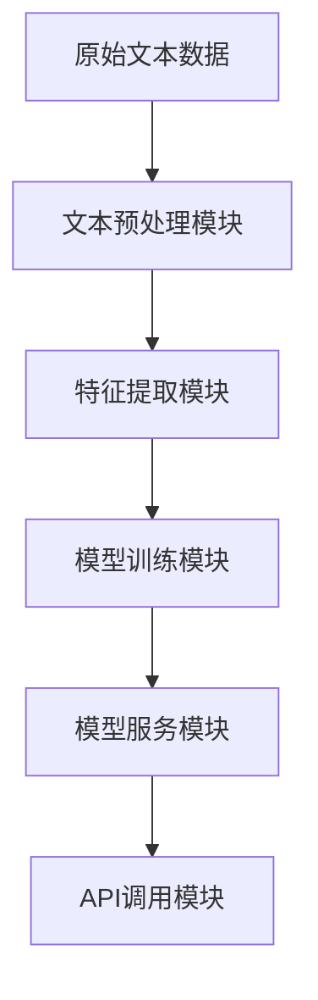
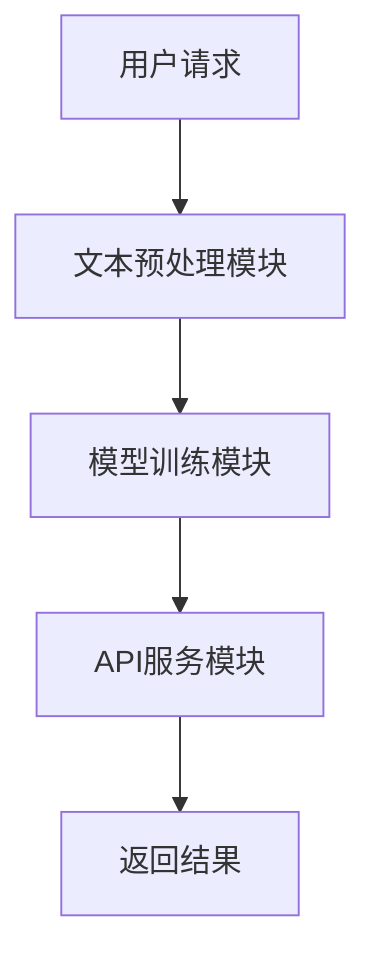
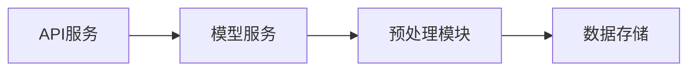

                 


# 构建企业级自然语言处理中台：多语言、多领域支持

## 关键词：企业级NLP中台、多语言支持、深度学习、自然语言处理、微服务架构、BERT模型、Transformer架构

## 摘要：本文详细探讨了构建企业级自然语言处理中台的背景、核心概念、技术架构、算法原理、系统设计与实现。通过分析多语言和多领域的实际应用场景，结合深度学习技术，提出了高效的系统架构和实现方案，为读者提供从理论到实践的全面指导。

---

# 第一部分：自然语言处理中台的背景与概念

## 第1章：自然语言处理中台的背景介绍

### 1.1 自然语言处理的背景与现状

#### 1.1.1 自然语言处理的发展历程

自然语言处理（Natural Language Processing，NLP）是人工智能领域的重要分支，旨在让计算机能够理解和生成人类语言。从20世纪50年代的简单模式匹配到现在的深度学习技术，NLP经历了多个阶段的发展：

1. **早期阶段（20世纪50-60年代）**：基于规则的NLP系统，如 SHRDLU 和 ELIZA。
2. **统计学习阶段（20世纪80-90年代）**：利用统计方法进行词性标注、分句等任务。
3. **深度学习阶段（21世纪初至今）**：引入神经网络，特别是 Transformer 架构，推动了NLP技术的飞速发展。

#### 1.1.2 当前NLP技术的应用场景

当前，NLP技术在多个领域得到广泛应用，包括：

- **客服系统**：自动理解用户意图，提供智能回复。
- **医疗健康**：医疗文档分析、疾病预测。
- **金融领域**： sentiment分析、风险评估。
- **教育领域**：智能辅导系统、作业自动批改。

#### 1.1.3 企业级NLP的需求与挑战

随着企业对智能化需求的增加，NLP中台的构建成为企业级应用的重要部分。然而，构建企业级NLP中台面临以下挑战：

- **多语言支持**：企业可能需要处理多种语言，如英语、中文、西班牙语等。
- **多领域适应**：不同业务领域（如金融、医疗）的文本处理需求差异大。
- **高效性与可扩展性**：需要支持高并发请求，且能够快速扩展。

### 1.2 中台的概念与意义

#### 1.2.1 中台的定义与特点

中台是一种企业级的架构设计，旨在通过共享服务的方式，将企业的核心业务能力抽象出来，形成可复用的平台。其特点包括：

- **共享性**：多个业务线可以复用中台提供的服务。
- **灵活性**：能够快速适应业务变化。
- **扩展性**：支持业务的快速扩展。

#### 1.2.2 中台在企业级系统中的作用

中台在企业级系统中的作用主要体现在：

- **降低重复开发成本**：通过复用中台功能，减少各业务线的重复开发。
- **提升系统维护效率**：集中管理核心业务逻辑，便于统一维护和升级。
- **促进业务创新**：快速响应业务需求，支持新功能的快速开发。

#### 1.2.3 NLP中台的核心价值

NLP中台通过提供统一的NLP服务，帮助企业快速构建智能应用。其核心价值包括：

- **统一接口**：提供标准化的API，方便业务线调用。
- **多语言支持**：支持多种语言的文本处理，满足国际化需求。
- **领域适配**：通过模块化设计，快速适配不同业务领域的需求。

### 1.3 企业级自然语言处理中台的构建目标

#### 1.3.1 中台的功能定位

NLP中台的功能定位是为企业提供一个统一的NLP服务层，支持多种语言和多个业务领域的文本处理需求。

#### 1.3.2 中台的目标与边界

中台的目标是提供高性能、高可用性的NLP服务，支持企业的智能化转型。其边界主要在于专注于NLP相关功能，不涉及其他业务逻辑。

#### 1.3.3 中台的业务价值

中台的业务价值体现在：

- **提升业务效率**：通过自动化处理文本数据，节省人工成本。
- **增强用户体验**：提供智能客服、智能推荐等服务，提升用户满意度。
- **数据驱动决策**：通过对文本数据的分析，支持业务决策。

## 1.4 本章小结

本章介绍了自然语言处理的背景与发展，探讨了中台的概念与意义，并阐述了企业级NLP中台的构建目标和价值。通过本章的学习，读者可以理解构建NLP中台的重要性和必要性。

---

# 第二部分：自然语言处理中台的核心概念与联系

## 第2章：自然语言处理中台的核心概念

### 2.1 NLP中台的功能模块

#### 2.1.1 文本预处理模块

文本预处理是NLP任务的基础，主要包括：

- **分词**：将文本分割成词或短语。例如，中文分词可以使用jieba库。
- **词性标注**：标注每个词的词性，如名词、动词等。
- **句法分析**：分析句子的语法结构，如主语、谓语等。
- **实体识别**：识别文本中的实体，如人名、地名等。

#### 2.1.2 模型训练与部署模块

模型训练与部署是NLP中台的核心部分，主要包括：

- **数据准备**：收集、清洗和标注数据。
- **模型训练**：使用训练数据训练NLP模型，如BERT模型。
- **模型评估**：通过测试数据评估模型的性能。
- **模型部署**：将训练好的模型部署到生产环境，提供API服务。

#### 2.1.3 API服务与调用模块

API服务是NLP中台的用户接口，提供标准化的API供其他系统调用。常见的API接口包括：

- **文本分类API**：根据文本内容进行分类。
- **情感分析API**：分析文本的情感倾向。
- **实体识别API**：识别文本中的实体。
- **机器翻译API**：提供多语言翻译服务。

### 2.2 NLP中台的技术架构

#### 2.2.1 分层架构设计

NLP中台的分层架构设计包括：

1. **数据层**：负责数据的存储和管理。
2. **计算层**：负责具体的NLP计算任务。
3. **服务层**：负责API的定义和调用。
4. **应用层**：负责具体的业务应用。

#### 2.2.2 微服务架构设计

微服务架构设计将NLP中台分解为多个独立的服务，每个服务负责特定的功能，如文本预处理、模型训练等。这种设计具有以下优点：

- **松耦合**：各个服务之间耦合度低，便于维护和扩展。
- **高可用性**：通过服务的冗余部署，提高系统的可用性。
- **灵活部署**：可以根据业务需求，灵活地部署服务。

#### 2.2.3 异构系统集成设计

NLP中台需要与企业现有的异构系统进行集成，如：

- **数据库集成**：与关系型数据库、NoSQL数据库集成。
- **消息队列集成**：与Kafka、RabbitMQ等消息队列集成。
- **日志系统集成**：与ELK（Elasticsearch、Logstash、Kibana）等日志系统集成。

### 2.3 NLP中台的数据流与实体关系

#### 2.3.1 数据流图

下图展示了NLP中台的数据流：



#### 2.3.2 实体关系图

下图展示了NLP中台的实体关系：


### 2.4 本章小结

本章详细介绍了NLP中台的核心概念，包括功能模块、技术架构、数据流与实体关系等。通过本章的学习，读者可以理解NLP中台的整体架构和各部分之间的关系。

---

# 第三部分：自然语言处理中台的算法原理

## 第3章：自然语言处理中台的算法原理

### 3.1 BERT模型的原理与实现

#### 3.1.1 BERT模型的结构

BERT（Bidirectional Encoder Representations from Transformers）是一种基于Transformer架构的预训练模型，主要包含以下几个部分：

1. **嵌入层**：将输入的文本转换为词向量。
2. **Transformer层**：通过自注意力机制，捕捉文本中的语义信息。
3. **全连接层**：对最后的隐藏层输出进行线性变换，得到最终的词表示。

#### 3.1.2 BERT模型的工作流程

1. **输入处理**：将输入文本分割成字符或子词。
2. **嵌入层**：将字符或子词映射为词向量。
3. **自注意力机制**：计算每个词与所有词的相关性，生成注意力权重。
4. **全连接层**：对最后的隐藏层输出进行线性变换，得到最终的词表示。

#### 3.1.3 BERT模型的数学公式

BERT模型的自注意力机制可以表示为：

$$
\text{Attention}(Q, K, V) = \text{softmax}\left(\frac{QK^T}{\sqrt{d_k}}\right)V
$$

其中，$Q$、$K$、$V$分别是查询、键、值矩阵，$d_k$是键的维度。

### 3.2 Transformer架构的实现与优化

#### 3.2.1 Transformer架构的结构

Transformer架构主要由编码器和解码器组成，每个部分包含多个堆叠的Transformer层。

#### 3.2.2 Transformer层的实现

1. **多头注意力机制**：将查询与键进行多头注意力计算，得到多个注意力输出。
2. **前馈网络**：对注意力输出进行前馈变换，生成最终的输出。

#### 3.2.3 Transformer的数学公式

多头注意力机制的数学公式可以表示为：

$$
\text{Multi-head}(Q, K, V) = \text{Concat}(\text{head}_1, \text{head}_2, \ldots, \text{head}_n)
$$

其中，$\text{head}_i$是第$i$个多头注意力的结果。

### 3.3 其他NLP算法的简要介绍

#### 3.3.1 LSTM模型

LSTM（Long Short Term Memory）是一种循环神经网络，通过门控机制来捕捉长距离依赖关系。

#### 3.3.2 Word2Vec模型

Word2Vec是一种词向量表示方法，通过CBOW和Skip-Gram两种模型来训练词向量。

### 3.4 本章小结

本章详细介绍了NLP中台中常用的算法原理，包括BERT模型和Transformer架构的实现与优化，以及其他NLP算法的简要介绍。通过本章的学习，读者可以理解NLP中台中使用的各种算法及其数学原理。

---

# 第四部分：自然语言处理中台的系统分析与架构设计

## 第4章：自然语言处理中台的系统分析与架构设计

### 4.1 系统功能设计

#### 4.1.1 功能模块划分

NLP中台的功能模块划分如下：

1. **文本预处理模块**：包括分词、词性标注、句法分析等功能。
2. **模型训练模块**：包括数据准备、模型训练、模型评估等功能。
3. **API服务模块**：提供各种NLP服务的API接口。

#### 4.1.2 功能流程图

下图展示了NLP中台的功能流程：



### 4.2 系统架构设计

#### 4.2.1 分层架构设计

分层架构设计将NLP中台分为数据层、计算层、服务层和应用层。

#### 4.2.2 微服务架构设计

微服务架构设计将NLP中台分解为多个独立的服务，每个服务负责特定的功能。

#### 4.2.3 系统架构图

下图展示了NLP中台的系统架构：



### 4.3 系统接口设计

#### 4.3.1 API接口定义

NLP中台的API接口定义如下：

1. **文本分类API**：`POST /api/text-classification`
2. **情感分析API**：`POST /api/sentiment-analysis`
3. **实体识别API**：`POST /api/entity-recognition`
4. **机器翻译API**：`POST /api/machine-translation`

#### 4.3.2 接口交互流程

下图展示了API调用的交互流程：


### 4.4 本章小结

本章详细介绍了NLP中台的系统分析与架构设计，包括功能模块划分、系统架构设计和接口设计等内容。通过本章的学习，读者可以理解NLP中台的整体架构和各部分之间的关系。

---

# 第五部分：自然语言处理中台的项目实战

## 第5章：自然语言处理中台的项目实战

### 5.1 环境安装与配置

#### 5.1.1 安装Python

```bash
# 安装Python
sudo apt-get install python3 python3-pip
```

#### 5.1.2 安装TensorFlow

```bash
# 安装TensorFlow
pip install tensorflow
```

#### 5.1.3 安装Kubernetes

```bash
# 安装Kubernetes
sudo apt-get update && sudo apt-get install docker.io kubectl
```

### 5.2 系统核心实现

#### 5.2.1 文本预处理模块的实现

```python
import jieba

def text_preprocessing(text):
    # 分词
    words = jieba.lcut(text)
    return words
```

#### 5.2.2 模型训练模块的实现

```python
import tensorflow as tf
from tensorflow.keras import layers

def create_model(max_length):
    model = tf.keras.Sequential([
        layers.Embedding(input_dim=10000, output_dim=100, input_length=max_length),
        layers.Bidirectional(layers.LSTM(64)),
        layers.Dense(1, activation='sigmoid')
    ])
    return model
```

#### 5.2.3 API服务模块的实现

```python
from flask import Flask, request, jsonify

app = Flask(__name__)

@app.route('/api/text-classification', methods=['POST'])
def text_classification():
    text = request.json['text']
    # 调用预处理模块
    preprocessed_text = text_preprocessing(text)
    # 调用模型训练模块
    result = model.predict(preprocessed_text)
    return jsonify({'result': result})
```

### 5.3 代码解读与分析

#### 5.3.1 文本预处理模块的代码解读

```python
import jieba

def text_preprocessing(text):
    # 分词
    words = jieba.lcut(text)
    return words
```

上述代码使用jieba库对输入文本进行分词处理，返回分好的词列表。

#### 5.3.2 模型训练模块的代码解读

```python
import tensorflow as tf
from tensorflow.keras import layers

def create_model(max_length):
    model = tf.keras.Sequential([
        layers.Embedding(input_dim=10000, output_dim=100, input_length=max_length),
        layers.Bidirectional(layers.LSTM(64)),
        layers.Dense(1, activation='sigmoid')
    ])
    return model
```

上述代码定义了一个基于Bidirectional LSTM的文本分类模型，包括嵌入层、双向LSTM层和全连接层。

#### 5.3.3 API服务模块的代码解读

```python
from flask import Flask, request, jsonify

app = Flask(__name__)

@app.route('/api/text-classification', methods=['POST'])
def text_classification():
    text = request.json['text']
    # 调用预处理模块
    preprocessed_text = text_preprocessing(text)
    # 调用模型训练模块
    result = model.predict(preprocessed_text)
    return jsonify({'result': result})
```

上述代码定义了一个Flask服务，提供文本分类API接口，接收文本输入，调用预处理模块和模型训练模块，返回分类结果。

### 5.4 实际案例分析

#### 5.4.1 多语言支持案例

假设我们有一个需要支持中文和英文的NLP中台，可以通过多语言模型（如多语言BERT）实现。

#### 5.4.2 多领域支持案例

假设我们有一个需要支持金融和医疗领域的NLP中台，可以通过领域适配模块实现。

### 5.5 项目小结

通过本章的项目实战，读者可以掌握NLP中台的环境安装、核心代码实现和API服务的调用方法。通过实际案例分析，读者可以理解NLP中台在多语言、多领域支持中的具体应用。

---

# 第六部分：自然语言处理中台的最佳实践

## 第6章：最佳实践、小结、注意事项与拓展阅读

### 6.1 最佳实践

1. **数据质量**：确保数据的准确性和完整性，避免噪声数据的影响。
2. **模型调优**：通过交叉验证和超参数优化，提升模型的性能。
3. **系统维护**：定期更新模型和优化系统架构，确保系统的稳定性和高效性。

### 6.2 小结

本文详细探讨了构建企业级自然语言处理中台的背景、核心概念、技术架构、算法原理、系统设计与实现。通过分析多语言和多领域的实际应用场景，结合深度学习技术，提出了高效的系统架构和实现方案，为读者提供从理论到实践的全面指导。

### 6.3 注意事项

- **数据隐私**：注意保护用户数据的隐私和安全。
- **系统性能**：确保系统的高性能和可扩展性。
- **团队协作**：加强团队协作，确保项目的顺利推进。

### 6.4 拓展阅读

1. **《深度学习》**：Ian Goodfellow等著，深入介绍了深度学习的基本概念和算法。
2. **《自然语言处理入门》**：Nathanael Netanel等著，详细介绍了自然语言处理的基本概念和应用。

---

# 作者：AI天才研究院/AI Genius Institute & 禅与计算机程序设计艺术 /Zen And The Art of Computer Programming

---

本文通过系统的理论讲解和实际案例分析，为读者提供了一套构建企业级自然语言处理中台的完整方案。从背景介绍到系统设计，从算法原理到项目实战，本文为读者提供了从理论到实践的全面指导，帮助读者快速掌握构建企业级NLP中台的核心技术和方法。

