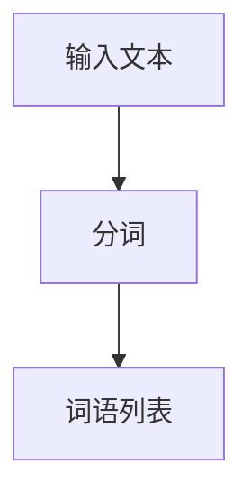
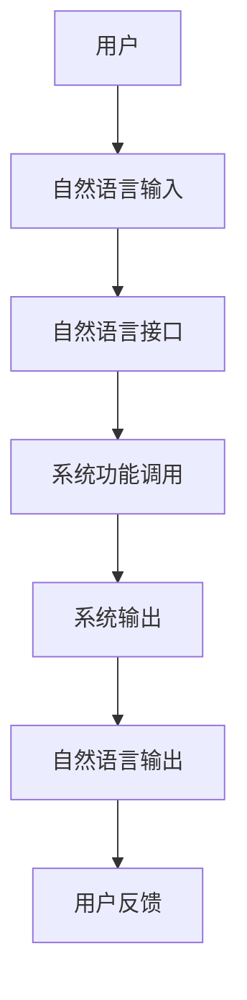

                 


# 构建企业级自然语言接口：简化复杂业务系统操作

## 关键词：自然语言处理，企业级系统，自然语言接口，系统架构，算法原理

## 摘要：  
企业级自然语言接口（NLI）通过自然语言处理技术，简化了复杂业务系统的操作。本文从背景、核心概念、算法原理、系统架构、项目实战等多个维度，详细解析企业级NLI的构建过程，涵盖分词、实体识别、意图理解等关键技术，结合实际案例，提供系统设计与实现的最佳实践。

---

## 第一部分: 企业级自然语言接口概述

### 第1章: 自然语言处理与企业级系统概述

#### 1.1 自然语言处理的基本概念  
自然语言处理（NLP）是人工智能领域的重要分支，旨在让计算机能够理解、生成和操作人类语言。NLP的核心目标是实现人与计算机之间的自然交互，解决信息提取、文本生成、情感分析等问题。  

**企业级系统的特点与复杂性**：  
企业级系统通常涉及复杂的业务流程、多部门协作和大量数据处理。传统的图形用户界面（GUI）虽然直观，但在处理复杂操作时效率低下，且难以满足用户多样化的交互需求。  

**问题背景与需求分析**：  
复杂业务系统的操作流程繁琐，用户需要通过多步交互完成任务，导致效率低下。自然语言接口通过将自然语言转化为系统操作指令，简化了用户与系统之间的交互，提高了操作效率。  

---

### 第2章: 自然语言接口的核心概念与联系  

#### 2.1 核心概念原理  
自然语言接口（NLI）由自然语言理解（NLU）和自然语言生成（NLG）两部分组成：  
- **NLU**：将用户输入的自然语言文本转化为结构化的计算机指令，涉及分词、实体识别、意图理解等技术。  
- **NLG**：根据系统处理结果生成自然语言反馈，帮助用户理解系统输出。  

**企业级NLI的特点**：  
- 高准确性：在复杂业务场景中，确保指令解析的准确性。  
- 高可用性：支持高并发请求，满足企业级系统的稳定性要求。  
- 可扩展性：能够灵活适配不同业务场景和系统功能。  

---

## 第二部分: 自然语言接口的算法原理

### 第3章: 分词算法  

#### 3.1 基于统计的分词算法  
基于统计的分词算法通过分析语言数据的统计特性，如词频、语言模型等，实现词语的自动分割。常用算法包括：  
- **最大匹配法（MM）**：从左到右扫描文本，匹配最长的已知词。  
- **动态规划法（DP）**：通过动态规划优化分词结果，减少错误率。  

**分词流程图**：  


#### 3.2 基于规则的分词算法  
基于规则的分词算法利用语言学知识，如语法规则、词汇规则等，进行词语分割。常见的规则包括：  
- 专有名词（如公司名称、人名）优先分割。  
- 动词、名词等词性规则辅助分割。  

---

## 第三部分: 系统架构与设计

### 第4章: 企业级自然语言接口的系统架构设计  

#### 4.1 问题场景分析  
以企业级系统中的订单处理为例，用户可以通过自然语言指令完成订单查询、状态跟踪等操作。  

#### 4.2 系统功能设计  
- **用户输入处理**：接收用户输入的自然语言指令，如“查询订单状态”。  
- **指令解析**：通过NLU技术解析指令，生成系统可执行的操作。  
- **系统反馈**：系统处理后，通过NLG生成自然语言反馈，如“订单已发货”。  

#### 4.3 系统架构图  


---

## 第四部分: 项目实战

### 第5章: 企业级自然语言接口的实现  

#### 5.1 环境安装与配置  
- **Python环境**：安装Python 3.8及以上版本。  
- **NLP库**：安装spaCy、jieba等分词库。  
- **机器学习框架**：安装TensorFlow或PyTorch。  

#### 5.2 核心功能实现  
**分词功能实现**：  
```python
import jieba

def tokenize(text):
    return list(jieba.lcut(text))
```

**实体识别功能实现**：  
```python
import spacy

nlp = spacy.load("zh_core_web_sm")
def identify_entities(text):
    doc = nlp(text)
    entities = [(ent.text, ent.label_) for ent in doc.ents]
    return entities
```

---

## 第五部分: 最佳实践与总结

### 第6章: 实施企业级自然语言接口的最佳实践  

#### 6.1 项目小结  
企业级自然语言接口的构建需要结合NLP技术、系统架构设计和实际业务需求。通过分词、实体识别、意图理解等技术，可以显著简化复杂业务系统的操作流程。  

#### 6.2 注意事项  
- 确保系统的高可用性和稳定性。  
- 定期更新和优化NLI模型，以提高准确率。  
- 注意数据隐私和安全问题。  

---

## 作者：AI天才研究院/AI Genius Institute & 禅与计算机程序设计艺术 /Zen And The Art of Computer Programming  

---

以上是《构建企业级自然语言接口：简化复杂业务系统操作》的技术博客文章目录和部分内容概述。文章详细分析了企业级自然语言接口的构建过程，从理论到实践，涵盖了核心概念、算法原理、系统架构设计和项目实战等关键环节，为读者提供全面的技术指导和实践参考。

