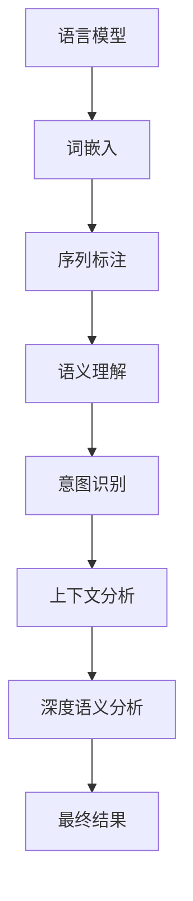
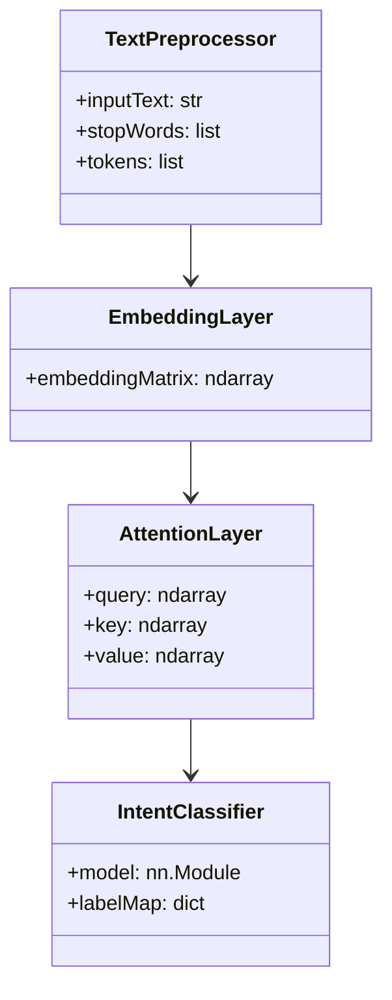
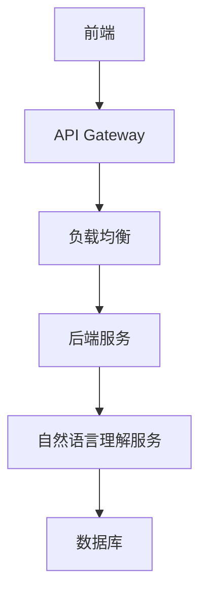
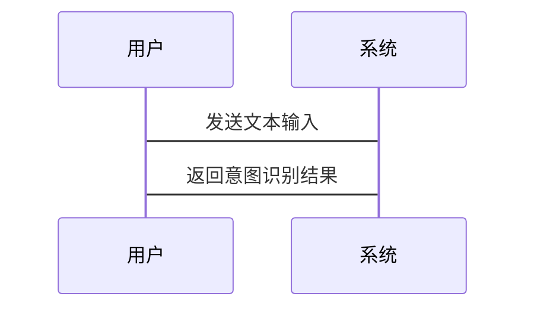

                 


# 构建企业级自然语言理解系统：深度语义分析与意图识别

> **关键词**：自然语言理解（NLU）、深度语义分析、意图识别、企业级系统、深度学习  
> **摘要**：本文深入探讨了构建企业级自然语言理解系统的关键技术和方法。重点介绍了自然语言理解的核心概念、深度语义分析的原理与实现，以及意图识别的技术细节。通过详细分析企业级NLU系统的架构设计与实际应用案例，本文为读者提供了从理论到实践的全面指导，帮助技术开发者和企业更好地理解和应用自然语言理解技术。

---

## 第一章: 自然语言理解系统背景与应用

### 1.1 自然语言理解的定义与核心概念

#### 1.1.1 什么是自然语言理解
自然语言理解（Natural Language Understanding, NLU）是人工智能领域的重要分支，旨在让计算机能够理解人类的自然语言输入（如文本或语音），并从中提取有用的信息或意图。NLU的核心目标是将人类语言转化为计算机可以处理的结构化数据。

#### 1.1.2 自然语言理解的核心要素
- **语言模型**：基于统计或深度学习的方法，预测下一个词或句子的概率分布。
- **语义理解**：通过上下文分析，理解输入文本的含义。
- **意图识别**：从文本中提取用户的意图或目标。

#### 1.1.3 自然语言理解的应用场景
- 智能客服系统：通过解析用户的输入，自动识别用户需求并提供解决方案。
- 智能搜索引擎：理解用户的搜索意图，提供更精准的结果。
- 智能音箱：通过语音识别和语义理解，实现人机交互。

### 1.2 企业级自然语言理解系统的价值

#### 1.2.1 企业级NLU的定义
企业级自然语言理解系统是指在企业环境中部署的NLU系统，能够处理大规模、多样化的自然语言输入，并满足企业级的性能和稳定性要求。

#### 1.2.2 企业级NLU的应用价值
- 提高用户体验：通过智能交互，提升客户满意度。
- 提升效率：自动化处理大量文本数据，降低人工成本。
- 增强竞争力：通过智能化服务，提升企业的市场竞争力。

#### 1.2.3 企业级NLU的挑战与机遇
- **挑战**：数据量大、领域专业性强、语义理解复杂。
- **机遇**：AI技术的进步为企业级NLU提供了更强大的技术支持。

### 1.3 本书的核心目标与结构

#### 1.3.1 本书的核心目标
本文旨在系统地介绍企业级自然语言理解系统的构建方法，涵盖从理论到实践的全过程。

#### 1.3.2 本书的结构安排
- 第一部分：自然语言理解系统概述。
- 第二部分：自然语言理解的核心概念与联系。
- 第三部分：深度语义分析与意图识别的算法原理。
- 第四部分：企业级自然语言理解系统的架构设计。
- 第五部分：项目实战与最佳实践。

#### 1.3.3 本书的读者群体
- AI工程师、数据科学家。
- 企业级系统架构师。
- 对自然语言理解技术感兴趣的技术爱好者。

---

## 第二章: 自然语言理解的核心原理

### 2.1 自然语言理解的原理概述

#### 2.1.1 语言模型的基本原理
语言模型通过概率统计方法，计算给定文本出现的概率。常用的语言模型包括n-gram模型和基于深度学习的模型（如LSTM、Transformer）。

#### 2.1.2 语义理解的实现方式
语义理解通过分析文本的上下文关系，提取关键词、实体和意图。常用的方法包括基于规则的语义理解、统计模型和深度学习模型。

#### 2.1.3 意图识别的算法框架
意图识别的目标是通过文本输入预测用户的意图。常用的算法包括朴素贝叶斯、支持向量机（SVM）、随机森林和深度学习模型（如CNN、RNN、Transformer）。

### 2.2 自然语言理解的关键技术

#### 2.2.1 词嵌入技术
词嵌入是一种将词表示为低维向量的方法，常用的嵌入技术包括Word2Vec、GloVe和FastText。

#### 2.2.2 语法分析技术
语法分析通过解析句子的语法结构，帮助理解文本的含义。常用的语法分析方法包括基于规则的语法分析和基于统计的语法分析。

#### 2.2.3 上下文理解技术
上下文理解通过分析文本的上下文关系，提高语义理解的准确性。常用的上下文理解技术包括注意力机制和基于预训练模型的上下文理解（如BERT、GPT）。

### 2.3 自然语言理解的核心模型

#### 2.3.1 基于规则的模型
基于规则的模型通过预定义的规则，匹配输入文本并提取意图。这种方法适用于规则明确的场景，但灵活性较差。

#### 2.3.2 统计模型
统计模型通过统计文本数据的特征，建立概率模型进行预测。常用的统计模型包括朴素贝叶斯、最大熵模型和SVM。

#### 2.3.3 深度学习模型
深度学习模型通过多层神经网络，自动提取文本的特征并进行分类。常用的深度学习模型包括RNN、LSTM、Transformer和预训练语言模型（如BERT、GPT）。

---

## 第三章: 深度语义分析与意图识别

### 3.1 深度语义分析的基本概念

#### 3.1.1 什么是深度语义分析
深度语义分析通过深度学习模型，分析文本的上下文关系，提取语义信息。这种方法能够更好地理解复杂语义，适用于需要高精度语义理解的场景。

#### 3.1.2 深度语义分析的特点
- **上下文感知**：能够理解上下文关系，提高语义理解的准确性。
- **深度特征提取**：通过多层神经网络，提取文本的深度特征。
- **可扩展性**：能够处理大规模、多样化的文本数据。

#### 3.1.3 深度语义分析的应用
- 智能对话系统：通过深度语义分析，实现更自然的对话交互。
- 信息提取系统：从文本中提取实体、关系和事件。
- 情感分析系统：分析文本的情感倾向。

### 3.2 意图识别的核心技术

#### 3.2.1 意图识别的定义
意图识别是指通过分析输入文本，预测用户的意图或目标。意图识别是自然语言理解的重要组成部分，广泛应用于智能客服、智能助手等领域。

#### 3.2.2 意图识别的算法实现
常用的意图识别算法包括：
- 基于规则的意图识别：通过预定义的规则匹配输入文本。
- 基于统计的意图识别：通过统计特征进行分类。
- 基于深度学习的意图识别：通过神经网络模型进行分类。

#### 3.2.3 意图识别的评估指标
常用的意图识别评估指标包括准确率、召回率、F1值和混淆矩阵。

### 3.3 深度语义分析与意图识别的关系

#### 3.3.1 深度语义分析在意图识别中的作用
深度语义分析通过分析文本的上下文关系，提高意图识别的准确性。特别是在处理复杂语义和模糊表达时，深度语义分析能够提供更可靠的结果。

#### 3.3.2 意图识别对深度语义分析的依赖
意图识别依赖于深度语义分析提供的语义信息，尤其是在处理复杂场景时，深度语义分析能够提供更丰富的语义特征。

#### 3.3.3 两者结合的实现方式
通过将深度语义分析与意图识别相结合，可以实现更准确的意图识别。常用的方法包括：
- 基于预训练模型的意图识别：利用BERT、GPT等预训练模型进行意图分类。
- 端到端的意图识别：通过深度学习模型直接从文本输入预测意图。

---

## 第四章: 自然语言理解的核心概念与联系

### 4.1 自然语言理解的核心概念

#### 4.1.1 语言模型
语言模型是自然语言理解的基础，通过概率统计方法，预测文本的出现概率。

#### 4.1.2 语义理解
语义理解通过分析文本的上下文关系，提取语义信息。语义理解是自然语言理解的核心部分。

#### 4.1.3 意图识别
意图识别是自然语言理解的重要组成部分，通过分析文本，预测用户的意图或目标。

### 4.2 核心概念的属性对比

#### 4.2.1 语言模型与语义理解的对比

| 属性         | 语言模型             | 语义理解             |
|--------------|----------------------|----------------------|
| 目标         | 预测文本的概率分布   | 提取语义信息         |
| 方法         | 统计或深度学习        | 统计、规则或深度学习  |
| 应用场景       | 机器翻译、文本生成   | 智能客服、信息提取   |

#### 4.2.2 意图识别与实体识别的对比

| 属性         | 意图识别             | 实体识别             |
|--------------|----------------------|----------------------|
| 目标         | 预测用户的意图       | 提取文本中的实体     |
| 方法         | 分类、深度学习        | 基于规则或统计方法  |
| 应用场景       | 智能助手、智能客服    | 信息抽取、问答系统   |

#### 4.2.3 深度语义分析与传统语义分析的对比

| 属性         | 深度语义分析         | 传统语义分析         |
|--------------|----------------------|----------------------|
| 方法         | 基于深度学习模型     | 基于规则或统计方法   |
| 特性         | 上下文感知强         | 上下文感知弱         |
| 应用场景       | 智能对话系统         | 简单信息提取         |

### 4.3 实体关系图架构的 Mermaid 流程图



---

## 第五章: 深度语义分析与意图识别的算法原理

### 5.1 深度语义分析的算法原理

#### 5.1.1 基于预训练模型的语义分析
预训练模型（如BERT、GPT）通过大量数据训练，能够理解文本的上下文关系。在实际应用中，可以通过微调预训练模型，适应特定任务的需求。

#### 5.1.2 注意力机制的实现原理
注意力机制通过计算输入文本中每个词的关注度，聚焦于重要的信息。注意力机制的公式如下：

$$
\text{Attention}(Q, K, V) = \text{softmax}\left(\frac{QK^T}{\sqrt{d_k}}\right)V
$$

其中，$Q$ 是查询向量，$K$ 是键向量，$V$ 是值向量，$d_k$ 是键的维度。

#### 5.1.3 多层感知机的实现
多层感知机（MLP）通过多层神经网络，提取文本的深度特征。MLP的结构如下：

$$
y = \sigma(Wx + b)
$$

其中，$x$ 是输入向量，$W$ 是权重矩阵，$b$ 是偏置向量，$\sigma$ 是激活函数。

### 5.2 意图识别的算法实现

#### 5.2.1 基于深度学习的意图分类
深度学习模型（如LSTM、Transformer）通过多层神经网络，直接从文本输入中预测意图。例如，使用BERT模型进行意图分类的流程如下：

1. 输入文本经过词嵌入，生成词向量。
2. 词向量通过多层神经网络进行特征提取。
3. 特征向量通过 softmax 层进行分类，输出意图的概率分布。

#### 5.2.2 意图分类的评估指标
常用的意图分类评估指标包括准确率、召回率、F1值和混淆矩阵。准确率的计算公式如下：

$$
\text{准确率} = \frac{\text{正确分类的样本数}}{\text{总样本数}}
$$

### 5.3 深度语义分析与意图识别的结合

#### 5.3.1 端到端的意图识别
端到端的意图识别模型直接从文本输入中预测意图，无需手动提取特征。例如，使用预训练的BERT模型进行意图分类的代码示例如下：

```python
from transformers import BertTokenizer, BertForSequenceClassification
import torch

# 加载预训练模型和分词器
tokenizer = BertTokenizer.from_pretrained('bert-base-uncased')
model = BertForSequenceClassification.from_pretrained('bert-base-uncased')

# 定义输入文本
text = "我需要查询明天的天气。"
# 分词
inputs = tokenizer(text, return_tensors='pt')
# 前向传播
outputs = model(**inputs)
# 获取预测结果
 predicts = torch.argmax(outputs.logits, dim=-1)
 print(predicts)
```

#### 5.3.2 注意力机制的应用
注意力机制在意图识别中的应用可以提高模型对重要信息的关注度。例如，在文本分类任务中，注意力机制可以帮助模型聚焦于关键词。

---

## 第六章: 企业级自然语言理解系统的架构设计

### 6.1 系统分析与设计

#### 6.1.1 问题场景介绍
企业级自然语言理解系统需要处理大规模、多样化的文本数据，并满足高可用性和高性能的要求。

#### 6.1.2 系统功能设计
- 文本预处理：分词、停用词处理、实体识别。
- 深度语义分析：词嵌入、序列标注、上下文分析。
- 意图识别：分类、预测、结果输出。
- 系统接口：REST API、WebSocket。

#### 6.1.3 领域模型设计
领域模型通过类图表示系统中的核心实体和它们之间的关系。例如：



### 6.2 系统架构设计

#### 6.2.1 系统架构图
系统架构图展示了系统的整体结构和模块之间的关系。例如：



#### 6.2.2 接口设计
系统接口设计包括输入接口和输出接口。输入接口接收文本数据，输出接口返回解析结果。

#### 6.2.3 交互流程图
交互流程图展示了用户与系统之间的交互流程。例如：



### 6.3 系统优化与部署

#### 6.3.1 系统优化
系统优化包括性能优化、可扩展性和可维护性优化。例如，通过负载均衡和分布式部署提高系统的性能。

#### 6.3.2 系统部署
系统部署包括本地部署和云部署。本地部署适合小规模测试，云部署适合大规模应用。

---

## 第七章: 项目实战与最佳实践

### 7.1 项目实战

#### 7.1.1 环境安装
项目实战需要安装必要的依赖库，例如Python、TensorFlow、Keras、Transformers等。

#### 7.1.2 核心实现
核心实现包括文本预处理、深度语义分析和意图识别的实现。例如：

```python
import numpy as np
from tensorflow.keras import layers

# 定义词嵌入层
embedding_layer = layers.Embedding(input_dim=10000, output_dim=50)

# 定义注意力机制层
def attention_layer(inputs):
    query = Dense(64, activation='relu')(inputs)
    key = Dense(64, activation='relu')(inputs)
    value = Dense(64, activation='relu')(inputs)
    attention_weights = layers.Softmax()(dot([query, key], axes=[1,1]))
    output = layers.Dot(axes=[1,1])([attention_weights, value])
    return output

# 定义意图分类层
intent_classifier = Dense(10, activation='softmax')(attention_layer(embedding_layer(input)))
```

#### 7.1.3 代码解读与分析
代码解读与分析包括各层的实现、模型的训练和评估。例如，通过混淆矩阵和F1值评估模型的性能。

#### 7.1.4 实际案例分析
实际案例分析包括将模型应用于实际场景，例如智能客服系统的意图识别。

### 7.2 最佳实践

#### 7.2.1 小结
小结部分总结了本章的主要内容，包括项目实战的核心实现和最佳实践。

#### 7.2.2 注意事项
注意事项包括模型的调参、数据的预处理和系统的优化。

#### 7.2.3 拓展阅读
拓展阅读包括推荐相关的书籍和论文，例如《Deep Learning》和《Natural Language Processing with PyTorch》。

---

## 第八章: 总结与展望

### 8.1 总结
本文系统地介绍了企业级自然语言理解系统的构建方法，涵盖了从理论到实践的全过程。

### 8.2 未来展望
未来展望包括深度学习技术的进步、多模态自然语言理解的发展和自然语言生成技术的突破。

---

## 作者信息

作者：AI天才研究院/AI Genius Institute & 禅与计算机程序设计艺术/Zen And The Art of Computer Programming

---

以上是《构建企业级自然语言理解系统：深度语义分析与意图识别》的技术博客文章的详细大纲和内容。如果需要进一步补充或修改，请随时告知！

