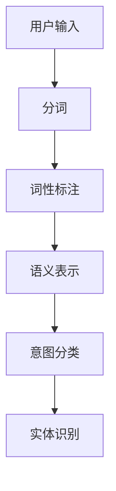
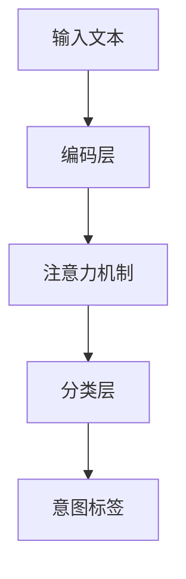
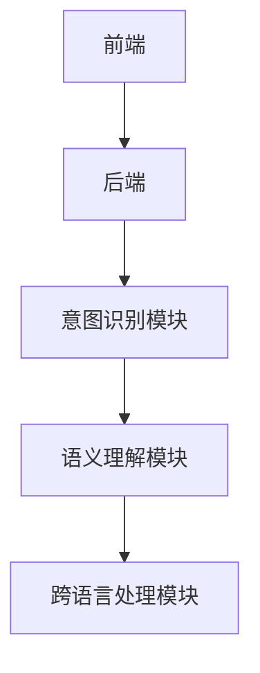
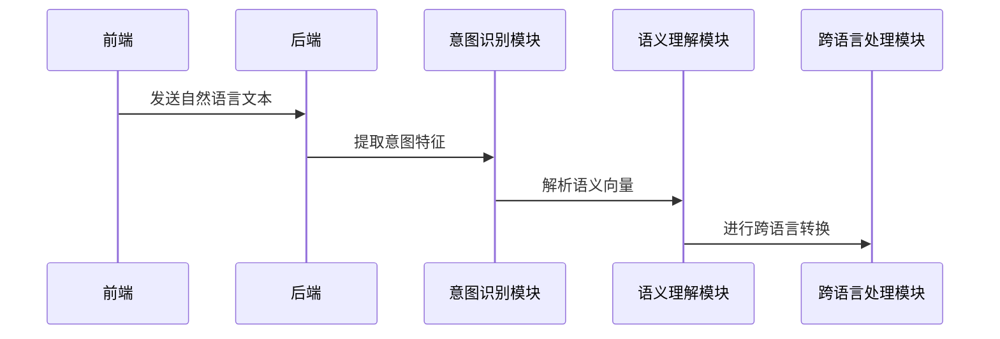

                 


# 构建企业级自然语言理解系统：跨语言语义理解与意图识别

> 关键词：自然语言处理、企业级系统、跨语言语义理解、意图识别、深度学习

> 摘要：本文详细探讨了构建企业级自然语言理解系统的关键技术，重点分析了跨语言语义理解和意图识别的核心原理。通过系统化的分析与实战案例，展示了如何利用深度学习算法设计高效的NLU系统，并结合实际应用场景提供最佳实践和优化建议。

---

# 第一部分: 自然语言理解系统概述

## 第1章: 自然语言理解系统背景与核心概念

### 1.1 自然语言理解的定义与背景

#### 1.1.1 自然语言处理的发展历程
自然语言处理（NLP）是人工智能领域的重要分支，经历了从规则驱动到数据驱动的转变。早期基于规则的系统在特定任务上表现良好，但难以扩展到复杂场景。近年来，深度学习的崛起推动了NLP技术的突破，特别是在语义理解方面。

#### 1.1.2 自然语言理解的核心目标
NLU的核心目标是让计算机能够理解人类语言的语义含义。这包括对文本的解析、实体识别、意图分类等任务。企业级NLU系统需要在高并发和复杂场景下稳定运行，这对系统的鲁棒性和效率提出了更高要求。

#### 1.1.3 企业级应用中的NLU需求
企业级应用（如客服系统、智能助手）对NLU的需求主要体现在高准确率、快速响应和跨语言支持上。特别是在全球化背景下，跨语言语义理解成为企业级NLU系统的重要能力。

### 1.2 问题背景与描述

#### 1.2.1 自然语言理解的挑战
NLU面临的主要挑战包括：多语言语料稀缺性、语义理解的模糊性、意图识别的多样性和上下文依赖性。这些问题在企业级应用中尤为突出，需要结合业务场景进行优化。

#### 1.2.2 企业级NLU系统的复杂性
企业级系统通常需要支持多语言、多领域、多模态的输入，这增加了语义理解和意图识别的复杂性。此外，系统的可扩展性和维护性也是关键挑战。

#### 1.2.3 跨语言语义理解的关键问题
跨语言语义理解需要解决不同语言间的语义映射问题。例如，如何将中文语义准确转化为英文，同时保持语境和语境中的细微差别。这需要结合语言学知识和深度学习模型。

### 1.3 核心概念与联系

#### 1.3.1 自然语言理解的核心要素
NLU系统通常包含以下核心要素：
- 文本预处理：分词、词性标注、句法分析
- 语义表示：向量表示、图结构表示
- 意图分类：基于特征的分类、深度学习分类
- 实体识别：基于规则的识别、基于模型的识别

#### 1.3.2 跨语言语义理解的特征
跨语言语义理解具有以下特征：
- 跨语言一致性：不同语言的语义应保持一致
- 上下文依赖性：语义理解依赖于上下文信息
- 多模态支持：结合语音、文本等多种输入方式

#### 1.3.3 意图识别的实体关系图
意图识别涉及的实体关系图如下：



---

## 第2章: 自然语言理解的核心原理

### 2.1 跨语言语义理解的原理

#### 2.1.1 跨语言语义表示
跨语言语义表示的核心是将不同语言的文本映射到共同的语义空间。常用的方法包括：
- 使用预训练多语言模型（如MULTE）
- 基于对齐的跨语言表示学习

#### 2.1.2 跨语言模型的训练策略
跨语言模型的训练通常采用以下策略：
- 跨语言预训练：在多语言语料上进行预训练
- 跨语言微调：在特定语言上进行微调

#### 2.1.3 語义理解的数学模型
跨语言语义理解的向量表示模型如下：

$$v_i = \text{cross\_lang\_align}(x_i, y_i)$$

其中，$x_i$ 是源语言文本，$y_i$ 是目标语言文本。

### 2.2 意图识别的算法原理

#### 2.2.1 意图识别的特征提取
意图识别的关键在于特征提取，常用的特征包括：
- 词汇特征：出现频率、TF-IDF
- 语义特征：词向量、句向量
- 上下文特征：位置信息、句法树信息

#### 2.2.2 基于深度学习的意图分类
深度学习模型（如LSTM、Transformer）在意图分类中表现出色。模型结构如下：



#### 2.2.3 模型调优与优化
模型调优的关键点包括：
- 超参数优化（学习率、批量大小）
- 正则化（L2正则化、Dropout）
- 数据增强（数据平衡、噪声注入）

### 2.3 算法原理的数学模型

#### 2.3.1 语义理解的向量空间模型
语义理解可以通过向量空间模型表示，例如：

$$v_i = \sum_{j=1}^{n} w_{ij} \cdot e_j$$

其中，$w_{ij}$ 是词的权重，$e_j$ 是词向量。

#### 2.3.2 意图分类的损失函数
常用的损失函数是交叉熵损失：

$$L = -\sum_{i=1}^{n} y_i \log p(y_i)$$

其中，$y_i$ 是真实标签，$p(y_i)$ 是预测概率。

---

## 第3章: 系统分析与架构设计

### 3.1 系统分析

#### 3.1.1 问题场景介绍
企业级NLU系统通常面临以下问题：
- 多语言支持的需求
- 高并发场景下的性能优化
- 复杂语境下的意图识别

#### 3.1.2 项目目标与范围
本项目旨在构建一个支持多语言、高准确率的自然语言理解系统，涵盖以下功能：
- 文本预处理
- 語义理解
- 意图识别
- 实体识别

#### 3.1.3 系统功能需求
系统需要支持以下功能：
- 多语言输入
- 实时意图分类
- 语义相似度计算
- 系统日志与反馈

### 3.2 系统架构设计

#### 3.2.1 系统架构图
系统架构图如下：



#### 3.2.2 系统接口设计
系统接口主要包含：
- 文本输入接口
- 意图识别接口
- 语义理解接口
- 系统配置接口

#### 3.2.3 系统交互流程
系统交互流程如下：



---

## 第4章: 项目实战

### 4.1 环境安装与配置

#### 4.1.1 安装Python环境
推荐使用Anaconda或虚拟环境管理工具。

#### 4.1.2 安装深度学习框架
安装TensorFlow或PyTorch框架。

#### 4.1.3 安装NLP相关库
安装spaCy、NLTK、transformers等NLP库。

### 4.2 核心代码实现

#### 4.2.1 意图识别模型实现
代码示例如下：

```python
import tensorflow as tf
from tensorflow.keras import layers

class IntentClassifier:
    def __init__(self, vocab_size, num_classes):
        self.model = self.build_model(vocab_size, num_classes)
    
    def build_model(self, vocab_size, num_classes):
        inputs = layers.Input(shape=(None,))
        embeddings = layers.Embedding(vocab_size, 100)(inputs)
        bi LSTM层
        bidirectional LSTM
        bidirectional = layers.Bidirectional(LSTM(64, return_sequences=True))(embeddings)
        attention = layers.Attention()([bidirectional, bidirectional])
        flatten = layers.Flatten()(attention)
        dense = layers.Dense(64, activation='relu')(flatten)
        outputs = layers.Dense(num_classes, activation='softmax')(dense)
        model = tf.keras.Model(inputs=inputs, outputs=outputs)
        return model

    def train(self, X_train, y_train, X_val, y_val, epochs=10, batch_size=32):
        self.model.compile(loss='sparse_categorical_crossentropy', 
                           optimizer='adam', 
                           metrics=['accuracy'])
        self.model.fit(X_train, y_train, 
                       epochs=epochs, 
                       batch_size=batch_size, 
                       validation_data=(X_val, y_val))
```

#### 4.2.2 語义理解模块实现
语义理解模块代码示例如下：

```python
import numpy as np
from sklearn.metrics.pairwise import cosine_similarity

class SemanticUnderstanding:
    def __init__(self, vectorizer):
        self.vectorizer = vectorizer
    
    def embed_text(self, text):
        return self.vectorizer(text)
    
    def compute_semantic_similarity(self, text1, text2):
        vec1 = self.embed_text(text1)
        vec2 = self.embed_text(text2)
        return np.mean(cosine_similarity(vec1.reshape(1, -1), vec2.reshape(1, -1)))
```

### 4.3 项目总结与优化

#### 4.3.1 环境配置与依赖管理
使用`requirements.txt`管理依赖，确保环境一致性。

#### 4.3.2 代码测试与调试
编写单元测试，确保各模块功能正常。

#### 4.3.3 性能优化
优化点包括：
- 使用缓存技术减少重复计算
- 并行化处理加速训练
- 优化模型结构减少参数量

---

## 第5章: 最佳实践与总结

### 5.1 最佳实践 tips

#### 5.1.1 数据处理建议
- 数据清洗：去停用词、处理特殊字符
- 数据增强：同义词替换、句式变换
- 数据平衡：处理类别不平衡问题

#### 5.1.2 模型优化建议
- 超参数调整：学习率、批量大小
- 正则化：防止过拟合
- 模型融合：集成学习、投票分类器

#### 5.1.3 系统部署建议
- 使用容器化技术（Docker）
- 分布式部署：负载均衡、容错机制
- 监控与日志：实时监控、错误日志

### 5.2 总结

企业级自然语言理解系统的构建需要结合理论与实践，通过深度学习算法实现高效的语义理解和意图识别。跨语言语义理解是系统的核心能力，而意图识别则是系统与用户交互的关键环节。本文通过理论分析和实战案例，展示了如何构建高效、稳定的NLU系统，并提供了实用的优化建议。

---

## 作者

作者：AI天才研究院/AI Genius Institute & 禅与计算机程序设计艺术 /Zen And The Art of Computer Programming

---

本文通过系统化的分析与实战案例，详细探讨了构建企业级自然语言理解系统的关键技术，为企业级NLU系统的开发提供了理论支持和实践指导。

