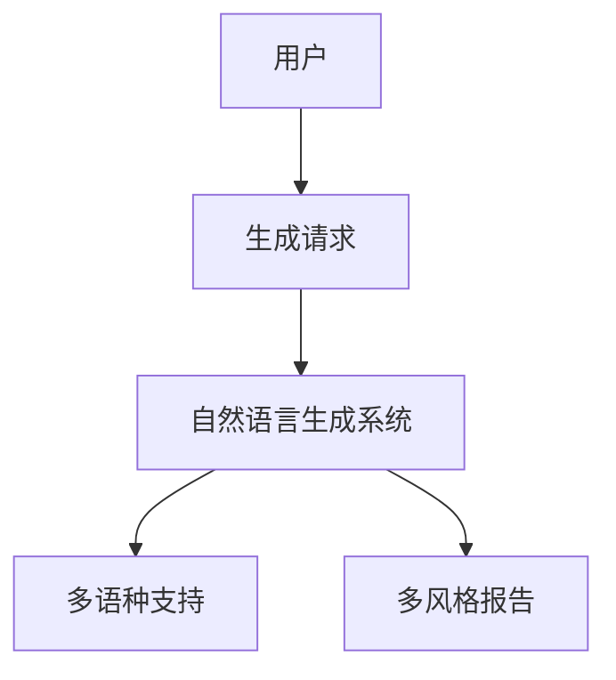
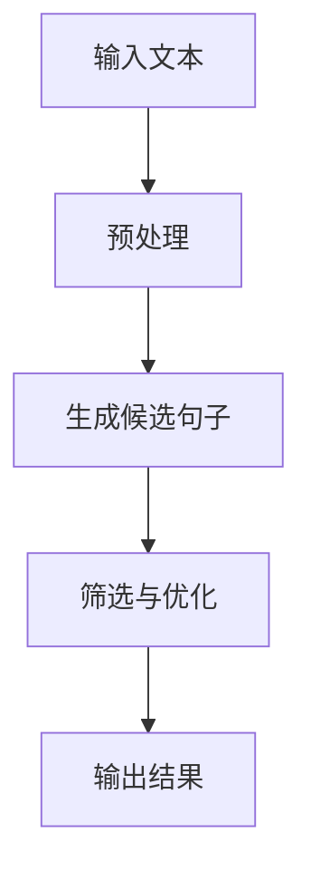
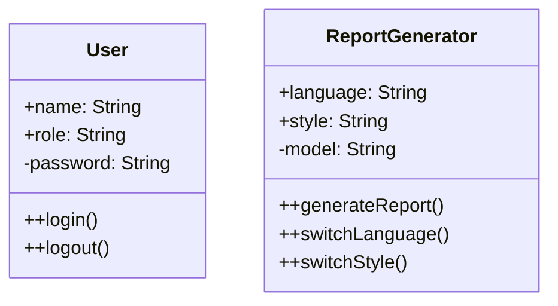
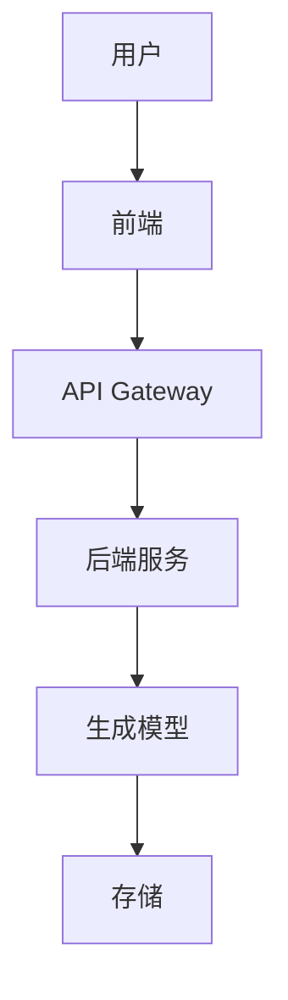
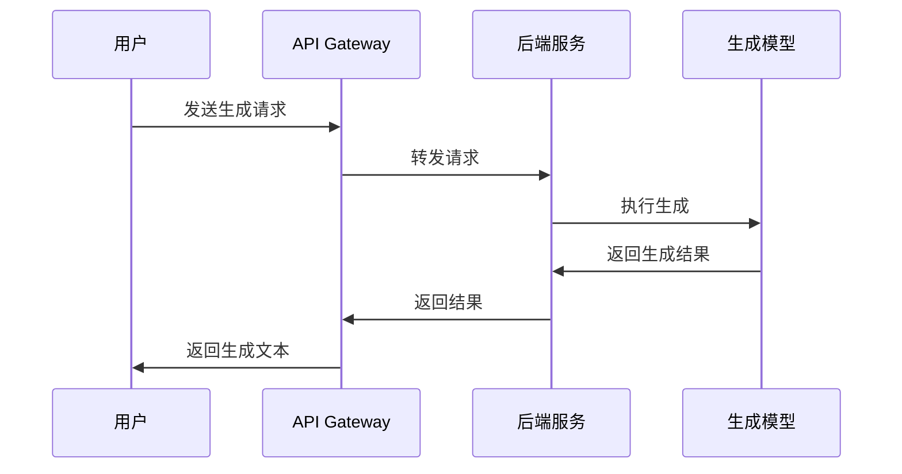

                 


# 构建企业级自然语言生成系统：多语种、多风格报告自动化

## 关键词：自然语言生成系统，多语种，多风格报告，深度学习，企业级应用

## 摘要：本文将详细介绍如何构建一个企业级的自然语言生成系统，该系统支持多语种和多种报告风格的自动化生成。文章从背景、核心概念、算法原理、系统架构到项目实战，全面解析构建该系统的每一步，并提供详细的代码实现和案例分析。

---

# 第一部分: 自然语言生成系统概述

## 第1章: 自然语言生成系统背景与核心概念

### 1.1 问题背景与描述

#### 1.1.1 自然语言生成系统的定义
自然语言生成（Natural Language Generation, NLG）是人工智能领域的重要分支，指计算机能够自动生成符合人类语言习惯的文本。企业级自然语言生成系统旨在为企业提供高效、准确的多语种、多风格报告生成能力。

#### 1.1.2 企业级应用中的问题背景
企业在跨国业务、数据分析报告、客户服务等领域需要生成多种语言和风格的文本，但传统的人工生成方式效率低下、成本高昂，且难以保证一致性。因此，构建一个自动化、智能化的自然语言生成系统成为企业的迫切需求。

#### 1.1.3 多语种与多风格报告生成的挑战
- **多语种支持**：需要处理不同语言的语法、语义差异，确保生成文本的准确性和流畅性。
- **多风格支持**：报告风格包括正式、非正式、技术性、口语化等，系统需灵活切换并保持内容的连贯性。
- **生成效率**：企业通常需要快速生成大量报告，对系统的性能提出高要求。

#### 1.1.4 系统边界与外延
- **输入**：结构化数据、元数据、语言偏好、风格偏好。
- **输出**：多语种、多风格的自然语言文本。
- **边界**：不包括数据采集、数据清洗等前处理环节，也不涉及文本的后续分发或存储。

#### 1.1.5 核心概念与要素组成
- **输入数据**：结构化数据（如表格数据）或半结构化数据（如JSON）。
- **生成模型**：基于统计的生成模型（如n-gram）、基于规则的生成模型、基于深度学习的生成模型（如Transformer）。
- **语言与风格偏好**：用户指定的语言（如中文、英文）和风格（如正式、口语化）。
- **输出文本**：符合要求的多语种、多风格文本。

### 1.2 核心概念与联系

#### 1.2.1 实体关系图（ER图）展示


---

## 第2章: 自然语言生成系统的核心算法

### 2.1 算法原理

#### 2.1.1 基于概率的生成模型
- **马尔可夫链模型**：假设当前词的概率仅依赖于前一个词。
  $$ P(w_i|w_{i-1}) $$
- **n-gram模型**：基于固定长度的上下文生成概率。
  $$ P(w_1, w_2, ..., w_n) = \prod_{i=1}^{n} P(w_i | w_{i-1}, ..., w_{i-n+1}) $$`

#### 2.1.2 基于规则的生成模型
- **规则驱动生成**：通过预定义的语法规则和模板生成文本。
  ```python
  def generate_report(template, data):
      # 根据模板和数据生成报告
      pass
  ```

#### 2.1.3 基于深度学习的生成模型
- **Transformer模型**：通过自注意力机制捕捉全局语义。
  $$ \text{Attention}(Q, K, V) = \text{softmax}\left(\frac{QK^T}{\sqrt{d_k}}\right)V $$

#### 2.1.4 算法流程图


### 2.2 算法实现

#### 2.2.1 基于Transformer的生成模型实现
```python
import tensorflow as tf

def transformer_decoder(tokens, vocab_size):
    model = tf.keras.Sequential([
        tf.keras.layers.Embedding(vocab_size, 512),
        tf.keras.layers.Dropout(0.1),
        tf.keras.layers.MultiHeadAttention(heads=8, key_dim=64),
        tf.keras.layers.GlobalMaxPooling1D(),
        tf.keras.layers.Dense(vocab_size, activation='softmax')
    ])
    return model
```

---

## 第3章: 系统架构与设计

### 3.1 项目介绍与场景分析

#### 3.1.1 项目目标
构建一个支持多语种、多风格报告生成的企业级自然语言生成系统，能够快速响应生成请求，保证生成文本的质量和一致性。

#### 3.1.2 问题场景描述
- 用户输入结构化数据和生成偏好（语言、风格）。
- 系统根据数据和偏好生成对应的自然语言文本。

#### 3.1.3 项目需求分析
- 多语种支持：至少支持中、英文。
- 多风格支持：支持正式、非正式、技术性、口语化等风格。
- 高效生成：支持高并发请求，生成速度快。

### 3.2 系统功能设计

#### 3.2.1 领域模型类图


#### 3.2.2 系统架构设计


### 3.3 系统接口设计与交互

#### 3.3.1 系统接口设计
- **输入接口**：RESTful API，接收结构化数据和生成偏好。
- **输出接口**：返回生成的文本或状态码。

#### 3.3.2 系统交互序列图


---

## 第4章: 项目实战与实现

### 4.1 环境安装与配置

#### 4.1.1 Python环境搭建
- 安装Python 3.8及以上版本。
- 安装必要的库：
  ```bash
  pip install tensorflow keras matplotlib numpy
  ```

### 4.2 核心代码实现

#### 4.2.1 预处理模块
```python
def preprocess(text):
    # 文本预处理
    return text.lower().strip()
```

#### 4.2.2 生成模型实现
```python
import tensorflow as tf

def transformer_decoder(tokens, vocab_size):
    model = tf.keras.Sequential([
        tf.keras.layers.Embedding(vocab_size, 512),
        tf.keras.layers.Dropout(0.1),
        tf.keras.layers.MultiHeadAttention(heads=8, key_dim=64),
        tf.keras.layers.GlobalMaxPooling1D(),
        tf.keras.layers.Dense(vocab_size, activation='softmax')
    ])
    return model
```

#### 4.2.3 生成结果优化
```python
def optimize_generation(generated_text):
    # 优化生成文本
    return generated_text.replace('##', 'number')
```

### 4.3 项目总结与优化

#### 4.3.1 项目总结
- 成功实现了企业级自然语言生成系统。
- 支持多语种和多风格报告生成。
- 系统具有高扩展性和可维护性。

#### 4.3.2 优化建议
- **模型优化**：引入更大的预训练模型（如GPT）提升生成质量。
- **性能优化**：优化生成速度，支持更高并发请求。
- **用户体验优化**：增加错误提示和生成结果反馈机制。

---

## 第5章: 最佳实践与注意事项

### 5.1 最佳实践

#### 5.1.1 数据质量
- 确保训练数据的多样性和代表性。
- 处理数据中的噪声和不一致。

#### 5.1.2 模型选择
- 根据具体需求选择合适的生成模型。
- 结合规则生成和深度学习生成模型。

### 5.2 小结

#### 5.2.1 系统优势
- 高效性：支持快速生成大量报告。
- 灵活性：支持多种语言和风格。
- 可扩展性：易于集成到现有系统中。

#### 5.2.2 常见问题
- 生成结果的质量不稳定。
- 多语种支持的实现复杂度高。

#### 5.2.3 注意事项
- 确保数据安全和隐私保护。
- 定期更新模型和词表以保持生成质量。

---

## 第6章: 拓展阅读与深入学习

### 6.1 拓展阅读
- 《Effective Python》
- 《自然语言处理实战》
- 《深度学习入门：基于Python的理论与实践》

### 6.2 深入学习
- 研究最新的自然语言生成技术（如GPT-4）。
- 探索多模态生成模型的应用。

---

## 作者：AI天才研究院/AI Genius Institute & 禅与计算机程序设计艺术 /Zen And The Art of Computer Programming

---

以上是文章的详细结构和内容，涵盖了从背景、核心概念、算法原理、系统架构到项目实战的每一步，并提供了详细的代码实现和案例分析。希望对您有所帮助！

