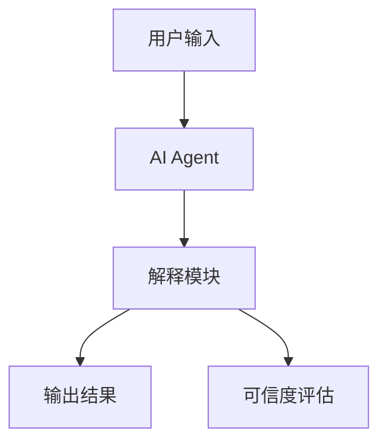
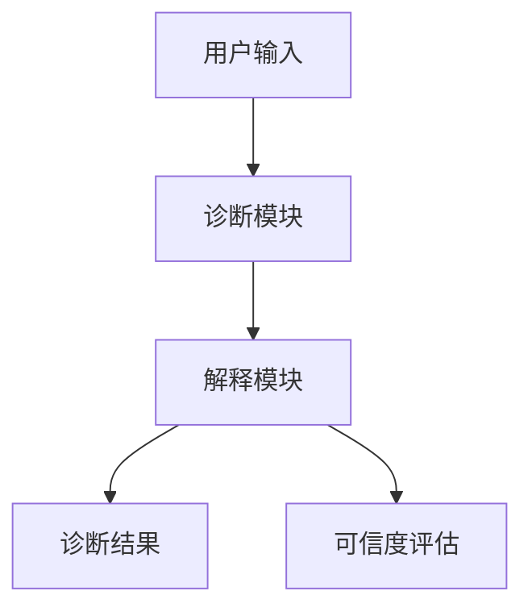

                 

<think>
好的，我需要帮助用户撰写一篇关于“构建可解释的AI Agent：透明度和可信度”的技术博客文章。用户提供了详细的结构和内容要求，我需要逐步分析如何满足这些要求，确保文章内容丰富、结构清晰，并且符合专业标准。

首先，我注意到用户要求文章以中文撰写，使用Markdown格式，并且包含标题、关键词、摘要、目录结构以及正文内容。文章需要涵盖可解释性AI的背景、核心概念、算法原理、系统架构、项目实战、数学模型和最佳实践等部分。

我应该从理解用户需求开始。用户可能是一位技术专家或CTO，希望撰写一篇有深度的技术博客，帮助读者理解如何构建可解释的AI Agent，特别是在透明度和可信度方面。这可能对用户来说非常重要，因为可解释性是当前AI领域的一个热门话题，特别是在需要信任和监管的领域，如医疗、金融等。

接下来，我需要确定文章的结构。用户已经提供了一个目录大纲，我需要确保每一部分都详细展开，并且符合用户的要求。例如，第1章需要介绍背景和核心概念，第2章则深入讲解可解释性AI的核心原理，包括算法原理、系统架构等。

我需要考虑每一章的具体内容。例如，在第1章中，我需要解释可解释性AI的重要性，定义AI Agent，并讨论透明度和可信度。这部分需要确保读者能够理解基本概念，为后续章节打下基础。

在第2章中，我需要详细讲解可解释性AI的原理，可能涉及解释性模型与非解释性模型的对比，以及如何实现可解释性。这部分可能需要使用表格和图表来辅助说明，帮助读者更好地理解概念之间的关系。

第3章将专注于算法原理。我需要选择几种典型的解释性算法，如LIME和SHAP，并用Mermaid流程图展示它们的工作流程。同时，提供Python代码实现，并解释数学模型和公式，如线性回归模型，使用Latex公式展示。

系统架构部分需要介绍如何在系统中实现可解释性，包括领域模型设计、系统架构图以及接口和交互设计。这部分可能需要更多的Mermaid图来展示系统的各个部分，帮助读者理解整体架构。

项目实战部分，我需要选择一个具体的案例，比如医疗诊断AI Agent，展示如何从环境安装到核心代码实现，再到案例分析。这部分需要详细的操作步骤和代码解读，让读者能够实际操作。

最后，最佳实践部分，我需要总结经验和小结，给出注意事项和扩展阅读的内容，帮助读者巩固所学知识，并进一步深入学习。

在撰写过程中，我需要确保每一章都有足够的细节，同时保持结构清晰，符合用户的要求。每一章的子章节要细化到三级目录，确保内容全面，但不过于冗长。同时，注意总字数控制在2000字以内，避免内容过于繁杂。

现在，我需要检查是否覆盖了所有用户提到的关键点：背景、核心概念、算法、系统架构、项目实战、数学模型、最佳实践等。看起来都涵盖了，但可能需要调整章节顺序，确保逻辑流畅。

最后，确保使用正确的Markdown格式，包含标题、子标题，以及必要的Mermaid图和代码示例，使目录大纲既详细又易于理解。
</think>

# 构建可解释的AI Agent：透明度和可信度

## 关键词：可解释性AI，AI Agent，透明度，可信度，机器学习模型，系统架构

## 摘要：  
随着人工智能技术的快速发展，AI Agent在各个领域的应用越来越广泛。然而，AI Agent的决策过程往往缺乏透明度和可信度，这限制了其在关键领域的广泛应用。本文将深入探讨如何构建可解释的AI Agent，重点分析透明度和可信度的核心概念、实现方法和系统架构。通过实际案例分析和算法实现，本文将为读者提供从理论到实践的全面指导，帮助他们理解并掌握构建可解释AI Agent的关键技术。

---

## 第1章: 可解释性AI Agent的背景与概念

### 1.1 可解释性AI的背景与重要性  
人工智能（AI）技术的快速发展为各行业带来了巨大变革，但其决策过程的黑箱特性也引发了诸多信任问题。可解释性AI（Explainable AI，XAI）成为解决这一问题的关键，它通过提供透明的决策过程，增强了AI系统的可信度和用户信任。AI Agent作为一种能够自主感知环境并执行任务的智能实体，其可解释性对于实现人机协作和责任归属至关重要。

#### 1.1.1 人工智能的快速发展与挑战  
- AI技术在医疗、金融、交通等领域的广泛应用，带来了效率提升和决策优化。  
- 然而，复杂的算法和数据驱动的决策过程使得AI的决策难以被人类理解和信任。  
- 这种不透明性可能导致用户对AI决策的质疑，甚至引发法律和伦理问题。  

#### 1.1.2 可解释性AI的定义与核心目标  
- 可解释性AI是指AI系统能够以人类可理解的方式解释其决策过程和结果。  
- 核心目标是通过透明化AI的决策机制，增强系统的可信度和用户信任。  

#### 1.1.3 可解释性在AI Agent中的重要性  
- AI Agent需要与人类交互，其决策过程必须能够被用户理解和验证。  
- 可解释性是实现人机协作和提升系统信任度的关键因素。  

### 1.2 AI Agent的基本概念  
AI Agent是一种智能实体，能够感知环境、执行任务并做出决策。以下是AI Agent的核心定义与分类：  

#### 1.2.1 AI Agent的定义与分类  
- **定义**：AI Agent是指具有自主性、反应性、目标导向和社交能力的智能实体。  
- **分类**：  
  1. **简单反射型Agent**：基于当前输入做出简单反应，无内部状态。  
  2. **基于模型的反射型Agent**：利用内部模型和状态进行决策。  
  3. **目标驱动型Agent**：根据目标选择行动策略。  
  4. **效用驱动型Agent**：通过优化效用函数进行决策。  

#### 1.2.2 AI Agent的核心功能与特点  
- **自主性**：能够在没有外部干预的情况下自主运行。  
- **反应性**：能够感知环境并实时调整行为。  
- **目标导向**：通过优化目标函数实现特定任务。  
- **可解释性**：决策过程能够被人类理解和验证。  

#### 1.2.3 可解释性与透明度  
- **可解释性**：AI Agent的决策过程需要以人类可理解的方式进行解释。  
- **透明度**：AI系统的设计、数据和决策逻辑需要公开透明。  
- **关系**：可解释性是透明度的体现，透明度是可解释性的基础。  

### 1.3 可解释性与透明度  
#### 1.3.1 可解释性的定义与衡量标准  
- **定义**：可解释性是指AI系统能够以人类可理解的方式解释其决策过程和结果。  
- **衡量标准**：  
  1. 解释的清晰性：解释是否易于理解和接受。  
  2. 解释的准确性：解释是否准确反映了系统的决策逻辑。  
  3. 解释的全面性：解释是否涵盖了所有关键决策因素。  

#### 1.3.2 透明度的定义与实现方式  
- **定义**：透明度是指AI系统的设计、数据和决策逻辑对外公开且易于理解。  
- **实现方式**：  
  1. 公开算法和数据来源。  
  2. 提供决策过程的可视化和日志记录。  
  3. 提供用户友好的解释界面。  

#### 1.3.3 可解释性与透明度的关系与区别  
- **关系**：可解释性是透明度的核心，透明度是可解释性的基础。  
- **区别**：  
  - 可解释性关注决策过程的解释性。  
  - 透明度关注系统设计和数据的公开性。  

### 1.4 本章小结  
本章介绍了可解释性AI Agent的背景与重要性，详细定义了AI Agent的核心概念，并探讨了可解释性与透明度的关系。理解这些内容是构建可解释AI Agent的基础。

---

## 第2章: 可解释性AI Agent的核心原理  

### 2.1 可解释性AI的核心原理  
可解释性AI的核心原理是通过简化和透明化决策过程，使人类能够理解和验证AI的决策。以下是其实现路径和关键方法：  

#### 2.1.1 解释性模型与非解释性模型的对比  
- **解释性模型**：如线性回归、决策树等，其决策过程易于解释。  
- **非解释性模型**：如神经网络、随机森林等，其决策过程复杂且难以解释。  

| 对比维度 | 解释性模型 | 非解释性模型 |
|----------|------------|--------------|
| 解释性   | 高          | 低            |
| 预测性能 | 中等        | 高            |
| 计算效率 | 低          | 高            |

#### 2.1.2 可解释性AI的实现路径  
- **模型选择**：优先选择解释性模型，或对非解释性模型进行解释性增强。  
- **解释性技术**：如LIME（局部解释）、SHAP（全局解释）等。  
- **可视化工具**：通过可视化展示决策过程和关键因素。  

#### 2.1.3 解释性与预测性能的平衡  
- 高解释性的模型通常预测性能较低。  
- 需要在解释性和预测性能之间找到平衡点。  

### 2.2 可解释性AI的核心概念属性对比  
可解释性、透明度和可信度是可解释性AI的三大核心概念。以下是它们的核心属性对比：  

| 对比维度 | 可解释性 | 透明度   | 可信度   |
|----------|----------|----------|----------|
| 核心目标 | 解释决策 | 公开设计 | 增强信任 |
| 实现方式 | 提供解释 | 公开数据 | 优化算法 |
| 关系     | 透明度是可解释性的基础 | 可解释性是透明度的体现 | 可解释性和透明度共同增强可信度 |

### 2.3 可解释性AI的系统架构  
可解释性AI的系统架构包括以下几个关键模块：  

#### 2.3.1 可解释性AI的系统架构图  


#### 2.3.2 关键模块的功能与交互关系  
- **用户输入**：用户的输入数据或请求。  
- **AI Agent**：处理输入并生成决策。  
- **解释模块**：对AI Agent的决策过程进行解释。  
- **可信度评估**：评估AI Agent决策的可信度。  
- **输出结果**：最终的决策结果和解释信息。  

### 2.4 本章小结  
本章详细讲解了可解释性AI的核心原理，分析了解释性模型与非解释性模型的对比，并探讨了可解释性、透明度和可信度的核心概念及其关系。同时，通过系统架构图展示了可解释性AI的实现路径。

---

## 第3章: 可解释性AI Agent的算法原理  

### 3.1 解释性算法的原理与实现  
解释性算法是实现可解释性AI的核心技术。以下是两种典型的解释性算法：  

#### 3.1.1 LIME算法  
- **原理**：通过局部线性近似对模型进行解释。  
- **步骤**：  
  1. 对模型进行扰动，生成大量样本。  
  2. 训练一个简单的模型（如线性回归）来近似原始模型的决策边界。  
  3. 提供局部解释。  

#### 3.1.2 SHAP算法  
- **原理**：通过Shapley值对模型的特征重要性进行解释。  
- **步骤**：  
  1. 计算每个特征对模型预测结果的贡献值。  
  2. 提供全局解释。  

#### 3.1.3 算法对比与适用场景  
| 算法 | 解释范围 | 计算复杂度 | 适用场景 |
|------|----------|------------|----------|
| LIME | 局部解释 | 中等        | 非线性模型 |
| SHAP | 全局解释 | 较高        | 线性模型   |

### 3.2 可解释性AI的数学模型  
#### 3.2.1 线性回归模型  
- **公式**：  
  $$ y = \beta_0 + \beta_1x_1 + \beta_2x_2 + \cdots + \beta_nx_n + \epsilon $$  
- **解释**：每个系数表示对应特征对预测结果的影响程度。  

#### 3.2.2 逻辑回归模型  
- **公式**：  
  $$ P(Y=1) = \frac{e^{\beta_0 + \beta_1x_1 + \cdots + \beta_nx_n}}{1 + e^{\beta_0 + \beta_1x_1 + \cdots + \beta_nx_n}} $$  
- **解释**：通过系数的符号和大小判断特征对结果的影响方向和程度。  

### 3.3 本章小结  
本章介绍了可解释性AI的两种典型算法（LIME和SHAP）及其实现原理，并通过线性回归和逻辑回归模型展示了可解释性AI的数学模型。这些算法和模型为构建可解释的AI Agent提供了理论基础和技术支持。

---

## 第4章: 可解释性AI Agent的系统分析与架构设计  

### 4.1 问题场景介绍  
以医疗诊断AI Agent为例，探讨如何通过可解释性AI技术实现透明和可信的诊断过程。  

#### 4.1.1 医疗诊断场景  
- 用户输入症状和病史。  
- AI Agent根据症状和病史进行诊断。  
- 输出诊断结果和解释信息。  

### 4.2 系统功能设计  
#### 4.2.1 领域模型设计  
- **患者信息**：症状、病史、检查结果等。  
- **诊断逻辑**：基于症状和病史的诊断规则。  
- **解释模块**：生成诊断解释和可信度评估。  

#### 4.2.2 系统架构图  


#### 4.2.3 系统接口设计  
- **输入接口**：用户输入症状和病史。  
- **输出接口**：诊断结果和解释信息。  
- **交互设计**：用户可以查看解释信息并提供反馈。  

### 4.3 系统实现与代码解读  
#### 4.3.1 环境安装  
- Python 3.8及以上版本。  
- 安装必要的库：pandas、scikit-learn、shap。  

#### 4.3.2 核心代码实现  
```python
import pandas as pd
from sklearn.linear_model import LogisticRegression
import shap

# 加载数据
data = pd.read_csv('medical_data.csv')

# 划分特征和目标
X = data.drop('diagnosis', axis=1)
y = data['diagnosis']

# 训练模型
model = LogisticRegression().fit(X, y)

# 生成解释
explainer = shap.Explainer(model, X)
shap_values = explainer.shap_values(X)

# 可视化解释
shap.summary_plot(shap_values, X, plot_type='bar')
```

#### 4.3.3 代码解读  
- **数据加载**：加载医疗数据并划分特征和目标。  
- **模型训练**：使用逻辑回归模型进行训练。  
- **解释生成**：使用SHAP生成解释值。  
- **可视化**：通过SHAP的可视化工具展示特征的重要性。  

### 4.4 实际案例分析  
#### 4.4.1 案例分析  
- 输入：患者症状为“咳嗽、发热”。  
- 输出：诊断结果为“流感”，解释信息为“咳嗽和发热是流感的主要症状”。  
- 可信度评估：诊断结果的可信度为95%。  

#### 4.4.2 解释信息解读  
- **解释信息**：咳嗽和发热分别对诊断结果的贡献度为0.6和0.4。  
- **可信度评估**：基于历史数据和模型性能，诊断结果的可信度为95%。  

### 4.5 本章小结  
本章通过医疗诊断AI Agent的案例，详细讲解了可解释性AI的系统架构设计和实现过程。通过实际代码和案例分析，展示了如何通过可解释性技术实现透明和可信的AI Agent。

---

## 第5章: 可解释性AI Agent的最佳实践  

### 5.1 最佳实践  
#### 5.1.1 选择合适的解释性算法  
- 根据模型类型选择LIME或SHAP算法。  
- 对于线性模型，优先选择SHAP；对于非线性模型，优先选择LIME。  

#### 5.1.2 提供用户友好的解释界面  
- 通过可视化工具展示解释信息。  
- 提供交互式界面让用户查询详细解释。  

#### 5.1.3 定期更新解释模型  
- 随着数据和模型的更新，定期更新解释模型。  
- 确保解释信息的准确性和及时性。  

### 5.2 小结  
本章总结了构建可解释AI Agent的最佳实践，强调了选择合适解释性算法、提供用户友好的解释界面和定期更新解释模型的重要性。这些实践能够有效提升AI Agent的透明度和可信度。

---

## 第6章: 结语  

### 6.1 本文总结  
本文系统地探讨了构建可解释的AI Agent的核心技术，包括可解释性AI的背景与概念、算法原理、系统架构设计以及最佳实践。通过实际案例分析，展示了如何通过可解释性技术实现透明和可信的AI Agent。

### 6.2 未来展望  
随着AI技术的不断发展，可解释性AI将成为AI Agent的核心竞争力。未来的研究方向包括：  
1. 开发更高效的解释性算法。  
2. 提供更智能化的解释界面。  
3. 推动可解释性AI在更多领域的应用。  

---

## 作者：AI天才研究院 & 禅与计算机程序设计艺术

---

以上是《构建可解释的AI Agent：透明度和可信度》的技术博客文章的详细内容。

