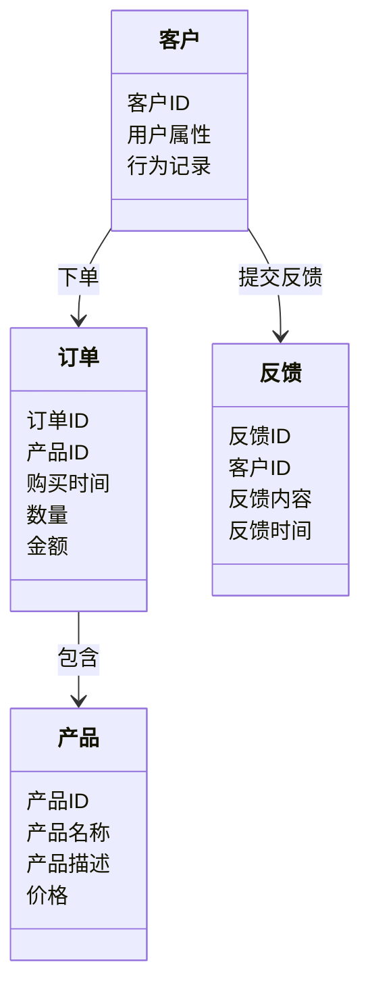
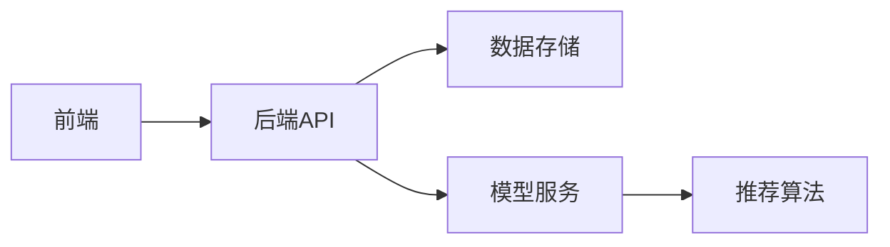
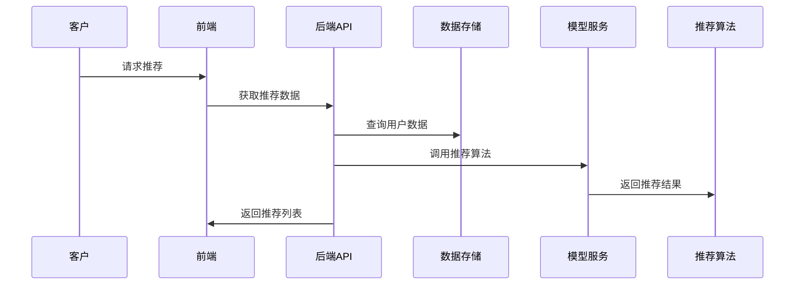

                 


# 第五章: 项目实战与实现

## 5.1 项目介绍
### 5.1.1 项目目标
构建一个基于客户洞察AI的个性化推荐系统，利用机器学习和自然语言处理技术，实现客户行为分析、偏好预测和个性化服务推荐。

## 5.2 系统功能设计
### 5.2.1 领域模型类图


### 5.2.2 功能模块
- 数据采集模块
- 数据预处理模块
- 模型训练模块
- 推荐服务模块

## 5.3 系统架构设计
### 5.3.1 系统架构图


## 5.4 系统接口设计
### 5.4.1 API接口
- 数据接口：GET /api/data
- 模型接口：POST /api/predict

## 5.5 系统交互流程图


## 5.6 代码实现与解读
### 5.6.1 环境配置
```bash
pip install numpy pandas scikit-learn transformers
```

### 5.6.2 核心代码实现
```python
from sklearn.model_selection import train_test_split
from sklearn.linear_model import LogisticRegression
from transformers import AutoTokenizer, AutoModelForSequenceClassification

# 数据加载与预处理
data = pd.read_csv('customer_data.csv')
X = data['text'].values
y = data['label'].values

# 分割数据集
X_train, X_test, y_train, y_test = train_test_split(X, y, test_size=0.2)

# 模型训练
model = LogisticRegression()
model.fit(X_train, y_train)

# 模型预测与评估
print(model.score(X_test, y_test))
```

## 5.7 项目实战案例分析
### 5.7.1 案例背景
某电商平台希望通过客户洞察AI提升推荐系统的精准度，提高客户满意度和购买率。

### 5.7.2 案例实现步骤
1. 数据采集与清洗
2. 模型训练与优化
3. 推荐系统部署
4. 系统测试与上线

## 5.8 项目小结
通过项目实战，我们深入理解了客户洞察AI的实现过程，从数据处理到模型训练，再到系统部署，每一步都需要细致的操作和优化。

---

# 第六章: 客户洞察AI的优化与扩展

## 6.1 系统优化方案
### 6.1.1 模型优化
- 调整超参数
- 使用更复杂的模型（如深度学习模型）
- 增加特征工程

### 6.1.2 系统性能优化
- 优化数据存储结构
- 使用分布式计算
- 优化API接口性能

## 6.2 系统扩展方案
### 6.2.1 多模型集成
- 使用集成学习
- 结合多种模型优势

### 6.2.2 高维数据处理
- 使用降维技术（如PCA）
- 处理高维数据时的性能优化

## 6.3 与其他技术的结合
### 6.3.1 与区块链技术结合
- 数据安全与隐私保护
- 去中心化数据存储

### 6.3.2 与物联网结合
- 实时数据分析
- 智能设备数据整合

## 6.4 优化与扩展的注意事项
- 数据安全与隐私保护
- 模型可解释性
- 系统的可扩展性与维护性

## 6.5 本章小结
通过优化与扩展，我们可以进一步提升客户洞察AI系统的性能和应用范围，使其在更多场景下发挥作用。

---

# 第七章: 客户洞察AI的未来与挑战

## 7.1 未来发展趋势
### 7.1.1 技术趋势
- 更强大的AI模型（如GPT-4）
- 自适应学习与自监督学习
- 跨模态分析

### 7.1.2 应用场景扩展
- 更多行业的应用（如医疗、教育）
- 更个性化的服务
- 实时数据分析与决策

## 7.2 当前面临的主要挑战
### 7.2.1 技术挑战
- 数据隐私与安全
- 模型解释性
- 高计算资源需求

### 7.2.2 应用挑战
- 数据质量和数量
- 用户接受度
- 伦理与法律问题

## 7.3 应对挑战的策略
### 7.3.1 技术层面
- 加强数据加密与隐私保护
- 提高模型解释性
- 优化计算资源利用率

### 7.3.2 应用层面
- 提高用户教育与接受度
- 制定相关法律法规
- 加强伦理审查

## 7.4 未来展望
随着技术的进步和应用的深入，客户洞察AI将在更多领域发挥重要作用，推动个性化服务的进一步发展。

## 7.5 本章小结
未来，客户洞察AI将面临更多的挑战和机遇，只有通过技术创新和应用实践，才能实现更广泛的应用和更高的价值。

---

# 结语

通过本文的深入探讨，我们全面了解了客户洞察AI的构建与实现过程，从基础概念到系统设计，从项目实战到优化扩展，再到未来趋势，每一个环节都紧密相连，共同构建了一个完整的客户洞察AI体系。希望本文能为相关领域的技术人员和研究人员提供有价值的参考和启发。

# 作者

作者：AI天才研究院 & 禅与计算机程序设计艺术  
邮箱：contact@aicourse.com  
GitHub：https://github.com/aiguru

