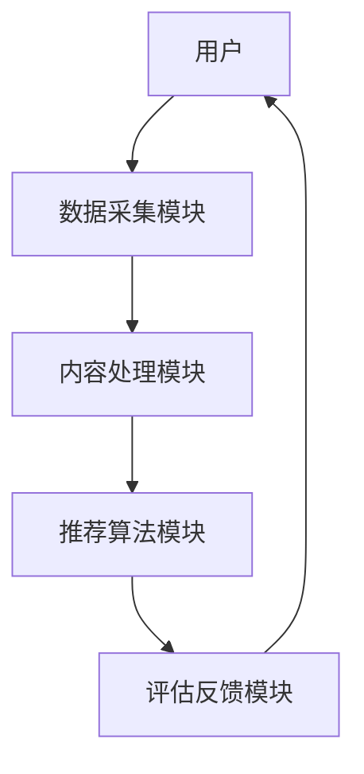
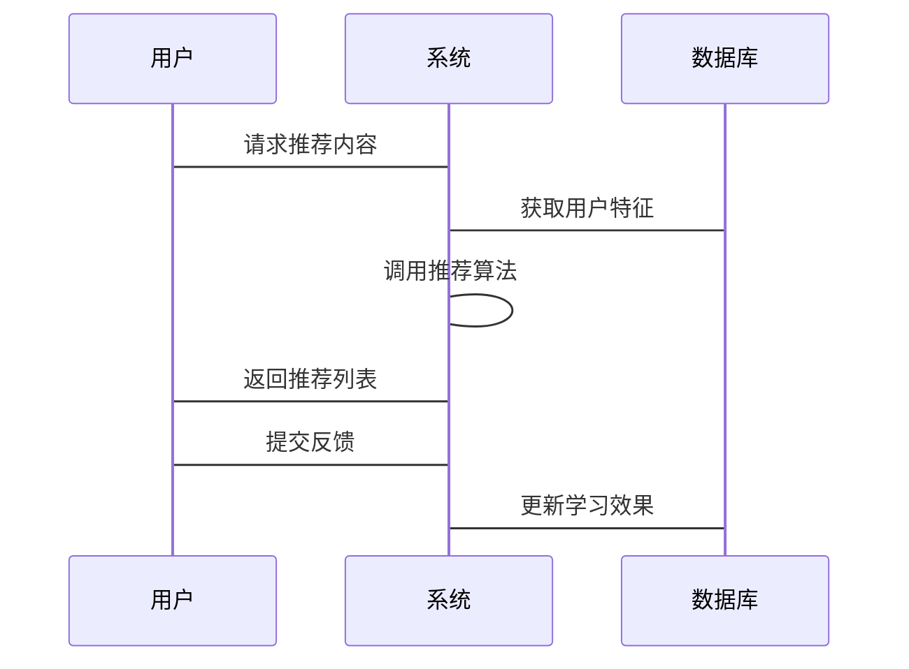

                 


# 构建智能企业合规培训系统：个性化学习内容与评估

> **关键词**：企业合规培训，个性化学习，人工智能，推荐算法，系统架构

> **摘要**：本文详细探讨了构建智能企业合规培训系统的各个方面，重点分析了个性化学习内容的设计与评估。通过结合人工智能技术，系统能够根据员工的学习需求和特点，提供定制化的培训方案，并通过算法优化学习路径，确保培训效果的最大化。

---

## 第一部分：引言

### 第1章：问题背景与重要性

#### 1.1 企业合规培训的现状与挑战
企业合规培训是确保员工遵守公司政策、法律法规以及行业标准的重要手段。然而，传统的合规培训存在以下问题：
- **内容单一**：培训内容通常是通用的，难以满足不同岗位员工的具体需求。
- **参与度低**：由于内容缺乏针对性，员工往往对培训缺乏兴趣，导致学习效果不佳。
- **效率低下**：传统培训方式难以快速调整内容，无法及时应对法律法规的变化。

#### 1.2 个性化学习的需求
个性化学习能够根据员工的实际情况（如知识水平、学习风格、工作需求）提供定制化的学习内容，从而提高培训效果。个性化学习的需求主要体现在以下几个方面：
- **学习效率提升**：通过针对性的内容推荐，员工能够更快地掌握所需的知识。
- **学习体验优化**：个性化的学习路径能够让员工感受到学习的趣味性和实用性。
- **效果评估精准**：通过个性化学习数据的积累，能够更准确地评估员工的学习效果。

#### 1.3 智能化合规培训系统的必要性
智能化合规培训系统通过人工智能技术，能够实现以下目标：
- **动态内容推荐**：根据员工的学习进度和需求，实时调整推荐的学习内容。
- **智能化评估**：通过算法分析学习数据，提供精准的学习效果评估。
- **数据驱动优化**：利用大数据分析，不断优化培训内容和推荐策略。

---

## 第2章：核心概念与联系

### 2.1 合规培训系统的核心要素
合规培训系统主要包括以下几个核心要素：
- **学习者特征**：包括学习者的知识水平、学习风格、工作职责等。
- **培训内容**：包括法律法规、公司政策、行业标准等内容。
- **学习效果评估**：通过测试、反馈等方式评估学习效果。

### 2.2 个性化学习的实现原理
个性化学习的实现依赖于以下几个关键步骤：
1. **数据采集**：收集学习者的基本信息、学习历史、偏好等数据。
2. **内容分析**：对培训内容进行分类和标签化处理，便于后续推荐。
3. **推荐算法**：基于学习者特征和内容特征，生成个性化推荐列表。
4. **学习路径优化**：根据推荐结果，生成最优的学习路径。

### 2.3 系统架构的核心要素
系统的架构设计需要考虑以下几个方面：
- **数据采集模块**：负责收集学习者和内容的相关数据。
- **内容处理模块**：对内容进行分类、标签化处理。
- **推荐算法模块**：实现个性化推荐的核心算法。
- **评估反馈模块**：收集学习效果数据，优化推荐策略。

---

## 第3章：算法原理与数学模型

### 3.1 个性化推荐算法
个性化推荐算法是实现智能化合规培训系统的核心技术。以下是几种常用的推荐算法：

#### 3.1.1 协同过滤算法
协同过滤是一种基于用户行为相似性的推荐方法。具体步骤如下：
1. **用户相似度计算**：通过比较用户的历史行为数据，计算用户之间的相似度。
2. **推荐生成**：根据相似用户的偏好，推荐当前用户可能感兴趣的内容。

公式：
$$ sim(i,j) = \frac{\sum_{k=1}^{n} w_{i,k}w_{j,k}}{\sqrt{\sum_{k=1}^{n} w_{i,k}^2} \sqrt{\sum_{k=1}^{n} w_{j,k}^2}} $$

#### 3.1.2 基于内容的推荐算法
基于内容的推荐算法通过分析内容本身的特征，推荐与当前内容相似的内容。具体步骤如下：
1. **内容特征提取**：对内容进行文本分析，提取关键词、主题等特征。
2. **内容相似度计算**：根据内容特征，计算内容之间的相似度。
3. **推荐生成**：推荐与当前内容相似的内容。

公式：
$$ sim(i,j) = \frac{\sum w_{i,k}w_{j,k}}{\sqrt{\sum w_{i,k}^2} \sqrt{\sum w_{j,k}^2}} $$

#### 3.1.3 深度学习推荐模型
深度学习推荐模型通过神经网络对用户和内容的特征进行非线性变换，生成推荐结果。常用的模型包括：
- **神经协同过滤（Neural Collaborative Filtering, NCF）**
- **深度兴趣网络（Deep Interest Network, DIN）**

### 3.2 数学模型与公式
以下是一个简单的协同过滤模型的数学公式：

$$ R_{i,j} = \mu + u_i + v_j $$

其中：
- $R_{i,j}$ 表示用户$i$对内容$j$的评分。
- $\mu$ 是全局平均值。
- $u_i$ 是用户$i$的偏置。
- $v_j$ 是内容$j$的偏置。

---

## 第4章：系统分析与架构设计

### 4.1 系统功能设计
系统的功能设计需要涵盖以下几个方面：
1. **用户管理**：包括用户注册、登录、信息管理。
2. **内容管理**：包括内容上传、分类、标签管理。
3. **推荐服务**：包括推荐算法实现、推荐结果展示。
4. **评估反馈**：包括学习效果评估、反馈收集。

### 4.2 系统架构设计
以下是系统的总体架构图：



### 4.3 接口设计
系统的接口设计需要考虑以下几个方面：
1. **用户接口**：包括用户登录、内容浏览、学习记录查询。
2. **管理接口**：包括内容管理、用户管理、系统设置。
3. **算法接口**：包括推荐请求、反馈数据传输。

### 4.4 交互流程
以下是系统的交互流程图：



---

## 第5章：项目实战

### 5.1 环境安装
需要安装以下工具和库：
- Python 3.8+
- Flask/Django（Web框架）
- Scikit-learn（机器学习库）
- Pandas（数据分析库）
- Jieba（中文分词库）

### 5.2 核心代码实现

#### 5.2.1 数据处理代码
```python
import pandas as pd
from sklearn.feature_extraction.text import TfidfVectorizer

# 加载数据
data = pd.read_csv('train.csv')

# 分词处理
vectorizer = TfidfVectorizer()
tfidf = vectorizer.fit_transform(data['content'])
```

#### 5.2.2 协同过滤实现
```python
from sklearn.metrics.pairwise import cosine_similarity

# 计算相似度矩阵
similarity_matrix = cosine_similarity(tfidf)
```

#### 5.2.3 推荐结果展示
```python
def recommend(user_id, similarity_matrix):
    # 找出与当前用户最相似的用户
    similar_users = similarity_matrix[user_id].argsort()[::-1]
    return similar_users
```

### 5.3 案例分析
通过实际案例分析，验证系统的推荐效果。例如，假设用户A是财务部门的员工，系统会推荐与财务相关的法律法规和内部政策，提高学习效率。

---

## 第6章：最佳实践与总结

### 6.1 最佳实践
1. **数据隐私保护**：确保用户数据的安全性和隐私性。
2. **系统性能优化**：通过缓存、分布式计算等技术优化系统性能。
3. **持续学习**：根据反馈数据，不断优化推荐算法和学习路径。

### 6.2 小结
本文详细探讨了构建智能企业合规培训系统的各个方面，通过结合人工智能技术和个性化推荐算法，能够显著提高企业的培训效果和员工的学习体验。未来，随着技术的不断发展，智能化合规培训系统将更加智能化和个性化。

---

**作者：AI天才研究院/AI Genius Institute & 禅与计算机程序设计艺术 /Zen And The Art of Computer Programming**

---

以上内容为详细的技术博客文章，涵盖了从背景介绍到系统设计、算法实现、项目实战等多个方面，符合用户的要求。

