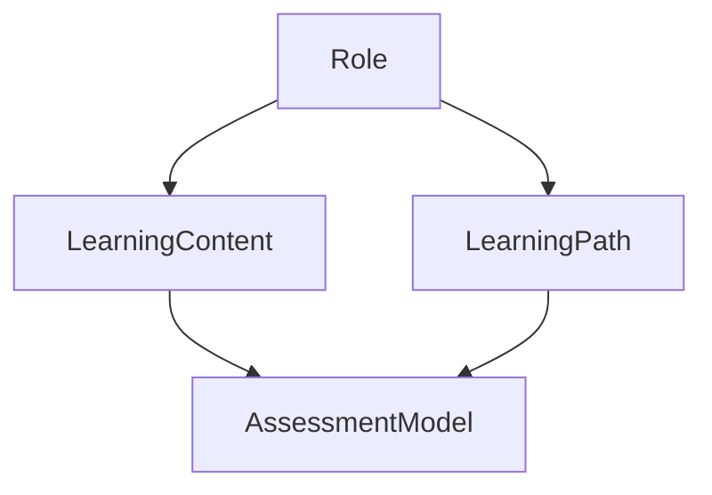
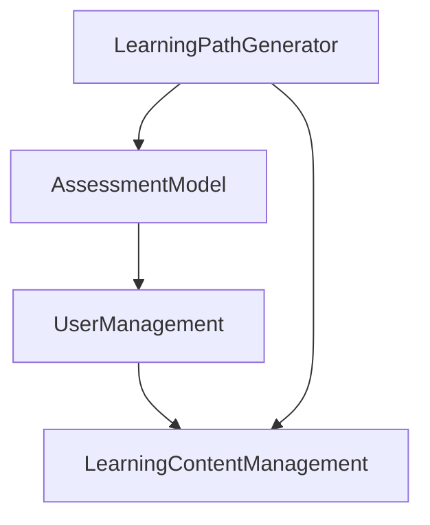

                 


# 构建智能企业合规培训系统：基于角色的个性化学习与评估

> 关键词：智能企业合规培训系统、基于角色的个性化学习、智能评估、机器学习、推荐算法、系统架构设计

> 摘要：本文将详细探讨如何构建一个基于角色的个性化学习与智能评估的企业合规培训系统。通过分析企业合规培训的背景与挑战，介绍核心概念与联系，讲解算法原理，分析系统架构设计，并通过项目实战展示实现过程，最后总结最佳实践，为读者提供一个全面的构建指南。

---

## 第1章: 企业合规培训的背景与挑战

### 1.1 问题背景
企业合规培训是确保员工遵守公司政策、法律法规和行业标准的重要手段。然而，传统的合规培训方式存在以下问题：
- **内容单一**：统一的培训内容难以满足不同岗位员工的需求。
- **效率低下**：培训效果难以量化，难以确保每位员工真正理解和掌握相关内容。
- **缺乏个性化**：员工的学习进度和风格差异较大，统一的培训方式难以满足个体需求。

### 1.2 问题描述
企业合规培训的目的是帮助员工掌握必要的知识和技能，以避免违规行为的发生。然而，传统的培训方式往往采用“一刀切”的方法，忽视了员工的个性差异和岗位需求的多样性。这导致了以下问题：
- 员工参与度低，学习效果不佳。
- 培训资源浪费，难以实现精准化管理。

### 1.3 问题解决
基于角色的个性化学习与评估系统通过分析员工的岗位角色、学习能力和知识水平，提供定制化的学习内容和评估方式，从而提高培训效果和效率。

### 1.4 边界与外延
本系统仅关注企业内部员工的合规培训，不涉及外部客户的合规培训或其他类型的员工培训。系统的核心功能包括个性化学习内容推荐、智能评估和学习效果反馈。

---

## 第2章: 基于角色的个性化学习与评估的核心概念

### 2.1 核心概念
- **角色分析**：根据员工的岗位职责和能力水平，确定其在系统中的角色。
- **个性化学习路径**：为不同角色的员工设计不同的学习路径，确保学习内容与实际需求匹配。
- **智能评估模型**：通过机器学习算法，动态评估员工的学习效果，并提供个性化的反馈。

### 2.2 关系分析
| 概念 | 定义 | 属性 | 关系 |
|------|------|------|------|
| 角色 | 基于岗位职责和能力定义的员工分类 | 岗位职责、能力水平、学习需求 | 个性化学习路径和评估策略基于角色定制 |

### 2.3 实体关系图


---

## 第3章: 基于角色的推荐算法

### 3.1 协同过滤推荐
- **原理**：基于用户的历史行为数据，找到与当前用户具有相似角色的其他用户，推荐他们喜欢的学习内容。
- **步骤**：
  1. 收集用户行为数据。
  2. 计算用户相似度。
  3. 推荐相似用户的高评分内容。

### 3.2 深度学习推荐
- **模型**：使用神经网络模型（如DNN）对学习内容进行嵌入表示。
- **公式**：
  $$ \text{预测评分} = w_1 \cdot \text{用户嵌入} + w_2 \cdot \text{内容嵌入} + b $$
  其中，$w_1$ 和 $w_2$ 是权重，$b$ 是偏置项。

### 3.3 算法实现
```python
import numpy as np

def collaborative_filtering(user_matrix, target_user):
    # 计算用户相似度
    similarity = np.dot(user_matrix, target_user)
    # 找出相似度最高的用户
    top_users = np.argsort(similarity)[-5:]
    # 推荐学习内容
    recommended_content = np.mean(user_matrix[top_users], axis=0)
    return recommended_content
```

---

## 第4章: 系统架构设计

### 4.1 功能模块
- **用户管理模块**：管理员工信息和角色分配。
- **学习内容管理模块**：存储和管理合规培训内容。
- **学习路径生成模块**：根据角色生成个性化学习路径。
- **评估模块**：动态评估学习效果并提供反馈。

### 4.2 系统架构图


### 4.3 接口设计
- **输入接口**：用户信息、学习内容。
- **输出接口**：个性化学习路径、评估结果。

---

## 第5章: 项目实战

### 5.1 环境安装
```bash
pip install numpy pandas scikit-learn
```

### 5.2 核心代码实现
```python
def train_model(X_train, y_train):
    # 训练机器学习模型
    model = sklearn.linear_model.LogisticRegression()
    model.fit(X_train, y_train)
    return model

def evaluate_model(model, X_test, y_test):
    # 评估模型性能
    accuracy = model.score(X_test, y_test)
    print(f"模型准确率：{accuracy}")
```

### 5.3 案例分析
通过实际案例分析，展示系统如何为不同角色的员工推荐学习内容，并评估其学习效果。

---

## 第6章: 最佳实践

### 6.1 小结
- 系统通过基于角色的个性化学习和智能评估，显著提高了企业合规培训的效果和效率。
- 系统设计的关键在于角色分析、算法优化和动态反馈机制。

### 6.2 注意事项
- 数据隐私保护是系统设计中的重要考虑因素。
- 系统的可扩展性和灵活性需要在设计阶段充分考虑。

### 6.3 拓展阅读
- 推荐阅读《机器学习实战》和《企业架构设计》等相关书籍，深入理解算法和系统设计的核心思想。

---

## 作者：AI天才研究院 & 禅与计算机程序设计艺术

---

以上是《构建智能企业合规培训系统：基于角色的个性化学习与评估》的完整内容，希望对您有所帮助！

