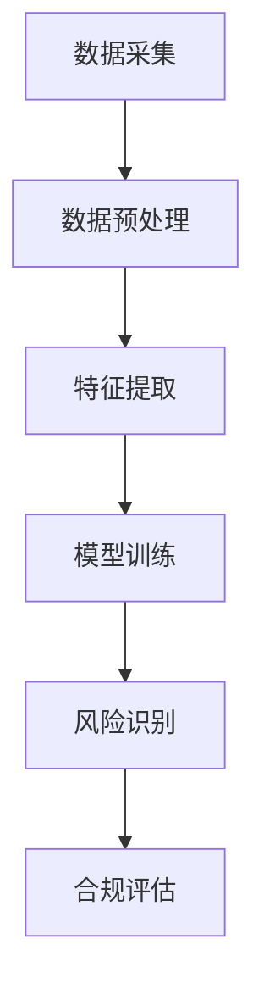
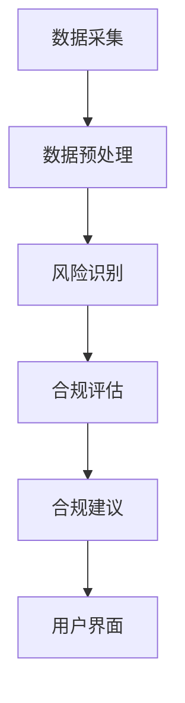

                 


# 构建智能企业合规管理系统：AI辅助风险识别与控制

## 关键词：企业合规管理，AI辅助，风险识别，智能控制，知识图谱，机器学习，NLP

## 摘要：本文详细探讨了如何利用人工智能技术构建智能企业合规管理系统，特别是通过AI辅助进行风险识别与控制。文章从企业合规管理的背景出发，分析了传统合规管理的局限性，提出了基于AI的解决方案。通过详细讲解AI辅助合规管理的核心概念、算法原理、系统架构设计以及实际项目案例，本文为读者提供了一套完整的智能企业合规管理解决方案。

---

## 第一部分: 企业合规管理的背景与挑战

### 第1章: 企业合规管理的背景与问题

#### 1.1 合规管理的背景介绍

##### 1.1.1 企业合规管理的定义与范围
企业合规管理是指企业在经营过程中，依据相关法律法规、行业标准和企业内部规章制度，对自身的业务活动进行合法性、合规性审查和管理的过程。合规管理的范围涵盖企业运营的各个环节，包括但不限于法律合规、财务合规、税务合规、数据合规、反腐败合规等。

##### 1.1.2 合规管理的重要性与作用
合规管理是企业合法经营、规避法律风险、保障企业稳健发展的基础。通过合规管理，企业可以有效降低经营风险，避免因违规行为导致的罚款、诉讼和声誉损失。同时，合规管理也是企业提升治理水平、增强竞争力的重要手段。

##### 1.1.3 传统合规管理的局限性
传统的合规管理主要依赖人工审查和手动记录，存在效率低、覆盖面窄、滞后性等问题。随着企业规模的扩大和业务复杂度的增加，传统合规管理难以应对海量数据和复杂场景下的合规需求，容易出现合规漏洞和管理盲区。

---

#### 1.2 AI在企业合规管理中的应用背景

##### 1.2.1 AI技术的发展与合规管理的结合
近年来，人工智能技术的快速发展为合规管理带来了新的机遇。AI技术可以通过自然语言处理（NLP）、机器学习（ML）等手段，帮助企业自动化处理大量文本数据，快速识别合规风险，并提供智能化的合规建议。

##### 1.2.2 数据驱动的合规管理需求
随着企业数字化转型的推进，数据成为企业的重要资产。合规管理也需要基于数据进行分析和决策。AI技术能够从海量数据中提取有价值的信息，为企业提供数据驱动的合规管理支持。

##### 1.2.3 企业合规管理的智能化转型
企业合规管理的智能化转型是必然趋势。通过引入AI技术，企业可以实现合规管理的自动化、智能化和实时化，提升合规管理的效率和准确性，降低合规成本。

---

#### 1.3 问题背景与问题描述

##### 1.3.1 企业合规管理中的主要问题
- **数据分散**：企业数据分散在不同的系统和部门中，难以进行统一管理和分析。
- **风险识别困难**：传统合规管理依赖人工经验，难以快速识别复杂场景下的潜在风险。
- **合规更新滞后**：法律法规和企业内部政策不断变化，合规管理需要及时更新和调整。

##### 1.3.2 风险识别与控制的难点
- **复杂性**：合规风险涉及多个领域和业务环节，难以全面覆盖。
- **动态性**：法律法规和企业内部政策的变化使得合规管理需要不断调整。
- **不确定性**：部分风险可能隐藏在非结构化数据中，难以被传统方法识别。

##### 1.3.3 AI辅助合规管理的必要性
AI技术可以帮助企业实现以下目标：
- 自动化处理大量数据，提高合规管理效率。
- 快速识别潜在风险，降低合规风险。
- 提供智能化的合规建议，优化合规策略。

---

#### 1.4 本章小结
本章从企业合规管理的背景出发，分析了传统合规管理的局限性，提出了AI辅助合规管理的必要性。通过对企业合规管理中的主要问题和难点的探讨，为后续章节的深入分析奠定了基础。

---

## 第二部分: AI辅助合规管理的核心概念与技术

### 第2章: 企业合规管理的核心概念

#### 2.1 企业合规管理的核心要素

##### 2.1.1 合规义务与风险
合规义务是指企业在经营活动中必须遵守的法律法规、行业标准和企业内部规章制度。合规风险是指企业在经营活动中可能因违反合规义务而产生的法律、财务、声誉等方面的风险。

##### 2.1.2 合规策略与措施
合规策略是企业为应对合规风险而制定的总体方针和策略。合规措施则是具体实施合规策略的行动方案，包括制度建设、流程优化、技术应用等。

##### 2.1.3 合规评估与改进
合规评估是对企业合规管理效果的检查和评价，通常包括内部审计和外部监管机构的检查。合规改进是指根据评估结果，对合规管理中存在的问题进行整改和优化。

---

#### 2.2 AI辅助合规管理的关键技术

##### 2.2.1 自然语言处理（NLP）在合规文本分析中的应用
NLP技术可以用于对合规相关的文本数据进行自动化的分析和处理，例如合同审查、政策解读、风险识别等。

##### 2.2.2 机器学习在风险识别中的应用
机器学习算法可以通过对企业历史数据的分析，识别潜在的合规风险，并预测未来的风险趋势。

##### 2.2.3 知识图谱在合规知识管理中的应用
知识图谱是一种用于表示知识的图结构，可以将企业合规相关的知识进行建模和管理，便于AI系统理解和应用。

---

#### 2.3 AI辅助合规管理的核心流程

##### 2.3.1 数据采集与预处理
AI辅助合规管理需要从企业内外部数据源采集合规相关的数据，包括法律法规文本、企业合同、财务数据、业务流程记录等。数据预处理包括数据清洗、数据标注、数据增强等步骤。

##### 2.3.2 风险识别与评估
通过NLP和机器学习技术，AI系统可以对合规数据进行分析，识别潜在的合规风险，并对风险进行分类和评估。

##### 2.3.3 合规建议与反馈
AI系统可以根据识别的风险，提供相应的合规建议，并根据反馈不断优化自身的分析能力和建议能力。

---

#### 2.4 本章小结
本章详细介绍了企业合规管理的核心要素以及AI辅助合规管理的关键技术，重点分析了NLP、机器学习和知识图谱在合规管理中的应用。这些内容为后续章节的算法原理和系统设计奠定了理论基础。

---

## 第三部分: AI辅助合规管理的算法原理与数学模型

### 第3章: AI辅助合规管理的算法原理

#### 3.1 算法原理概述

##### 3.1.1 基于机器学习的风险识别模型
机器学习模型可以用于分类、回归、聚类等任务。在合规管理中，常用的是分类模型，用于将合规数据分为合规和不合规两类。

##### 3.1.2 基于深度学习的文本分析模型
深度学习模型（如LSTM、BERT）可以用于对合规相关的文本数据进行分析，提取文本中的实体、关系和语义信息。

##### 3.1.3 基于规则的合规推理引擎
基于规则的推理引擎可以根据预先定义的合规规则，对企业的业务活动进行推理和判断，识别潜在的合规风险。

---

#### 3.2 算法流程图



---

#### 3.3 数学模型与公式

##### 3.3.1 损失函数
$$L = \frac{1}{n}\sum_{i=1}^{n}(y_i - \hat{y}_i)^2$$

##### 3.3.2 优化目标
$$\min_{\theta} \sum_{i=1}^{n} (y_i - f(x_i))^2$$

##### 3.3.3 逻辑回归模型
$$P(y=1|x) = \frac{1}{1 + e^{-\beta x}}$$

---

#### 3.4 本章小结
本章详细介绍了AI辅助合规管理中常用的算法原理，包括机器学习、深度学习和基于规则的推理引擎。通过算法流程图和数学公式的展示，读者可以更好地理解这些算法的应用和实现。

---

## 第四部分: 系统架构设计与实现

### 第4章: 系统架构设计与实现

#### 4.1 系统功能设计

##### 4.1.1 数据采集模块
数据采集模块负责从企业内外部数据源采集合规相关的数据，包括法律法规文本、企业合同、财务数据等。

##### 4.1.2 数据预处理模块
数据预处理模块对采集到的数据进行清洗、标注和增强，确保数据的质量和一致性。

##### 4.1.3 风险识别模块
风险识别模块利用NLP和机器学习技术，对预处理后的数据进行分析，识别潜在的合规风险。

##### 4.1.4 合规评估模块
合规评估模块根据风险识别结果，对企业的合规情况进行评估，并生成合规报告。

##### 4.1.5 合规建议模块
合规建议模块根据评估结果，提供智能化的合规建议，帮助企业优化合规管理策略。

---

#### 4.2 系统架构设计

##### 4.2.1 系统架构图



##### 4.2.2 数据流设计
数据流设计描述了数据在系统中的流动过程，包括数据采集、数据预处理、风险识别、合规评估和合规建议等环节。

---

#### 4.3 接口设计

##### 4.3.1 API接口设计
API接口是系统与其他系统或外部服务进行交互的接口，包括数据接口、模型接口和用户接口。

##### 4.3.2 接口协议
常用接口协议包括HTTP、REST、GraphQL等。

---

#### 4.4 本章小结
本章详细介绍了AI辅助合规管理系统的功能设计和系统架构设计，重点展示了系统的各个模块和数据流设计。通过系统架构图和接口设计的展示，读者可以更好地理解系统的整体结构和实现方式。

---

## 第五部分: 项目实战与应用案例

### 第5章: 项目实战与应用案例

#### 5.1 项目背景与目标

##### 5.1.1 项目背景
本项目旨在利用AI技术构建一个智能企业合规管理系统，实现对企业合规风险的自动化识别和控制。

##### 5.1.2 项目目标
- 实现企业合规数据的自动化采集和处理。
- 利用AI技术识别潜在的合规风险。
- 提供智能化的合规建议，优化企业合规管理。

---

#### 5.2 项目实施步骤

##### 5.2.1 环境安装与配置
- 安装Python、TensorFlow、Keras、NLP库（如spaCy、NLTK）等工具。
- 配置开发环境，如Jupyter Notebook、IDE等。

##### 5.2.2 数据准备与处理
- 采集企业合规数据，包括法律法规文本、企业合同、财务数据等。
- 对数据进行清洗、标注和增强。

##### 5.2.3 模型训练与优化
- 选择合适的机器学习或深度学习模型，进行模型训练。
- 通过交叉验证和调参优化模型性能。

##### 5.2.4 系统实现与测试
- 根据系统架构设计，实现各个模块的功能。
- 进行系统测试，包括单元测试、集成测试和用户测试。

##### 5.2.5 系统部署与上线
- 将系统部署到生产环境，进行系统上线。
- 进行监控和维护，确保系统的稳定运行。

---

#### 5.3 项目核心实现代码

##### 5.3.1 数据预处理代码

```python
import pandas as pd
import numpy as np

# 读取数据
data = pd.read_csv('compliance_data.csv')

# 数据清洗
data.dropna(inplace=True)
data = data[~data.duplicated()]

# 数据增强
from sklearn.model_selection import train_test_split
train_data, test_data = train_test_split(data, test_size=0.2)
```

##### 5.3.2 风险识别模型代码

```python
from sklearn.linear_model import LogisticRegression
from sklearn.metrics import accuracy_score

# 训练模型
model = LogisticRegression()
model.fit(train_data[['feature1', 'feature2']], train_data['label'])

# 模型预测
predictions = model.predict(test_data[['feature1', 'feature2']])
print("准确率:", accuracy_score(test_data['label'], predictions))
```

##### 5.3.3 合规建议生成代码

```python
def generate_compliance_recommendations(risk_score):
    if risk_score >= 0.8:
        return "高风险，建议立即采取措施"
    elif risk_score >= 0.5:
        return "中风险，建议进一步调查"
    else:
        return "低风险，建议定期监控"
```

---

#### 5.4 项目小结
本章通过一个具体的项目案例，详细展示了AI辅助合规管理系统的实施过程，包括环境安装、数据准备、模型训练和系统实现。通过代码示例和项目流程图的展示，读者可以更好地理解如何将AI技术应用于企业合规管理。

---

## 第六部分: 最佳实践与拓展阅读

### 第6章: 最佳实践与拓展阅读

#### 6.1 最佳实践

##### 6.1.1 数据质量管理
数据质量是AI辅助合规管理的基础。建议企业在数据采集和预处理阶段，注重数据的准确性和完整性。

##### 6.1.2 模型可解释性
在合规管理中，模型的可解释性非常重要。建议企业在选择模型时，优先考虑具有较高可解释性的算法。

##### 6.1.3 持续优化
合规管理是一个动态的过程，建议企业定期更新模型和优化系统，以应对法律法规和企业内部政策的变化。

---

#### 6.2 小结

##### 6.2.1 本章小结
本章总结了AI辅助合规管理的最佳实践，包括数据质量管理、模型可解释性和持续优化等方面。

##### 6.2.2 注意事项
在实际应用中，企业需要根据自身特点和需求，灵活调整合规管理策略和AI技术的应用方式。

##### 6.2.3 拓展阅读
推荐读者进一步阅读以下内容：
- 《企业合规管理的理论与实践》
- 《人工智能在金融领域的应用》
- 《自然语言处理与法律文本分析》

---

## 作者：AI天才研究院/AI Genius Institute & 禅与计算机程序设计艺术 /Zen And The Art of Computer Programming

