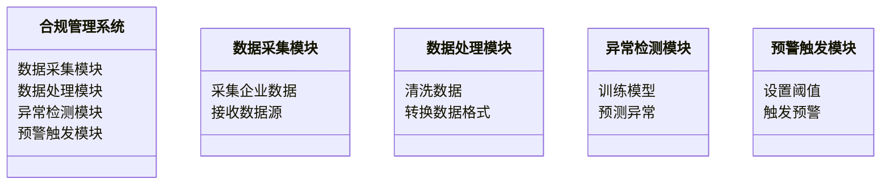
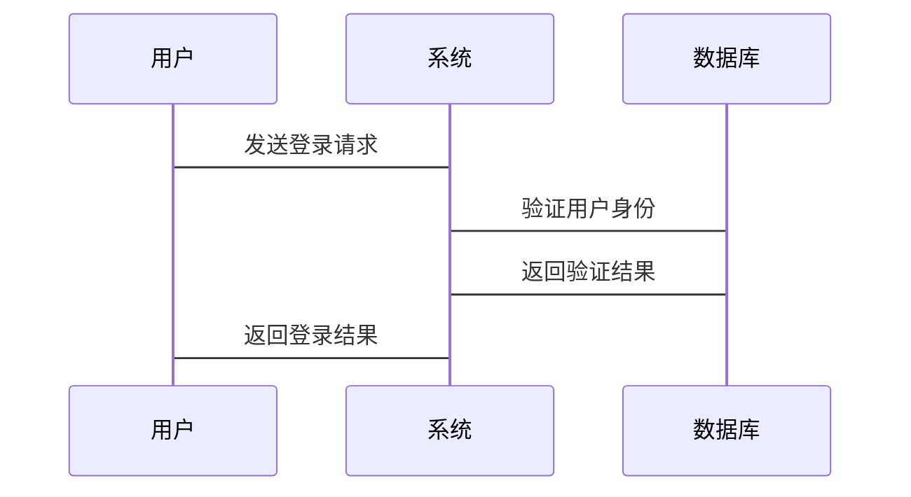
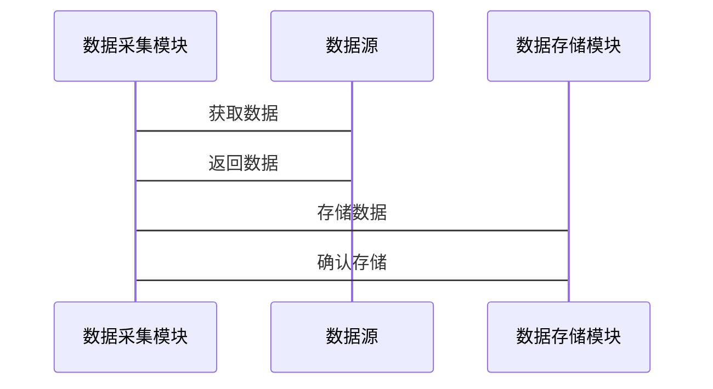

                 


# 构建智能企业合规管理系统：实时监控与预警机制设计

## 关键词：企业合规管理、实时监控、预警机制、智能系统、算法原理

## 摘要：  
本文详细探讨了构建智能企业合规管理系统的实时监控与预警机制设计。通过分析企业合规管理的重要性，介绍了实时监控与预警机制的核心概念与联系，详细讲解了相关的算法原理、系统架构设计及项目实战案例。本文旨在为企业提供一套智能化的合规管理解决方案，助力企业在数字化转型中实现高效合规管理。

---

# 第一部分: 企业合规管理与智能系统概述

## 第1章: 企业合规管理的重要性

### 1.1 企业合规管理的核心概念

#### 1.1.1 合规管理的定义与范围  
合规管理是指企业为了遵守相关法律法规、行业标准和企业内部规章制度，对企业的各项经营活动进行监督和管理的过程。合规管理的范围涵盖企业运营的各个环节，包括但不限于财务、税务、合同、数据安全、劳动法等方面。

#### 1.1.2 企业合规管理的必要性  
随着全球化和数字化的推进，企业面临的合规要求日益严格。合规管理不仅是企业合法经营的基础，也是企业风险管理的重要组成部分。通过合规管理，企业可以避免法律风险、声誉损失和经济损失。

#### 1.1.3 智能化合规管理的优势  
传统的合规管理依赖于人工审核和事后检查，效率低下且容易遗漏问题。智能化合规管理通过引入人工智能、大数据分析等技术，可以实现自动化监控、实时预警和智能决策，显著提高了合规管理的效率和准确性。

---

### 1.2 企业合规管理的现状与挑战

#### 1.2.1 当前企业合规管理的主要问题  
1. **人工审核效率低**：传统合规管理依赖人工检查，耗时且容易出错。  
2. **合规要求复杂多变**：法律法规和行业标准不断更新，企业难以及时适应。  
3. **数据分散**：企业数据分布在不同的系统中，难以统一监控和分析。  
4. **成本高**：合规管理需要投入大量的人力和资源，增加了企业的运营成本。  

#### 1.2.2 合规管理中的技术难点  
1. **实时性要求高**：需要对企业的各项经营活动进行实时监控，及时发现违规行为。  
2. **数据处理复杂**：涉及多源异构数据的采集、清洗和分析，技术实现难度大。  
3. **模型准确性**：需要建立高精度的预警模型，确保预警的准确性和可靠性。  

#### 1.2.3 智能化合规管理的必要性  
智能化合规管理通过技术手段解决传统合规管理的痛点，帮助企业实现高效、精准的合规管理。通过实时监控和预警机制，企业可以在问题发生前及时采取措施，避免潜在风险。

---

## 第2章: 实时监控与预警机制的必要性

### 2.1 实时监控在企业合规管理中的作用

#### 2.1.1 实时监控的定义与特点  
实时监控是指通过对企业的各项经营活动进行实时数据采集和分析，及时发现和处理违规行为的过程。其特点是高效性、连续性和主动性。

#### 2.1.2 实时监控在合规管理中的应用  
1. **财务合规**：实时监控企业的财务数据，发现异常交易和资金流动。  
2. **合同合规**：实时检查合同内容是否符合法律法规要求。  
3. **数据安全**：实时监控企业的数据访问和操作，防止数据泄露。  

#### 2.1.3 实时监控对企业运营的影响  
实时监控可以帮助企业快速发现和处理问题，避免因违规行为导致的法律风险和经济损失。同时，实时监控还可以提高企业的管理效率，优化资源配置。

---

### 2.2 预警机制在合规管理中的重要性

#### 2.2.1 预警机制的定义与分类  
预警机制是指通过分析企业的各项数据，预测潜在的合规风险，并提前发出预警信号的过程。常见的预警机制包括基于规则的预警和基于机器学习的预警。

#### 2.2.2 预警机制在合规管理中的应用  
1. **风险预警**：通过分析企业的经营数据，预测潜在的合规风险。  
2. **异常行为检测**：实时监控员工和外部合作伙伴的行为，发现异常操作。  
3. **合规状态评估**：定期评估企业的合规状态，确保符合相关法律法规。  

#### 2.2.3 预警机制对企业决策的支持  
预警机制可以帮助企业在问题发生前采取预防措施，避免潜在风险。同时，预警机制还可以为企业提供数据支持，优化企业的经营决策。

---

# 第二部分: 智能企业合规管理系统的原理与设计

## 第3章: 合规管理的核心概念与联系

### 3.1 合规管理的核心概念

#### 3.1.1 合规管理的主体与客体  
1. **主体**：企业、管理层、员工、外部监管机构等。  
2. **客体**：企业的经营活动、数据、合同、财务等。  

#### 3.1.2 合规管理的主要维度  
1. **法律合规**：确保企业经营活动符合相关法律法规。  
2. **行业合规**：遵守行业标准和规范。  
3. **内部合规**：执行企业内部规章制度。  

#### 3.1.3 合规管理的关键要素  
1. **数据采集**：获取企业的各项经营活动数据。  
2. **数据分析**：对数据进行清洗、处理和分析。  
3. **风险评估**：识别和评估潜在的合规风险。  
4. **预警触发**：根据分析结果，触发预警信号。  
5. **问题处理**：针对预警信号，采取相应的处理措施。  

---

### 3.2 实时监控与预警机制的原理

#### 3.2.1 实时监控的基本原理  
实时监控通过对企业数据的实时采集和分析，发现异常行为和潜在风险。其实现过程包括数据采集、数据处理、异常检测和预警触发。

#### 3.2.2 预警机制的实现原理  
预警机制通过建立数学模型和阈值，对企业的数据进行分析，当数据指标超过预设阈值时，触发预警信号。预警机制的核心在于模型的准确性和阈值的合理性。

#### 3.2.3 监控与预警的关联性  
实时监控和预警机制是相辅相成的。实时监控提供数据支持，预警机制基于监控数据进行分析和判断，最终实现风险的早期发现和处理。

---

## 第4章: 合规管理系统的核心算法原理

### 4.1 数据采集与处理算法

#### 4.1.1 数据采集的实现  
1. **数据源**：企业的财务系统、合同管理系统、数据安全系统等。  
2. **数据格式**：结构化数据（如数据库表）、半结构化数据（如JSON、XML）和非结构化数据（如文本、图像）。  

#### 4.1.2 数据清洗与预处理  
1. **数据清洗**：去除重复数据、处理缺失值、纠正异常值。  
2. **数据转换**：将数据转换为统一的格式，便于后续分析。  

#### 4.1.3 数据存储  
1. **数据仓库**：将清洗后的数据存储在数据仓库中，便于后续分析和查询。  
2. **实时数据库**：支持实时数据存储和查询，满足实时监控的需求。  

---

### 4.2 异常检测与预警算法

#### 4.2.1 基于规则的异常检测  
1. **规则定义**：根据法律法规和企业内部规章制度，定义异常行为的规则。  
2. **规则匹配**：将企业的实际数据与预定义的规则进行匹配，发现异常行为。  

#### 4.2.2 基于机器学习的异常检测  
1. **模型训练**：使用历史数据训练异常检测模型，如随机森林、支持向量机等。  
2. **实时预测**：将实时数据输入模型，预测是否存在异常行为。  

#### 4.2.3 预警触发机制  
1. **阈值设定**：根据模型预测结果和业务需求，设定预警阈值。  
2. **预警信号**：当数据指标超过阈值时，触发预警信号，并通知相关人员处理。  

---

### 4.3 数学模型与公式

#### 4.3.1 基于统计的异常检测模型  
$$ P(X) = \frac{1}{\sqrt{2\pi\sigma^2}} e^{-\frac{(x-\mu)^2}{2\sigma^2}} $$  
其中，$$\mu$$ 是均值，$$\sigma$$ 是标准差，$$X$$ 是数据点。

#### 4.3.2 基于时间序列的异常检测模型  
$$ ARIMA(p, d, q) $$  
其中，$$p$$ 是自回归阶数，$$d$$ 是差分阶数，$$q$$ 是移动平均阶数。

---

## 第5章: 系统架构设计与实现

### 5.1 系统功能设计

#### 5.1.1 领域模型设计  


#### 5.1.2 系统架构设计  


#### 5.1.3 系统接口设计  
1. **数据采集接口**：提供REST API，接收企业数据。  
2. **数据处理接口**：提供数据清洗和转换的API。  
3. **异常检测接口**：提供模型训练和预测的API。  
4. **预警触发接口**：提供阈值设置和预警触发的API。  

---

### 5.2 系统交互设计

#### 5.2.1 用户登录流程  


#### 5.2.2 数据采集流程  


---

## 第6章: 项目实战与应用分析

### 6.1 项目环境安装

#### 6.1.1 系统环境  
- 操作系统：Linux/Windows  
- 语言：Python 3.8+  
- 开发工具：PyCharm、VS Code  

#### 6.1.2 依赖安装  
```bash
pip install numpy pandas scikit-learn matplotlib
```

---

### 6.2 核心代码实现

#### 6.2.1 数据采集模块  
```python
import requests

def fetch_data(api_url):
    response = requests.get(api_url)
    return response.json()
```

#### 6.2.2 数据处理模块  
```python
import pandas as pd

def preprocess_data(data):
    df = pd.DataFrame(data)
    df = df.drop_duplicates()
    df = df.fillna(0)
    return df
```

#### 6.2.3 异常检测模块  
```python
from sklearn.ensemble import RandomForestClassifier

def train_model(X_train, y_train):
    model = RandomForestClassifier()
    model.fit(X_train, y_train)
    return model

def predict_model(model, X_test):
    y_pred = model.predict(X_test)
    return y_pred
```

#### 6.2.4 预警触发模块  
```python
def trigger_alarm(threshold, prediction):
    if prediction > threshold:
        print("触发预警！")
    else:
        print("未触发预警。")
```

---

### 6.3 实际案例分析

#### 6.3.1 案例背景  
某企业发现其财务数据存在异常交易，需要通过合规管理系统进行实时监控和预警。

#### 6.3.2 数据分析与处理  
1. 数据采集：从企业的财务系统中获取交易数据。  
2. 数据清洗：去除重复数据和异常值。  
3. 异常检测：使用随机森林模型预测交易的合规性。  
4. 预警触发：当预测结果超过阈值时，触发预警信号。

---

## 第7章: 最佳实践与未来展望

### 7.1 最佳实践

#### 7.1.1 数据安全与隐私保护  
确保企业的数据在采集、处理和存储过程中符合数据隐私保护的相关法律法规。

#### 7.1.2 模型优化与迭代  
定期更新模型，确保模型的准确性和有效性。

#### 7.1.3 系统可扩展性  
设计系统的可扩展性，方便未来的功能扩展和性能优化。

---

### 7.2 小结

通过构建智能企业合规管理系统，企业可以实现对各项经营活动的实时监控和预警，显著提高合规管理的效率和准确性。本文详细介绍了系统的原理、设计和实现过程，为企业提供了可参考的解决方案。

---

### 7.3 注意事项

1. **数据隐私保护**：在数据采集和处理过程中，必须遵守相关法律法规，确保数据安全和隐私保护。  
2. **模型优化**：定期更新模型，确保预警机制的准确性和可靠性。  
3. **系统维护**：定期检查和维护系统，确保系统的稳定运行。  

---

### 7.4 拓展阅读

1. 《机器学习实战》  
2. 《数据挖掘导论》  
3. 《企业合规管理指南》  

---

# 作者：AI天才研究院/AI Genius Institute & 禅与计算机程序设计艺术 /Zen And The Art of Computer Programming

