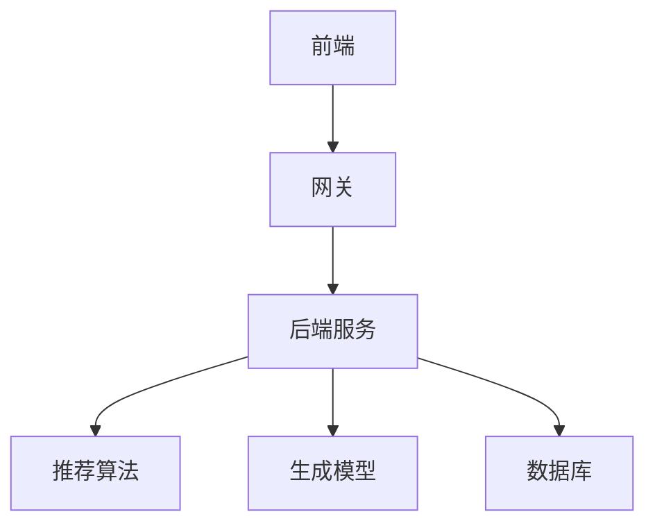
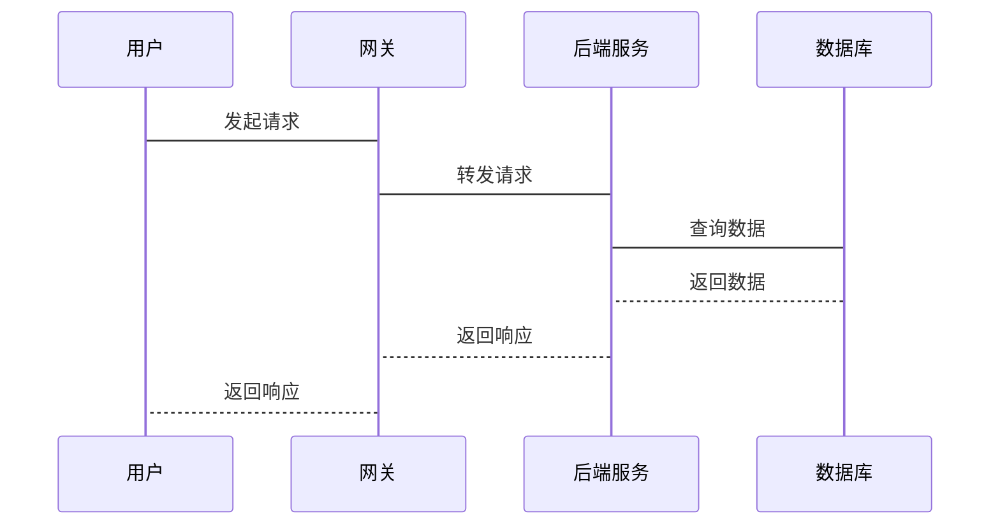
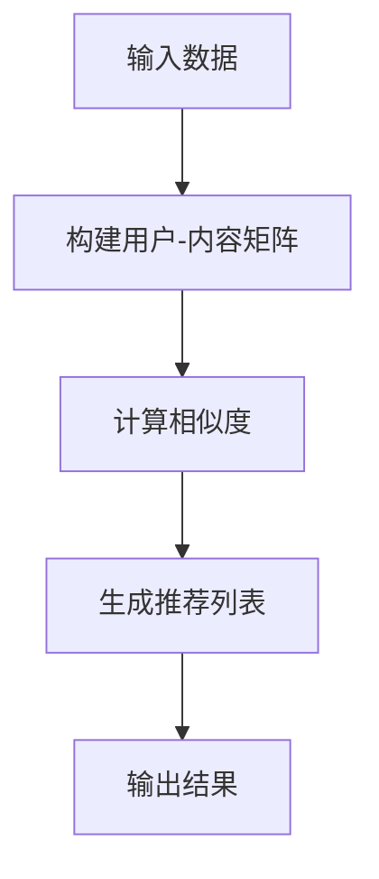
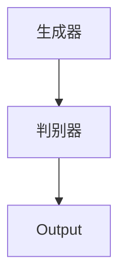

                 


# 《构建智能企业培训系统：自适应学习路径与内容动态生成》

## 关键词：智能企业培训系统、自适应学习路径、内容动态生成、机器学习、系统架构、算法实现

## 摘要：  
本文详细探讨了构建智能企业培训系统的各个方面，重点介绍了自适应学习路径和内容动态生成的核心技术。通过分析传统培训系统的局限性，提出了基于机器学习的解决方案，并详细讲解了系统架构设计、算法实现、项目实战等内容。本文旨在为企业培训系统的设计者和开发者提供理论支持和实践指导，帮助他们构建高效、个性化的智能培训系统。

---

# 第3章 系统架构设计与实现

## 3.1 系统功能模块划分

### 3.1.1 用户管理模块
- 用户注册与登录
- 用户信息管理
- 用户权限控制

### 3.1.2 内容管理模块
- 内容资源库管理
- 内容标签与分类
- 内容版本控制

### 3.1.3 路径生成模块
- 学员行为分析
- 知识点推荐算法
- 学习路径动态生成

### 3.1.4 数据分析模块
- 学员学习效果评估
- 系统性能监控
- 数据驱动的优化策略

---

## 3.2 系统架构设计

### 3.2.1 系统分层架构
```
前端层：
- 用户界面（Web/移动端）
- API网关
后端层：
- 业务逻辑处理
- 微服务架构
数据层：
- 数据库（关系型/非关系型）
- 数据存储与检索
```

### 3.2.2 模块交互关系
```
学员请求 -> 路径生成模块 -> 调用推荐算法 -> 返回个性化路径
内容动态生成 -> 调用生成模型 -> 生成适配内容
```

### 3.2.3 系统架构图


---

## 3.3 数据库设计

### 3.3.1 数据表结构
| 表名          | 字段                     | 说明                     |
|---------------|--------------------------|--------------------------|
| 用户表 (User) | id, username, password   | 用户基本信息             |
| 内容表 (Content) | id, title, content, tags | 内容信息及标签           |
| 学习路径表 (LearningPath) | id, user_id, path_content | 学习路径信息             |
| 行为记录表 (BehaviorLog) | id, user_id, action_time, action_type | 学员行为记录           |

### 3.3.2 数据库优化策略
- 索引优化：为高频查询字段（如用户ID、时间戳）创建索引
- 分库分表：根据用户或内容进行分片处理
- 读写分离：主库处理写入，从库处理读取

---

## 3.4 系统接口设计

### 3.4.1 接口定义
- `/api/login`：用户登录接口
- `/api/recommend`：推荐学习路径接口
- `/api/generate-content`：动态生成内容接口

### 3.4.2 接口交互流程


---

# 第4章 算法原理与实现

## 4.1 协同过滤推荐算法

### 4.1.1 算法原理
- 基于用户相似度或物品相似度的推荐
- 使用余弦相似度计算用户兴趣相似度

### 4.1.2 算法流程图


### 4.1.3 算法实现代码
```python
import numpy as np

def cosine_similarity(user_profile, content_profile):
    return np.dot(user_profile, content_profile) / (np.linalg.norm(user_profile) * np.linalg.norm(content_profile))

# 示例
user_profile = np.array([0.5, 0.8, 0.3])
content_profile = np.array([0.6, 0.7, 0.5])
similarity = cosine_similarity(user_profile, content_profile)
print(similarity)
```

## 4.2 基于生成对抗网络的内容动态生成

### 4.2.1 GAN模型简介
- 生成器（Generator）：生成内容
- 判别器（Discriminator）：判别内容是否为真实

### 4.2.2 模型结构


### 4.2.3 模型训练流程
```mermaid
graph TD
    G -> D: 生成样本
    D -> G: 反馈损失
    G --> Train: 更新参数
    D --> Train: 更新参数
```

### 4.2.4 代码实现
```python
import torch
import torch.nn as nn

class Generator(nn.Module):
    def __init__(self, input_size, hidden_size, output_size):
        super(Generator, self).__init__()
        self.fc = nn.Linear(input_size, hidden_size)
        self.relu = nn.ReLU()
        self.fc2 = nn.Linear(hidden_size, output_size)
    
    def forward(self, x):
        x = self.fc(x)
        x = self.relu(x)
        x = self.fc2(x)
        return x

class Discriminator(nn.Module):
    def __init__(self, input_size, hidden_size, output_size):
        super(Discriminator, self).__init__()
        self.fc = nn.Linear(input_size, hidden_size)
        self.relu = nn.ReLU()
        self.fc2 = nn.Linear(hidden_size, output_size)
        self.sigmoid = nn.Sigmoid()
    
    def forward(self, x):
        x = self.fc(x)
        x = self.relu(x)
        x = self.fc2(x)
        x = self.sigmoid(x)
        return x
```

---

# 第5章 系统实现与项目实战

## 5.1 环境搭建

### 5.1.1 技术选型
- 开发语言：Python
- 框架：Django/Flask
- 数据库：MySQL/PostgreSQL
- 机器学习库：Scikit-learn/TensorFlow

### 5.1.2 安装依赖
```bash
pip install django
pip install mysql-connector-python
pip install scikit-learn
pip install tensorflow
```

---

## 5.2 核心代码实现

### 5.2.1 推荐算法实现
```python
def recommend(user_id, user_profiles, content_profiles):
    similarities = {}
    for content_id, content_profile in content_profiles.items():
        similarity = cosine_similarity(user_profiles[user_id], content_profile)
        similarities[content_id] = similarity
    # 根据相似度排序，返回推荐列表
    sorted_contents = sorted(similarities.items(), key=lambda x: x[1], reverse=True)
    return [content_id for content_id, _ in sorted_contents[:10]]
```

### 5.2.2 内容生成实现
```python
def generate_content(generator, noise):
    with torch.no_grad():
        generated_content = generator(noise).numpy()
    return generated_content
```

---

## 5.3 实际案例分析

### 5.3.1 案例背景
某企业希望为员工提供个性化的编程技能培训路径。

### 5.3.2 实施步骤
1. 数据采集：收集员工技能水平、学习偏好等数据。
2. 模型训练：使用协同过滤算法生成推荐路径。
3. 内容生成：利用GAN生成适配的学习资料。

### 5.3.3 结果展示
- 学员A：推荐路径为“Python基础 -> 数据结构 -> 算法设计”。
- 学员B：推荐路径为“Python高级 -> 网络编程 -> 人工智能基础”。

---

## 5.4 项目总结与优化

### 5.4.1 实现的关键点
- 系统的模块化设计
- 算法的高效实现
- 系统的可扩展性

### 5.4.2 注意事项
- 数据隐私保护
- 算法的可解释性
- 系统的稳定性

---

# 第6章 系统优化与性能提升

## 6.1 算法优化

### 6.1.1 协同过滤算法的优化
- 增加正则化项防止过拟合
- 使用隐式反馈提升推荐精度

### 6.1.2 GAN模型的优化
- 增加判别器的训练次数
- 使用Wasserstein距离优化损失函数

## 6.2 系统性能调优

### 6.2.1 前端优化
- 使用缓存技术减少重复请求
- 优化页面加载速度

### 6.2.2 后端优化
- 垂直扩展与水平扩展结合
- 使用消息队列优化异步任务

## 6.3 系统可扩展性设计

### 6.3.1 微服务架构
- 模块化设计
- 服务间通信机制

### 6.3.2 异地部署与负载均衡
- 使用云服务（如AWS、阿里云）
- 配置反向代理和负载均衡

---

# 第7章 系统应用与未来展望

## 7.1 系统应用案例

### 7.1.1 企业培训中的应用
- 个性化学习路径
- 动态生成学习资料

### 7.1.2 效果评估
- 学员满意度提升
- 学习效率提高
- 企业培训成本降低

## 7.2 未来展望

### 7.2.1 技术趋势
- 元学习（Meta-Learning）
- 强化学习（Reinforcement Learning）
- 边缘计算（Edge Computing）

### 7.2.2 应用场景扩展
- 跨领域应用
- 全球化部署

---

# 作者信息

作者：AI天才研究院/AI Genius Institute & 禅与计算机程序设计艺术/Zen And The Art of Computer Programming

---

以上为文章的完整内容，涵盖从系统设计到算法实现，再到项目实战和未来展望的详细步骤。通过系统化的分析与实践，本文为构建智能企业培训系统提供了全面的技术指导。

