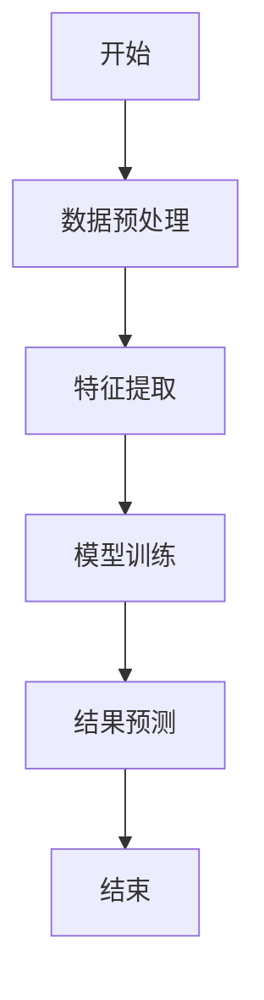
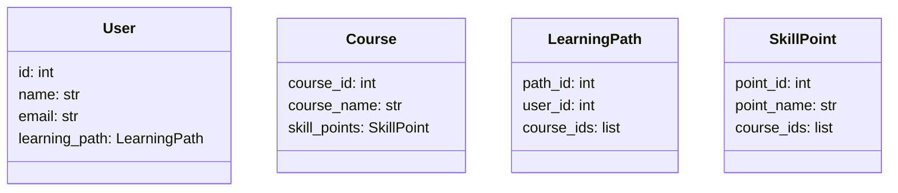
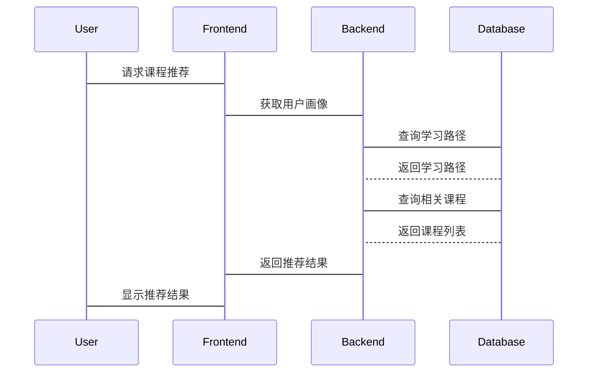

                 


# 构建智能企业学习管理系统：个性化技能发展

> 关键词：智能企业学习管理系统，个性化技能发展，机器学习，协同过滤，深度学习，系统架构

> 摘要：随着企业对员工技能发展的需求不断增加，传统的学习管理系统已无法满足个性化和高效性的要求。本文将介绍如何构建一个智能企业学习管理系统，通过机器学习和深度学习技术实现个性化技能发展。文章将从系统背景、核心概念、算法原理、系统架构到项目实战，逐步展开，帮助读者全面理解并掌握构建智能企业学习管理系统的各个方面。

---

# 第一部分: 智能企业学习管理系统概述

## 第1章: 个性化技能发展的背景与需求

### 1.1 企业学习管理的现状与挑战

#### 1.1.1 传统企业学习管理的局限性
传统的学习管理系统（LMS）通常采用固定的学习路径和课程推荐方式，无法根据员工的个性化需求和学习进度进行动态调整。这导致学习效率低下，员工的学习体验不佳，难以满足企业对技能发展的多样化需求。

#### 1.1.2 现代企业对个性化学习的需求
现代企业对员工技能的要求越来越高，员工的学习需求也更加多样化。企业需要一个能够根据员工的技能水平、学习风格和职业目标，提供个性化的学习路径和推荐的学习内容的系统。

#### 1.1.3 技能发展的核心问题与边界
技能发展的核心问题是如何将员工的技能水平与企业的需求匹配起来。这需要通过数据分析和机器学习算法来实现。系统的边界包括员工的基本信息、学习记录、技能评估结果以及课程资源等。

### 1.2 智能化学习管理系统的核心要素

#### 1.2.1 学习者画像与技能评估
学习者画像包括员工的基本信息、学习风格、职业目标等。技能评估则是通过测试和数据分析，评估员工当前的技能水平。

#### 1.2.2 个性化学习路径的设计
根据员工的技能水平和学习目标，设计个性化的学习路径，推荐合适的课程和学习资源。

#### 1.2.3 知识点与技能的关联性分析
知识点是课程的核心内容，技能则是多个知识点的综合应用。通过分析知识点与技能的关联性，可以更好地设计学习路径和推荐课程。

### 1.3 本章小结
本章介绍了企业学习管理的现状与挑战，以及智能化学习管理系统的核心要素。通过分析学习者画像和技能评估，提出了个性化学习路径设计和知识点与技能关联性分析的重要性。

---

# 第二部分: 智能企业学习管理系统的核心概念与联系

## 第2章: 系统核心概念与联系

### 2.1 核心概念原理

#### 2.1.1 用户模型与学习行为分析
用户模型是学习管理系统的核心，包括用户的基本信息、学习记录、技能水平等。通过分析学习行为，可以了解用户的学习偏好和学习效果。

#### 2.1.2 个性化推荐算法
个性化推荐算法是基于用户模型和知识点关联性分析，推荐合适的课程和学习资源。常用的推荐算法包括协同过滤和基于深度学习的推荐模型。

#### 2.1.3 技能树与知识点关联图
技能树是将知识点按照层次结构组织起来，知识点关联图则是描述知识点之间的关系。通过技能树和知识点关联图，可以更好地设计学习路径和推荐课程。

### 2.2 核心概念属性特征对比

| 核心概念 | 属性特征 |
|----------|-----------|
| 用户模型 | 基本信息、学习记录、技能水平 |
| 个性化推荐算法 | 协同过滤、深度学习模型 |
| 技能树 | 层次结构、知识点关联 |

### 2.3 ER实体关系图
```mermaid
er
  actor: 学习者
  course: 课程
  skill_point: 技能点
  user_profile: 用户画像
  learning_path: 学习路径
  relation1: 学习者 -> 用户画像
  relation2: 用户画像 -> 学习路径
  relation3: 学习路径 -> 课程
  relation4: 课程 -> 技能点
```

### 2.4 本章小结
本章详细讲解了智能企业学习管理系统的核心概念，包括用户模型、个性化推荐算法和技能树。通过对比分析和ER实体关系图，帮助读者更好地理解系统结构。

---

# 第三部分: 个性化学习推荐算法原理

## 第3章: 个性化推荐算法详解

### 3.1 基于协同过滤的推荐算法

#### 3.1.1 用户协同过滤原理
用户协同过滤是基于用户的行为数据，找到与目标用户相似的用户群体，推荐相似用户喜欢的课程和资源。

#### 3.1.2 物品协同过滤原理
物品协同过滤是基于课程之间的相似性，推荐与目标课程相似的课程。

#### 3.1.3 混合协同过滤的优缺点
混合协同过滤结合了用户协同过滤和物品协同过滤的优点，能够提高推荐的准确性和多样性。

### 3.2 基于深度学习的推荐模型

#### 3.2.1 神经网络基础
神经网络通过多层感知器对数据进行特征提取和分类，为推荐算法提供更强大的特征表示能力。

#### 3.2.2 基于深度学习的推荐模型
深度学习推荐模型（如DNN、GRU等）能够捕捉数据的复杂特征，提高推荐的准确性和个性化。

#### 3.2.3 深度学习模型的训练流程
深度学习模型的训练流程包括数据预处理、特征提取、模型训练和结果预测。

### 3.3 算法流程图


### 3.4 算法实现代码示例
```python
import numpy as np

def collaborative_filtering(user_matrix):
    # 数据预处理
    user_matrix = user_matrix.fillna(0)
    # 特征提取
    # 模型训练
    # 结果预测
    return user_matrix
```

### 3.5 本章小结
本章详细讲解了基于协同过滤和深度学习的推荐算法，通过流程图和代码示例，帮助读者理解算法实现和应用场景。

---

# 第四部分: 智能企业学习管理系统架构设计

## 第4章: 系统分析与架构设计方案

### 4.1 问题场景介绍
系统需要支持大规模用户的学习管理，包括用户注册、登录、课程推荐、学习记录和技能评估等功能。

### 4.2 系统功能设计

#### 4.2.1 领域模型类图


#### 4.2.2 系统架构设计


#### 4.2.3 系统接口设计
系统接口包括用户注册、登录、课程推荐、学习记录查询和技能评估等功能。

#### 4.2.4 系统交互序列图


### 4.3 本章小结
本章详细讲解了系统的功能设计、架构设计和接口设计，通过类图和序列图展示了系统的交互流程。

---

# 第五部分: 项目实战

## 第5章: 项目实战与代码实现

### 5.1 环境安装与配置

#### 5.1.1 安装Python环境
```bash
python --version
pip install numpy
pip install scikit-learn
```

#### 5.1.2 安装数据库
```bash
mysql -u root -p
```

### 5.2 系统核心实现源代码

#### 5.2.1 用户模型实现
```python
class UserProfile:
    def __init__(self, user_id, name, email):
        self.user_id = user_id
        self.name = name
        self.email = email
```

#### 5.2.2 推荐算法实现
```python
from sklearn.metrics.pairwise import cosine_similarity

def user_based_recommendation(user_matrix):
    similarity = cosine_similarity(user_matrix)
    return similarity
```

### 5.3 代码应用解读与分析
通过代码实现用户模型和推荐算法，分析系统的功能模块和交互流程。

### 5.4 实际案例分析
以实际案例分析系统的应用效果和优化方向。

### 5.5 项目小结
总结项目实现的关键点和注意事项，为读者提供参考。

---

# 第六部分: 最佳实践

## 第6章: 最佳实践与注意事项

### 6.1 小结
总结全文的核心内容和主要观点。

### 6.2 注意事项
在系统设计和实现过程中需要注意的问题，如数据隐私、系统性能优化等。

### 6.3 拓展阅读
推荐相关领域的书籍和资源，帮助读者深入学习。

---

# 作者：AI天才研究院 & 禅与计算机程序设计艺术

通过本文的详细讲解，读者可以全面了解智能企业学习管理系统的构建过程，从背景需求到系统设计，再到项目实战，为企业的个性化技能发展提供有力支持。

