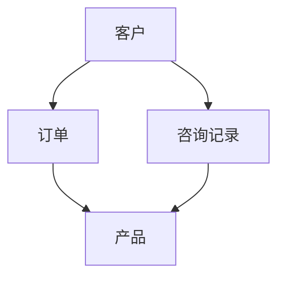
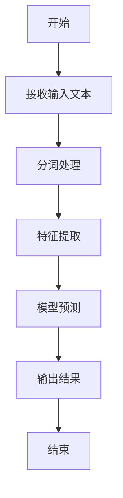
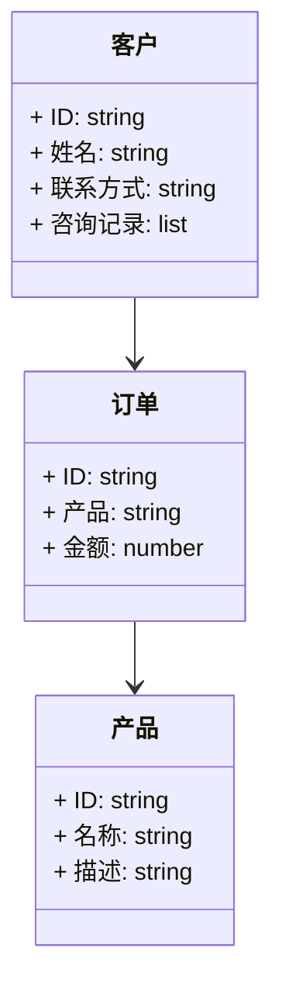
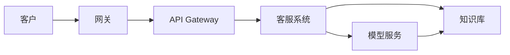
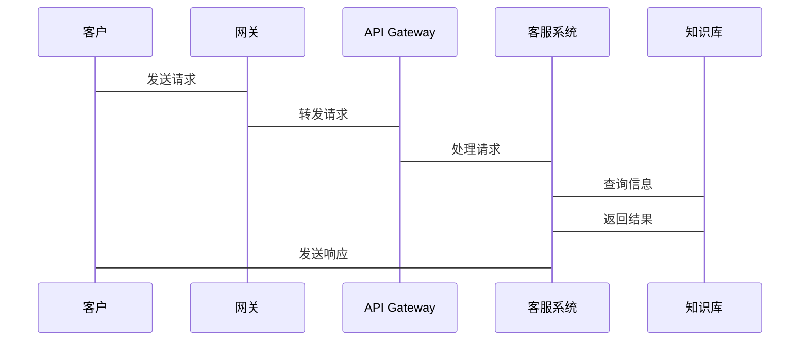

                 


# 构建智能企业客户服务系统：AI全渠道支持

## 关键词：AI，企业客服，全渠道支持，自然语言处理，机器学习，知识图谱

## 摘要：  
本文详细探讨了如何利用人工智能技术构建智能企业客户服务系统，实现全渠道支持。通过分析传统客户服务系统的局限性，结合AI技术的核心概念与算法原理，提出了一套完整的系统架构设计方案，并通过实际案例展示了如何将理论应用于实践。文章还总结了最佳实践和未来发展方向。

---

# 第1章: 背景介绍与核心概念

## 1.1 问题背景

### 1.1.1 传统客户服务系统的局限性  
传统客户服务系统通常依赖人工客服，存在以下问题：  
1. **效率低下**：人工客服响应速度慢，无法满足大规模客户的需求。  
2. **服务一致性差**：不同客服人员的知识水平和经验差异导致服务体验不一致。  
3. **数据孤岛**：客户信息分散在不同渠道和系统中，难以实现统一管理和分析。  

### 1.1.2 AI技术对企业客服的变革作用  
AI技术的引入，特别是自然语言处理（NLP）和机器学习，为客服系统带来了革命性的变化：  
1. **自动化处理**：通过AI自动解析客户问题，实现快速响应。  
2. **一致体验**：基于预训练模型提供统一的服务标准。  
3. **数据整合**：利用知识图谱技术整合多渠道数据，实现全局视角。  

### 1.1.3 全渠道客户服务的需求驱动  
现代客户通过多种渠道（如电话、邮件、社交媒体、在线聊天）与企业互动，要求企业能够提供一致的服务体验。AI技术能够统一处理这些渠道，满足全渠道支持的需求。

---

## 1.2 问题描述

### 1.2.1 客户服务效率低下  
传统客服系统依赖人工处理，导致响应速度慢，客户等待时间长。  

### 1.2.2 客户体验不一致  
由于不同客服人员的知识水平和经验不同，客户可能得到不同的答案，影响体验。  

### 1.2.3 数据孤岛与信息碎片化  
客户信息分散在各个系统和渠道中，难以实现统一管理和分析，导致资源浪费和服务效率低下。

---

## 1.3 问题解决与系统目标

### 1.3.1 AI全渠道支持的核心目标  
- 提供快速、准确的客户问题解决。  
- 实现全渠道一致的服务体验。  
- 利用AI技术整合多渠道数据，提升服务效率。  

### 1.3.2 系统边界与外延  
- 系统边界：仅关注客户与企业之间的互动，不涉及企业内部管理。  
- 系统外延：支持多种渠道（如电话、邮件、社交媒体、在线聊天）和多种语言。  

### 1.3.3 核心要素与组成结构  
- **客户交互层**：实现多渠道客户互动。  
- **AI处理层**：包括NLP、机器学习和知识图谱。  
- **知识库**：存储企业产品、服务和FAQ信息。  

---

# 第2章: 核心概念与联系

## 2.1 AI在企业客户服务中的应用原理

### 2.1.1 自然语言处理（NLP）在客服中的应用  
NLP技术用于解析客户的自然语言输入，提取关键词和意图。  
- **分词**：将客户输入的文本分割成词语或短语。  
- **实体识别**：识别文本中的关键实体（如产品名称、客户ID）。  

### 2.1.2 机器学习在客户意图识别中的作用  
机器学习模型用于分类客户的问题类型，例如：  
- **分类任务**：将客户问题分为“产品咨询”、“投诉”、“技术支持”等类别。  
- **情感分析**：识别客户情绪（如正面、负面、中性）。  

### 2.1.3 知识图谱在客服知识库中的构建  
知识图谱是一种结构化数据表示方式，用于存储企业的产品、服务和FAQ信息。  
- **实体-关系-属性模型**：例如，产品与服务的关系，服务与客户的关联。  

---

## 2.2 核心概念对比分析

### 2.2.1 规则引擎与深度学习模型的对比  
| 对比维度         | 规则引擎            | 深度学习模型         |  
|------------------|---------------------|--------------------|  
| 适用场景         | 简单规则匹配       | 复杂模式识别         |  
| 知识表示         | 基于规则库         | 基于训练数据         |  
| 可扩展性         | 低                 | 高                 |  

### 2.2.2 实体关系图（ER图）  


---

# 第3章: 算法原理与数学模型

## 3.1 算法原理

### 3.1.1 基于NLP的文本分类算法  
文本分类用于将客户问题分类到预定义的类别中。  
- **步骤**：  
  1. 数据预处理（分词、去除停用词）。  
  2. 特征提取（如TF-IDF）。  
  3. 训练分类器（如朴素贝叶斯、支持向量机）。  

### 3.1.2 情感分析算法  
情感分析用于识别客户情绪。  
- **步骤**：  
  1. 数据标注（正面、负面、中性）。  
  2. 特征提取。  
  3. 训练情感分析模型（如LSTM）。  

---

## 3.2 数学模型与公式

### 3.2.1 文本相似度计算公式  
$$ \text{余弦相似度} = \frac{\vec{A} \cdot \vec{B}}{|\vec{A}| |\vec{B}|} $$  
其中，$\vec{A}$和$\vec{B}$分别是两个文本的向量表示。

### 3.2.2 朴素贝叶斯分类器公式  
$$ P(y|x) = \frac{P(x|y)P(y)}{P(x)} $$  
其中，$P(x|y)$是类别$y$下$x$的条件概率，$P(y)$是类别$y$的先验概率。

---

## 3.3 算法流程图  


---

# 第4章: 系统分析与架构设计

## 4.1 系统功能设计

### 4.1.1 客户交互模块  
- 支持多渠道输入（电话、邮件、社交媒体、在线聊天）。  
- 提供实时聊天和语音交互功能。  

### 4.1.2 知识库管理模块  
- 支持知识库的创建、维护和更新。  
- 提供基于知识图谱的语义搜索功能。  

---

## 4.2 系统架构设计

### 4.2.1 领域模型类图  


### 4.2.2 系统架构图  


---

## 4.3 系统接口设计

### 4.3.1 HTTP接口  
- **GET /api/customers**: 获取客户列表。  
- **POST /api/support**: 提交客户支持请求。  

---

## 4.4 系统交互序列图  


---

# 第5章: 项目实战

## 5.1 环境安装

### 5.1.1 安装Python  
```bash
python --version
```

### 5.1.2 安装依赖  
```bash
pip install jieba numpy scikit-learn
```

---

## 5.2 系统核心实现

### 5.2.1 分词代码  
```python
import jieba

text = "我需要帮助修改订单信息"
words = jieba.lcut(text)
print(words)  # 输出: ['我', '需要', '帮助', '修改', '订单信息']
```

### 5.2.2 情感分析代码  
```python
from sklearn.feature_extraction.text import TfidfVectorizer
from sklearn.naive_bayes import MultinomialNB

# 假设X为文本数据，y为标签
vectorizer = TfidfVectorizer()
X = vectorizer.fit_transform(X)
model = MultinomialNB()
model.fit(X, y)
```

---

## 5.3 案例分析与详细解读  
通过一个具体案例，展示如何利用AI技术构建智能客服系统，包括数据采集、模型训练和系统部署。

---

# 第6章: 最佳实践与总结

## 6.1 最佳实践 tips  
- 数据质量管理是关键，确保数据的准确性和完整性。  
- 模型优化需要结合业务需求，避免过度拟合。  

## 6.2 小结  
本文详细介绍了如何利用AI技术构建智能企业客户服务系统，从背景分析到系统设计，再到项目实战，为读者提供了全面的指导。

## 6.3 注意事项  
- 确保系统的安全性和隐私保护。  
- 定期更新知识库，保持系统的准确性。  

## 6.4 拓展阅读  
- 《自然语言处理实战》  
- 《机器学习算法详解》  

---

# 作者：AI天才研究院/AI Genius Institute & 禅与计算机程序设计艺术/Zen And The Art of Computer Programming

---

以上是完整的文章大纲和内容，涵盖了构建智能企业客户服务系统所需的所有关键点。希望这篇文章能为读者提供有价值的指导和启发。

