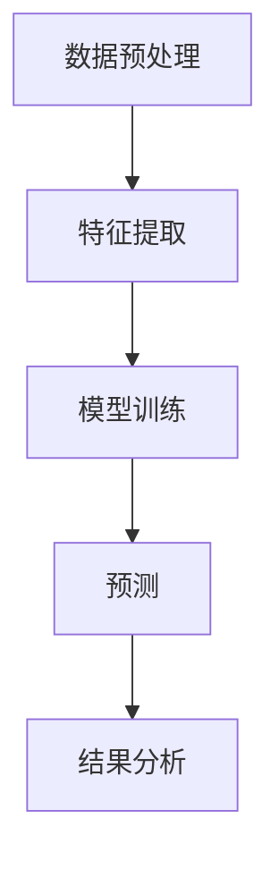

                 


# 构建智能企业市场调研系统：社交媒体聆听与趋势预测的AI驱动

> 关键词：智能企业，市场调研系统，社交媒体聆听，趋势预测，AI驱动

> 摘要：本文将探讨如何利用AI技术构建智能企业市场调研系统，通过社交媒体聆听和趋势预测，帮助企业更高效地进行市场分析和决策。文章从背景介绍、核心概念、算法原理、系统架构到项目实战，全面解析系统的构建过程。

---

## 第一部分：引言

### 第1章：智能企业市场调研系统的背景与目标

#### 1.1 问题背景
- **市场调研的传统方法及其局限性**：传统市场调研依赖问卷调查和数据分析，耗时且成本高，难以捕捉实时市场动态。
- **社交媒体数据对企业决策的重要性**：社交媒体数据提供了海量用户反馈，但如何有效提取和分析这些数据是关键。
- **传统市场调研与AI驱动预测的差距**：传统方法缺乏实时性和准确性，而AI技术能够通过大数据分析提升预测的精准度。

#### 1.2 问题描述
- **当前市场调研中的主要挑战**：数据分散、处理复杂、预测模型不够灵活。
- **社交媒体数据的碎片化与难以处理性**：如何从海量社交媒体数据中提取有价值的信息是难点。
- **预测模型的准确性和实时性问题**：现有模型可能不够精准或无法实时更新。

#### 1.3 问题解决
- **引入AI技术的必要性**：利用机器学习和自然语言处理技术，提升数据处理和预测能力。
- **构建智能系统的总体思路**：整合社交媒体数据，构建预测模型，实时分析市场趋势。
- **系统如何整合社交媒体数据与预测模型**：通过数据采集、清洗、建模和预测，实现智能化市场调研。

#### 1.4 系统边界与外延
- **系统的功能边界**：专注于社交媒体数据的收集、分析和趋势预测，不涉及其他数据源。
- **系统的适用范围与限制**：适用于需要实时市场反馈的企业，但不包括内部数据源。
- **系统与其他工具或平台的接口**：可与CRM系统集成，提供全面的市场分析。

---

## 第二部分：核心概念与联系

### 第2章：核心概念与联系

#### 2.1 核心概念原理
- **社交媒体聆听**：通过爬虫和API获取社交媒体数据，包括文本、图片、视频等。
- **趋势预测**：利用机器学习模型预测市场趋势，如销量预测、用户行为分析等。

#### 2.2 概念属性特征对比表格
| 概念 | 特性 | 描述 |
|------|------|------|
| 社交媒体数据 | 结构化 | 文本、评论、点赞等 |
| 预测模型 | 方法 | 时间序列分析、回归分析等 |

#### 2.3 ER实体关系图
```mermaid
er
actor:
    User
    Comment
    Post

relation:
    User -> Comment: 用户发表评论
    User -> Post: 用户发布帖子
    Comment -> Predict: 评论影响预测
    Post -> Predict: 帖子影响预测
```

---

## 第三部分：算法原理讲解

### 第3章：趋势预测的算法原理

#### 3.1 算法选择与优化
- **时间序列分析**：使用ARIMA模型进行预测，适用于历史数据充足的情况。
- **集成学习**：通过集成模型提升预测准确性，如随机森林和梯度提升。

#### 3.2 算法流程


#### 3.3 数学模型与公式
- **ARIMA模型**：用于时间序列预测。
  $$ ARIMA(p, d, q) $$
- **LSTM网络**：适用于时间序列数据。
  $$ LSTM(t, h, c) $$

---

## 第四部分：系统架构设计

### 第4章：系统架构设计

#### 4.1 系统功能设计
- **数据采集模块**：负责获取社交媒体数据。
- **数据处理模块**：清洗和预处理数据。
- **预测模型模块**：构建并训练模型。
- **结果展示模块**：可视化预测结果。

#### 4.2 系统架构图


#### 4.3 系统接口设计
- **数据接口**：通过API获取社交媒体数据。
- **模型接口**：提供预测结果的API。

---

## 第五部分：项目实战

### 第5章：项目实战

#### 5.1 环境配置
- **Python环境**：安装必要的库如pandas、numpy、scikit-learn。

#### 5.2 核心代码实现
```python
import pandas as pd
from sklearn.model_selection import train_test_split
from sklearn.ensemble import RandomForestRegressor

# 数据预处理
data = pd.read_csv('data.csv')
X = data.drop('target', axis=1)
y = data['target']

# 划分训练集和测试集
X_train, X_test, y_train, y_test = train_test_split(X, y, test_size=0.2)

# 模型训练
model = RandomForestRegressor()
model.fit(X_train, y_train)

# 预测
y_pred = model.predict(X_test)
```

#### 5.3 功能模块实现
- **数据采集模块**：使用爬虫技术获取数据。
- **数据处理模块**：清洗和转换数据。
- **预测模块**：训练模型并进行预测。
- **结果展示模块**：生成可视化报告。

#### 5.4 案例分析
- **案例背景**：假设一家电商公司需要预测销售额。
- **数据准备**：收集社交媒体评论和历史销售数据。
- **系统实现**：构建预测模型，输出预测结果。
- **结果分析**：分析预测的准确性和误差。

#### 5.5 经验总结
- **数据质量的重要性**：高质量数据是模型准确的基础。
- **模型调优**：通过参数优化提升预测精度。
- **实时更新**：定期更新模型以保持预测的准确性。

---

## 第六部分：总结与展望

### 第6章：总结与展望

#### 6.1 总结
- 本文详细介绍了构建智能企业市场调研系统的全过程，包括数据采集、处理、建模和预测。
- 强调了AI技术在市场调研中的重要性，展示了系统的实际应用价值。

#### 6.2 未来展望
- **数据源扩展**：整合更多数据源，提升预测的全面性。
- **模型优化**：引入深度学习技术，提高预测精度。
- **实时性提升**：优化系统架构，实现更快速的预测响应。

---

## 作者信息

作者：AI天才研究院/AI Genius Institute & 禅与计算机程序设计艺术 /Zen And The Art of Computer Programming

---

以上是完整的目录大纲和文章内容，涵盖了从背景介绍到项目实战的各个方面，确保每个部分都详细且有深度。

