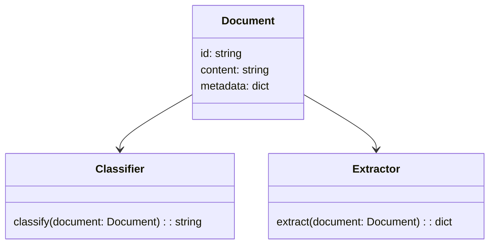
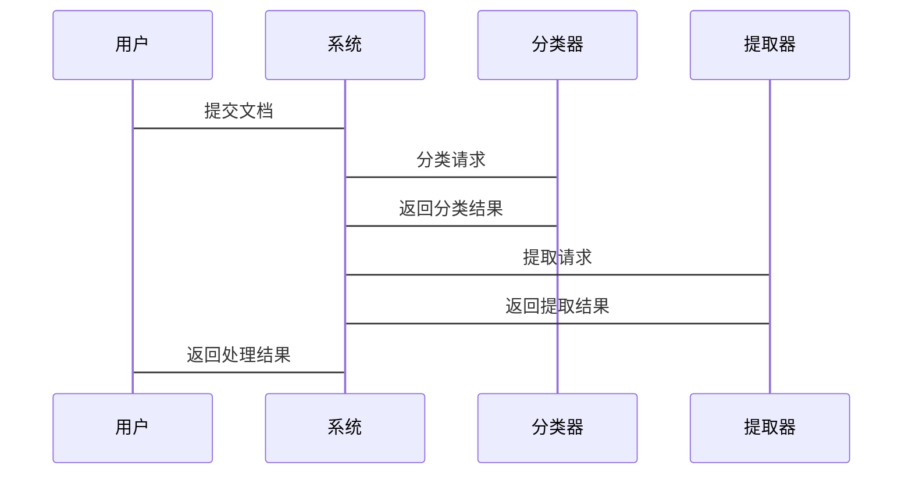

                 


# 构建智能企业文档管理系统：自动分类与信息提取

## 关键词：企业文档管理，智能分类，信息提取，机器学习，深度学习

## 摘要：本文详细探讨了构建智能企业文档管理系统的各个方面，重点介绍了自动分类与信息提取的核心概念、算法原理、系统架构设计以及实际项目案例。通过理论与实践相结合的方式，帮助读者理解如何利用先进的技术手段提升企业文档管理效率和准确性。

---

## 第1章：企业文档管理系统的背景与问题

### 1.1 企业文档管理的现状与挑战

#### 1.1.1 传统文档管理的痛点
- **存储分散**：企业文档通常分散在不同的存储位置，难以统一管理。
- **分类复杂**：文档分类依赖人工操作，效率低且容易出错。
- **检索困难**：传统检索系统难以处理非结构化数据，导致文档查找效率低下。
- **安全风险**：文档管理不当可能导致敏感信息泄露，带来安全隐患。

#### 1.1.2 数字化转型中的文档管理需求
- **高效性**：企业需要快速访问和处理文档，以支持业务决策。
- **智能化**：通过自动化技术减少人工干预，提高文档处理效率。
- **安全性**：确保文档在存储和传输过程中的安全性和合规性。

#### 1.1.3 智能文档管理的必要性
- **提升效率**：通过自动化分类和信息提取，减少人工操作，节省时间。
- **提高准确性**：智能系统能够精准识别和提取文档信息，降低错误率。
- **增强可扩展性**：智能文档管理系统能够处理海量数据，支持企业规模的扩展。

### 1.2 智能文档管理的核心问题

#### 1.2.1 文档分类的复杂性
- 文档分类需要考虑文档的内容、格式、语言等多种因素。
- 不同类型文档的分类标准不同，增加了分类的复杂性。

#### 1.2.2 信息提取的准确性
- 信息提取需要从非结构化数据中准确提取关键信息。
- 文本中可能存在歧义和不完整信息，影响提取的准确性。

#### 1.2.3 系统集成的挑战
- 智能文档管理系统需要与企业现有的信息化系统（如ERP、CRM）无缝集成。
- 数据格式、接口标准等方面的兼容性问题需要解决。

### 1.3 自动分类与信息提取的定义

#### 1.3.1 文档自动分类的定义
- 文档自动分类是指利用计算机技术对文档进行自动分类的过程。
- 分类标准可以是文档的主题、类型、部门等。

#### 1.3.2 信息提取的定义
- 信息提取是从文档中提取特定信息的过程，通常是结构化数据。
- 常见的信息提取任务包括命名实体识别、关键信息提取等。

#### 1.3.3 两者的区别与联系
- **区别**：文档分类是将文档整体归类，而信息提取是从文档中提取特定信息。
- **联系**：文档分类为信息提取提供基础，信息提取的结果可以进一步用于分类。

### 1.4 本章小结
本章介绍了企业文档管理系统的背景与挑战，阐述了智能文档管理的必要性，并对自动分类与信息提取的定义和区别进行了详细说明。下一章将深入探讨自动分类与信息提取的核心概念与原理。

---

## 第2章：自动分类的核心原理

### 2.1 文本分类的基本原理

#### 2.1.1 文本分类的流程
1. 数据预处理：清洗、分词、去除停用词等。
2. 特征提取：将文本转换为数值特征，如TF-IDF、词袋模型等。
3. 模型训练：使用训练数据训练分类器。
4. 文本分类：对新文本进行分类预测。

#### 2.1.2 常见的文本分类算法
- **朴素贝叶斯（Naive Bayes）**：基于概率论，假设特征之间独立。
- **K近邻（K-Nearest Neighbor, KNN）**：基于距离的分类方法。
- **决策树（Decision Tree）**：通过构建树状结构进行分类。
- **随机森林（Random Forest）**：基于决策树的集成方法。

#### 2.1.3 分类器的性能评估
- **准确率（Accuracy）**：正确分类的比例。
- **召回率（Recall）**：真实正例中被正确分类的比例。
- **F1分数（F1 Score）**：准确率和召回率的调和平均数。

### 2.2 基于机器学习的分类算法

#### 2.2.1 支持向量机（SVM）
- **原理**：通过构建超平面将数据点分成不同类别。
- **优点**：适用于高维数据，分类效果好。
- **缺点**：计算复杂度较高。

#### 2.2.2 随机森林（Random Forest）
- **原理**：通过构建多个决策树，取其投票结果作为最终分类结果。
- **优点**：抗过拟合能力强，适用于高维数据。
- **缺点**：计算资源消耗较大。

#### 2.2.3 神经网络（Neural Networks）
- **原理**：通过多层神经网络模拟人脑的处理方式。
- **优点**：适用于复杂的非线性分类问题。
- **缺点**：训练时间长，需要大量计算资源。

### 2.3 基于深度学习的分类算法

#### 2.3.1 卷积神经网络（CNN）
- **原理**：通过卷积层提取文本中的局部特征。
- **优点**：适用于文本序列数据，提取能力强。
- **缺点**：需要大量标注数据进行训练。

#### 2.3.2 循环神经网络（RNN）
- **原理**：通过循环层处理序列数据，捕捉上下文信息。
- **优点**：适用于长序列数据，捕捉长距离依赖。
- **缺点**：存在梯度消失问题，训练困难。

#### 2.3.3 Transformer架构
- **原理**：基于自注意力机制，通过全局上下文进行分类。
- **优点**：捕捉长距离依赖能力强，计算效率高。
- **缺点**：需要大量计算资源，训练成本高。

### 2.4 本章小结
本章详细介绍了文本分类的基本原理和常见算法，重点分析了基于机器学习和深度学习的分类方法，并对各种算法的优缺点进行了对比。下一章将探讨信息提取的核心原理。

---

## 第3章：信息提取的核心原理

### 3.1 信息提取的基本概念

#### 3.1.1 信息提取的定义
- 信息提取是从文本中提取特定信息的过程，通常涉及模式匹配和上下文理解。

#### 3.1.2 信息提取的常见任务
- **命名实体识别（NER）**：提取文本中的专有名词，如人名、地名、组织名等。
- **关键信息提取**：提取文本中的关键事件、时间、地点等信息。
- **关系抽取**：提取文本中的实体关系，如“某人是某公司的CEO”。

#### 3.1.3 信息提取的挑战
- **歧义性**：文本中可能存在多种解释，导致信息提取困难。
- **多样性**：不同领域和语言的信息提取规则不同。
- **数据稀疏性**：标注数据有限，影响模型的泛化能力。

### 3.2 基于规则的信息提取

#### 3.2.1 正则表达式
- **原理**：通过预定义的正则表达式匹配特定模式。
- **优点**：简单易用，适用于规则明确的场景。
- **缺点**：灵活性差，难以应对复杂的文本结构。

#### 3.2.2 预定义模板
- **原理**：基于模板匹配特定模式，如“时间：XXXX年XX月XX日”。
- **优点**：规则明确，易于维护。
- **缺点**：灵活性有限，难以应对多样化的需求。

#### 3.2.3 规则引擎
- **原理**：通过规则引擎处理文本，支持复杂的规则组合。
- **优点**：规则可配置，灵活性高。
- **缺点**：规则设计复杂，需要专业知识。

### 3.3 基于机器学习的信息提取

#### 3.3.1 命名实体识别（NER）
- **原理**：通过训练模型识别文本中的专有名词。
- **常用算法**：CRF（条件随机场）、神经网络（如LSTM）。

#### 3.3.2 依存句法分析
- **原理**：分析句子的语法结构，提取主谓宾等关系。
- **常用工具**：Stanford NLP、 spaCy。

#### 3.3.3 意图识别
- **原理**：通过分析文本意图，提取关键信息。
- **常用方法**：基于关键词匹配、深度学习模型（如BERT）。

### 3.4 本章小结
本章介绍了信息提取的基本概念和常见任务，详细探讨了基于规则和机器学习的两种信息提取方法，并对各种方法的优缺点进行了分析。下一章将结合实际案例，介绍系统分析与架构设计。

---

## 第4章：系统分析与架构设计

### 4.1 系统需求分析

#### 4.1.1 问题场景介绍
- **需求背景**：企业需要一个智能文档管理系统，实现文档自动分类和信息提取。
- **目标用户**：企业员工、管理层等。
- **核心需求**：文档自动分类、信息提取、系统集成。

#### 4.1.2 项目介绍
- **项目名称**：智能企业文档管理系统。
- **项目目标**：提升文档管理效率，降低人工成本。
- **项目范围**：支持多种文档格式，实现分类和信息提取。

### 4.2 系统功能设计

#### 4.2.1 领域模型


#### 4.2.2 系统架构设计


#### 4.2.3 接口设计
- **API接口**：提供RESTful API，供其他系统调用。
- **数据格式**：支持JSON格式，方便数据传输。

#### 4.2.4 交互设计


### 4.3 本章小结
本章通过系统分析与架构设计，明确了智能企业文档管理系统的功能需求和架构设计。下一章将通过一个实际案例，详细介绍项目的具体实现。

---

## 第5章：项目实战

### 5.1 环境安装

#### 5.1.1 安装Python
- **版本要求**：Python 3.8及以上。
- **安装命令**：`python --version`

#### 5.1.2 安装依赖库
- **常用库**：scikit-learn、spaCy、transformers。
- **安装命令**：`pip install scikit-learn spacy transformers`

### 5.2 系统核心实现源代码

#### 5.2.1 文本分类实现
```python
from sklearn.feature_extraction.text import TfidfVectorizer
from sklearn.svm import SVC
import spacy

nlp = spacy.load("en_core_web_sm")

def preprocess(text):
    doc = nlp(text)
    return ' '.join([token.lemma_ for token in doc])

vectorizer = TfidfVectorizer(max_features=1000)
clf = SVC(C=1.0, random_state=42)
```

#### 5.2.2 信息提取实现
```python
import spacy
from transformers import pipeline

ner = pipeline("ner")

def extract_entities(text):
    return ner(text)

```

### 5.3 实际案例分析

#### 5.3.1 案例分析
- **输入文档**：一份公司年度报告。
- **分类结果**：财务报告。
- **提取信息**：公司名称、收入、利润等。

#### 5.3.2 代码解读与分析
- **文本预处理**：使用spaCy进行分词和词干提取。
- **特征提取**：使用TF-IDF提取文本特征。
- **分类模型**：SVM分类器进行文本分类。
- **信息提取**：NER模型提取命名实体。

### 5.4 项目小结
本章通过一个实际项目案例，详细介绍了智能企业文档管理系统的实现过程，包括环境安装、代码实现、案例分析等。读者可以通过本章内容掌握系统的实际应用。

---

## 第6章：最佳实践与总结

### 6.1 小结
- **核心内容回顾**：本文详细探讨了智能企业文档管理系统的构建过程，包括自动分类和信息提取的核心概念、算法原理、系统架构设计以及实际项目案例。

### 6.2 注意事项
- **数据安全**：确保文档数据的安全性和隐私性。
- **模型优化**：根据实际需求优化分类和提取模型。
- **系统维护**：定期更新模型和系统，确保其稳定性和高效性。

### 6.3 拓展阅读
- **推荐书籍**：《自然语言处理入门》、《深度学习》。
- **推荐博客**：AI天才研究院、Towards Data Science。

### 6.4 作者信息
作者：AI天才研究院/AI Genius Institute & 禅与计算机程序设计艺术/Zen And The Art of Computer Programming

---

通过以上内容，读者可以系统地了解构建智能企业文档管理系统的各个方面，从理论到实践，全面掌握自动分类与信息提取的核心技术。

