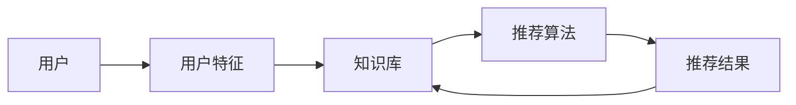
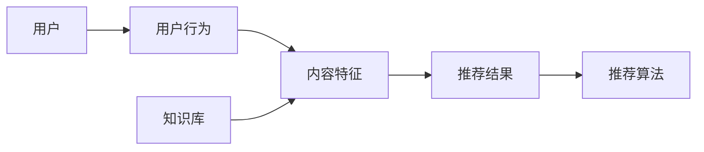

                 


# 构建智能企业知识推荐系统：个性化学习与技能提升路径规划

> 关键词：知识推荐系统，个性化学习，技能提升，机器学习，深度学习，推荐算法

> 摘要：本文章深入探讨了智能企业知识推荐系统的构建方法，从背景介绍、核心概念、算法原理到系统架构和项目实战，全面解析了如何利用个性化学习和技能提升路径规划来优化企业知识管理。通过详细的技术分析和实际案例，展示了如何利用协同过滤、深度学习和混合推荐模型等算法，构建高效的知识推荐系统，助力企业员工实现精准学习和技能提升。

---

## 第一部分: 智能企业知识推荐系统概述

### 第1章: 知识推荐系统的背景与目标

#### 1.1 知识推荐系统的背景

在企业环境中，知识管理是提升员工能力、优化业务流程和推动创新的核心。随着企业规模的扩大和知识的快速积累，传统的知识管理方式逐渐暴露出效率低下、难以个性化的问题。员工需要从海量的知识库中筛选出与自己相关的知识，这不仅耗时，还可能导致信息过载。

知识推荐系统通过智能化的方式，根据员工的学习需求、工作场景和职业发展路径，推荐相关的知识资源，从而优化学习体验和效率。这种系统能够帮助企业实现知识的精准传递，提升员工的技能水平，进而推动企业的整体竞争力。

#### 1.2 知识推荐系统的目标

知识推荐系统的建设目标主要包括以下几个方面：

1. **个性化学习路径规划**：根据员工的当前技能水平、学习目标和职业发展方向，推荐个性化的学习资源和路径。
2. **技能提升的精准推荐**：基于员工的历史学习行为和知识掌握程度，推荐与实际需求匹配的知识点和学习内容。
3. **知识库的动态更新与优化**：通过实时分析员工的学习行为和反馈，动态更新知识库，并优化推荐算法，提升推荐的准确性和用户体验。

#### 1.3 个性化学习与技能提升的必要性

在当今快速变化的商业环境中，员工需要不断学习和更新知识以适应新的挑战。传统的学习方式往往缺乏针对性，导致学习效率低下。通过个性化学习与技能提升路径规划，员工能够：

1. **节省时间**：直接获取与自己需求相关的知识，避免无效学习。
2. **提高效率**：根据学习进度和掌握程度，动态调整学习内容和节奏。
3. **增强效果**：通过个性化的推荐，确保学习内容与实际工作需求高度契合，提升学习效果。

### 1.4 知识推荐系统的定义与特点

知识推荐系统是一种基于机器学习和数据挖掘技术的智能系统，旨在通过分析用户的行为、偏好和知识特征，推荐相关的知识资源和学习路径。以下是知识推荐系统的主要特点：

1. **个性化推荐**：根据用户的特征和需求，提供定制化的知识推荐。
2. **动态更新**：实时分析用户行为和反馈，动态调整推荐策略。
3. **多模态融合**：结合文本、图像、视频等多种知识形式，提供多样化的推荐内容。
4. **可扩展性**：能够处理大规模的知识库和用户数据，适应企业知识管理的复杂需求。

### 1.5 知识推荐系统的构建目标

知识推荐系统的构建目标主要包括以下几个方面：

1. **实现个性化学习路径规划**：通过分析员工的学习需求和职业目标，设计个性化的学习路径。
2. **优化技能提升过程**：通过精准的知识推荐，缩短员工从新手到专家的学习周期。
3. **提升知识管理效率**：通过智能化的知识推荐和动态更新，优化知识库的利用效率，降低知识浪费。

---

## 第2章: 知识推荐系统的核心概念

### 2.1 知识推荐系统的原理

知识推荐系统的构建涉及多个关键环节，主要包括知识图谱构建、用户行为分析和内容特征提取。以下是各环节的详细说明：

1. **知识图谱构建**：通过对企业内部知识资源的结构化处理，构建一个包含知识点、技能点、课程和资源的关系网络。知识图谱能够帮助系统理解知识之间的关联性，从而实现更精准的推荐。
   
2. **用户行为分析**：通过收集和分析用户的点击、浏览、收藏和学习行为，挖掘用户的兴趣偏好和学习需求。用户行为数据是推荐系统的重要输入，用于生成个性化的推荐结果。

3. **内容特征提取**：对知识资源（如课程、文档、视频等）进行特征提取，生成能够表征内容主题和难度的特征向量。常见的特征提取方法包括TF-IDF、Word2Vec和主题模型。

### 2.2 核心概念对比分析

知识推荐系统与其他推荐系统（如电影推荐、音乐推荐）存在一些共同点，但也有一些关键区别。以下是核心概念的对比分析：

| 对比维度         | 知识推荐系统                   | 电影推荐系统                  |
|------------------|-------------------------------|-----------------------------|
| 推荐对象         | 知识点、课程、技能             | 电影、音乐                   |
| 推荐依据         | 用户的知识需求、学习目标       | 用户的娱乐偏好               |
| 数据特征         | 知识的结构化、专业性           | 内容的娱乐性和情感性           |
| 推荐目标         | 提升学习效率和技能水平         | 提供娱乐和放松               |

### 2.3 知识推荐系统的实体关系图

为了更好地理解知识推荐系统的结构，我们可以通过Mermaid图来展示系统中的实体关系。以下是知识推荐系统的实体关系图：



从图中可以看出，用户特征和知识库是推荐系统的核心输入，推荐算法负责根据用户特征和知识库生成推荐结果。

---

## 第3章: 知识推荐系统的算法原理

### 3.1 协同过滤算法

协同过滤是一种基于用户行为相似性的推荐算法，广泛应用于知识推荐系统中。以下是协同过滤算法的详细原理和实现步骤：

1. **基于用户的协同过滤**：通过计算用户之间的相似性，将用户分成不同的群体，然后根据群体的共同兴趣推荐知识资源。

2. **基于物品的协同过滤**：通过计算知识点之间的相似性，推荐与用户已学习的知识点相关的内容。

3. **混合协同过滤算法**：结合基于用户的协同过滤和基于物品的协同过滤，利用两者的优点，提升推荐的准确性和多样性。

### 3.2 基于内容的推荐算法

基于内容的推荐算法通过分析知识内容的特征，推荐与用户需求匹配的知识资源。以下是实现步骤：

1. **TF-IDF特征提取**：通过对知识内容进行分词和特征提取，生成文本的TF-IDF特征向量。

2. **余弦相似度计算**：计算目标知识点与其他知识点的余弦相似度，选择相似度最高的知识点进行推荐。

3. **向量空间模型**：构建知识内容的向量表示，利用向量的相似性进行推荐。

### 3.3 基于深度学习的推荐算法

基于深度学习的推荐算法利用神经网络模型，学习知识内容和用户特征的高层次表示，提升推荐的准确性和个性化。以下是几种常见的深度学习推荐算法：

1. **Word2Vec模型**：通过无监督学习生成知识点的向量表示，捕捉知识点之间的语义关系。

2. **神经网络推荐系统**：利用多层感知机或卷积神经网络，学习用户的深度特征，并生成推荐结果。

3. **注意力机制**：在神经网络中引入注意力机制，重点关注与用户需求相关的内容特征，提升推荐的精准度。

### 3.4 混合推荐模型

混合推荐模型结合多种推荐算法的优点，通过多任务学习或集成学习的方式，提升推荐的效果。以下是混合推荐模型的实现步骤：

1. **多目标优化模型**：同时优化多个推荐目标（如点击率、转化率），提升推荐的多样性和准确性。

2. **多任务学习框架**：在同一模型中同时学习多个任务，共享特征表示，提升模型的泛化能力。

3. **深度学习与协同过滤的结合**：将协同过滤的用户特征与深度学习的知识表示进行融合，生成更精准的推荐结果。

---

## 第4章: 知识推荐系统的数学模型与公式

### 4.1 协同过滤的数学模型

协同过滤的数学模型主要基于相似性计算。以下是基于用户的协同过滤模型的公式：

$$
sim(u, v) = \frac{\sum_{i \in I_u \cap I_v} (r_{u,i} - \bar{r}_u)(r_{v,i} - \bar{r}_v)}{\sqrt{\sum_{i \in I_u} (r_{u,i} - \bar{r}_u)^2} \cdot \sqrt{\sum_{i \in I_v} (r_{v,i} - \bar{r}_v)^2}}
$$

其中：
- \(sim(u, v)\) 表示用户 \(u\) 和用户 \(v\) 之间的相似性。
- \(I_u\) 和 \(I_v\) 分别表示用户 \(u\) 和用户 \(v\) 的行为记录。
- \(r_{u,i}\) 表示用户 \(u\) 对项目的评分。
- \(\bar{r}_u\) 表示用户 \(u\) 的平均评分。

### 4.2 基于内容的推荐模型

基于内容的推荐模型主要基于文本特征的相似性。以下是TF-IDF特征提取的公式：

$$
TF-IDF(t, d) = TF(t, d) \times ID
``` 

（此处需要补充完整的内容）

---

## 第5章: 知识推荐系统的系统架构

### 5.1 问题场景介绍

知识推荐系统的构建需要考虑企业内部的知识管理需求，包括知识的采集、存储、分析和推荐。以下是系统需要解决的主要问题：

1. **知识采集与存储**：如何高效地采集和存储企业内部的知识资源，包括文档、课程、视频等。

2. **用户行为分析**：如何收集和分析用户的点击、浏览和学习行为，挖掘用户的兴趣偏好。

3. **推荐算法实现**：如何设计和实现高效的推荐算法，满足大规模数据的处理需求。

4. **系统交互与反馈**：如何设计用户友好的界面和交互流程，收集用户的反馈并优化推荐结果。

### 5.2 系统功能设计

知识推荐系统的功能设计包括以下几个模块：

1. **知识采集模块**：负责采集和预处理知识资源，包括文本、图片、视频等多种形式。

2. **用户行为分析模块**：收集和分析用户的交互行为，生成用户特征向量。

3. **推荐算法模块**：实现协同过滤、深度学习等推荐算法，生成推荐结果。

4. **用户界面模块**：展示推荐结果，提供用户反馈和交互功能。

### 5.3 系统架构设计

以下是知识推荐系统的架构图：



从图中可以看出，用户行为和内容特征是推荐系统的输入，推荐算法负责生成推荐结果。

---

## 第6章: 项目实战

### 6.1 环境安装

在实现知识推荐系统之前，需要安装以下环境和工具：

1. **Python**：推荐使用最新版本的Python（如Python 3.9或更高）。
2. **机器学习库**：包括scikit-learn、tensorflow和pytorch。
3. **自然语言处理库**：包括nltk、spaCy和gensim。
4. **可视化工具**：包括Matplotlib和Seaborn。

### 6.2 核心实现

以下是知识推荐系统的实现步骤：

1. **数据预处理**：对知识内容进行分词和特征提取，生成TF-IDF特征向量。
2. **模型训练**：基于TF-IDF特征向量，训练协同过滤模型或深度学习模型。
3. **结果展示**：将推荐结果展示在用户界面上，提供用户反馈和优化建议。

### 6.3 代码实现

以下是协同过滤算法的Python代码示例：

```python
import numpy as np
from sklearn.metrics.pairwise import cosine_similarity

# 示例数据：用户-知识点评分矩阵
ratings = {
    'user1': [4, 3, 2],
    'user2': [3, 4, 1],
    'user3': [2, 1, 4]
}

# 计算用户相似性矩阵
users = ratings.keys()
rating_matrix = np.array([ratings[user] for user in users])

# 计算余弦相似度
similarity_matrix = cosine_similarity(rating_matrix)

print(similarity_matrix)
```

---

## 第7章: 总结与展望

### 7.1 总结

通过本文的详细介绍，我们可以看到知识推荐系统的构建涉及多个关键环节，包括知识图谱构建、用户行为分析、推荐算法设计和系统实现等。通过合理的系统架构和高效的算法实现，知识推荐系统能够为企业提供个性化的学习路径和精准的知识推荐，提升员工的学习效率和企业的整体竞争力。

### 7.2 展望

未来，随着人工智能和深度学习技术的不断发展，知识推荐系统将更加智能化和个性化。以下是未来的发展方向：

1. **多模态推荐**：结合文本、图像、视频等多种模态信息，提升推荐的准确性和多样性。
2. **实时反馈机制**：通过实时分析用户行为和反馈，动态调整推荐策略，优化推荐效果。
3. **知识图谱优化**：通过知识图谱的动态更新和优化，提升知识推荐系统的可解释性和智能化水平。

---

## 作者

作者：AI天才研究院/AI Genius Institute & 禅与计算机程序设计艺术 /Zen And The Art of Computer Programming

