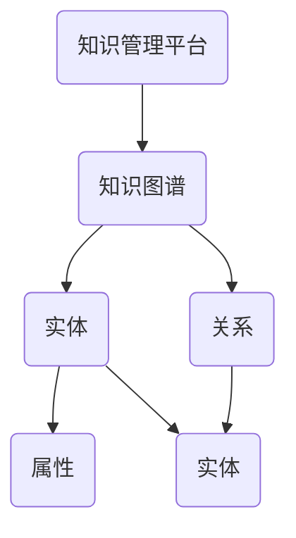
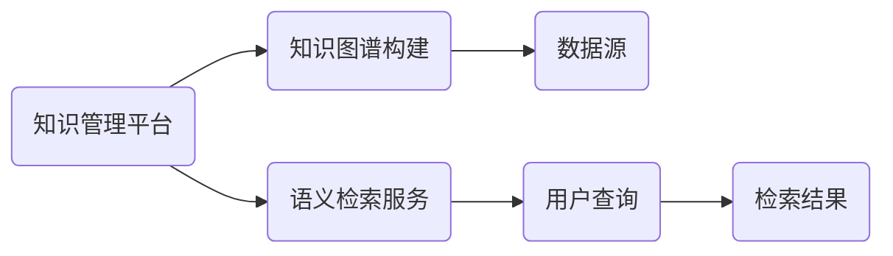
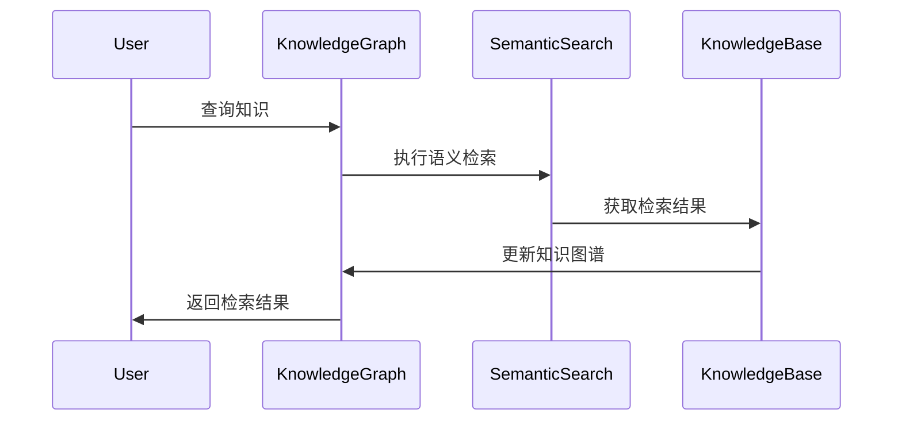

                 

# 构建智能企业知识管理平台：动态知识图谱与语义检索

> 关键词：知识图谱，动态知识图谱，语义检索，企业知识管理，智能知识管理

> 摘要：随着企业数据的快速增长和复杂化，传统的知识管理方法已难以满足智能化、动态化的需求。本文从企业知识管理的背景出发，详细探讨了动态知识图谱与语义检索的核心概念、算法原理、系统架构及实现方案。通过构建动态知识图谱和优化语义检索算法，本文提出了一种智能化的知识管理平台，能够有效提升企业的知识利用效率和决策能力。

---

# 第1章：智能企业知识管理平台的背景与问题背景

## 1.1 问题背景

### 1.1.1 传统知识管理的局限性

企业在传统知识管理中面临以下问题：
- **数据孤岛**：知识分散在不同的系统和部门中，难以统一管理和利用。
- **静态化**：知识图谱通常是静态的，难以应对业务的动态变化。
- **检索效率低**：基于关键词的检索方式难以满足语义理解的需求。

### 1.1.2 智能化知识管理的需求

随着人工智能技术的快速发展，企业对知识管理提出了更高的要求：
- **动态更新**：能够实时更新和调整知识图谱。
- **语义理解**：支持基于语义的检索，提升信息的准确性和相关性。
- **智能化应用**：结合机器学习和自然语言处理技术，提供智能化的知识服务。

### 1.1.3 动态知识图谱与语义检索的必要性

动态知识图谱能够实时反映企业的最新知识结构，而语义检索技术能够基于语义理解提升信息检索的精准度。两者的结合能够显著提升企业的知识管理能力。

---

## 1.2 问题描述

### 1.2.1 知识管理平台的核心目标

知识管理平台的核心目标是：
1. 提供统一的知识存储和管理平台。
2. 支持动态更新的知识图谱构建。
3. 提供高效的语义检索服务。

### 1.2.2 动态知识图谱的构建挑战

动态知识图谱的构建面临以下挑战：
- 数据的实时更新和同步。
- 复杂的实体关系建模。
- 动态数据的高效存储与查询。

### 1.2.3 语义检索的关键问题

语义检索的关键问题包括：
- 如何实现语义理解。
- 如何提升检索的效率和准确率。
- 如何处理大规模数据的检索需求。

---

## 1.3 问题解决

### 1.3.1 动态知识图谱的构建方法

动态知识图谱的构建方法包括：
1. **数据采集与预处理**：从多种数据源采集知识数据，并进行清洗和转换。
2. **实体识别与关系抽取**：利用自然语言处理技术提取实体及其关系。
3. **动态更新与维护**：定期更新知识图谱，确保其准确性和时效性。

### 1.3.2 语义检索的技术实现

语义检索的技术实现包括：
1. **向量表示**：将文本转化为向量表示，用于语义相似度计算。
2. **深度学习模型**：利用预训练语言模型（如BERT）进行语义理解。
3. **索引优化**：构建高效的索引结构，提升检索速度。

### 1.3.3 平台的整体解决方案

整体解决方案包括：
- 构建动态知识图谱，支持知识的实时更新。
- 实现高效的语义检索服务，提升信息检索的精准度。
- 提供可视化界面，方便用户管理和查询知识。

---

## 1.4 边界与外延

### 1.4.1 知识管理平台的边界

知识管理平台的边界包括：
- 数据范围：仅限于企业内部知识的存储和管理。
- 功能范围：不涉及外部数据的接入和处理。

### 1.4.2 动态知识图谱的外延

动态知识图谱的外延包括：
- 支持多语言知识图谱的构建。
- 支持跨领域的知识融合。

### 1.4.3 语义检索的应用范围

语义检索的应用范围包括：
- 企业内部知识库的检索。
- 客户服务中的智能问答。
- 企业决策支持中的信息检索。

---

## 1.5 核心要素与概念结构

### 1.5.1 核心概念的组成

知识管理平台的核心概念包括：
- **知识图谱**：企业知识的结构化表示。
- **语义检索**：基于语义理解的信息检索技术。
- **动态更新**：知识图谱的实时更新能力。

### 1.5.2 概念结构的分析

知识管理平台的概念结构可以分为以下层次：
1. **知识存储**：存储企业的知识数据。
2. **知识建模**：构建知识图谱的结构。
3. **知识检索**：提供语义化的检索服务。

### 1.5.3 核心要素的详细描述

- **知识存储**：支持多种数据格式的存储，提供高效的查询接口。
- **知识建模**：通过实体识别和关系抽取构建知识图谱。
- **知识检索**：基于语义理解实现高效的检索服务。

---

# 第2章：动态知识图谱与语义检索的核心概念

## 2.1 动态知识图谱的定义与特点

### 2.1.1 动态知识图谱的定义

动态知识图谱是指能够实时更新和适应业务变化的知识图谱。它通过持续的数据采集和关系抽取，保持知识图谱的最新性。

### 2.1.2 动态知识图谱的核心特点

动态知识图谱的核心特点包括：
- **实时性**：能够实时更新知识图谱。
- **动态性**：能够适应业务的变化。
- **准确性**：确保知识图谱的准确性。

### 2.1.3 动态知识图谱与静态知识图谱的对比

| 特性       | 静态知识图谱             | 动态知识图谱             |
|------------|--------------------------|--------------------------|
| 更新频率   | 定期或一次性             | 实时或周期性             |
| 知识结构   | 固定                     | 动态                     |
| 适用场景   | 知识相对稳定的场景       | 知识快速变化的场景       |

---

## 2.2 语义检索的定义与特点

### 2.2.1 语义检索的定义

语义检索是指基于语义理解进行信息检索的技术。它通过分析文本的语义信息，提升检索的准确性和相关性。

### 2.2.2 语义检索的核心特点

语义检索的核心特点包括：
- **语义理解**：能够理解文本的语义信息。
- **相关性高**：检索结果的相关性显著提高。
- **动态调整**：能够根据反馈调整检索策略。

### 2.2.3 语义检索与传统检索的对比

| 特性       | 传统检索             | 语义检索             |
|------------|----------------------|----------------------|
| 检索依据   | 关键词匹配           | 语义理解             |
| 精准度     | 较低                 | 较高                 |
| 应用场景   | 简单查询             | 复杂语义查询         |

---

## 2.3 动态知识图谱与语义检索的关系

### 2.3.1 动态知识图谱为语义检索提供基础

动态知识图谱提供了丰富的语义信息，为语义检索提供了数据基础。

### 2.3.2 语义检索提升知识图谱的利用率

通过语义检索，可以更高效地利用知识图谱中的信息。

### 2.3.3 两者的结合对企业知识管理的意义

- **提升效率**：通过动态知识图谱和语义检索的结合，显著提升知识管理的效率。
- **增强决策能力**：通过语义检索，能够快速获取所需知识，支持企业决策。

---

## 2.4 核心概念的属性特征对比

### 2.4.1 动态知识图谱的属性特征

| 属性       | 特征                   |
|------------|------------------------|
| 实时性      | 支持实时更新           |
| 动态性      | 能够适应业务变化       |
| 准确性      | 确保知识的准确性       |

### 2.4.2 语义检索的属性特征

| 属性       | 特征                   |
|------------|------------------------|
| 语义理解    | 基于深度学习模型       |
| 相关性      | 高度相关               |
| 动态调整    | 根据反馈动态优化       |

---

## 2.5 动态知识图谱与语义检索的ER实体关系图

---

## 2.6 动态知识图谱与语义检索的系统架构

---

## 2.7 动态知识图谱与语义检索的系统交互流程

---

# 作者：AI天才研究院/AI Genius Institute & 禅与计算机程序设计艺术 /Zen And The Art of Computer Programming

