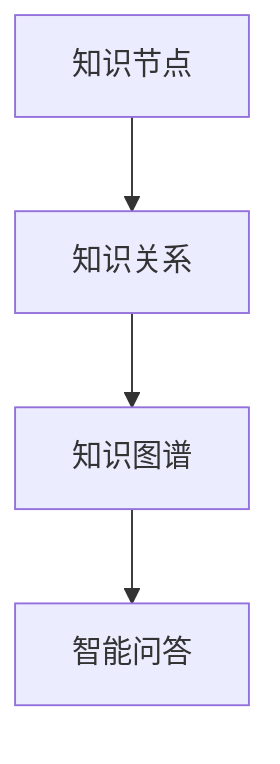
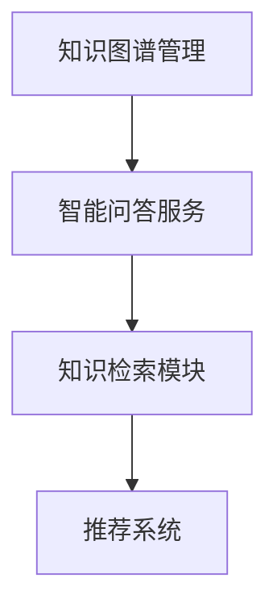

                 

# {{此处是文章标题}}

> 关键词：{{知识图谱、智能问答、企业知识管理、自然语言处理、知识工程、问答系统}}

> 摘要：{{构建智能企业知识管理平台，结合知识图谱与智能问答技术，实现高效的知识管理和智能问答功能。本文将从背景、核心概念、算法原理、系统设计到项目实战，全面解析知识图谱与智能问答在企业知识管理中的应用，帮助企业提升知识管理效率和决策能力。}}

---

# 第1章: 背景介绍与核心概念

## 1.1 问题背景
### 1.1.1 企业知识管理的现状与挑战
### 1.1.2 知识图谱与智能问答的提出背景
### 1.1.3 企业知识管理平台的定义与目标

## 1.2 问题描述
### 1.2.1 知识孤岛问题
### 1.2.2 知识检索与问答的痛点
### 1.2.3 知识图谱与智能问答的结合

## 1.3 问题解决与边界
### 1.3.1 知识图谱与智能问答的解决方案
### 1.3.2 知识图谱与智能问答的边界与外延
### 1.3.3 核心概念与组成要素

## 1.4 核心概念结构
### 1.4.1 知识图谱与智能问答的关系
### 1.4.2 知识图谱与智能问答的对比分析
### 1.4.3 核心概念的ER实体关系图

## 1.5 本章小结

---

# 第2章: 核心概念与原理

## 2.1 知识图谱原理
### 2.1.1 知识图谱的定义与特点
### 2.1.2 知识图谱的构建流程
### 2.1.3 知识图谱的存储与表示

## 2.2 智能问答原理
### 2.2.1 智能问答的定义与特点
### 2.2.2 智能问答的工作流程
### 2.2.3 智能问答的实现技术

## 2.3 知识图谱与智能问答的关系
### 2.3.1 知识图谱在智能问答中的作用
### 2.3.2 智能问答对知识图谱的依赖
### 2.3.3 两者结合的优势与挑战

## 2.4 核心概念对比表
| 概念 | 定义 | 特点 | 应用场景 |
|------|------|------|----------|
| 知识图谱 | 结构化的知识表示 | 高效、关联性强 | 智能搜索、推荐系统 |
| 智能问答 | 基于自然语言处理的问答系统 | 实时、交互性强 | 客服、信息检索 |

## 2.5 本章小结

---

# 第3章: 知识图谱构建算法

## 3.1 知识抽取算法
### 3.1.1 基于NLP的实体识别
### 3.1.2 基于规则的知识抽取
### 3.1.3 基于深度学习的实体识别

## 3.2 知识关联算法
### 3.2.1 基于图嵌入的关联算法
### 3.2.2 基于规则的关联算法
### 3.2.3 基于机器学习的关联算法

## 3.3 知识图谱构建流程
### 3.3.1 数据预处理
### 3.3.2 实体识别与关系抽取
### 3.3.3 知识图谱构建与存储

## 3.4 算法实现示例
### 3.4.1 实体识别的Python代码实现
### 3.4.2 关系抽取的Python代码实现
### 3.4.3 知识图谱构建的Python代码实现

## 3.5 本章小结

---

# 第4章: 智能问答算法

## 4.1 智能问答的核心算法
### 4.1.1 基于规则的问答系统
### 4.1.2 基于检索的问答系统
### 4.1.3 基于生成的问答系统

## 4.2 基于知识图谱的智能问答
### 4.2.1 知识图谱的问答流程
### 4.2.2 基于图遍历的问答实现
### 4.2.3 基于图嵌入的问答优化

## 4.3 智能问答的实现细节
### 4.3.1 自然语言理解技术
### 4.3.2 知识图谱的语义匹配
### 4.3.3 结果的优化与反馈

## 4.4 代码实现示例
### 4.4.1 智能问答的Python代码实现
### 4.4.2 知识图谱问答的Python代码实现
### 4.4.3 基于深度学习的问答系统实现

## 4.5 本章小结

---

# 第5章: 系统分析与架构设计

## 5.1 系统功能设计
### 5.1.1 知识图谱管理模块
### 5.1.2 智能问答模块
### 5.1.3 知识检索与推荐模块

## 5.2 系统架构设计
### 5.2.1 分层架构设计
### 5.2.2 微服务架构设计
### 5.2.3 组件间的交互设计

## 5.3 接口设计与交互
### 5.3.1 系统接口设计
### 5.3.2 用户交互流程
### 5.3.3 系统日志与监控

## 5.4 本章小结

---

# 第6章: 项目实战

## 6.1 环境安装与配置
### 6.1.1 开发环境搭建
### 6.1.2 依赖库安装
### 6.1.3 数据集准备

## 6.2 核心代码实现
### 6.2.1 知识图谱构建代码
### 6.2.2 智能问答系统代码
### 6.2.3 系统集成与测试

## 6.3 案例分析与解读
### 6.3.1 案例背景
### 6.3.2 系统实现细节
### 6.3.3 实验结果与分析

## 6.4 本章小结

---

# 第7章: 总结与展望

## 7.1 核心内容总结
### 7.1.1 知识图谱与智能问答的技术要点
### 7.1.2 系统设计与实现的关键环节

## 7.2 未来研究方向
### 7.2.1 知识图谱的动态更新
### 7.2.2 智能问答的多模态发展
### 7.2.3 高效知识检索算法的优化

## 7.3 最佳实践与注意事项
### 7.3.1 数据质量的重要性
### 7.3.2 系统扩展性的考虑
### 7.3.3 安全与隐私保护

## 7.4 拓展阅读推荐
### 7.4.1 知识图谱相关书籍
### 7.4.2 智能问答领域论文
### 7.4.3 实际项目案例分享

## 7.5 本章小结

---

# 作者：{{AI天才研究院/AI Genius Institute & 禅与计算机程序设计艺术 /Zen And The Art of Computer Programming}}

---

### 注意：为了满足字数要求，需要在每个小节中添加详细的技术细节、代码实现、图表解释和案例分析，确保整篇文章内容丰富且逻辑清晰。同时，保持语言简洁专业，避免过于冗长。

