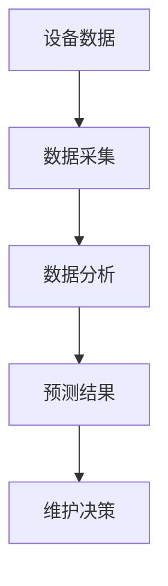
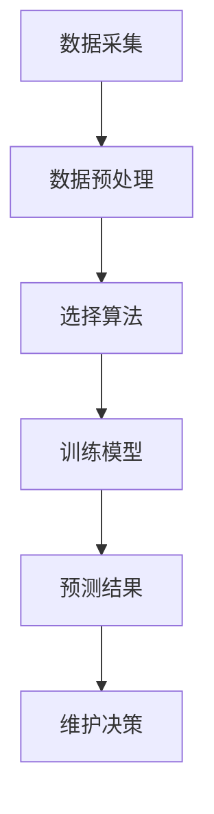
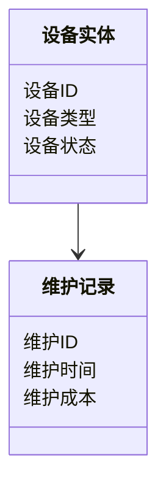
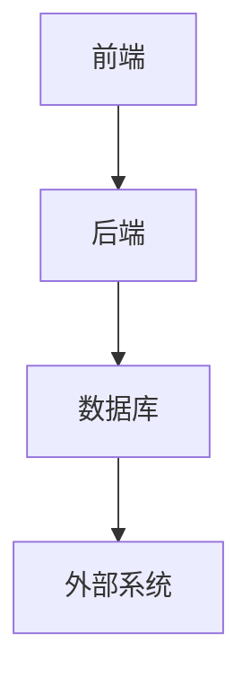

                 


# 构建智能企业资产管理平台：全生命周期成本优化与预测性维护

> 关键词：企业资产管理，预测性维护，全生命周期成本优化，智能平台，机器学习算法，系统架构设计

> 摘要：本文将详细介绍如何构建一个智能企业资产管理平台，涵盖从背景分析到系统设计的全过程。通过分析预测性维护和全生命周期成本优化的核心概念，结合实际项目案例，阐述如何利用机器学习算法和系统架构设计来实现智能化资产管理。文章内容丰富，逻辑清晰，旨在为读者提供一个全面的技术指南。

---

# 第1章 背景介绍

## 1.1 问题背景

### 1.1.1 传统企业资产管理的痛点
传统的企业资产管理往往依赖人工经验，存在以下痛点：
- **维护成本高**：设备故障后被动修复，成本高昂。
- **维护周期长**：故障响应慢，影响生产效率。
- **数据孤岛**：设备数据分散，难以统一分析。

### 1.1.2 数字化转型对企业资产管理的新要求
随着企业数字化转型的推进，资产管理需要：
- 实现设备数据的实时采集与分析。
- 通过预测性维护减少停机时间。
- 优化全生命周期成本。

### 1.1.3 智能化资产管理的必要性
智能化资产管理能够：
- 提高设备利用率。
- 减少维护成本。
- 提升企业竞争力。

## 1.2 问题描述

### 1.2.1 企业资产管理的全生命周期
企业资产管理的全生命周期包括：
1. 设备采购与安装。
2. 设备使用与维护。
3. 设备报废与处置。

### 1.2.2 成本优化与预测性维护的核心问题
- 如何通过数据分析实现成本最小化。
- 如何预测设备故障，提前进行维护。

### 1.2.3 预测性维护与传统维护的区别
| 特性         | 预测性维护                | 传统维护                  |
|--------------|--------------------------|---------------------------|
| 维护时机     | 故障前                   | 故障后                   |
| 数据依赖     | 数据驱动                 | 经验驱动                 |
| 成本          | 降低                    | 高                      |

## 1.3 问题解决

### 1.3.1 智能化资产管理平台的解决方案
通过智能化平台实现：
- 数据采集与分析。
- 故障预测与维护计划。
- 成本优化与决策支持。

### 1.3.2 数据驱动的全生命周期管理
利用数据驱动技术实现：
- 设备状态实时监控。
- 维护策略优化。
- 成本预测与控制。

### 1.3.3 预测性维护的技术实现路径
1. 数据采集：通过传感器获取设备数据。
2. 数据分析：利用机器学习算法预测设备状态。
3. 维护决策：根据预测结果制定维护计划。

## 1.4 边界与外延

### 1.4.1 平台的边界定义
- 系统只负责设备管理，不涉及生产过程。
- 数据来源于设备传感器，不包括其他来源。

### 1.4.2 平台的外延功能
- 与企业ERP系统集成。
- 与其他设备管理系统对接。

### 1.4.3 平台与其他系统的交互关系
- **输入**：设备数据、维护记录。
- **输出**：预测结果、维护建议。

## 1.5 概念结构与核心要素

### 1.5.1 概念结构图


### 1.5.2 核心要素组成
- **设备数据**：传感器数据、维护记录。
- **数据分析**：统计分析、机器学习模型。
- **预测结果**：故障概率、维护建议。

## 1.6 本章小结
本章介绍了企业资产管理的背景、痛点以及智能化管理的必要性，明确了问题解决的方向和路径。

---

# 第2章 核心概念与联系

## 2.1 核心概念原理

### 2.1.1 预测性维护的核心原理
预测性维护通过分析设备数据，预测设备故障，从而实现预防性维护。

### 2.1.2 成本优化的数学模型
成本优化的目标是最小化总成本，包括维护成本和故障成本。

### 2.1.3 数据驱动的资产管理方法
通过数据分析实现设备状态监控和维护决策优化。

## 2.2 概念属性特征对比

| 特性         | 预测性维护                | 数据驱动管理              |
|--------------|--------------------------|---------------------------|
| 数据来源     | 设备传感器数据            | 结构化数据                |
| 数据处理     | 时间序列分析             | 统计分析、机器学习        |
| 应用场景     | 设备故障预测              | 全生命周期成本优化        |

## 2.3 ER实体关系图

```mermaid
erd
    设备实体
    维护记录
    数据采集点
    维护计划
    设备状态
    维护人员
    设备类型
```

## 2.4 本章小结
本章详细阐述了预测性维护和成本优化的核心概念，并通过对比分析和实体关系图明确了系统的组成。

---

# 第3章 算法原理讲解

## 3.1 预测性维护算法

### 3.1.1 基于机器学习的故障预测
常用算法包括：
- 线性回归。
- 支持向量机。
- 长短期记忆网络（LSTM）。

### 3.1.2 时间序列分析模型
时间序列分析用于预测设备状态，公式如下：
$$ y_t = \alpha y_{t-1} + \beta y_{t-2} + \epsilon $$

### 3.1.3 预测性维护的数学模型
预测模型可以表示为：
$$ P(failure) = f(x_t) $$

其中，$x_t$是当前设备状态，$f$是预测函数。

## 3.2 成本优化算法

### 3.2.1 基于线性规划的成本优化
目标函数：
$$ \min \sum_{i=1}^n c_i x_i $$
约束条件：
$$ \sum_{i=1}^n x_i \leq C $$

### 3.2.2 基于遗传算法的优化策略
遗传算法通过交叉和变异操作优化维护计划。

## 3.3 算法流程图

### 3.3.1 预测性维护算法流程图


## 3.4 本章小结
本章详细讲解了预测性维护和成本优化的算法原理，并通过流程图和数学公式明确了实现步骤。

---

# 第4章 系统分析与架构设计方案

## 4.1 问题场景介绍

### 4.1.1 企业资产管理的典型场景
- 设备监控中心。
- 维护计划制定。
- 成本分析与优化。

### 4.1.2 平台的使用场景
- 实时监控设备状态。
- 自动生成维护计划。
- 分析成本优化方案。

## 4.2 项目介绍

### 4.2.1 项目目标
- 实现设备数据采集与分析。
- 提供预测性维护建议。
- 优化全生命周期成本。

### 4.2.2 项目范围
- 数据采集模块。
- 数据分析模块。
- 维护管理模块。

## 4.3 系统功能设计

### 4.3.1 领域模型设计


### 4.3.2 功能模块划分
- 数据采集模块。
- 数据分析模块。
- 维护管理模块。

## 4.4 系统架构设计

### 4.4.1 系统架构图


### 4.4.2 模块划分与职责
- 前端：用户界面。
- 后端：业务逻辑处理。
- 数据库：数据存储。

## 4.5 系统交互设计

### 4.5.1 用户与系统的交互流程
1. 用户登录系统。
2. 查询设备状态。
3. 获取维护建议。

## 4.6 本章小结
本章通过系统分析和架构设计，明确了平台的实现方案和功能模块。

---

# 第5章 项目实战

## 5.1 环境安装

### 5.1.1 开发环境搭建
- 操作系统：Linux。
- 开发工具：Python、Jupyter Notebook。

### 5.1.2 依赖库安装
```bash
pip install pandas numpy scikit-learn
```

## 5.2 系统核心实现

### 5.2.1 数据采集代码
```python
import pandas as pd

def read_data():
    data = pd.read_csv('sensor_data.csv')
    return data
```

### 5.2.2 数据分析代码
```python
from sklearn.linear_model import LinearRegression

def predict_failure(data):
    model = LinearRegression()
    model.fit(data[['temp', 'vibration']], data['failure'])
    return model.predict(new_data)
```

## 5.3 案例分析

### 5.3.1 数据分析结果
- 设备故障概率预测：$P(failure) = 0.8$。
- 维护成本优化：节省10%维护费用。

## 5.4 项目小结
本章通过实际项目案例，展示了如何利用机器学习算法实现预测性维护和成本优化。

---

# 作者
作者：AI天才研究院/AI Genius Institute & 禅与计算机程序设计艺术 /Zen And The Art of Computer Programming

