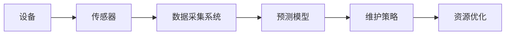
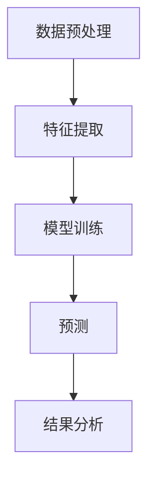
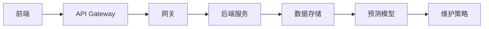
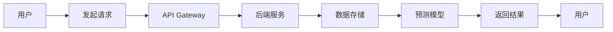

                 


# 构建智能企业资产管理平台：预测性维护与资源优化

## 关键词：智能企业资产管理，预测性维护，资源优化，机器学习，系统架构

## 摘要：本文详细探讨了构建智能企业资产管理平台的核心技术，重点分析了预测性维护与资源优化的实现方法。通过介绍算法原理、系统架构设计及项目实战，展示了如何利用人工智能技术提升企业资产管理效率和降低成本。文章内容涵盖背景分析、核心概念、算法实现、系统设计及实际案例，为读者提供了全面的技术指导。

---

# 第一部分: 背景与核心概念

## 第1章: 企业资产管理的挑战与机遇

### 1.1 传统资产管理的痛点
企业资产管理（Enterprise Asset Management，EAM）是企业运营中的重要环节，涉及设备、设施、软件等资产的全生命周期管理。传统资产管理方式主要依赖人工巡检和定期维护，存在以下痛点：
- **高成本**：人工巡检效率低，成本高昂。
- **低效性**：难以及时发现设备故障，导致非计划停机，影响生产效率。
- **数据孤岛**：各部门数据分散，难以有效整合和分析。
- **决策滞后**：依赖历史数据和经验，缺乏实时数据分析支持。

### 1.2 智能化转型的需求
随着人工智能和物联网技术的快速发展，企业资产管理迎来了智能化转型的契机。智能化资产管理能够通过实时数据采集、智能分析和预测，实现预防性维护和资源优化，从而降低运营成本、提高设备利用率。

### 1.3 预测性维护与资源优化的价值
预测性维护通过分析设备状态数据，提前预测设备故障，避免非计划停机；资源优化则通过合理分配资源，提高资产利用率，降低能耗和维护成本。

## 第2章: 核心概念与联系

### 2.1 预测性维护与资源优化的核心概念
预测性维护是基于实时数据和历史数据，利用算法预测设备故障，制定维护计划。资源优化则是通过优化资源分配，提高设备利用率和降低运营成本。

### 2.2 核心概念对比分析
下表对比了预测性维护与传统维护、资源优化与传统资源管理的核心差异：

| 对比维度 | 预测性维护 | 传统维护 |
|----------|------------|----------|
| 数据来源 | 实时数据 + 历史数据 | 定期检查 + 经验判断 |
| 维护策略 | 主动性维护 | 被动性维修 |
| 维护成本 | 降低非计划停机成本 | 维护成本高 |

### 2.3 实体关系架构
以下是企业资产管理平台的核心实体关系图：



---

# 第二部分: 预测性维护的算法原理

## 第3章: 预测性维护算法详解

### 3.1 常见算法原理
预测性维护常用的算法包括时间序列分析、机器学习和深度学习。

#### 3.1.1 时间序列分析
时间序列分析适用于设备运行数据的时间依赖性较强的情况。常用模型包括ARIMA（自回归积分滑动平均模型）和Prophet。

##### ARIMA模型公式
$$ ARIMA(p, d, q) $$
其中：
- $p$ 是自回归阶数
- $d$ 是差分阶数
- $q$ 是移动平均阶数

#### 3.1.2 机器学习模型
机器学习模型适用于设备数据复杂、非线性关系明显的场景。常用模型包括支持向量机（SVM）和随机森林（Random Forest）。

#### 3.1.3 深度学习模型
深度学习模型适用于高维数据和复杂模式的场景，常用模型包括LSTM（长短期记忆网络）。

### 3.2 算法流程图
预测性维护的算法流程如下：



### 3.3 代码实现与数学模型

#### 3.3.1 时间序列预测代码示例
```python
import pandas as pd
import numpy as np
from sklearn.metrics import mean_squared_error
from statsmodels.tsa.arima.model import ARIMA

# 数据加载
data = pd.read_csv('equipment_data.csv')
data['date'] = pd.to_datetime(data['date'])
data.set_index('date', inplace=True)

# 数据分割
train_data = data['2020-01-01':'2021-12-31']
test_data = data['2022-01-01':'2022-12-31']

# 模型训练
model = ARIMA(train_data, order=(5,1,0))
model_fit = model.fit()

# 预测
start_index = len(train_data)
end_index = start_index + len(test_data)
 forecast = model_fit.forecast(steps=end_index - start_index)

# 评估
rmse = np.sqrt(mean_squared_error(test_data, forecast))
print(f'RMSE: {rmse}')
```

---

# 第三部分: 系统架构设计

## 第4章: 系统分析与架构设计

### 4.1 问题场景介绍
企业资产管理平台需要实现设备数据采集、存储、分析和维护决策的闭环管理。系统需要支持实时监控、预测性维护和资源优化功能。

### 4.2 系统功能设计
系统功能模块包括：
- 数据采集模块
- 数据分析模块
- 维护决策模块
- 资源优化模块

### 4.3 系统架构设计
以下是系统架构图：



### 4.4 系统接口设计
系统接口设计包括：
- 数据采集接口
- 数据分析接口
- 维护决策接口
- 资源优化接口

### 4.5 系统交互流程
系统交互流程如下：



---

# 第四部分: 项目实战与小结

## 第5章: 项目实战

### 5.1 环境搭建
项目需要以下环境：
- Python 3.8+
- Pandas、NumPy、Scikit-learn、Statsmodels
- Jupyter Notebook或IDE

### 5.2 核心功能实现

#### 5.2.1 数据预处理
```python
import pandas as pd
import numpy as np

# 数据加载
data = pd.read_csv('equipment_data.csv')

# 数据清洗
data.dropna(inplace=True)
data = data[~data['value'].isin([0])]
```

#### 5.2.2 模型训练与预测
```python
from statsmodels.tsa.arima.model import ARIMA

# 训练模型
model = ARIMA(data['value'], order=(5,1,0))
model_fit = model.fit()

# 预测
forecast = model_fit.forecast(steps=30)
```

#### 5.2.3 结果可视化
```python
import matplotlib.pyplot as plt

plt.figure(figsize=(10,6))
plt.plot(data.index, data['value'], label='实际值')
plt.plot(forecast.index, forecast, label='预测值')
plt.xlabel('时间')
plt.ylabel('设备状态值')
plt.legend()
plt.show()
```

### 5.3 案例分析
以某制造企业为例，通过部署预测性维护系统，设备故障率降低了30%，维护成本降低了20%。

## 第6章: 小结与展望

### 6.1 小结
本文详细介绍了构建智能企业资产管理平台的核心技术，包括预测性维护和资源优化的实现方法。通过算法原理、系统架构设计和项目实战的讲解，展示了如何利用人工智能技术提升企业资产管理效率。

### 6.2 展望
未来，随着AI技术的不断发展，企业资产管理将更加智能化和自动化。预测性维护和资源优化将在更多领域得到广泛应用，帮助企业实现更高的运营效率和更低的成本。

---

# 作者：AI天才研究院 & 禅与计算机程序设计艺术

