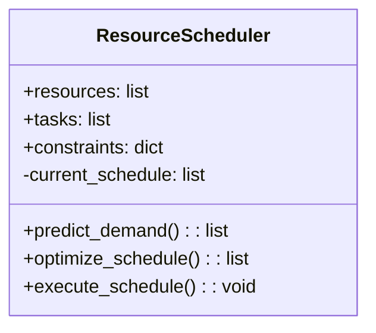
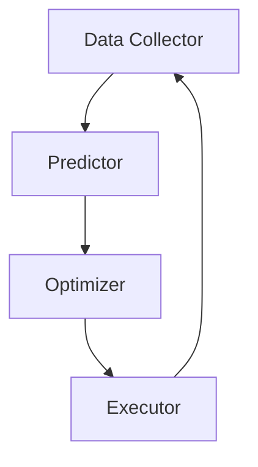
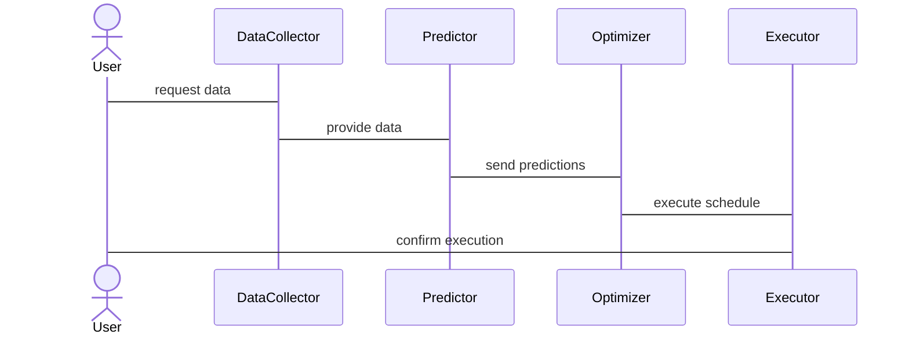

                 


# 构建智能企业资源调度系统：实时优化与预测性分配

## 关键词：智能调度系统，资源优化，实时优化，预测性分配，动态规划，机器学习，系统架构

## 摘要：本文详细探讨构建智能企业资源调度系统的方法，涵盖实时优化和预测性分配的核心算法、系统架构设计、项目实战及最佳实践。通过分析优化算法和预测模型，结合实际案例，指导读者高效利用企业资源。

---

## 第一部分：构建智能企业资源调度系统概述

### 第1章：背景介绍

#### 1.1 问题背景

企业资源调度涉及生产、物流、人员分配等多个方面，传统方法依赖固定规则或人工操作，效率低下，容易出错。随着市场竞争加剧，企业亟需智能化解决方案，以实时优化资源分配，避免浪费，提高效率。

#### 1.2 问题描述

资源调度的核心在于高效利用，需满足时间、成本、资源可用性等约束。实时优化要求系统快速调整，而预测性分配则需利用历史数据预测未来需求，做出最优决策。

#### 1.3 问题解决

智能调度系统通过AI和大数据分析，实时调整资源分配，提高效率。采用动态规划、遗传算法等优化算法，结合机器学习模型，提前预测需求，优化资源分配。

#### 1.4 边界与外延

系统边界包括数据采集、预测模型、优化引擎和执行模块。外延涉及与其他系统的集成，如ERP、CRM等，确保数据流畅和协同工作。

#### 1.5 核心概念与要素

系统核心要素包括数据采集模块、预测模型、优化算法和执行模块，确保资源调度的实时性和准确性。

---

## 第二部分：核心概念与联系

### 第2章：系统原理

#### 2.1 实时优化算法

动态规划通过分解问题，找到子问题最优解，合并得到全局最优。例如，使用动态规划优化生产流程，分解为原材料供应、生产步骤等子问题，分别优化，最终得到整体最优。

#### 2.2 预测性分配模型

机器学习模型如LSTM用于时间序列预测，分析历史数据，识别需求模式，预测未来资源需求。例如，预测某设备的维护需求，提前安排维护人员和备件。

#### 2.3 资源分配的动态调整

系统实时监控资源使用情况，结合预测模型，动态调整调度计划。例如，当某生产线出现故障，系统重新分配资源，调整生产计划，确保整体效率。

---

## 第三部分：算法原理讲解

### 第3章：实时优化算法

#### 3.1 动态规划算法

使用动态规划解决资源分配问题。例如，定义状态、转移方程和边界条件，实现生产计划的优化。

**Python代码示例：**
```python
import numpy as np

def dynamic_programming_optimization(...):
    # 初始化状态
    # 状态转移方程
    # 返回最优解
    pass

# 示例数据
data = ...
result = dynamic_programming_optimization(data)
print(result)
```

**数学模型：**
目标函数：$$ \text{min} \sum_{i} c_i x_i $$
约束条件：
$$ \sum_{i} a_i x_i \leq b $$
$$ x_i \geq 0 $$

### 第4章：预测性分配模型

#### 4.1 机器学习预测模型

使用LSTM预测未来资源需求，分析历史数据，识别需求模式，优化预测精度。

**Python代码示例：**
```python
from tensorflow.keras import layers

model = Sequential()
model.add(LSTM(64, input_shape=(timesteps, features)))
model.add(Dense(1))
model.compile(...)
```

**数学模型：**
预测函数：$$ \hat{y}_t = f(x_t) $$
损失函数：$$ L = \sum_{t} (y_t - \hat{y}_t)^2 $$

---

## 第四部分：系统架构设计

### 第5章：系统架构设计

#### 5.1 问题场景

企业资源调度系统需实时监控资源使用情况，预测需求，动态调整计划。例如，某制造企业需优化生产线资源分配，减少生产瓶颈。

#### 5.2 系统功能设计

系统功能包括数据采集、预测模型、优化引擎和执行模块。领域模型类图展示各模块交互。

**领域模型类图：**


#### 5.3 系统架构图

展示各模块交互，数据流方向。

**系统架构图：**


#### 5.4 系统接口设计

定义API接口，如RESTful API，用于数据传输和功能调用。

#### 5.5 系统交互序列图

展示系统运行时的交互流程。

**交互序列图：**


---

## 第五部分：项目实战

### 第6章：项目实战

#### 6.1 环境安装

安装必要的库，如numpy、pandas、scikit-learn、tensorflow等。

#### 6.2 核心代码实现

提供动态规划和预测模型的代码实现，解释代码结构和功能。

**动态规划实现：**
```python
def dynamic_programming(...):
    # 初始化DP表
    # 填充DP表
    # 回溯求解最优解
    pass
```

**预测模型实现：**
```python
def lstm_model(...):
    # 定义LSTM模型
    # 编译模型
    # 训练模型
    pass
```

#### 6.3 案例分析

以某制造企业为例，展示系统如何优化资源分配，减少生产瓶颈，提升效率。

---

## 第六部分：最佳实践与总结

### 第7章：总结

#### 7.1 最佳实践

强调数据质量的重要性，模型选择的合理性，系统维护的必要性。例如，定期更新模型，优化数据采集机制。

#### 7.2 注意事项

提醒读者注意数据隐私、模型泛化能力、系统可扩展性等问题。例如，数据预处理时避免过拟合，确保系统能够扩展到更大规模。

#### 7.3 拓展阅读

推荐相关书籍和论文，如《机器学习实战》、《运筹学》等，帮助读者深入学习。

---

## 作者

作者：AI天才研究院/AI Genius Institute & 禅与计算机程序设计艺术 /Zen And The Art of Computer Programming

---

通过以上结构，本文详细阐述了构建智能企业资源调度系统的方法，从理论到实践，帮助读者掌握实时优化与预测性分配的核心技术，提升企业资源管理效率。

