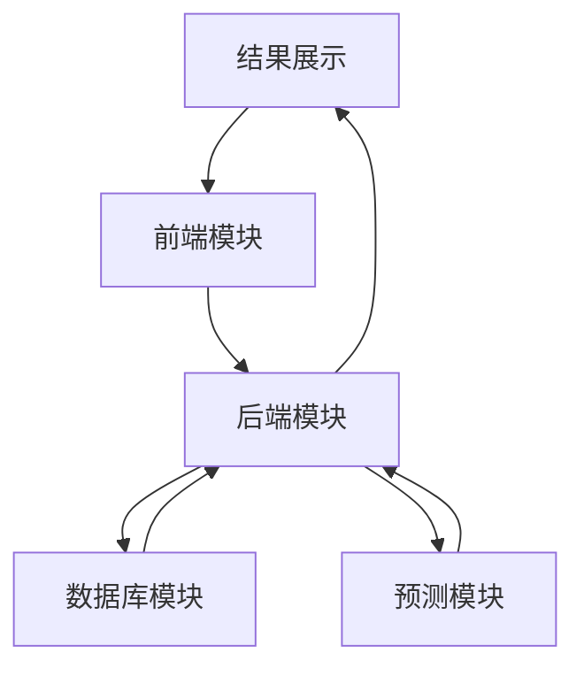

                 


# 《构建智能化的个人退休收入规划工具》

---

## 关键词：
- 退休收入规划
- 人工智能
- 大数据分析
- 系统架构设计
- 个性化推荐
- 智能化工具

---

## 摘要：
本书详细介绍了如何利用人工智能和大数据分析技术构建智能化的个人退休收入规划工具。通过分析退休规划的核心问题，提出基于机器学习和数据驱动的解决方案，并从算法原理、系统架构到项目实战，全面阐述了如何设计和实现一个智能化的退休收入规划系统。书中结合实际案例，深入浅出地讲解了数据预处理、模型训练、系统架构设计等关键环节，并通过代码示例和图表展示，帮助读者掌握构建智能化退休收入规划工具的核心技术。

---

# 第一部分: 智能化个人退休收入规划工具的背景与核心概念

## 第1章: 个人退休收入规划工具的背景与问题描述

### 1.1 退休收入规划的重要性
#### 1.1.1 退休规划的核心目标
- **目标1**：确保退休后的生活质量
- **目标2**：实现资产的保值与增值
- **目标3**：应对突发的经济风险

#### 1.1.2 退休规划的多样化需求
- **需求1**：个性化的需求分析
- **需求2**：动态调整的规划方案
- **需求3**：长期稳定的财务支持

#### 1.1.3 智能化技术在退休规划中的作用
- **作用1**：数据驱动的个性化推荐
- **作用2**：基于AI的预测与优化
- **作用3**：实时监控与风险预警

### 1.2 个人退休收入规划的现状与痛点
#### 1.2.1 传统退休规划方法的局限性
- **局限性1**：静态规划缺乏灵活性
- **局限性2**：人工计算效率低下
- **局限性3**：难以应对复杂经济环境

#### 1.2.2 用户需求的多样化与个性化
- **需求1**：不同职业群体的差异性
- **需求2**：不同经济状况的差异性
- **需求3**：不同风险偏好的差异性

#### 1.2.3 智能化技术的应用价值
- **价值1**：提升规划效率与精准度
- **价值2**：降低用户的决策风险
- **价值3**：提供实时动态的规划支持

### 1.3 智能化退休收入规划工具的解决方案
#### 1.3.1 基于AI的退休规划工具的优势
- **优势1**：智能化的数据处理能力
- **优势2**：个性化的推荐算法
- **优势3**：实时的市场数据支持

#### 1.3.2 数据驱动的个性化规划思路
- **思路1**：基于用户数据的特征提取
- **思路2**：基于市场数据的预测模型
- **思路3**：基于用户行为的动态调整

#### 1.3.3 智能化工具的核心功能与边界
- **核心功能1**：数据采集与处理
- **核心功能2**：预测模型的构建与优化
- **核心功能3**：个性化推荐与反馈机制

### 1.4 本章小结
本章从退休收入规划的重要性和现状出发，分析了传统方法的局限性，并提出了基于AI的智能化退休收入规划工具的解决方案，明确了工具的核心功能与边界。

---

## 第2章: 智能化退休收入规划工具的核心概念与联系

### 2.1 核心概念原理
#### 2.1.1 数据驱动的退休规划模型
- **模型1**：基于历史数据的回归分析
- **模型2**：基于市场数据的时间序列预测
- **模型3**：基于用户数据的个性化推荐

#### 2.1.2 基于AI的预测算法
- **算法1**：机器学习中的回归模型
- **算法2**：基于神经网络的时间序列预测
- **算法3**：基于协同过滤的个性化推荐

#### 2.1.3 用户行为分析与个性化推荐
- **分析方法1**：用户画像的构建
- **分析方法2**：用户行为的特征提取
- **分析方法3**：基于用户行为的动态调整

### 2.2 核心概念属性对比表
| 概念 | 属性 | 描述 |
|------|------|------|
| 数据源 | 类型 | 财务数据、市场数据、用户数据 |
| 预测模型 | 方法 | 时间序列分析、机器学习模型 |
| 个性化推荐 | 算法 | 基于用户行为的协同过滤 |

### 2.3 ER实体关系图
```mermaid
erDiagram
    user {
        id INT
        name VARCHAR
        age INT
        income INT
    }
    market {
        id INT
        index VARCHAR
        value DECIMAL
        date DATE
    }
    prediction {
        id INT
        model VARCHAR
        result DECIMAL
        timestamp DATE
    }
    user --|> prediction : 用户预测结果
    market --|> prediction : 市场数据输入
```

### 2.4 本章小结
本章详细讲解了智能化退休收入规划工具的核心概念与联系，通过对比分析和实体关系图，明确了系统中各核心概念之间的关系和作用。

---

## 第3章: 智能化退休收入规划工具的算法原理

### 3.1 数据预处理与特征提取
#### 3.1.1 数据清洗与标准化
- **步骤1**：去除缺失值
- **步骤2**：处理异常值
- **步骤3**：数据标准化

#### 3.1.2 特征工程与维度降维
- **方法1**：特征选择
- **方法2**：主成分分析（PCA）
- **方法3**：特征组合

#### 3.1.3 时间序列数据的处理方法
- **方法1**：滑动窗口技术
- **方法2**：时间差分法
- **方法3**：LSTM网络的时间序列预测

### 3.2 基于机器学习的预测模型
#### 3.2.1 线性回归模型
- **公式**：$y = \beta_0 + \beta_1x + \epsilon$
- **实现步骤**：
  1. 数据准备
  2. 模型训练
  3. 模型评估

#### 3.2.2 随机森林与XGBoost模型
- **随机森林**：
  - **优势**：抗过拟合能力强
  - **实现步骤**：数据准备、模型训练、特征重要性分析
- **XGBoost**：
  - **优势**：适合分类和回归问题
  - **实现步骤**：数据准备、模型训练、参数调优

#### 3.2.3 LSTM网络的时间序列预测
- **网络结构**：输入层 → LSTM层 → 全连接层 → 输出层
- **训练过程**：使用梯度下降优化器（如Adam）进行训练
- **实现步骤**：
  1. 数据准备
  2. 模型构建
  3. 模型训练
  4. 模型评估

### 3.3 算法优化与模型选择
#### 3.3.1 模型评估指标
- **指标1**：均方误差（MSE）
- **指标2**：平均绝对误差（MAE）
- **指标3**：R²系数

#### 3.3.2 超参数调优
- **方法1**：网格搜索（Grid Search）
- **方法2**：随机搜索（Random Search）
- **方法3**：贝叶斯优化

### 3.4 本章小结
本章详细讲解了智能化退休收入规划工具的算法原理，包括数据预处理、特征提取、模型选择与优化等内容，并通过具体实现步骤和代码示例，帮助读者掌握这些算法的核心思想。

---

## 第4章: 智能化退休收入规划工具的系统分析

### 4.1 项目背景与目标
#### 4.1.1 项目背景
- **背景1**：老龄化社会的加剧
- **背景2**：个人对退休规划的需求增加
- **背景3**：智能化技术的快速发展

#### 4.1.2 项目目标
- **目标1**：构建一个智能化的退休收入规划工具
- **目标2**：提供个性化的规划方案
- **目标3**：实现系统的实时监控与预警功能

### 4.2 系统功能设计
#### 4.2.1 用户模块
- **功能1**：用户注册与登录
- **功能2**：个人信息管理
- **功能3**：数据提交与修改

#### 4.2.2 数据处理模块
- **功能1**：数据采集与清洗
- **功能2**：特征提取与数据建模
- **功能3**：数据存储与管理

#### 4.2.3 预测与推荐模块
- **功能1**：基于AI的预测模型
- **功能2**：个性化推荐方案
- **功能3**：实时数据更新与预测结果展示

### 4.3 系统架构设计
#### 4.3.1 微服务架构设计
- **模块1**：前端模块
- **模块2**：后端模块
- **模块3**：数据库模块

#### 4.3.2 系统交互流程
- **步骤1**：用户登录与数据提交
- **步骤2**：数据处理与模型训练
- **步骤3**：预测结果展示与反馈

#### 4.3.3 系统架构图


### 4.4 系统接口设计
#### 4.4.1 API接口定义
- **接口1**：用户登录与注册
- **接口2**：数据提交与查询
- **接口3**：预测结果获取

#### 4.4.2 接口实现
- **实现方法1**：RESTful API
- **实现方法2**：GraphQL接口
- **实现方法3**：WebSocket实时通信

### 4.5 系统交互流程
#### 4.5.1 用户登录与数据提交
- **步骤1**：用户登录系统
- **步骤2**：用户提交相关数据
- **步骤3**：系统接收数据并进行处理

#### 4.5.2 数据处理与模型训练
- **步骤1**：数据清洗与特征提取
- **步骤2**：模型训练与优化
- **步骤3**：预测结果生成

#### 4.5.3 预测结果展示
- **步骤1**：预测结果展示
- **步骤2**：用户反馈与调整
- **步骤3**：系统实时更新与维护

### 4.6 本章小结
本章从系统设计的角度，详细分析了智能化退休收入规划工具的系统架构、功能设计和接口设计，并通过系统架构图和交互流程图，明确了系统的整体架构和运作流程。

---

## 第5章: 智能化退休收入规划工具的项目实战

### 5.1 项目环境安装与配置
#### 5.1.1 开发环境搭建
- **工具1**：Python 3.8+
- **工具2**：Jupyter Notebook
- **工具3**：Git版本控制

#### 5.1.2 依赖库安装
- **库1**：Pandas
- **库2**：NumPy
- **库3**：Scikit-learn
- **库4**：XGBoost
- **库5**：Keras
- **库6**：Flask

### 5.2 系统核心实现
#### 5.2.1 数据预处理与特征提取
- **代码示例1**：
  ```python
  import pandas as pd
  import numpy as np

  # 数据加载
  data = pd.read_csv(' retirement_data.csv ')

  # 数据清洗
  data.dropna(inplace=True)
  data['age'] = data['age'].astype(int)
  ```

#### 5.2.2 预测模型的实现
- **代码示例2**：
  ```python
  from sklearn.model_selection import train_test_split
  from sklearn.linear_model import LinearRegression
  from sklearn.metrics import mean_squared_error

  # 数据分割
  X = data[['income', 'age']]
  y = data['retire_income']

  X_train, X_test, y_train, y_test = train_test_split(X, y, test_size=0.2)

  # 模型训练
  model = LinearRegression()
  model.fit(X_train, y_train)

  # 模型评估
  y_pred = model.predict(X_test)
  mse = mean_squared_error(y_test, y_pred)
  print(f'MSE: {mse}')
  ```

#### 5.2.3 个性化推荐实现
- **代码示例3**：
  ```python
  import numpy as np
  from sklearn.neighbors import NearestNeighbors

  # 用户数据
  user_data = np.array([[50000, 60]])

  # 模型训练
  model = NearestNeighbors(n_neighbors=5).fit(data)

  # 推荐结果
  distances, indices = model.kneighbors(user_data)
  recommendations = data.iloc[indices.flatten(), :]
  ```

### 5.3 项目实战案例分析
#### 5.3.1 数据集介绍
- **数据来源**：公开数据集或用户自测数据
- **数据格式**：CSV格式
- **数据字段**：收入、年龄、职业、资产等

#### 5.3.2 案例分析
- **案例1**：中年用户的退休规划
  - **输入数据**：收入50000，年龄45
  - **预测结果**：退休后年收入约为80000
  - **推荐方案**：每年储蓄10000，投资股票型基金，预计年收益8%

#### 5.3.3 案例分析
- **案例2**：老年用户的退休规划
  - **输入数据**：收入30000，年龄65
  - **预测结果**：退休后年收入约为40000
  - **推荐方案**：增加养老金缴纳比例，投资债券型基金，预计年收益5%

### 5.4 本章小结
本章通过实际的项目实战，详细讲解了智能化退休收入规划工具的实现过程，包括环境搭建、核心代码实现和案例分析，帮助读者掌握从理论到实践的全过程。

---

## 第6章: 总结与扩展

### 6.1 本项目的核心总结
- **总结1**：智能化技术在退休规划中的重要性
- **总结2**：数据驱动与AI算法的核心作用
- **总结3**：系统架构设计的关键性

### 6.2 智能化退休收入规划工具的最佳实践 Tips
- **Tip1**：数据质量管理的重要性
- **Tip2**：模型调优与优化的必要性
- **Tip3**：用户隐私与数据安全的保护

### 6.3 未来扩展方向
- **方向1**：引入更多金融数据源
- **方向2**：优化推荐算法，提升个性化水平
- **方向3**：增加实时市场数据的接入与分析

### 6.4 本章小结
本章总结了智能化退休收入规划工具的核心内容，并提出了未来的发展方向和建议，帮助读者在实际应用中不断优化和提升工具的功能。

---

## 作者：AI天才研究院/AI Genius Institute & 禅与计算机程序设计艺术 /Zen And The Art of Computer Programming

