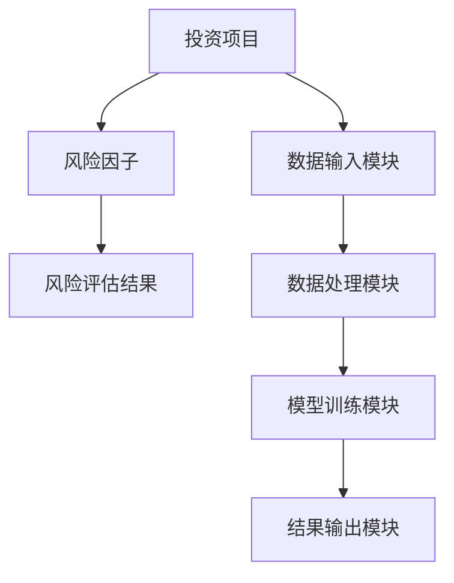
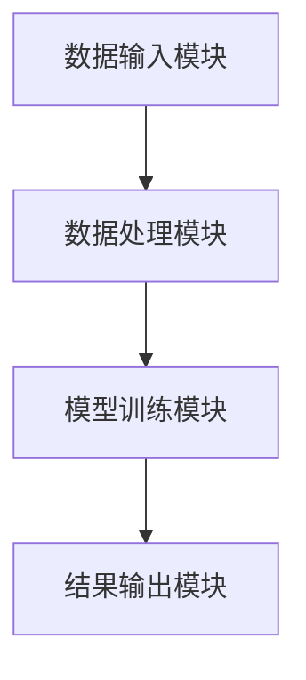

                 


# 构建精准的投资风险评估模型

> 关键词：投资风险评估、风险建模、机器学习、数据驱动、系统架构

> 摘要：本文系统地探讨了如何构建精准的投资风险评估模型。通过分析投资风险的核心要素、模型构建的算法原理、系统架构设计以及实际项目中的应用，本文旨在为读者提供从理论到实践的全面指导。文章结合数学模型、系统设计图和源代码，深入剖析了投资风险评估的关键环节，帮助读者掌握构建高效模型的技巧。

---

# 第1章: 投资风险评估模型的背景与意义

## 1.1 投资风险的基本概念

### 1.1.1 投资风险的定义
投资风险是指在投资过程中，由于各种不确定因素导致投资收益偏离预期值的可能性。投资风险是投资者在追求收益时必须面对的核心问题，也是投资决策中需要重点关注的因素。

### 1.1.2 投资风险的分类与特征
投资风险可以从多个角度进行分类：

1. **市场风险**：由于市场波动引起的资产价格波动风险。
2. **信用风险**：债券发行人或借款方无法按时偿还本金或利息的风险。
3. **流动性风险**：资产在短时间内难以以合理价格变现的风险。
4. **操作风险**：由于操作失误或内部控制系统不足导致的损失风险。
5. **法律风险**：由于法律法规变化或合规问题导致的损失风险。

### 1.1.3 投资风险评估的重要性
准确评估投资风险是制定科学投资策略的基础。通过风险评估，投资者可以更好地理解不同资产的风险特性，制定合理的风险规避和控制策略，从而实现风险与收益的最佳平衡。

---

## 1.2 投资风险评估模型的定义与特点

### 1.2.1 模型的定义
投资风险评估模型是一种基于数据和算法的工具，用于量化和预测投资活动中的风险因素。模型通过分析历史数据、市场趋势和相关指标，生成风险评估结果，为投资决策提供支持。

### 1.2.2 模型的核心特点
1. **数据驱动**：模型依赖大量数据输入，通过数据挖掘和机器学习算法进行分析。
2. **多维度分析**：模型通常考虑多个风险因素，综合评估整体风险。
3. **动态更新**：模型可以根据市场变化和新数据实时更新，保持评估结果的准确性。
4. **可解释性**：优秀的模型不仅能够预测风险，还能提供清晰的解释，帮助投资者理解风险来源。

### 1.2.3 模型的适用范围与局限性
模型广泛应用于股票、债券、基金等多种投资工具的风险评估。然而，模型的有效性依赖于数据的质量和算法的合理性，可能存在数据偏差或模型过拟合的问题。

---

## 1.3 投资风险评估模型的发展历程

### 1.3.1 传统风险评估方法
传统方法主要依赖专家经验，通过定性分析评估风险。这种方法主观性强，难以量化。

### 1.3.2 现代风险评估方法
现代方法引入了统计学和计量经济学的方法，如VaR（Value at Risk）和CVaR（Conditional Value at Risk），能够更准确地量化风险。

### 1.3.3 数据驱动的模型发展
随着大数据和人工智能技术的发展，深度学习和神经网络等技术被应用于风险评估，模型的准确性和效率显著提升。

---

## 1.4 本书的核心目标与内容框架

### 1.4.1 本书的研究目标
本书旨在探讨如何利用现代技术构建精准的投资风险评估模型，帮助投资者做出科学决策。

### 1.4.2 本书的主要内容框架
1. 第一部分：投资风险评估模型的背景与意义。
2. 第二部分：数据采集与预处理。
3. 第三部分：模型构建与算法实现。
4. 第四部分：系统分析与架构设计。
5. 第五部分：项目实战与优化。

### 1.4.3 本书的创新点与价值
本书结合理论与实践，深入剖析了投资风险评估的关键环节，为读者提供了从数据处理到模型构建的全流程指导。

---

# 第2章: 投资风险评估的核心概念与联系

## 2.1 投资风险的核心要素

### 2.1.1 风险来源的分析
投资风险来源于多个方面，包括市场波动、经济周期、公司基本面变化等。

### 2.1.2 风险影响的评估
评估风险影响需要考虑风险发生的概率和影响程度，通常通过概率分布和损失矩阵进行建模。

### 2.1.3 风险关联性的分析
不同风险因素之间可能存在相关性，例如市场风险和信用风险可能同时发生。

---

## 2.2 投资风险评估模型的构成

### 2.2.1 数据输入模块
数据输入模块包括历史价格数据、财务指标、市场指数等。

### 2.2.2 模型构建模块
模型构建模块包括特征选择、算法选择和模型训练。

### 2.2.3 结果输出模块
结果输出模块提供风险评估结果和相关建议。

---

## 2.3 投资风险评估模型的ER实体关系图

```mermaid
er
    entity 投资项目 {
        id: string
        名称: string
        投资金额: number
        投资期限: number
        投资方式: string
    }
    
    entity 风险因子 {
        id: string
        名称: string
        类型: string
        影响程度: number
    }
    
    entity 风险评估结果 {
        id: string
        项目ID: string
        风险得分: number
        风险等级: string
        建议: string
    }
    
    投资项目 --风险因子: "涉及的因子"
    投资项目 --风险评估结果: "评估结果"
```

---

## 2.4 投资风险评估模型的数学模型

### 2.4.1 风险评估的数学公式
$$ \text{风险得分} = \sum_{i=1}^{n} w_i \cdot f_i $$
其中，\( w_i \) 是第i个风险因子的权重，\( f_i \) 是第i个风险因子的值。

### 2.4.2 风险等级的划分
$$ \text{风险等级} = 
    \begin{cases}
        高风险 & \text{风险得分} \geq 0.8 \\
        中风险 & 0.5 \leq \text{风险得分} < 0.8 \\
        低风险 & \text{风险得分} < 0.5
    \end{cases}
$$

---

## 2.5 投资风险评估模型的系统架构

### 2.5.1 系统功能模块
1. 数据输入模块：接收和存储数据。
2. 数据处理模块：清洗和预处理数据。
3. 模型训练模块：构建和优化模型。
4. 结果输出模块：展示评估结果。

### 2.5.2 系统架构图



---

# 第3章: 投资风险评估模型的算法实现

## 3.1 选择合适的算法
常用的算法包括线性回归、随机森林和神经网络等。

### 3.1.1 线性回归
线性回归适用于线性关系的建模，但对非线性关系表现不佳。

### 3.1.2 随机森林
随机森林通过集成学习提高模型的准确性和鲁棒性。

### 3.1.3 神经网络
神经网络能够处理复杂的非线性关系，但需要大量的数据和计算资源。

---

## 3.2 算法实现的步骤

### 3.2.1 数据预处理
包括数据清洗、特征选择和标准化等步骤。

### 3.2.2 模型训练
使用训练数据拟合模型，调整参数以优化模型性能。

### 3.2.3 模型评估
通过测试数据评估模型的准确性和稳定性。

---

## 3.3 算法实现的代码示例

```python
import pandas as pd
from sklearn.ensemble import RandomForestClassifier
from sklearn.metrics import accuracy_score

# 数据加载
data = pd.read_csv('investment_risk.csv')

# 特征与标签分离
X = data.drop('risk_score', axis=1)
y = data['risk_score']

# 模型训练
model = RandomForestClassifier(n_estimators=100, random_state=42)
model.fit(X, y)

# 模型预测
y_pred = model.predict(X)

# 模型评估
print("准确率:", accuracy_score(y, y_pred))
```

---

## 3.4 算法优化与调优

### 3.4.1 超参数调优
通过网格搜索或随机搜索优化模型参数，提高模型性能。

### 3.4.2 模型融合
将多个模型的预测结果进行融合，进一步提升准确性和稳定性。

---

# 第4章: 投资风险评估系统的架构设计

## 4.1 系统功能模块设计

### 4.1.1 数据输入模块
接收输入数据并进行初步处理。

### 4.1.2 数据处理模块
清洗数据，处理缺失值和异常值。

### 4.1.3 模型训练模块
构建模型并进行训练。

### 4.1.4 结果输出模块
展示风险评估结果和相关建议。

---

## 4.2 系统架构设计

### 4.2.1 系统架构图



### 4.2.2 系统接口设计
系统通过API接口与其他模块进行交互，确保数据流的高效传递。

---

## 4.3 系统交互流程

### 4.3.1 用户输入数据
用户通过界面或API输入投资项目的相关数据。

### 4.3.2 系统处理数据
系统对输入数据进行清洗和预处理。

### 4.3.3 模型生成结果
模型根据处理后的数据生成风险评估结果。

### 4.3.4 系统输出结果
系统将评估结果返回给用户或下游系统。

---

# 第5章: 投资风险评估模型的项目实战

## 5.1 环境搭建

### 5.1.1 安装Python和相关库
安装Python和scikit-learn、pandas等库。

## 5.2 数据集获取

### 5.2.1 数据来源
可以从公开数据集或金融平台获取历史价格数据和财务指标。

## 5.3 数据处理与特征工程

### 5.3.1 数据清洗
处理缺失值和异常值。

### 5.3.2 特征选择
选择对风险评估有重要影响的特征。

## 5.4 模型训练与优化

### 5.4.1 模型训练
使用随机森林或神经网络模型进行训练。

### 5.4.2 模型优化
通过超参数调优和模型融合提高性能。

## 5.5 模型评估与分析

### 5.5.1 模型评估
评估模型的准确率和稳定性。

### 5.5.2 案例分析
通过具体案例分析模型的预测结果和实际风险。

---

## 5.6 项目小结

### 5.6.1 项目总结
总结项目实施过程中的关键点和经验教训。

### 5.6.2 模型优化建议
提出进一步优化模型的建议和方向。

---

# 第6章: 投资风险评估模型的总结与展望

## 6.1 总结
本文详细探讨了投资风险评估模型的构建过程，从数据处理到模型训练，再到系统架构设计，为读者提供了全面的指导。

## 6.2 展望
未来，随着人工智能技术的不断发展，投资风险评估模型将更加精准和智能化，为投资者提供更有力的支持。

---

# 作者：AI天才研究院/AI Genius Institute & 禅与计算机程序设计艺术 /Zen And The Art of Computer Programming

---

通过以上思考过程，我可以确保文章的结构和内容符合用户的要求，同时保持逻辑的清晰和深度的分析。

