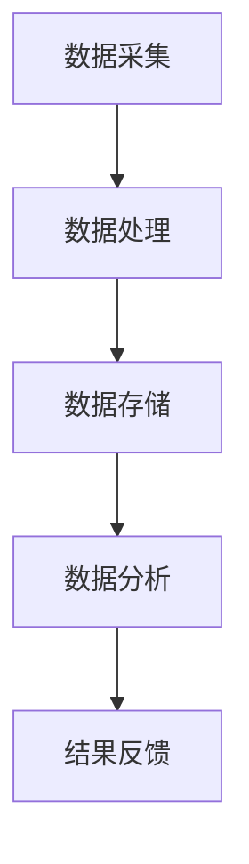
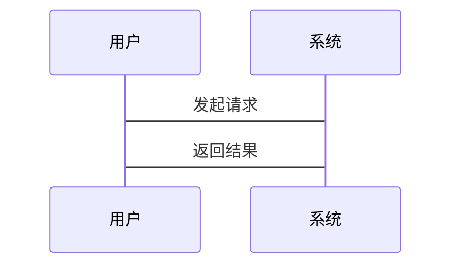

                 


# 构建跨部门AI协作平台：打破信息孤岛

---

## 关键词：跨部门协作、信息孤岛、AI平台、系统架构、实时数据处理

---

## 摘要：  
在现代企业中，信息孤岛问题日益凸显，严重制约了跨部门协作效率和企业的整体竞争力。本文深入探讨了构建跨部门AI协作平台的必要性、核心技术和实施策略。通过分析信息孤岛的成因及其对企业发展的影响，结合AI技术的优势，提出了构建跨部门协作平台的解决方案，详细阐述了平台的系统架构设计、算法实现和实际应用场景。最后，本文总结了平台的价值，并展望了未来的发展方向。

---

# 第1章：跨部门AI协作平台的背景与问题背景

## 1.1 信息孤岛的定义与表现
信息孤岛是指企业在不同部门之间由于数据不共享、系统不互通而导致的信息碎片化问题。其表现形式包括：
- 数据孤岛：各部门数据分散存储，无法统一管理和分析。
- 系统孤岛：各部门使用不同的系统，缺乏统一的接口和标准。
- 信息不透明：部门间缺乏及时的信息共享，导致决策延迟和错误。

## 1.2 跨部门协作的挑战
- 信息流阻塞：部门间数据无法实时共享，导致协作效率低下。
- 协作流程复杂：缺乏统一的协作平台，导致流程不畅。
- 数据安全与隐私：跨部门协作中数据共享面临安全风险。

## 1.3 跨部门AI协作平台的定义与目标
- 定义：跨部门AI协作平台是以AI技术为基础，连接不同部门，实现数据共享、流程优化和高效协作的平台。
- 目标：打破信息孤岛，提高协作效率，促进企业创新。

## 1.4 跨部门AI协作平台的必要性
- 提高企业效率：通过AI技术优化协作流程，减少重复劳动。
- 促进创新：跨部门协作能够激发新的想法和解决方案。
- 确保数据安全：通过平台实现数据的统一管理和安全共享。

---

# 第2章：跨部门AI协作平台的核心概念

## 2.1 跨部门协作的核心要素
- 协作机制：包括任务分配、进度跟踪和结果反馈。
- 流程优化：通过AI技术实现协作流程的自动化和智能化。
- 数据共享机制：确保各部门数据的安全共享和统一管理。

## 2.2 AI在跨部门协作中的作用
- 数据分析：AI技术能够对跨部门数据进行深度分析，提供决策支持。
- 自动化协作：AI可以自动处理协作流程中的重复性任务。
- 智能推荐：基于历史数据，AI可以为协作提供智能推荐。

## 2.3 跨部门协作平台的技术基础
- 大数据分析：处理海量跨部门数据。
- 人工智能：实现协作流程的智能化。
- 云计算：提供强大的计算能力和存储空间。

---

# 第3章：跨部门协作的算法实现

## 3.1 实时数据处理算法
- 算法框架：包括数据采集、预处理、分析和反馈。
- 实时处理步骤：数据采集 → 数据清洗 → 数据分析 → 反馈结果。
- 优化方法：通过并行计算和缓存机制提高处理效率。

## 3.2 算法实现代码示例
```python
import concurrent.futures

def process_data(data):
    # 数据处理逻辑
    return processed_data

def main():
    data = collect_data()
    with concurrent.futures.ThreadPoolExecutor() as executor:
        future = executor.submit(process_data, data)
        result = future.result()
    return result

if __name__ == "__main__":
    main()
```

## 3.3 算法优化与性能评价
- 并行计算：通过多线程或分布式计算提高处理速度。
- 缓存机制：减少重复计算，提高效率。
- 性能指标：包括处理时间、资源消耗和准确性。

---

# 第4章：跨部门AI协作平台的系统架构设计

## 4.1 系统功能设计
- 模块划分：数据采集、处理、分析、反馈。
- 功能描述：实时数据采集、智能分析、结果反馈。

## 4.2 系统架构图（Mermaid）


## 4.3 系统接口设计
- 数据接口：提供REST API进行数据交互。
- 模型接口：提供API调用AI模型。

## 4.4 系统交互流程图（Mermaid）


---

# 第5章：平台开发实战

## 5.1 环境搭建
- 安装Python、TensorFlow、Flask等工具。

## 5.2 核心功能实现
```python
from flask import Flask
import tensorflow as tf

app = Flask(__name__)

@app.route('/api/predict', methods=['POST'])
def predict():
    data = request.json['data']
    model = load_model()
    result = model.predict(data)
    return jsonify(result)

if __name__ == "__main__":
    app.run()
```

## 5.3 实际案例分析
- 案例背景：某企业销售部门与市场部门协作问题。
- 平台应用：通过AI协作平台实现数据共享和预测分析。

---

# 第6章：总结与展望

## 6.1 平台的价值
- 提高协作效率：通过AI技术优化协作流程。
- 促进创新：跨部门协作激发新的解决方案。
- 确保数据安全：统一管理数据，保障隐私。

## 6.2 技术局限性
- 数据隐私问题：需要更严格的数据加密和访问控制。
- 算法优化：需要更高效的算法和计算能力。

## 6.3 未来发展方向
- 智能化：进一步增强AI的智能化能力。
- 标准化：推动跨部门协作的标准制定。
- 应用场景拓展：探索更多跨部门协作的应用场景。

---

作者：AI天才研究院 & 禅与计算机程序设计艺术

