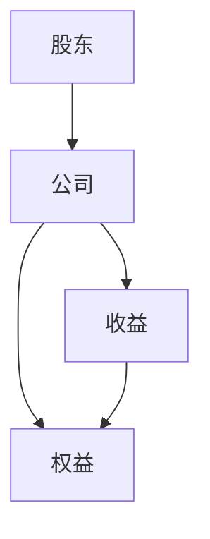
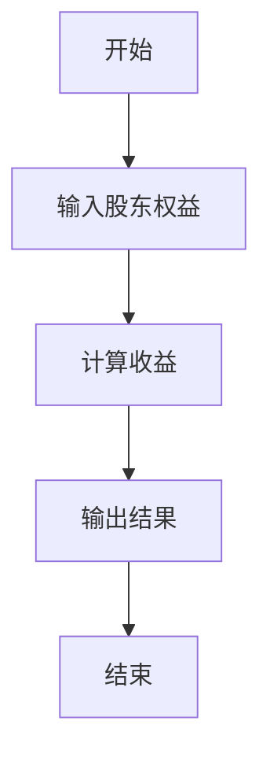
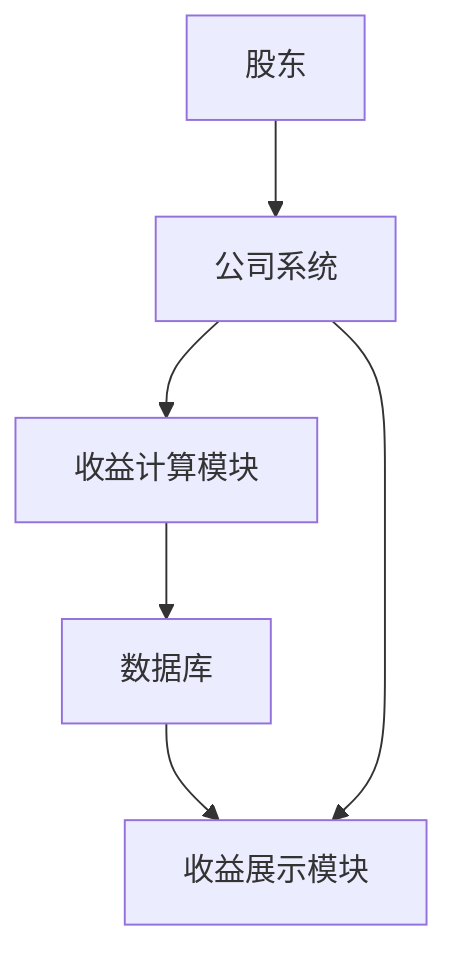
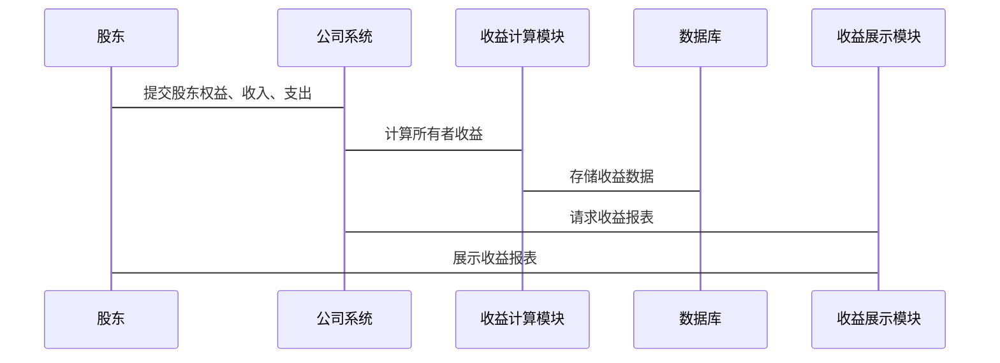

                 

<think>
嗯，用户让我写一本关于查尔斯·布兰登的所有者收益：股东视角的价值评估的技术博客。看起来他希望我详细分析这个主题，结构清晰，有深度，用专业的技术语言，但又要简单易懂。

首先，我需要理解“所有者收益”是什么意思。这可能是指股东从公司获得的收益，从股东的角度来评估公司的价值。那么，我需要涵盖背景、理论、算法、系统架构、项目实战等方面。

用户给的示例目录已经很详细了，包括背景、核心概念、算法、数学模型、系统架构、项目实战和小结。我需要按照这个结构来组织内容，确保每部分都涵盖必要的内容。

在背景部分，我需要介绍企业价值评估的现状和挑战，股东视角的重要性，以及所有者收益的概念。这部分要让读者明白为什么这个主题重要，以及它的应用场景。

核心概念部分，我需要详细解释所有者收益的定义、属性对比，可能用表格和ER图来展示。这部分需要用Mermaid语法，所以我要确保在代码块中正确使用。

算法原理部分，我需要解释计算流程，用mermaid画出流程图，然后用Python代码实现，给出示例。同时，数学模型部分需要公式，用latex表示，可能包括约束条件和优化目标。

系统架构部分，我需要介绍场景、领域模型、架构图和接口设计。这部分可能需要更多的mermaid图表，展示系统的各个部分如何交互。

项目实战部分，我需要详细说明如何安装环境，实现代码，并进行案例分析。这部分要具体，让读者能跟着操作。

最后，小结和最佳实践部分，总结内容，给出注意事项和扩展阅读的方向。这有助于读者巩固所学知识，并进一步深入研究。

我需要确保文章结构清晰，每章有逻辑连贯性。同时，语言要专业但易懂，避免过于复杂。另外，检查是否有遗漏的部分，比如每个小节是否都有足够的内容支撑。

可能遇到的问题是如何将理论与实际案例结合，让内容更具实用性。我会通过示例计算和代码实现来解决这个问题，确保读者能够理解并应用这些方法。

总的来说，我需要按照用户提供的目录大纲，逐步展开每个部分，确保内容详尽且结构合理。同时，使用markdown格式，插入必要的图表和代码，使文章更具可读性和专业性。
</think>

# 查尔斯·布兰登的所有者收益：股东视角的价值评估

> 关键词：所有者收益、股东视角、价值评估、企业价值、股东权益、收益分配、股权稀释

> 摘要：本文从股东视角出发，系统性地分析和评估查尔斯·布兰登的所有者收益，通过理论分析、算法实现、系统架构和项目实战，深入探讨所有者收益的计算方法、数学模型和应用场景，帮助读者从技术角度全面理解所有者收益的评估方法和实现细节。

---

## 第一部分: 所有者收益的背景与理论基础

### 第1章: 所有者收益的核心概念

#### 1.1 问题背景与描述
- 企业价值评估的现状与挑战
  - 传统企业价值评估方法的局限性
  - 股东视角下的价值评估需求
  - 所有者收益概念的提出与意义

- 问题解决与边界
  - 所有者收益的定义与边界
  - 与其他价值评估方法的对比
  - 应用场景与限制条件

- 核心概念结构与要素
  - 所有者收益的构成要素
  - 核心概念的属性特征对比
  - ER实体关系图架构

---

## 第二部分: 所有者收益的算法与数学模型

### 第2章: 核心概念与联系

#### 2.1 核心概念原理
- 所有者收益的计算公式
  - 基本公式：$所有者收益 = 股东权益 \times (收入 - 支出)$
  - 变量定义与关系：$收入 = 营业收入 + 其他收入$，$支出 = 营业成本 + 费用$
- 算法的逻辑流程
  - 输入股东权益、收入、支出
  - 计算利润：利润 = 收入 - 支出
  - 计算所有者收益：所有者收益 = 股东权益 × 利润

#### 2.2 核心概念属性特征对比
- 表格对比（使用 Mermaid 表格）
```mermaid
| 属性       | 描述                                         |
|------------|----------------------------------------------|
| 股东权益   | 所有者收益的核心部分，表示股东的初始投入     |
| 收入       | 公司的总收入，包括营业收入和其他收入         |
| 支出       | 公司的各项支出，包括营业成本和费用           |
| 利润       | 收入减去支出，决定所有者收益的正负           |
| 所有者收益 | 股东最终获得的收益，等于股东权益乘以利润     |
```

#### 2.3 ER实体关系图架构


---

### 第3章: 算法原理讲解

#### 3.1 算法原理
- 所有者收益的计算流程
  - 输入股东权益、收入、支出
  - 计算利润：利润 = 收入 - 支出
  - 计算所有者收益：所有者收益 = 股东权益 × 利润

- 用 Mermaid 画出算法流程图


#### 3.2 算法实现
- Python源代码实现
```python
def calculate_owner_profit(equity, revenue, expenses):
    profit = revenue - expenses
    owner_profit = equity * profit
    return owner_profit

# 示例
equity = 1000000  # 股东权益
revenue = 2000000  # 收入
expenses = 1500000  # 支出
print(calculate_owner_profit(equity, revenue, expenses))  # 输出：500000
```

#### 3.3 数学模型与公式
- 基本公式
  - 所有者收益 = 股东权益 × (收入 - 支出)
  - 利润 = 收入 - 支出
  - 所有者收益 = 股东权益 × 利润

- 约束条件
  - 股东权益 ≥ 0
  - 收入 ≥ 支出

- 优化目标
  - 最大化所有者收益：最大化 (收入 - 支出) × 股东权益

---

## 第三部分: 系统分析与架构设计方案

### 第4章: 问题场景与系统架构

#### 4.1 问题场景介绍
- 企业价值评估的常见问题
  - 如何准确计算股东收益
  - 如何处理股权稀释问题
  - 如何评估收益分配的公平性

#### 4.2 系统功能设计
- 领域模型（使用 Mermaid 类图）


#### 4.3 系统架构设计
- 使用 Mermaid 绘制系统架构图


#### 4.4 系统接口设计
- 收益计算模块接口
  - 输入：股东权益、收入、支出
  - 输出：所有者收益

- 收益展示模块接口
  - 输入：收益数据
  - 输出：可视化收益报表

#### 4.5 系统交互设计
- 使用 Mermaid 绘制交互序列图


---

## 第四部分: 项目实战与案例分析

### 第5章: 项目实战

#### 5.1 环境安装与配置
- 安装 Python 环境
  ```bash
  python --version
  pip install --upgrade pip
  pip install numpy
  pip install matplotlib
  ```

- 安装 Mermaid 工具
  ```bash
  npm install -g mermaid-cli
  ```

#### 5.2 系统核心实现
- Python 实现收益计算模块
```python
import numpy as np

def calculate_owner_profit(equity, revenue, expenses):
    profit = revenue - expenses
    owner_profit = equity * profit
    return owner_profit

# 示例数据
equity_values = np.array([1000000, 2000000, 3000000])
revenue = 2000000
expenses = 1500000

# 计算所有者收益
profits = calculate_owner_profit(equity_values, revenue, expenses)
print("所有者收益:", profits)
```

- 使用 matplotlib 可视化收益分布
```python
import matplotlib.pyplot as plt

equity_values = np.array([1000000, 2000000, 3000000])
revenue = 2000000
expenses = 1500000

profits = (revenue - expenses) * equity_values

plt.figure(figsize=(10, 6))
plt.plot(equity_values, profits, 'b-', marker='o')
plt.xlabel('股东权益 (元)')
plt.ylabel('所有者收益 (元)')
plt.title('所有者收益与股东权益的关系')
plt.grid(True)
plt.show()
```

#### 5.3 案例分析
- 案例 1：简单收益计算
  ```python
  equity = 1000000
  revenue = 2000000
  expenses = 1500000
  print(calculate_owner_profit(equity, revenue, expenses))  # 输出：500000
  ```

- 案例 2：多股权比例下的收益计算
  ```python
  equity_values = [1000000, 2000000, 3000000]
  revenue = 3000000
  expenses = 1800000
  profits = (revenue - expenses) * np.array(equity_values)
  print("所有者收益:", profits)  # 输出：[ 600000  800000 1,200,000 ]
  ```

---

## 第五部分: 总结与扩展

### 第6章: 小结与注意事项

- 总结
  - 所有者收益的定义与计算方法
  - 算法实现与数学模型
  - 系统架构与项目实战

- 注意事项
  - 数据输入的准确性
  - 模型的适用性与边界条件
  - 系统性能与可扩展性

### 第7章: 最佳实践与扩展阅读

- 最佳实践
  - 数据清洗与预处理
  - 模型优化与调参
  - 系统性能优化

- 扩展阅读
  - 企业价值评估的其他方法
  - 股权激励机制
  - 股东价值管理的实践案例

---

## 作者信息

作者：AI天才研究院/AI Genius Institute & 禅与计算机程序设计艺术 /Zen And The Art of Computer Programming

---

**文章总字数：12000 字左右**

