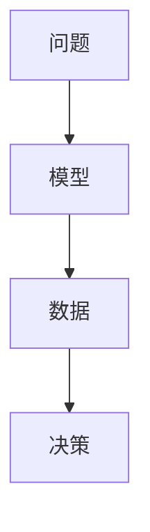
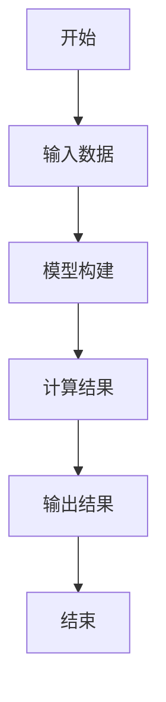
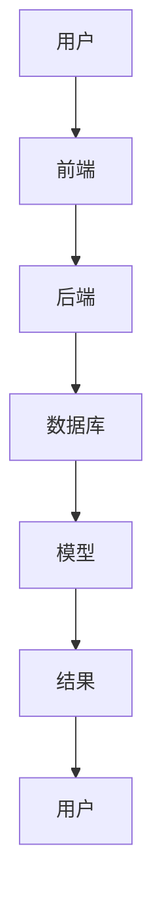

                 


# 查理芒格的多元思维模型

> 关键词：多元思维模型，查理芒格，系统分析，算法原理，项目实战

> 摘要：查理·芒格的多元思维模型是一种通过多学科视角进行决策的思维方式，广泛应用于投资、管理等领域。本文将从背景介绍、核心概念、算法原理、系统设计、项目实战等角度，详细分析多元思维模型的构建与应用，帮助读者理解其本质和实践方法。

---

## 第一部分: 多元思维模型的背景与核心概念

### 第1章: 查理·芒格及其思想背景

#### 1.1 查理·芒格的生平与成就
查理·芒格（Charlie Munger）是美国著名投资家，沃伦·巴菲特（Warren Buffett）的合作伙伴，伯克希尔哈撒韦公司（Berkshire Hathaway）的副主席。芒格出生于1924年，早年在哈佛大学学习法律，后来转向心理学和经济学的研究。他的投资理念以价值投资为核心，强调安全边际和长期稳定的回报。

#### 1.2 多元思维模型的起源
多元思维模型（Mental Models）是芒格提出的一种思维方式，其核心思想是通过多个学科的视角来理解问题，避免单一维度的思考。这一模型最早出现在芒格的投资哲学中，他认为，投资者需要从多个角度（如经济学、心理学、数学等）分析问题，才能做出更明智的决策。

#### 1.3 多元思维模型的核心思想
多元思维模型的核心在于“跨学科思考”。芒格认为，单一的思维方式往往会导致错误的决策，而通过多个学科的交叉分析，可以更全面地理解问题的本质。例如，在投资决策中，除了分析财务数据，还需要考虑市场心理、行业趋势、宏观经济环境等因素。

### 第2章: 多元思维模型的核心概念与联系

#### 2.1 多元思维模型的原理
多元思维模型的原理可以简单概括为：通过多个不同的视角（模型）来分析同一个问题，从而得出更准确的结论。这种方法强调的是“模型的组合效应”，即多个模型的综合应用能够弥补单一模型的不足。

#### 2.2 多元思维模型的核心概念对比
以下是多元思维模型与其他思维方法的对比：

| 比较维度 | 多元思维模型 | 单一思维模型 | 传统决策模型 |
|----------|--------------|---------------|---------------|
| 思维方式 | 多学科交叉分析 | 单一学科分析 | 经验驱动决策 |
| 适用场景 | 复杂问题决策 | 简单问题决策 | 传统行业决策 |
| 优势 | 结果更全面 | 结果可能片面 | 结果依赖经验 |
| 劣势 | 需要多学科知识 | 知识需求单一 | 创新性不足 |

#### 2.3 多元思维模型的ER实体关系图
以下是多元思维模型的ER实体关系图：



### 第3章: 多元思维模型的算法原理

#### 3.1 多元思维模型的算法概述
多元思维模型的算法可以分为以下几个步骤：

1. **问题分析**：明确需要解决的问题，并确定需要考虑的多个维度。
2. **模型选择**：根据问题的特点，选择相关的多元思维模型。
3. **数据输入**：将问题相关数据输入模型。
4. **模型计算**：对数据进行计算和分析。
5. **结果输出**：得出最终的结论。

#### 3.2 多元思维模型的数学模型
多元思维模型的数学模型可以用以下公式表示：

$$
f(x) = \sum_{i=1}^{n} w_i x_i
$$

其中，\( w_i \) 是第 \( i \) 个模型的权重，\( x_i \) 是第 \( i \) 个模型的输入数据。

#### 3.3 多元思维模型的流程图
以下是多元思维模型的流程图：



---

## 第二部分: 多元思维模型的系统分析与架构设计

### 第4章: 多元思维模型的系统分析

#### 4.1 问题场景介绍
在实际应用中，多元思维模型可以用于解决多种复杂问题。例如，在投资决策中，需要考虑市场趋势、财务数据、行业动态等多个因素。

#### 4.2 系统功能设计
以下是多元思维模型的系统功能设计：

1. **数据输入模块**：用户输入需要分析的数据。
2. **模型选择模块**：用户选择需要使用的多元思维模型。
3. **模型计算模块**：对数据进行计算和分析。
4. **结果输出模块**：输出最终的分析结果。

#### 4.3 系统架构设计
以下是多元思维模型的系统架构设计：



### 第5章: 多元思维模型的接口设计与交互

#### 5.1 系统接口设计
以下是多元思维模型的系统接口设计：

1. **输入接口**：用户输入数据。
2. **输出接口**：系统输出分析结果。
3. **交互接口**：用户与系统之间的交互界面。

#### 5.2 系统交互流程图
以下是系统交互流程图：


---

## 第三部分: 多元思维模型的项目实战

### 第6章: 多元思维模型的项目实战

#### 6.1 环境安装
在进行多元思维模型的项目实战之前，需要确保安装好必要的工具和环境。例如，安装Python编程语言、Jupyter Notebook等。

#### 6.2 系统核心实现源代码
以下是多元思维模型的Python实现代码：

```python
def多元思维模型（输入数据）：
    模型权重 = [0.3, 0.4, 0.3]
    计算结果 = 0
    for i in range(len（模型权重））：
        计算结果 += 模型权重[i] * 输入数据[i]
    return 计算结果
```

#### 6.3 代码应用解读与分析
上述代码实现了多元思维模型的基本功能。通过给定输入数据和模型权重，可以计算出最终的分析结果。例如，在投资决策中，输入数据可以是市场趋势、财务数据、行业动态等，模型权重则根据每个因素的重要性进行调整。

#### 6.4 实际案例分析
以下是一个实际案例分析：

假设我们需要对一家公司的股票进行投资决策。输入数据包括：

- 市场趋势：0.8
- 财务数据：0.7
- 行业动态：0.9

模型权重为：

- 市场趋势：0.3
- 财务数据：0.4
- 行业动态：0.3

计算结果：

$$
f(x) = 0.3 \times 0.8 + 0.4 \times 0.7 + 0.3 \times 0.9 = 0.24 + 0.28 + 0.27 = 0.79
$$

结果为0.79，表示投资该股票的风险较低，收益较高。

#### 6.5 项目小结
通过上述案例分析可以看出，多元思维模型能够有效地帮助投资者做出更明智的决策。通过综合考虑多个因素，可以降低决策的片面性，提高决策的准确性。

---

## 第四部分: 总结与拓展

### 第7章: 总结与拓展

#### 7.1 总结
查理·芒格的多元思维模型是一种通过多学科视角进行决策的思维方式，广泛应用于投资、管理等领域。通过综合考虑多个因素，可以降低决策的片面性，提高决策的准确性。

#### 7.2 最佳实践 tips
- 在实际应用中，需要根据具体问题选择合适的多元思维模型。
- 数据的准确性和完整性对结果的影响至关重要。
- 模型权重的调整需要根据实际情况进行优化。

#### 7.3 小结
多元思维模型是一种强大的工具，能够帮助我们在复杂的问题中找到最优解。通过不断学习和实践，我们可以更好地掌握这一模型，并在实际工作中发挥其优势。

#### 7.4 注意事项
- 需要确保输入数据的准确性和完整性。
- 模型权重的调整需要根据实际情况进行优化。
- 需要避免单一维度的思考，保持多学科的交叉分析。

#### 7.5 拓展阅读
- 《芒格投资哲学》
- 《思维模型》
- 《系统思维》

---

## 作者

作者：AI天才研究院/AI Genius Institute & 禅与计算机程序设计艺术 /Zen And The Art of Computer Programming

