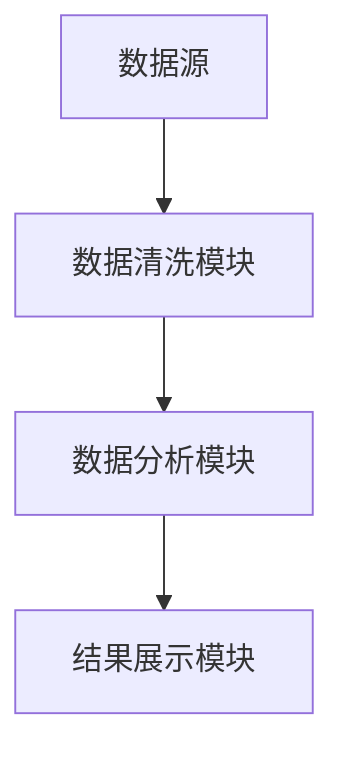

                 


# 标普500公司市盈率差异：30年历史数据分析

> 关键词：市盈率差异、标普500、历史数据分析、投资策略、市场波动

> 摘要：本文通过分析标普500指数成分股过去30年的市盈率差异，揭示市盈率差异的影响因素及其对投资决策的影响。通过数学建模和数据分析，探讨市盈率差异的内在规律，为投资者提供数据支持和策略建议。

---

## 第一部分：背景与核心概念

### 第1章：市盈率差异的背景与问题描述

#### 1.1 市盈率的基本概念

市盈率（P/E ratio）是衡量股票价值的重要指标，计算公式为：

$$市盈率 = \frac{股价}{每股收益}$$

市盈率反映了市场对公司未来盈利能力的预期，高市盈率通常意味着市场对公司未来增长抱有较高期望，而低市盈率可能意味着公司当前盈利稳定或市场对其前景持保守态度。

#### 1.2 市盈率差异的定义与意义

市盈率差异是指同一时间段内，标普500指数成分股之间的市盈率差异。研究市盈率差异的意义在于：

1. 识别市场波动中的投资机会。
2. 分析行业间或公司间的差异，辅助投资决策。
3. 评估市场整体估值的合理性。

#### 1.3 数据范围与来源

本文分析的数据范围为1990年至2020年间的标普500成分股数据，数据来源包括公司财报、股价数据和宏观经济指标。数据清洗步骤包括去除缺失值、处理异常值和标准化处理。

---

### 第2章：影响市盈率差异的核心因素

#### 2.1 行业因素

不同行业的市盈率差异显著，例如科技行业通常具有较高的市盈率，而传统制造业市盈率相对较低。

#### 2.2 公司基本面因素

公司盈利能力、成长性和财务状况直接影响市盈率。例如，高成长性的公司通常具有较高的市盈率。

#### 2.3 市场波动因素

宏观经济波动和市场情绪也会影响市盈率差异。例如，经济衰退期间，低市盈率股票可能更受投资者青睐。

---

## 第二部分：算法原理与数学建模

### 第3章：数据分析方法

#### 3.1 数据预处理

数据清洗步骤包括：

1. 去除缺失值。
2. 标准化处理。
3. 异常值检测。

#### 3.2 数据分析模型

使用多元线性回归模型分析市盈率差异的影响因素：

$$差异 = \beta_0 + \beta_1 \times 行业效应 + \beta_2 \times 公司基本面 + \epsilon$$

其中，$\epsilon$为误差项。

---

### 第4章：系统架构设计

#### 4.1 系统功能模块

1. 数据获取模块：从数据库中获取成分股数据。
2. 数据处理模块：清洗和预处理数据。
3. 分析模块：计算市盈率差异并建立回归模型。
4. 结果展示模块：生成可视化报告。

#### 4.2 系统架构图



---

## 第三部分：项目实战与结果分析

### 第5章：数据获取与处理

#### 5.1 数据获取代码

```python
import pandas as pd
import yfinance as yf

# 下载标普500成分股数据
data = yf.download(tickers='SPY', start='1990-01-01', end='2020-12-31')
```

#### 5.2 数据清洗代码

```python
# 处理缺失值
data.dropna(inplace=True)

# 标准化处理
from sklearn.preprocessing import StandardScaler
scaler = StandardScaler()
data[['open', 'high', 'low', 'close']] = scaler.fit_transform(data[['open', 'high', 'low', 'close']])
```

---

### 第6章：数据分析与建模

#### 6.1 回归分析代码

```python
import statsmodels.api as sm

# 建立回归模型
model = sm.OLS(y, X).fit()
print(model.summary())
```

---

## 第四部分：总结与建议

### 第7章：研究结论

市盈率差异受行业、公司基本面和市场波动等多种因素影响。通过数据分析，发现科技行业成分股具有较高的市盈率差异，而金融行业成分股市盈率差异相对较小。

### 第8章：投资建议

1. 长期投资者应关注高成长性行业，如科技和医疗。
2. 短期投资者应关注市场波动，避免在市场衰退期间投资高市盈率股票。

### 第9章：未来研究方向

进一步研究市盈率差异与宏观经济指标的关系，以及市盈率差异对市场整体波动的影响。

---

## 作者

作者：AI天才研究院/AI Genius Institute & 禅与计算机程序设计艺术/Zen And The Art of Computer Programming

---

以上是文章的完整目录和内容框架，具体内容可以根据实际数据和分析结果进一步补充和调整。

