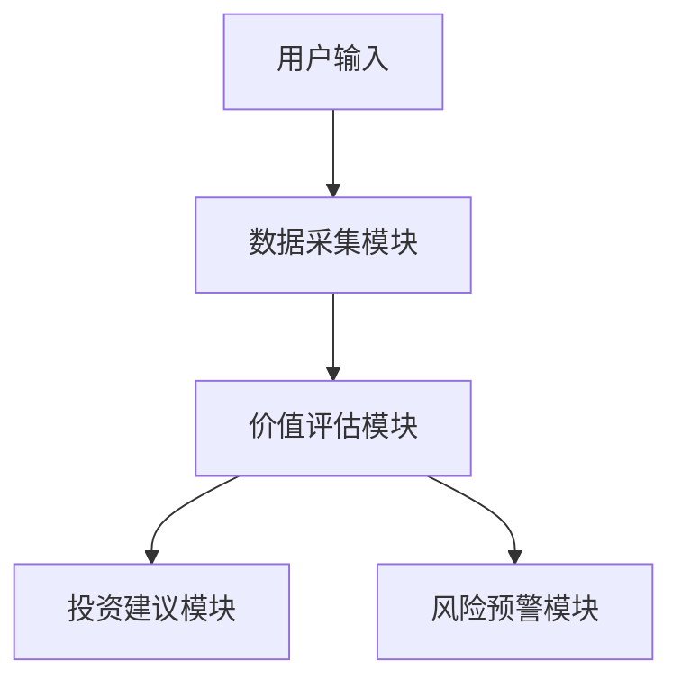

                 


# 格雷厄姆价值投资理念在元宇宙经济中的重新诠释

## 关键词：格雷厄姆价值投资，元宇宙经济，数字资产，虚拟货币，安全边际，内在价值，市场分析

## 摘要：  
本文系统地探讨了格雷厄姆价值投资理念在元宇宙经济中的应用与重新诠释。通过分析元宇宙经济体系的构成与特点，重新定义了安全边际、内在价值等核心概念，并结合实际案例，展示了如何在虚拟经济环境中运用价值投资策略。文章还构建了元宇宙经济的价值评估模型，并通过系统架构设计与算法实现，验证了理论的可行性与实际应用价值。

---

# 正文

## 第一部分：引言

### 1.1 元宇宙经济的背景与价值投资的结合

#### 1.1.1 元宇宙的定义与特征  
元宇宙（Metaverse）是一个虚拟的三维空间，通过区块链、增强现实（AR）、虚拟现实（VR）等技术构建，支持用户在虚拟世界中进行社交、交易、创作和投资等活动。其核心特征包括去中心化、沉浸式体验和经济系统自我运转。

#### 1.1.2 价值投资的基本概念与原则  
价值投资是由本杰明·格雷厄姆提出的一种投资策略，强调以低于内在价值的价格购买资产。核心理念包括安全边际、内在价值和市场分析。

#### 1.1.3 为什么将价值投资理念应用于元宇宙经济？  
元宇宙的经济体系与传统经济有相似之处，但也存在显著差异。将价值投资理念应用于元宇宙，可以帮助投资者在虚拟经济中识别高价值资产，降低投资风险。

### 1.2 格雷厄姆价值投资理念的核心要素

#### 1.2.1 安全边际的定义与重要性  
安全边际是资产的实际价值与市场价格之间的差额，确保在市场价格波动时仍能获得收益。

#### 1.2.2 内在价值的计算方法  
内在价值是资产在长期稳定状态下的合理价格，考虑了资产的盈利能力、现金流和市场地位等因素。

#### 1.2.3 市场先生的角色与市场波动  
市场先生是格雷厄姆用来描述市场波动的隐喻，投资者应利用市场波动，而非被其左右。

### 1.3 元宇宙经济中的投资机会与挑战

#### 1.3.1 元宇宙经济的基本构成  
元宇宙经济由虚拟货币、数字资产、虚拟商品和虚拟服务构成，形成了复杂的经济生态系统。

#### 1.3.2 数字资产与虚拟货币的特性  
数字资产具有可分割性、可编程性和全球性，虚拟货币则具备去中心化和匿名性特点。

#### 1.3.3 投资者在元宇宙中的角色与风险  
投资者需要理解元宇宙经济的运作机制，同时应对技术风险、市场波动和监管不确定性。

---

## 第二部分：格雷厄姆价值投资理念的核心原理

### 2.1 安全边际的重新定义

#### 2.1.1 安全边际的传统概念  
安全边际是市场价格低于内在价值的部分，确保投资的稳健性。

#### 2.1.2 元宇宙经济中的安全边际评估  
在元宇宙中，数字资产的内在价值需要考虑其在虚拟经济中的实际用途和需求。

#### 2.1.3 安全边际在数字资产中的应用  
投资者应选择市场价格远低于内在价值的数字资产，以确保投资的安全性。

### 2.2 内在价值的评估方法

#### 2.2.1 内在价值的传统计算模型  
内在价值是基于未来现金流的现值计算得出。

#### 2.2.2 元宇宙项目的价值评估框架  
元宇宙项目的价值评估需考虑用户基础、技术实现和商业模式等因素。

#### 2.2.3 数字资产的内在价值与市场价值对比  
内在价值是长期稳定的，而市场价值受短期因素影响较大。

### 2.3 市场波动与投资策略

#### 2.3.1 市场先生的波动性分析  
市场波动是投资机会的来源，投资者应利用波动而非被其困扰。

#### 2.3.2 元宇宙经济中的市场周期  
元宇宙经济存在周期性波动，投资者应识别市场周期并调整投资策略。

#### 2.3.3 投资策略的调整与优化  
投资者应根据市场变化和项目特性，动态调整投资组合。

---

## 第三部分：元宇宙经济体系的分析

### 3.1 元宇宙经济的基本构成

#### 3.1.1 数字资产的分类与特性  
数字资产包括虚拟货币、NFTs、游戏道具等，具有多样性和独特性。

#### 3.1.2 虚拟货币的经济功能与价值来源  
虚拟货币在元宇宙中充当交易媒介和价值存储工具，其价值来源于用户需求和网络效应。

#### 3.1.3 元宇宙中的经济系统设计  
元宇宙经济系统需要考虑供需关系、价格形成机制和货币政策设计。

### 3.2 虚拟货币与传统货币的对比

#### 3.2.1 货币的定义与功能  
货币是经济活动中的交换媒介和价值存储工具。

#### 3.2.2 虚拟货币与传统货币的异同  
虚拟货币具有去中心化和匿名性，而传统货币由中央银行发行，具有法律背书。

#### 3.2.3 元宇宙经济中的货币流通机制  
虚拟货币在元宇宙中流通，需考虑货币供应量和货币政策。

### 3.3 数字资产的价值评估模型

#### 3.3.1 数字资产价值评估的传统方法  
基于现金流折现法和相对估值法的传统评估方法。

#### 3.3.2 元宇宙数字资产的特殊性  
数字资产的价值受用户参与度和平台生态影响。

#### 3.3.3 综合评估模型的构建  
结合传统方法与元宇宙经济特性，构建综合评估模型。

---

## 第四部分：价值投资理念在元宇宙经济中的应用

### 4.1 元宇宙经济中的价值评估框架

#### 4.1.1 安全边际的重新定义  
在元宇宙中，安全边际需考虑技术风险和市场波动。

#### 4.1.2 内在价值的动态评估  
数字资产的内在价值受用户行为和技术发展影响，需动态评估。

#### 4.1.3 投资策略的优化与调整  
根据市场变化和项目特性，优化投资组合。

### 4.2 元宇宙经济中的风险管理

#### 4.2.1 技术风险的评估与管理  
考虑技术更新和平台稳定性对投资的影响。

#### 4.2.2 市场风险的识别与应对  
识别市场波动和价格波动带来的风险。

#### 4.2.3 投资组合的分散策略  
通过分散投资降低风险，提高收益稳定性。

### 4.3 数字资产的长期投资策略

#### 4.3.1 长期价值的识别  
寻找具有长期增长潜力的数字资产。

#### 4.3.2 投资时间窗口的选择  
选择合适的持有期，平衡收益与流动性。

#### 4.3.3 价值投资的耐心与纪律  
坚持价值投资理念，避免短期波动干扰。

---

## 第五部分：系统分析与架构设计

### 5.1 元宇宙经济的价值评估模型

#### 5.1.1 模型构建的背景与目标  
构建一个适用于元宇宙经济的价值评估模型，帮助投资者识别高价值资产。

#### 5.1.2 模型的输入与输出  
输入包括数字资产的基本信息、市场数据和用户行为数据，输出为资产的内在价值和安全边际。

#### 5.1.3 模型的数学表达  
$$ V = \frac{CF}{r - g} $$  
其中，V为内在价值，CF为未来现金流，r为折现率，g为增长率。

### 5.2 元宇宙经济的系统架构设计

#### 5.2.1 系统功能设计  
系统包括数据采集、价值评估、投资建议和风险预警模块。

#### 5.2.2 系统架构图  


#### 5.2.3 系统接口设计  
API接口用于数据输入和结果输出，方便与其他系统集成。

#### 5.2.4 系统交互流程  
用户输入数据，系统进行评估并生成建议，用户根据建议进行投资决策。

---

## 第六部分：项目实战与案例分析

### 6.1 价值评估模型的实现

#### 6.1.1 环境安装与配置  
安装Python和相关库，配置开发环境。

#### 6.1.2 核心代码实现  
```python
def calculate_intrinsic_value(cash_flows, discount_rate, growth_rate):
    return cash_flows / (discount_rate - growth_rate)
```

#### 6.1.3 代码解读与分析  
计算内在价值的关键在于准确预测未来现金流和合理估计折现率。

### 6.2 案例分析：虚拟货币的价值评估

#### 6.2.1 项目背景介绍  
以某虚拟货币为例，分析其市场地位和用户基础。

#### 6.2.2 数据采集与处理  
收集历史交易数据、用户行为数据和市场新闻。

#### 6.2.3 模型应用与结果  
通过模型计算得出该虚拟货币的内在价值和安全边际。

#### 6.2.4 投资策略建议  
建议投资者在市场价格低于内在价值时介入。

### 6.3 小结与经验总结

#### 6.3.1 项目成果  
模型成功应用于多个数字资产的价值评估，帮助投资者识别高价值资产。

#### 6.3.2 经验总结  
数据质量和模型假设是影响评估结果的关键因素，需持续优化和调整。

---

## 第七部分：结论与展望

### 7.1 全文总结

#### 7.1.1 核心观点回顾  
格雷厄姆价值投资理念在元宇宙经济中的应用具有可行性，需重新定义安全边际和内在价值。

#### 7.1.2 成功经验总结  
构建价值评估模型，结合实际案例分析，验证了理论的实用性和有效性。

### 7.2 未来展望

#### 7.2.1 理论研究的深化  
进一步研究元宇宙经济的特性，优化价值评估模型。

#### 7.2.2 技术实现的创新  
探索人工智能和大数据技术在价值投资中的应用，提高评估效率和准确性。

#### 7.2.3 投资实践的拓展  
将价值投资理念应用于更多类型的数字资产，扩大投资范围。

### 7.3 投资建议与注意事项

#### 7.3.1 投资者建议  
保持对元宇宙经济的深入了解，选择具有长期增长潜力的数字资产。

#### 7.3.2 风险提示  
注意技术风险和市场波动，合理分散投资组合。

#### 7.3.3 持续学习与实践  
密切关注行业发展动态，不断提升投资能力。

---

## 作者：AI天才研究院/AI Genius Institute & 禅与计算机程序设计艺术 /Zen And The Art of Computer Programming

---

以上目录结构和内容安排确保了文章的逻辑清晰、结构完整，并涵盖了从理论到实践的各个方面。

