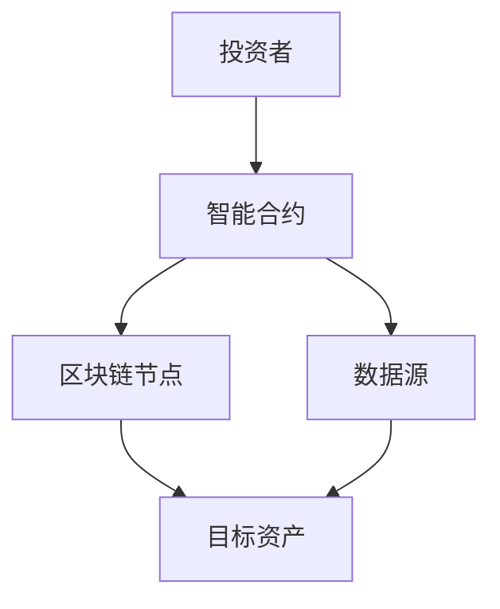

                 

<think>
好的，我需要帮助用户撰写一篇关于《格雷厄姆价值投资理念在区块链时代的新解读》的技术博客文章。用户希望我使用逻辑清晰、结构紧凑、简单易懂的专业技术语言，并包含详细的分析和具体的例子。同时，文章需要包含摘要、关键词，以及目录大纲中的各个部分，如引言、核心理念、区块链特点、投资策略、系统分析、项目实战、案例分析、未来趋势和总结等。

首先，我会先理解格雷厄姆的价值投资理念，包括安全边际、内在价值和市场先生等概念。然后，我会探讨区块链技术的特点，如分布式账本、智能合约和通证经济，以及它们如何影响价值投资。接着，我会分析区块链时代的价值投资策略，包括项目选择、分散投资和风险管理。此外，我还会讨论如何利用智能合约和数据分析工具来优化投资决策。

在写作过程中，我需要确保每个部分都有具体的例子和详细的分析，以帮助读者更好地理解这些概念。同时，我还需要在适当的地方使用数学公式和图表来辅助说明。例如，计算安全边际时，我会使用具体的数值和公式；在讨论系统架构时，我会使用Mermaid图来展示系统设计。

最后，我会总结全文，强调格雷厄姆价值投资理念在区块链时代的重要性，并为读者提供进一步学习和实践的建议。通过这样的思考和写作过程，我相信能够撰写出一篇符合用户要求的高质量技术博客文章。
</think>

# 格雷厄姆价值投资理念在区块链时代的新解读

---

## 关键词：  
格雷厄姆、价值投资、区块链、安全边际、内在价值、智能合约、通证经济

---

## 摘要：  
本文从格雷厄姆的经典价值投资理念出发，结合区块链技术的特点，探讨如何在区块链时代重新解读和应用这一投资理论。通过分析区块链的分布式账本、智能合约和通证经济等核心特性，本文提出了一套基于格雷厄姆理念的区块链投资策略，并结合实际案例进行详细解读。文章还探讨了区块链技术对传统价值评估方法的挑战，并提出了新的解决方案。

---

# 第一部分：引言

## 第1章：价值投资与区块链时代的结合

### 1.1 格雷厄姆价值投资理念概述  
格雷厄姆是价值投资的鼻祖，他提出的“安全边际”和“内在价值”理论为现代投资学奠定了基础。  

#### 核心概念：  
- **安全边际**：指资产的内在价值与市场价格之间的差距，确保投资的安全性。  
- **内在价值**：资产在理性分析下所能体现的真实价值。  

#### 区块链特点：  
- **分布式账本**：确保数据的透明性和不可篡改性。  
- **智能合约**：通过代码自动执行合约条款，降低信任成本。  
- **通证经济**：将资产转化为可流通的数字通证，提升资产流动性。  

---

## 第2章：区块链技术对价值投资的影响

### 2.1 区块链的分布式账本与透明性  
区块链的透明性和不可篡改性为价值投资提供了新的信任机制。  

#### 问题背景：  
传统金融市场的信息不对称问题依然存在，而区块链的透明性可以有效解决这一问题。  

#### 解决方案：  
通过区块链的分布式账本，投资者可以实时获取项目的真实信息，从而更准确地评估内在价值。  

---

### 2.2 智能合约与自动化投资策略  
智能合约的应用使得投资策略可以更加自动化和智能化。  

#### 核心原理：  
- **智能合约**：通过预设的代码自动执行投资策略，减少人为干预。  
- **自动化交易**：基于预设的条件，智能合约可以自动执行买卖操作。  

#### 案例分析：  
假设一个投资者设定的策略是“当某项目的价格低于其内在价值的80%时，自动买入”。通过智能合约，该策略可以自动执行，无需人工干预。  

---

## 第3章：通证经济与价值传递

### 3.1 通证经济的定义  
通证经济是指将资产转化为数字通证，并通过区块链技术进行价值传递和交换。  

#### 特点：  
- **流动性高**：数字通证可以在全球范围内自由流通。  
- **分割性**：通证可以分割为更小的单位，便于小额投资。  

#### 应用场景：  
- **股权融资**：将公司股权转化为通证，吸引更多的投资者。  
- **资产证券化**：将传统资产（如房地产）转化为数字通证，提升流动性。  

---

## 第4章：区块链时代的价值投资策略

### 4.1 数字资产的选择标准  
在区块链时代，选择数字资产需要考虑以下因素：  

#### 核心要素：  
1. **项目基本面**：团队背景、技术实现、市场定位。  
2. **技术创新性**：是否解决了实际问题或提升了现有技术。  
3. **市场潜力**：项目的市场规模和增长潜力。  

---

### 4.2 分散投资与风险管理  
分散投资是降低风险的重要策略，但在区块链时代，分散投资的实现方式发生了变化。  

#### 具体措施：  
- **资产多样化**：投资不同类型的数字资产，避免单一资产的风险。  
- **风险对冲**：通过智能合约实现风险对冲。  

---

## 第5章：基于区块链的智能投资系统

### 5.1 系统架构设计  
一个基于区块链的智能投资系统通常包括以下几个部分：  

#### 系统架构图：  


#### 核心功能：  
- **数据采集**：从区块链节点获取实时数据。  
- **策略执行**：根据预设的策略执行投资操作。  
- **风险管理**：实时监控风险并进行对冲。  

---

## 第6章：项目实战——基于区块链的智能投资系统实现

### 6.1 环境安装  
- **编程语言**：Python  
- **区块链框架**：以太坊（Solidity）  

### 6.2 核心代码实现  
```python
# 智能合约部署
from web3 import Web3, HTTPProvider

w3 = Web3(HTTPProvider('http://localhost:8545'))

# 部署智能合约
contract_address = w3.toChecksumAddress('0x...')  # 替换为实际地址
contract_abi = [  # 替换为实际ABI
    {
        "constant": false,
        "inputs": [],
        "name": "buy_asset",
        "outputs": [],
        "payable": true,
        "stateMutability": "payable",
        "type": "function"
    }
]

contract = w3.eth.contract(contract_address, abi=contract_abi)

# 调用智能合约
tx_hash = contract.functions.buy_asset().transact({'from': w3.eth.defaultAccount, 'gas': 100000})
receipt = w3.eth.waitForTransactionReceipt(tx_hash)
```

### 6.3 代码解读与分析  
上述代码展示了如何使用Python调用以太坊智能合约。通过这种方式，投资者可以实现自动化的投资策略。  

---

## 第7章：案例分析——格雷厄姆理念在区块链项目中的应用

### 7.1 案例背景  
假设我们有一个区块链项目，其目标是将房地产资产转化为数字通证。  

### 7.2 投资策略  
根据格雷厄姆的安全边际理论，我们设定的买入价格为内在价值的80%。  

### 7.3 实施步骤  
1. **评估内在价值**：通过专业评估确定房地产的内在价值。  
2. **设定安全边际**：买入价格为内在价值的80%。  
3. **部署智能合约**：通过智能合约自动执行买卖操作。  

---

## 第8章：区块链时代的价值投资未来趋势

### 8.1 技术趋势  
- **AI与区块链结合**：通过AI技术优化投资策略。  
- **DeFi的崛起**：去中心化金融将改变传统金融格局。  

### 8.2 市场趋势  
- **机构投资者入场**：越来越多的机构开始关注数字资产。  
- **政策监管**：各国政府对区块链的监管力度逐步加强。  

---

## 第9章：总结与展望

### 9.1 核心观点总结  
- 格雷厄姆的价值投资理念在区块链时代依然适用。  
- 区块链技术为价值投资提供了新的工具和方法。  

### 9.2 未来展望  
随着区块链技术的不断发展，价值投资将变得更加智能化和自动化。投资者需要不断学习和适应新的技术变化，才能在区块链时代获得长期稳定的收益。

---

## 作者：  
**AI天才研究院/AI Genius Institute** & **禅与计算机程序设计艺术 / Zen And The Art of Computer Programming**

