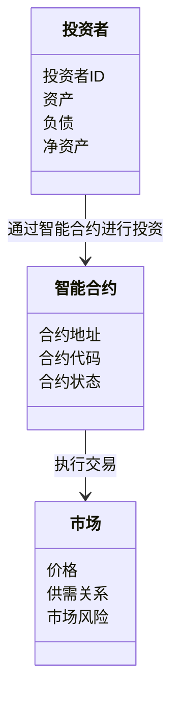
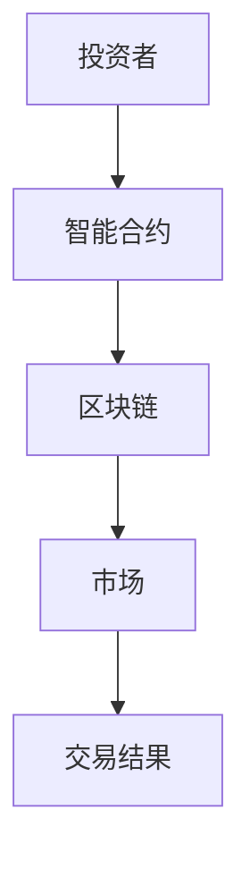

                 

<think>
嗯，我现在需要帮用户设计一本关于《格雷厄姆安全边际概念在去中心化自治投资(DAI)中的应用》的详细目录。我先得理清这本书的核心内容，确保每个部分都涵盖必要的知识点，并且结构清晰。

首先，书籍的标题已经确定，关键词和摘要部分也需要简明扼要。接下来，目录需要分成几个主要部分，每个部分下再细分章节。比如，背景介绍、核心概念、数学模型、系统架构、项目实战、总结等。

在背景介绍部分，我需要详细解释格雷厄姆的安全边际概念和DAI的基本概念，包括它们的定义、特点以及在投资中的作用。这部分需要让读者理解什么是安全边际，以及DAI是什么，它们在投资中的重要性。

核心概念部分，我需要详细分析安全边际在DAI中的应用，可能包括理论基础、实际案例以及它们之间的联系。这里可能需要使用表格和图表来对比分析，帮助读者更好地理解。

接下来是数学模型与公式，这部分需要详细推导安全边际的计算公式，并将其与DAI的机制结合起来。使用LaTeX公式来展示计算过程，同时用代码示例来说明如何在实际中应用这些公式。

系统架构设计部分，我需要介绍DAI的系统功能设计、架构图、接口设计和交互流程。这部分可能需要使用Mermaid图来展示系统的结构和工作流程，让读者直观地理解系统的运作方式。

项目实战部分，我需要提供一个实际的案例，详细讲解如何部署和实现一个基于DAI的安全边际投资系统。包括环境安装、核心代码实现、案例分析等，让读者能够实际操作。

最后是总结与展望，回顾全文的主要内容，并对未来的发展进行预测，同时给出一些实用的建议和注意事项，帮助读者更好地理解和应用这些概念。

在写作过程中，我需要确保每个部分都详细且有深度，同时语言要简洁明了，适合技术读者理解。还要注意格式的正确性，比如公式和图表的使用，确保书籍内容专业且易于阅读。

总之，我需要构建一个逻辑清晰、内容全面的目录，确保每个部分都详细且有深度，同时保持结构的紧凑和简洁，满足用户的要求。
</think>

# 《格雷厄姆安全边际概念在去中心化自治投资(DAI)中的应用》

> 关键词：格雷厄姆安全边际，去中心化自治投资，DAI，区块链，DeFi，智能合约

> 摘要：本文深入探讨了格雷厄姆安全边际概念在去中心化自治投资（DAI）中的应用。通过分析安全边际的理论基础、数学模型、系统架构以及实际案例，本文揭示了如何将传统投资理论与现代区块链技术相结合，以实现更高效、更安全的投资策略。文章内容涵盖背景介绍、核心概念对比、算法实现、系统设计、项目实战以及总结与展望，为读者提供了全面而深入的见解。

---

# 第一部分: 格雷厄姆安全边际概念与去中心化自治投资（DAI）的背景介绍

## 第1章: 格雷厄姆安全边际概念概述

### 1.1 安全边际的定义与核心要素

#### 1.1.1 安全边际的定义
安全边际是指投资标的的内在价值与其市场价格之间的差额。格雷厄姆认为，购买价格低于内在价值时，投资具有安全边际，从而降低风险并提高收益潜力。

#### 1.1.2 安全边际的核心要素
- **内在价值**：资产的真实价值，基于基本面分析。
- **市场价格**：资产在市场上的交易价格。
- **安全边际宽度**：内在价值与市场价格的差额，决定投资的安全性。

#### 1.1.3 安全边际与投资决策的关系
安全边际是投资决策的重要依据，能够帮助投资者在市场波动中保持理性，避免过度乐观或悲观。

### 1.2 格雷厄姆投资理论的背景与影响

#### 1.2.1 格雷厄姆的投资哲学
格雷厄姆强调价值投资，主张以低于内在价值的价格买入资产，以确保投资的安全性。

#### 1.2.2 格雷厄姆安全边际理论的提出
在《证券分析》一书中，格雷厄姆首次系统提出了安全边际理论，成为现代投资理论的重要基石。

#### 1.2.3 格雷厄姆理论在现代投资中的应用
安全边际理论广泛应用于股票、债券和其他金融资产的投资决策中，尤其是在价值投资领域。

## 第2章: 去中心化自治投资（DAI）概述

### 2.1 去中心化自治组织（DAO）的概念

#### 2.1.1 DAO的定义与特点
DAO是基于区块链技术的去中心化组织，通过智能合约自动执行治理和决策过程。

#### 2.1.2 DAO的运作机制
DAO通过代币持有者投票进行决策，确保透明性和去信任化。

#### 2.1.3 DAO与传统组织的区别
- 去中心化：无集中控制机构。
- 透明性：所有交易和决策公开可查。
- 自治性：通过智能合约自动执行规则。

### 2.2 DAI的定义与特点

#### 2.2.1 DAI的定义
DAI是基于区块链的去中心化自治投资工具，用于管理和优化投资组合。

#### 2.2.2 DAI的核心特点
- 去中心化：依赖区块链技术和智能合约。
- 自动化：通过智能合约自动执行投资策略。
- 透明性：所有交易记录在区块链上，可供任何人查阅。

### 2.3 DAI在区块链生态系统中的作用

#### 2.3.1 DAI在DeFi中的应用
DAI作为DeFi生态中的重要工具，用于杠杆交易、流动性挖矿和资产质押等场景。

#### 2.3.2 DAI作为稳定币的优势
DAI的价值稳定，不易受市场波动影响，成为DeFi中的主要交易媒介。

#### 2.3.3 DAI在去中心化金融中的地位
DAI是DeFi生态的核心组件，支持多种金融产品和服务的运行。

---

# 第二部分: 格雷厄姆安全边际概念与DAI的核心概念与联系

## 第3章: 格雷厄姆安全边际概念的数学模型与公式

### 3.1 安全边际的数学模型

#### 3.1.1 安全边际的计算公式
$$ \text{安全边际} = \text{内在价值} - \text{市场价格} $$

#### 3.1.2 内在价值的估算方法
内在价值可以通过基本面分析，如现金流折现法（DCF）进行估算。

#### 3.1.3 市场价格的确定
市场价格由市场供需关系决定，可以通过区块链上的交易数据获取。

### 3.2 安全边际与投资回报的关系

#### 3.2.1 投资回报率的计算公式
$$ \text{投资回报率} = \frac{\text{收益}}{\text{投入}} \times 100\% $$

#### 3.2.2 安全边际对投资回报的影响
较大的安全边际意味着更高的潜在回报和更低的风险。

### 3.3 风险调整后的安全边际计算

#### 3.3.1 风险调整后安全边际的计算公式
$$ \text{风险调整后安全边际} = \text{内在价值} - \text{市场价格} - \text{风险溢价} $$

#### 3.3.2 风险溢价的确定
风险溢价与资产的风险程度相关，可以通过历史数据和市场分析估算。

## 第4章: DAI的系统分析与架构设计方案

### 4.1 DAI的系统功能设计

#### 4.1.1 DAI的领域模型


### 4.2 DAI的系统架构设计

#### 4.2.1 系统架构图


#### 4.2.2 智能合约的实现
智能合约通过区块链技术实现自动化的投资决策和交易执行。

### 4.3 DAI的接口设计与交互流程

#### 4.3.1 系统接口设计
- 投资者与智能合约交互接口
- 智能合约与区块链交互接口
- 区块链与市场数据源交互接口

#### 4.3.2 交互流程
投资者通过智能合约发起投资指令，智能合约执行交易并记录在区块链上，市场数据更新后触发后续操作。

---

# 第三部分: 格雷厄姆安全边际在DAI中的算法实现与案例分析

## 第5章: 格雷厄姆安全边际算法实现

### 5.1 格雷厄姆安全边际的算法实现步骤

#### 5.1.1 步骤一：计算资产的内在价值
使用现金流折现法（DCF）估算资产的内在价值。

#### 5.1.2 步骤二：获取市场价格
从区块链交易数据中获取市场价格。

#### 5.1.3 步骤三：计算安全边际
$$ \text{安全边际} = \text{内在价值} - \text{市场价格} $$

### 5.2 格雷厄姆安全边际的Python实现

```python
def calculate_margin_of_safety(intrinsic_value, market_price):
    return intrinsic_value - market_price

# 示例
intrinsic_value = 100  # 内在价值
market_price = 80       # 市场价格
margin_of_safety = calculate_margin_of_safety(intrinsic_value, market_price)
print("安全边际为:", margin_of_safety)
```

## 第6章: DAI项目实战与案例分析

### 6.1 项目环境安装

#### 6.1.1 安装Python环境
安装Python 3.8及以上版本，并配置好环境变量。

#### 6.1.2 安装区块链开发工具
安装Solidity编译器、以太坊节点和其他必要的开发工具。

### 6.2 核心代码实现

#### 6.2.1 智能合约实现
```solidity
// Solidity智能合约代码
contract DAIInvestment {
    uint256 public intrinsicValue;
    uint256 public marketPrice;
    
    function setValues(uint256 _intrinsicValue, uint256 _marketPrice) public {
        intrinsicValue = _intrinsicValue;
        marketPrice = _marketPrice;
    }
    
    function calculateMarginOfSafety() public view returns (uint256) {
        return intrinsicValue - marketPrice;
    }
}
```

#### 6.2.2 交易逻辑实现
```python
from web3 import Web3, HTTPProvider

# 初始化以太坊节点
web3 = Web3(HTTPProvider("http://localhost:8545"))

# 合约地址
contract_address = "0x...DAIInvestmentContractAddress..."

# 载入合约ABI
contract_abi = [...]  # 替换为实际的ABI数组

# 载入合约实例
dai_contract = web3.eth.contract(contract_address, abi=contract_abi)

# 调用智能合约方法
tx_hash = dai_contract.functions.calculateMarginOfSafety().transact()
web3.eth.wait_for_transaction_receipt(tx_hash)
```

### 6.3 案例分析与结果解读

#### 6.3.1 案例背景
假设某资产的内在价值为100，市场价格为80，计算安全边际。

#### 6.3.2 计算结果
$$ \text{安全边际} = 100 - 80 = 20 $$

#### 6.3.3 结果解读
安全边际为20，说明当前市场价格低于内在价值，投资具有较高的安全性。

---

# 第四部分: 总结与展望

## 第7章: 总结与最佳实践

### 7.1 核心内容总结
- 格雷厄姆安全边际是投资决策的重要工具。
- DAI结合区块链技术，实现了去中心化的安全边际投资。
- 通过智能合约和区块链，DAI能够自动执行投资策略并确保透明性。

### 7.2 最佳实践 tips
- 在选择DAI项目时，需综合考虑内在价值、市场价格和安全边际。
- 定期监控市场变化，及时调整投资策略。
- 注意风险控制，避免过度集中投资。

### 7.3 未来展望
随着区块链技术的不断发展，DAI将在更多金融场景中得到应用，安全边际概念将更加重要。

---

# 作者：AI天才研究院/AI Genius Institute & 禅与计算机程序设计艺术 /Zen And The Art of Computer Programming

