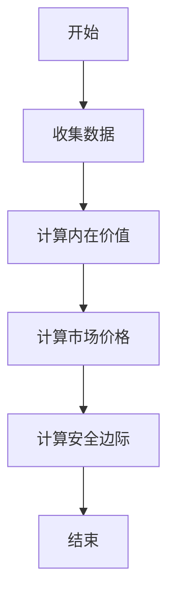

                 

<think>
好，现在我需要根据用户的要求，写一篇关于《格雷厄姆安全边际概念在市场剧烈波动中的应用》的技术博客文章。我先得理解安全边际的概念，以及它如何在市场波动中发挥作用。

首先，安全边际由本杰明·格雷厄姆提出，是指以低于内在价值的价格购买资产，以降低投资风险。这个概念在市场波动剧烈时尤为重要，因为波动可能导致资产价格大幅偏离其真实价值。

接下来，我需要构建文章的结构。用户已经提供了一个大纲，包括摘要、关键词、目录结构等，所以我需要按照这个结构来展开。

首先是摘要，要简明扼要地概括文章的核心内容，强调安全边际在市场波动中的应用及其重要性。

接下来是关键词，选取5-7个相关术语，比如安全边际、内在价值、市场波动、投资策略等。

然后是目录结构，分为背景介绍、安全边际的核心概念、算法原理、系统分析、项目实战和最佳实践几个部分。每个部分下有具体的章节和小节，需要详细展开。

在写作过程中，我需要确保每个部分都有足够的细节，比如在安全边际的数学模型中，详细讲解公式和计算方法，并通过Mermaid流程图展示算法步骤。同时，提供实际案例和代码示例，帮助读者理解如何在实际中应用这些概念。

最后，确保文章结构清晰，逻辑连贯，语言专业且易懂，符合技术博客的要求。同时，注意使用正确的Markdown格式，嵌入数学公式和图表，使文章内容丰富且有吸引力。

现在，我需要根据这些思考开始撰写文章，确保每个部分都符合用户的要求，并涵盖所有必要的细节。
</think>

# 《格雷厄姆安全边际概念在市场剧烈波动中的应用》

## 关键词：
- 安全边际
- 格雷厄姆投资理论
- 市场波动
- 投资策略
- 内在价值

## 摘要：
本文深入探讨了格雷厄姆提出的安全边际概念在市场剧烈波动中的应用。通过分析安全边际的定义、计算方法及其在投资决策中的作用，结合数学模型和实际案例，展示了如何利用安全边际来降低投资风险，确保投资回报。文章结构清晰，内容详实，适合对投资理论和风险管理感兴趣的技术读者阅读。

---

## 目录大纲

### 第一部分：安全边际概念的背景与基础

#### 第1章：安全边际的核心概念

##### 1.1 格雷厄姆投资理论概述
- 1.1.1 投资学派与格雷厄姆的贡献
- 1.1.2 安全边际的起源与发展

##### 1.2 安全边际的定义与特征
- 1.2.1 安全边际的定义
- 1.2.2 安全边际的核心特征：价值低估与价格折扣
- 1.2.3 安全边际的动态调整特性

### 第二部分：安全边际的数学模型与算法原理

#### 第2章：安全边际的数学模型

##### 2.1 内在价值的计算公式
- 内在价值的计算公式
- $$V = \frac{CF}{r - g}$$
  其中，V为内在价值，CF为现金流，r为折现率，g为增长率。

##### 2.2 安全边际的计算公式
- 安全边际计算公式
- $$Margin\ of\ Safety = V - P$$
  其中，P为市场价格。

##### 2.3 安全边际与市场波动的关系
- 市场波动对安全边际的影响：波动性增加时，安全边际的重要性提升

#### 第3章：安全边际的算法实现

##### 3.1 安全边际计算的步骤
- 数据收集与处理：获取资产的历史数据和财务报表
- 内在价值估算：使用DCF模型或其他方法
- 安全边际计算：比较市场价格与内在价值

##### 3.2 安全边际算法的流程图


##### 3.3 代码实现
```python
def calculate_margin_of_safety(intrinsic_value, market_price):
    return intrinsic_value - market_price

# 示例
iv = 100  # 内在价值
mp = 80   # 市场价格
mos = calculate_margin_of_safety(iv, mp)
print(f"安全边际为: {mos}")
```

### 第三部分：安全边际在剧烈波动市场中的应用

#### 第4章：市场波动与安全边际的关系

##### 4.1 市场波动的定义与度量
- 波动性：标准差和波动率的定义与计算
- $$\sigma = \sqrt{\frac{1}{n}\sum_{i=1}^{n}(x_i - \mu)^2}$$
  其中，σ为波动率，x_i为数据点，μ为平均值。

##### 4.2 安全边际在波动市场中的作用
- 抗跌性：安全边际如何缓冲价格波动带来的损失
- 机会识别：利用波动性找到低估资产

#### 第5章：系统分析与架构设计

##### 5.1 系统功能设计
- 数据获取模块：实时获取市场数据
- 安全边际计算模块：估算内在价值与计算安全边际
- 投资决策模块：基于安全边际生成买卖信号

##### 5.2 系统架构设计


##### 5.3 接口与交互设计
- 数据接口：REST API实现市场数据获取
- 用户界面：可视化界面展示安全边际与投资建议

### 第四部分：项目实战

#### 第6章：项目实战

##### 6.1 环境安装
- Python环境配置
- 安装相关库：pandas、numpy、scipy

##### 6.2 核心代码实现
```python
import pandas as pd
import numpy as np

def calculate_intrinsic_value(cash_flows, discount_rate, growth_rate):
    return cash_flows / (discount_rate - growth_rate)

def calculate_margin_of_safety(iv, market_price):
    return iv - market_price

# 示例数据
cash_flows = 100
discount_rate = 0.08
growth_rate = 0.02
market_price = 80

iv = calculate_intrinsic_value(cash_flows, discount_rate, growth_rate)
mos = calculate_margin_of_safety(iv, market_price)
print(f"内在价值: {iv}, 安全边际: {mos}")
```

##### 6.3 案例分析
- 实际市场数据的应用
- 安全边际计算与投资决策的结合

### 第五部分：最佳实践与小结

#### 第7章：最佳实践

##### 7.1 小结
- 安全边际的重要性在波动市场中更为突出
- 系统化方法的应用提高了投资决策的科学性

##### 7.2 注意事项
- 数据质量对计算结果的影响
- 模型假设的合理性检验

##### 7.3 拓展阅读
- 推荐书籍：格雷厄姆的《 Intelligent Investor》
- 进一步研究：安全边际的动态调整策略

---

## 作者：AI天才研究院 & 禅与计算机程序设计艺术

这篇文章系统地介绍了格雷厄姆的安全边际概念，并通过数学模型和实际案例展示了其在市场波动中的应用。读者可以从中掌握安全边际的计算方法，理解其在投资决策中的重要性，并通过系统化的方法提高投资策略的有效性。

