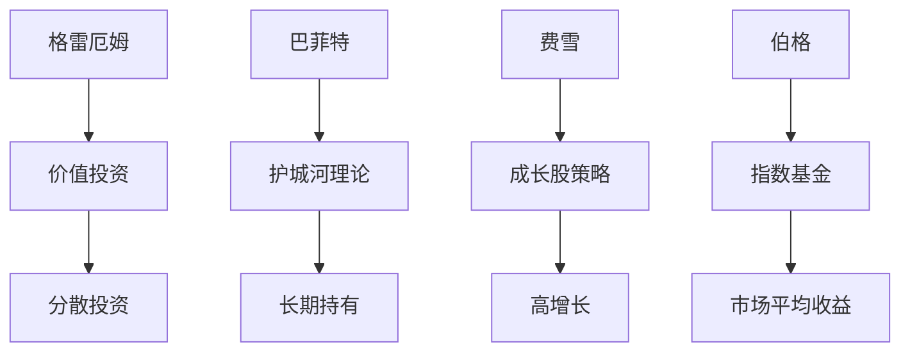

                 

# 格雷厄姆、巴菲特、费雪和伯格的投资理念比较

> 关键词：价值投资，巴菲特，费雪，伯格，投资理念，护城河理论，指数基金，成长股策略

> 摘要：本文通过比较本杰明·格雷厄姆、巴菲特、费雪和伯格四位投资大师的投资理念，分析其核心思想、策略和方法的异同。通过数学模型、系统架构和项目实战的方式，深入探讨这些理念在现代投资中的应用和实践。

---

# 第一部分: 投资理念的背景与基础

## 第1章: 投资理念概述

### 1.1 投资理念的核心概念
#### 1.1.1 投资的基本定义与目标
投资的本质是通过合理配置资源，以实现资产的保值、增值和风险控制。投资的核心目标是最大化收益与风险的最优组合。

#### 1.1.2 不同投资理念的背景与特点
- **价值投资**：基于对公司内在价值的评估，寻找被市场低估的投资标的。
- **成长股投资**：关注公司未来的成长潜力，选择具备高增长潜力的公司。
- **护城河理论**：通过企业的竞争优势（经济护城河）来判断其长期盈利能力。
- **指数基金投资**：通过投资市场整体表现，实现长期稳健的收益。

#### 1.1.3 投资理念比较的必要性与意义
通过对不同投资理念的比较，我们可以理解其优缺点，从而在实际投资中做出更明智的选择，优化投资组合。

---

## 第2章: 格雷厄姆、巴菲特、费雪和伯格的生平与主要思想

### 2.1 本杰明·格雷厄姆
#### 2.1.1 格雷厄姆的生平简介
本杰明·格雷厄姆（1897-1976）是价值投资的鼻祖，被誉为“价值投资之父”。他创立了哥伦比亚证券分析公司，并培养了包括巴菲特在内的许多投资大师。

#### 2.1.2 格雷厄姆的投资理念与价值投资
格雷厄姆的核心思想是**安全边际**和**内在价值**。他认为，投资者应该以低于公司内在价值的价格买入股票，并长期持有。

#### 2.1.3 格雷厄姆的代表作《聪明的投资者》
《聪明的投资者》是价值投资领域的经典著作，书中提出了“防御型投资者”和“积极型投资者”的概念，并强调了分散投资和风险控制的重要性。

### 2.2 巴菲特
#### 2.2.1 巴菲特的生平简介
沃伦·巴菲特（1934年生）是全球最成功的投资者之一，他继承并发展了格雷厄姆的价值投资理念，并提出了**护城河理论**。

#### 2.2.2 巴菲特的投资理念与护城河理论
巴菲特认为，具有强大竞争优势（经济护城河）的企业能够在长期内持续盈利。他强调买入优质企业的股票并长期持有。

#### 2.2.3 巴菲特的导师关系与投资哲学
巴菲特是格雷厄姆的学生，他的投资哲学深受老师影响，但又加入了对成长性和竞争优势的关注。

### 2.3 费雪
#### 2.3.1 费雪的生平简介
菲利普·费雪（1903-2004）是成长股投资的代表人物，他提出了**“成长股投资”**的理念。

#### 2.3.2 费雪的投资策略与选股方法
费雪认为，投资者应该选择那些具备高增长潜力的企业，并长期持有。他强调管理层的质量和企业的创新能力。

#### 2.3.3 费雪的投资理念与成长股策略
费雪的核心思想是通过买入具备持续增长能力的股票，实现超额收益。

### 2.4 伯格
#### 2.4.1 伯格的生平简介
约翰·伯格（1922年生）是指数基金投资的倡导者，他创立了 Vanguard 集团，并发明了指数基金。

#### 2.4.2 伯格的指数基金投资理念
伯格认为，市场是有效的，普通投资者很难通过主动投资获得超额收益。因此，他主张投资指数基金，以获得市场的平均收益。

#### 2.4.3 伯格对被动投资的贡献
伯格的指数基金理念奠定了现代被动投资的基础，也为广大投资者提供了一种简单、低成本的投资方式。

---

## 第3章: 核心概念与联系

### 3.1 投资理念的核心要素对比
#### 3.1.1 格雷厄姆的价值投资
- 核心要素：内在价值、安全边际、分散投资。
- 适用场景：市场低估、寻找价值被忽视的企业。

#### 3.1.2 巴菲特的护城河理论
- 核心要素：经济护城河、竞争优势、长期持有。
- 适用场景：选择具备持续竞争优势的企业。

#### 3.1.3 费雪的成长股策略
- 核心要素：高增长潜力、管理层质量、创新能力强。
- 适用场景：寻找具备长期增长动力的企业。

#### 3.1.4 伯格的指数基金投资
- 核心要素：市场有效性、低成本、分散投资。
- 适用场景：无法主动选股、追求市场平均收益。

### 3.2 投资理念对比表格
| 投资理念 | 格雷厄姆的价值投资 | 巴菲特的护城河理论 | 费雪的成长股策略 | 伯格的指数基金投资 |
|----------|--------------------|--------------------|-------------------|--------------------|
| 核心目标 | 寻找低估的价值     | 寻找竞争优势       | 寻找高增长企业     | 追求市场平均收益   |
| 适用场景 | 市场低估           | 具备竞争优势       | 高增长行业         | 无法主动选股       |
| 投资策略 | 买入低估股票       | 买入具备护城河的企业 | 买入高增长股票     | 投资指数基金         |
| 风险控制 | 分散投资           | 长期持有           | 选股严格           | 低成本、分散风险     |

### 3.3 实体关系图（Mermaid）

---

## 第4章: 投资理念的数学模型与公式

### 4.1 格雷厄姆的价值投资模型
#### 4.1.1 内在价值公式
$$ V = \frac{E}{1 + r} $$
其中，$V$ 为内在价值，$E$ 为未来现金流，$r$ 为折现率。

#### 4.1.2 安全边际公式
$$ \text{安全边际} = \text{内在价值} - \text{市场价格} $$

### 4.2 巴菲特的护城河模型
#### 4.2.1 经济护城河的衡量公式
$$ E = \frac{C}{T} $$
其中，$E$ 为经济护城河强度，$C$ 为竞争优势带来的收益，$T$ 为时间因素。

### 4.3 费雪的成长股模型
#### 4.3.1 股价增长公式
$$ P = g \times t $$
其中，$P$ 为股价，$g$ 为增长率，$t$ 为时间。

### 4.4 伯格的指数基金模型
#### 4.4.1 指数基金收益公式
$$ R = M + \alpha $$

