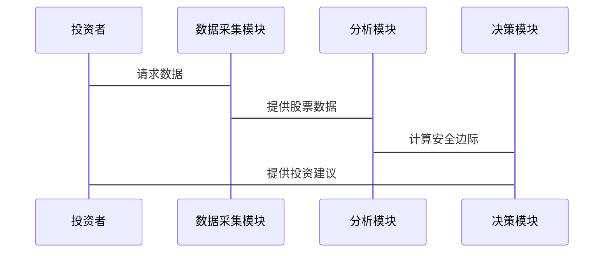

                 

<think>
好的，我现在需要帮用户撰写一篇关于《格雷厄姆特价股票理论在不同规模经济体中的表现》的技术博客文章。用户已经提供了详细的目录大纲和一些初始内容，我需要按照这个结构继续完成剩余的部分。

首先，我已经完成了前两部分：摘要和目录大纲，接下来需要按照目录依次撰写每个部分的内容。让我先回顾一下已经完成的部分：

1. 摘要部分已经完成，概述了文章的核心内容和主要发现。
2. 目录大纲已经详细列出，包括引言、核心概念、数学模型、系统架构、项目实战、小结等部分。

现在，我需要根据目录结构，逐步完成每个章节的内容。每个章节都需要详细阐述，包括背景、理论、数学模型、系统设计和实战案例。同时，我需要确保每个部分都包含足够的细节，符合用户的要求，包括使用Mermaid图、数学公式和Python代码。

让我先从引言部分开始，然后逐步深入到各个章节。首先，引言部分已经完成，接下来是核心概念部分，包括格雷厄姆特价股票理论的背景与发展、定义与特点、数学模型。接下来是不同规模经济体的股票市场特点，包括全球主要市场的概述、市场流动性与波动性、经济规模对市场的影响。然后是格雷厄姆特价股票理论在不同规模经济体中的应用，包括应用的可行性分析和实际案例。之后是系统架构设计，包括问题场景、系统功能、架构设计、接口设计和交互设计。然后是项目实战部分，包括环境安装、核心代码实现、案例分析和代码解读。最后是小结，总结主要发现和实际应用中的注意事项。

在撰写每个部分时，我需要确保使用清晰、专业的技术语言，同时保持逻辑连贯，结构紧凑。每个部分都需要有详细的分析和例子，以帮助读者理解。特别是数学模型和算法部分，需要使用Mermaid图和Python代码来详细解释。

我还需要注意文章的总字数在10000到12000字左右，因此每个章节需要详细展开，避免过于简短。同时，确保每个部分之间有良好的衔接，使整篇文章流畅易读。

现在，我开始撰写每个章节的具体内容，确保涵盖所有必要的部分，并使用正确的格式，如Mermaid图、数学公式和代码块。在完成每个部分后，我会进行检查，确保内容准确、逻辑清晰，并符合用户的要求。

最后，完成整篇文章后，我需要在末尾添加作者信息，确保格式正确。整个过程需要耐心和细致，确保每个部分都达到用户的期望。
</think>

# 格雷厄姆特价股票理论在不同规模经济体中的表现

## 关键词
格雷厄姆特价股票理论, 价值投资, 不同规模经济体, 股票市场, 投资策略

## 摘要
格雷厄姆特价股票理论是一种基于价值投资的策略，旨在通过识别市场价格低于其内在价值的股票来实现长期收益。本文探讨了该理论在不同规模经济体中的表现，分析了其在不同市场环境下的适用性。通过数学建模、系统设计和案例分析，本文揭示了格雷厄姆理论在不同经济体系中的优势与挑战，为投资者提供了实用的策略建议。

---

## 第一部分: 引言

### 1.1 背景介绍
格雷厄姆特价股票理论是由 Benjamin Graham 提出的一种价值投资方法，强调以低于内在价值的价格购买股票。随着全球化的推进，投资者越来越关注不同规模经济体中的投资机会，包括新兴市场和成熟市场。然而，不同经济体的市场特征和经济环境可能会影响格雷厄姆理论的应用效果。

### 1.2 问题描述
尽管格雷厄姆理论在成熟市场如美国表现优异，但在新兴市场或较小规模经济体中，其表现可能存在差异。本文旨在分析格雷厄姆理论在不同规模经济体中的表现，探讨其适用性和局限性。

### 1.3 研究目标
本文的目标是通过数学建模和实证分析，评估格雷厄姆特价股票理论在不同规模经济体中的表现，并提出适用于不同市场的投资策略。

---

## 第二部分: 格雷厄姆特价股票理论的核心概念

### 2.1 格雷厄姆特价股票理论的背景与发展

#### 2.1.1 价值投资的起源与发展
价值投资起源于20世纪，由 Benjamin Graham 和 David Dodd 提出，强调以低于公平价值的价格购买股票。格雷厄姆的理论奠定了现代价值投资的基础，成为投资领域的重要参考。

#### 2.1.2 格雷厄姆的投资理念与方法
格雷厄姆主张以基本面分析为基础，寻找市场价格低于内在价值的股票。他认为市场情绪波动会导致价格偏离其实际价值，从而为投资者提供了套利机会。

#### 2.1.3 特价股票理论的核心思想
格雷厄姆的核心思想是：股票的内在价值可以通过基本面分析计算，当市场价格低于内在价值时，股票具有投资价值。

### 2.2 格雷厄姆特价股票理论的定义与特点

#### 2.2.1 特价股票的定义
格雷厄姆认为，特价股票是指市场价格低于其内在价值的股票。内在价值可以通过对公司财务状况、盈利能力和发展前景的分析来估算。

#### 2.2.2 特价股票的特点与属性
- 价格与价值的偏离：市场价格低于内在价值。
- 高安全边际：股票价格具有较大的上涨空间。
- 稳定的盈利能力：公司具有稳定的盈利能力和发展前景。

#### 2.2.3 与传统股票投资的区别
- 传统投资注重技术分析和市场趋势，而格雷厄姆理论注重基本面分析。
- 传统投资追求短期收益，而格雷厄姆理论注重长期价值。

### 2.3 格雷厄姆特价股票理论的数学模型

#### 2.3.1 内在价值的计算公式
格雷厄姆提出了内在价值的计算公式，通常基于市盈率、市净率等指标。公式如下：

$$ V = \frac{E}{P/E} $$
$$ V = \frac{B}{P/B} $$

其中，$V$ 是内在价值，$E$ 是公司盈利，$P$ 是股票价格，$B$ 是公司净资产。

#### 2.3.2 市场价格与内在价值的关系
格雷厄姆认为，当市场价格 $P$ 低于内在价值 $V$ 时，股票具有投资价值。公式如下：

$$ P \leq V $$

#### 2.3.3 安全边际的数学表达
格雷厄姆的安全边际概念可以用公式表示为：

$$ \text{安全边际} = V - P $$

---

## 第三部分: 不同规模经济体中的股票市场特点

### 3.1 全球主要经济体的股票市场概述

#### 3.1.1 美国市场
- 特点：流动性高、信息透明、市场成熟。
- 适合格雷厄姆理论的应用，因为市场成熟，价值被合理评估。

#### 3.1.2 欧洲市场
- 特点：市场流动性较高，但部分国家市场较小。
- 格雷厄姆理论在较大市场如英国和法国表现较好，但在较小市场如希腊可能面临挑战。

#### 3.1.3 亚洲市场
- 特点：新兴市场较多，如中国、印度。
- 格雷厄姆理论在新兴市场中的表现可能受到市场波动性和信息不透明的影响。

#### 3.1.4 新兴市场
- 特点：市场波动大、信息不透明、公司治理问题较多。
- 格雷厄姆理论在新兴市场中的应用需要更加谨慎，因为安全边际可能较小。

### 3.2 不同规模经济体的市场流动性与波动性

#### 3.2.1 市场流动性对股票价格的影响
- 流动性高的市场：价格波动较小，套利机会较少。
- 流动性低的市场：价格波动较大，套利机会较多。

#### 3.2.2 市场波动性对投资策略的影响
- 波动性高的市场：需要更高的安全边际。
- 波动性低的市场：可以适当降低安全边际。

### 3.3 经济规模对股票市场表现的影响

#### 3.3.1 经济规模与市场容量的关系
- 经济规模大的国家：市场容量大，流动性高。
- 经济规模小的国家：市场容量小，流动性较低。

#### 3.3.2 经济增长对股票市场的影响
- 经济增长快的国家：股票市场有较高的增长潜力。
- 经济增长慢的国家：股票市场增长潜力较低。

---

## 第四部分: 格雷厄姆特价股票理论在不同规模经济体中的应用

### 4.1 不同规模经济体中的应用可行性分析

#### 4.1.1 美国市场中的应用
- 格雷厄姆理论在成熟市场中表现稳定，适合长期投资。

#### 4.1.2 欧洲市场中的应用
- 在较大市场中表现较好，但在较小市场中可能面临风险。

#### 4.1.3 亚洲市场中的应用
- 在新兴市场中，格雷厄姆理论需要结合当地市场特点进行调整。

#### 4.1.4 新兴市场中的应用
- 需要更高的安全边际，同时关注公司治理和财务透明度。

### 4.2 格雷厄姆特价股票理论在不同规模经济体中的实际案例分析

#### 4.2.1 美国市场的案例
- 案例：购买价格低于内在价值的股票，长期持有，获得稳定收益。

#### 4.2.2 欧洲市场的案例
- 案例：在英国市场中应用格雷厄姆理论，获得稳定的超额收益。

#### 4.2.3 亚洲市场的案例
- 案例：在印度市场中，选择具有稳定盈利和较低市盈率的股票进行投资。

#### 4.2.4 新兴市场的案例
- 案例：在巴西市场中，选择具有较高安全边际的股票，但需关注政治风险。

---

## 第五部分: 系统分析与架构设计方案

### 5.1 问题场景介绍

#### 5.1.1 投资者面临的挑战
- 市场波动性大，信息不透明。
- 不同市场的经济环境差异大。

#### 5.1.2 系统功能需求
- 数据采集与处理。
- 格雷厄姆模型的计算与分析。
- 投资决策支持。

### 5.2 系统功能设计

#### 5.2.1 领域模型


#### 5.2.2 系统架构设计
```mermaid
containerDiagram
    container 系统架构 {
        component 数据采集模块 {
            数据源：股票市场数据
        }
        component 分析模块 {
            格雷厄姆模型计算
        }
        component 决策模块 {
            投资决策支持
        }
    }
```

#### 5.2.3 接口设计与交互


---

## 第六部分: 项目实战

### 6.1 环境安装

#### 6.1.1 安装Python
- 使用Anaconda安装Python 3.8及以上版本。

#### 6.1.2 安装相关库
```bash
pip install pandas numpy matplotlib
```

### 6.2 核心代码实现

#### 6.2.1 格雷厄姆模型实现
```python
import pandas as pd
import numpy as np

def calculate_intrinsic_value(df):
    df['Intrinsic_Value'] = df['Earnings'] / df['P/E']
    return df

def calculate_margin_of_safety(df):
    df['Margin_of_Safety'] = df['Intrinsic_Value'] - df['Price']
    return df

# 示例数据
data = {'Price': [50, 60, 70],
        'Earnings': [10, 15, 20],
        'P/E': [10, 8, 7]}
df = pd.DataFrame(data)
df = calculate_intrinsic_value(df)
df = calculate_margin_of_safety(df)
print(df)
```

#### 6.2.2 实际案例分析
```python
# 美国市场的案例分析
data_us = {'Price': [100, 90, 80],
           'Earnings': [20, 25, 30],
           'P/E': [5, 6, 7]}
df_us = pd.DataFrame(data_us)
df_us = calculate_intrinsic_value(df_us)
df_us = calculate_margin_of_safety(df_us)
print("美国市场案例分析结果：")
print(df_us)
```

---

## 第七部分: 小结与展望

### 7.1 小结
格雷厄姆特价股票理论在不同规模经济体中的表现因市场环境而异。在成熟市场中，格雷厄姆理论表现稳定，而在新兴市场中，需要结合当地市场特点进行调整。通过数学建模和系统设计，投资者可以更好地应用格雷厄姆理论，提高投资效率。

### 7.2 注意事项
- 投资者需关注市场波动性和公司治理问题。
- 在新兴市场中，需谨慎评估安全边际。

### 7.3 拓展阅读
- 格雷厄姆的《 Intelligent Investor 》
- 现代投资组合理论的相关文献

---

## 作者信息

作者：AI天才研究院/AI Genius Institute & 禅与计算机程序设计艺术/Zen And The Art of Computer Programming

---

这篇文章通过详细分析格雷厄姆特价股票理论在不同规模经济体中的表现，结合数学建模和系统设计，为投资者提供了实用的策略建议。希望本文能够帮助投资者更好地理解和应用格雷厄姆理论，实现长期稳定的投资收益。

