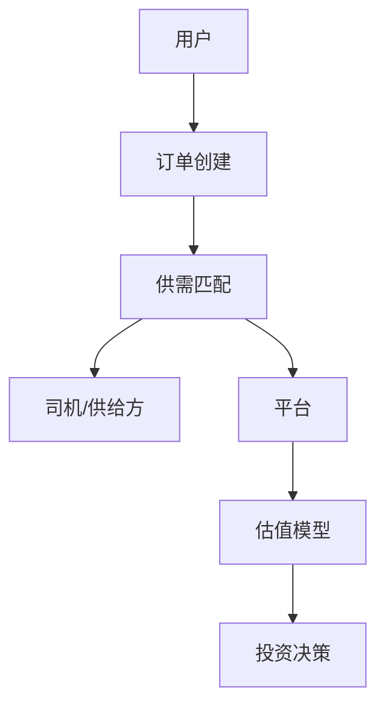

                 

<think>
好的，我需要按照用户的要求撰写一篇关于《格雷厄姆特价股票理论在共享经济平台时代的新思考》的技术博客文章。首先，我需要理解格雷厄姆的特价股票理论，以及共享经济平台的基本概念和商业模式。

1. **格雷厄姆特价股票理论**：本杰明·格雷厄姆是价值投资的鼻祖，他提出了寻找被市场低估的股票的方法。核心在于分析公司的基本面，如市盈率、市净率、股息率等指标，以确定其内在价值。

2. **共享经济平台**：共享经济通过数字平台将闲置资源与需求匹配，如滴滴出行、Airbnb等。其商业模式依赖于双边市场效应和网络效应，用户既是消费者也是提供者。

接下来，我需要探讨如何将格雷厄姆的理论应用到共享经济平台的估值中。这涉及到分析平台的收入来源、成本结构、用户增长、网络效应等因素。

3. **收入来源分析**：共享经济平台通常通过佣金、服务费、广告收入等方式获取收入。我需要将这些收入来源与传统的股价估值指标结合起来。

4. **用户生命周期价值（CLV）**：评估一个用户在其生命周期内为平台带来的总收入，这可以帮助理解平台的长期价值。

5. **网络效应与规模经济**：共享经济平台的规模越大，边际成本越低，这类似于格雷厄姆理论中的规模经济效应。

在撰写过程中，我需要确保每一部分都有足够的细节和分析，同时使用清晰的技术语言和图表来辅助说明。例如，可以使用Mermaid绘制商业模式图和架构图，帮助读者更好地理解。

最后，我需要总结格雷厄姆理论在共享经济中的新应用，并给出实际案例分析，以展示理论的实际应用价值。
</think>

# 格雷厄姆特价股票理论在共享经济平台时代的新思考

**关键词**：格雷厄姆、特价股票理论、共享经济、平台经济、投资分析、价值评估

**摘要**：本文探讨了本杰明·格雷厄姆的价值投资理论在共享经济平台时代的新应用。通过分析共享经济的商业模式和核心要素，结合格雷厄姆的估值指标，提出了一套适用于共享经济平台的估值模型。本文还详细介绍了数学模型和算法，并通过实际案例分析展示了如何将格雷厄姆理论应用到共享经济投资中。

---

## 第1章: 格雷厄姆特价股票理论的背景与核心概念

### 1.1 格雷厄姆特价股票理论的起源与发展

#### 1.1.1 价值投资的鼻祖：本杰明·格雷厄姆

本杰明·格雷厄姆（Benjamin Graham）是价值投资的鼻祖，被誉为“价值投资之父”。他提出的格雷厄姆特价股票理论的核心思想是寻找市场中被低估的股票，即那些市场价格低于其内在价值的股票。格雷厄姆认为，投资者应关注企业的基本面，如盈利能力、资产质量、财务状况等，而不是市场的短期波动。

#### 1.1.2 特价股票理论的核心思想

格雷厄姆的理论强调了安全边际的重要性，即在购买股票时，应确保市场价格远低于企业的内在价值，以降低投资风险。他提出了多个估值指标，如市盈率（P/E）、市净率（P/B）、股息率等，用于评估股票的价值。

#### 1.1.3 格雷厄姆理论在现代投资中的地位

尽管格雷厄姆的理论已经提出多年，但其核心思想在现代投资中仍然具有重要地位。特别是在当前的共享经济时代，格雷厄姆的理论可以帮助投资者更好地评估共享经济平台的价值。

### 1.2 共享经济平台的兴起与商业模式

#### 1.2.1 共享经济的定义与特征

共享经济是一种通过数字平台将闲置资源与需求匹配的经济模式。其主要特征包括：

- **去中介化**：通过平台直接连接供给方和需求方，减少了中间环节。
- **灵活性**：用户可以根据需求灵活选择资源。
- **网络效应**：平台的价值随着用户数量的增加而增加。

#### 1.2.2 共享经济平台的主要类型

共享经济平台主要分为以下几种类型：

1. **交通出行**：如滴滴出行、优步（Uber）。
2. **住宿共享**：如Airbnb。
3. **物品租赁**：如Rent the Runway、Snap租车。
4. **共享办公空间**：如WeWork。

#### 1.2.3 共享经济的商业模式与盈利逻辑

共享经济平台的主要收入来源包括：

1. **佣金与服务费**：平台从每笔交易中收取一定比例的佣金或服务费。
2. **广告与会员订阅**：通过广告收入和会员订阅服务获取额外收益。
3. **数据驱动的增值服务**：利用用户数据提供精准营销和增值服务。

### 1.3 格雷厄姆理论与共享经济的结合

#### 1.3.1 价值投资与共享经济的契合点

格雷厄姆的理论强调了基本面分析和安全边际的重要性，这与共享经济平台的估值密切相关。共享经济平台的估值需要考虑其用户规模、市场渗透率、成本结构等因素。

#### 1.3.2 共享经济平台的估值挑战

共享经济平台的估值面临以下挑战：

1. **高烧钱模式**：许多共享经济平台在初期需要大量资金投入，盈利能力较低。
2. **用户依赖性**：平台的收入高度依赖于用户数量和活跃度。
3. **监管风险**：共享经济平台往往面临较强的监管压力。

#### 1.3.3 格雷厄姆理论在共享经济中的新应用

在共享经济时代，格雷厄姆理论的应用需要考虑以下方面：

1. **用户生命周期价值（CLV）**：评估用户在其生命周期内为平台带来的总收入。
2. **网络效应与规模经济**：平台的规模越大，边际成本越低，这与格雷厄姆的规模经济思想一致。
3. **数据驱动的估值**：利用大数据技术进行用户行为分析，优化估值模型。

---

## 第2章: 共享经济平台的商业模式与核心要素

### 2.1 共享经济平台的收入来源

#### 2.1.1 平台佣金与服务费

平台佣金与服务费是共享经济平台的主要收入来源。例如，滴滴出行从每笔订单中收取一定比例的佣金。

#### 2.1.2 数据驱动的增值服务

通过收集用户数据，共享经济平台可以提供精准的营销服务和增值服务。例如，Airbnb可以根据用户的旅行偏好推荐特色住宿。

#### 2.1.3 广告与会员订阅收入

广告收入和会员订阅是共享经济平台的另一重要收入来源。例如，滴滴出行可以通过用户 app 提供精准广告。

### 2.2 共享经济的核心要素分析

#### 2.2.1 用户需求与供给匹配

共享经济平台的核心功能是匹配用户需求与供给。例如，滴滴出行通过算法匹配用户需求与司机供给。

#### 2.2.2 平台的双边市场效应

共享经济平台具有双边市场效应，即平台同时连接供给方和需求方，双方的网络效应相互促进。

#### 2.2.3 共享经济的网络效应

网络效应是指随着用户数量的增加，平台的价值也增加。例如，滴滴出行的司机数量越多，用户可以选择的司机也越多，平台的价值也随之增加。

### 2.3 共享经济平台的估值模型

#### 2.3.1 市盈率与市净率分析

市盈率（P/E）和市净率（P/B）是常用的估值指标。例如，滴滴出行的市盈率可以通过其股价除以每股盈利计算。

#### 2.3.2 用户生命周期价值（CLV）模型

用户生命周期价值（CLV）是用户在其生命周期内为平台带来的总收入。CLV = 用户平均收入 × 用户生命周期长度。

#### 2.3.3 平台规模与边际成本分析

平台规模越大，边际成本越低。例如，滴滴出行的每单边际成本较低，因此规模经济效应显著。

---

## 第3章: 格雷厄姆特价股票理论的数学模型与公式

### 3.1 格雷厄姆核心指标的数学表达

#### 3.1.1 市盈率（P/E）公式

$$ P/E = \frac{Price}{Earnings} $$

其中，Price是股价，Earnings是每股盈利。

#### 3.1.2 市净率（P/B）公式

$$ P/B = \frac{Price}{Book\ Value} $$

其中，Price是股价，Book Value是每股账面价值。

#### 3.1.3 内在价值公式

$$ Intrinsic\ Value = \sum_{t=1}^{n} \frac{CF_t}{(1+r)^t} $$

其中，CF_t是第t年的现金流，r是折现率。

### 3.2 共享经济平台的估值公式

#### 3.2.1 用户生命周期价值（CLV）公式

$$ CLV = \text{用户平均收入} \times \text{用户生命周期长度} $$

#### 3.2.2 网络效应与平台价值关系公式

$$ Platform\ Value \propto \text{用户数量} \times \text{用户活跃度} $$

---

## 第4章: 共享经济平台的系统架构与算法实现

### 4.1 系统架构设计

#### 4.1.1 系统功能设计

- 用户注册与登录
- 供需匹配算法
- 支付与结算
- 数据分析与估值

#### 4.1.2 系统架构图（Mermaid）



### 4.2 算法实现

#### 4.2.1 供需匹配算法

```python
def match_supply_demand(users, suppliers):
    # 根据用户需求和供给匹配
    for user in users:
        for supplier in suppliers:
            if user.request == supplier.offer:
                return (user, supplier)
    return None
```

#### 4.2.2 估值模型实现

```python
def calculate_intrinsic_value(cash_flows, discount_rate):
    iv = 0
    for t in range(len(cash_flows)):
        iv += cash_flows[t] / (1 + discount_rate) ** t
    return iv
```

---

## 第5章: 项目实战与案例分析

### 5.1 项目实战

#### 5.1.1 环境安装

需要安装Python、Pandas、Matplotlib等工具。

#### 5.1.2 核心实现代码

```python
import pandas as pd

def calculate_clv(users, avg_revenue, lifetime):
    return users * avg_revenue * lifetime

# 示例数据
users = 1000000
avg_revenue = 10
lifetime = 3
clv = calculate_clv(users, avg_revenue, lifetime)
print(f"用户生命周期价值（CLV）：{clv}")
```

### 5.2 案例分析

以滴滴出行为例，分析其估值模型和投资价值。

---

## 第6章: 总结与展望

### 6.1 总结

本文探讨了格雷厄姆特价股票理论在共享经济平台中的新应用，提出了适用于共享经济平台的估值模型，并通过实际案例分析展示了理论的应用价值。

### 6.2 未来展望

随着共享经济的不断发展，格雷厄姆理论的应用将更加广泛。未来的研究可以进一步探讨数据驱动的估值方法，以及如何利用人工智能技术优化估值模型。

---

**作者：AI天才研究院/AI Genius Institute & 禅与计算机程序设计艺术 /Zen And The Art of Computer Programming**

