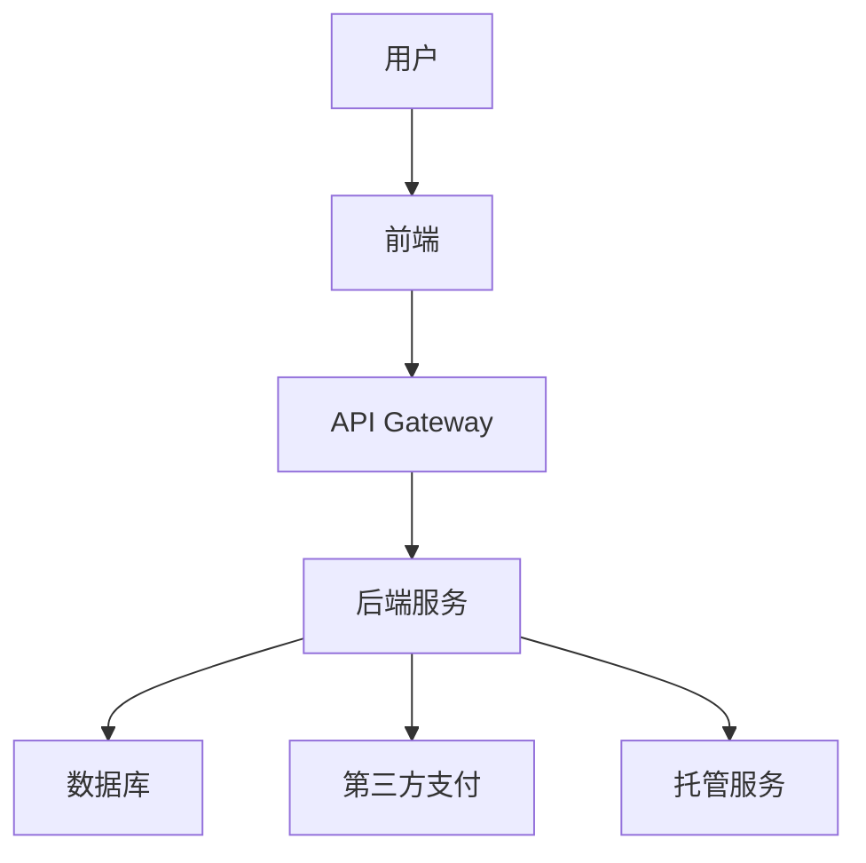
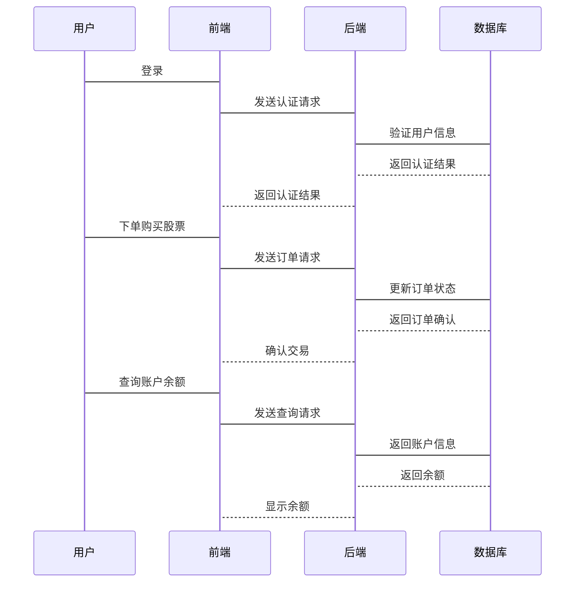

                 

<think>
好的，我将按照用户的要求逐步分析并撰写这篇文章。首先，我需要理解文章的主题，即格雷厄姆特价股票理论在分数化所有权证券中的应用。这涉及到价值投资的基本原理以及如何将其应用于现代金融工具。

**步骤一：背景介绍**

我需要先介绍格雷厄姆的背景和他的投资理论，特别是安全边际和内在价值的概念。然后，我会解释什么是分数化所有权证券，以及它们如何改变传统的投资方式。

**步骤二：核心概念与联系**

接下来，我需要详细讲解格雷厄姆理论中的核心概念，并展示它们如何与分数化所有权证券结合。我可能会使用表格和ER图来对比不同的概念属性，并展示它们之间的关系。

**步骤三：算法原理**

我需要将格雷厄姆的投资策略转化为数学模型，使用mermaid流程图展示算法步骤。同时，我会提供Python代码来计算内在价值和安全边际，确保读者能够理解这些概念的实际应用。

**步骤四：系统分析与架构设计**

这部分将涉及系统设计，包括功能模块、架构图和接口设计。我需要考虑如何将分数化所有权证券集成到现有的金融系统中，确保系统的高效和安全。

**步骤五：项目实战**

我将提供一个具体的案例，展示如何在实际中应用这些理论和算法。这可能包括环境安装、代码实现和案例分析，帮助读者更好地理解。

**步骤六：最佳实践**

最后，我将总结文章的主要观点，并给出投资建议、注意事项和进一步的学习资源，确保读者能够有效地应用所学知识。

在整个过程中，我需要确保语言简洁明了，逻辑清晰，并且每个部分都详细且具有实际例子，以帮助读者更好地理解和应用这些理论。
</think>

# 《格雷厄姆特价股票理论在分数化所有权证券中的运用》

## 关键词：格雷厄姆，特价股票，分数化所有权，证券，投资策略，价值投资，内在价值，安全边际，数学模型

## 摘要

本文深入探讨了格雷厄姆的价值投资理论在分数化所有权证券中的应用。通过分析安全边际、内在价值等核心概念，结合数学模型和实际案例，展示了如何在现代金融环境中应用这些理论。文章还详细介绍了系统的架构设计和实现方案，为投资者提供了实用的指导。

---

# 第一部分: 格雷厄姆投资理论基础

## 第1章: 格雷厄姆投资理论概述

### 1.1 格雷厄姆投资理论的起源与核心思想

- **1.1.1 投资理论的演变与背景**

  格雷厄姆是价值投资的鼻祖，他的理论在20世纪初兴起，强调安全边际和内在价值。传统投资理论注重技术分析，而格雷厄姆则强调基本面分析，尤其是企业的内在价值。

- **1.1.2 格雷厄姆的价值投资理念**

  格雷厄姆认为，股票不仅仅是一个交易工具，而是企业的一部分所有权。投资者应以合理的价格购买具有内在价值的股票，等待其价值被市场发现。

- **1.1.3 格雷厄姆投资理论的核心原则**

  格雷厄姆的核心原则包括：
  - 安全边际：购买价格低于内在价值。
  - 内在价值：企业未来现金流的现值。
  - 市场先生理论：市场波动反映了非理性行为。

### 1.2 特价股票的定义与特征

- **1.2.1 什么是特价股票**

  特价股票是指价格低于其内在价值的股票，通常被市场低估，具有较大的上涨潜力。

- **1.2.2 特价股票的市场特征**

  特价股票通常具有低市盈率、低市净率，且股息收益率较高。它们可能处于困境行业或暂时被市场忽视。

- **1.2.3 特价股票的投资价值**

  投资特价股票可以带来超额收益，尤其是当市场情绪好转时，这些股票的价值会被重新评估。

### 1.3 格雷厄姆投资策略的基本框架

- **1.3.1 安全边际的概念**

  安全边际是指股票价格与内在价值之间的差额，确保投资者在市场波动中不会遭受重大损失。

- **1.3.2 内在价值的计算方法**

  内在价值计算需要考虑企业的未来现金流、资产价值和行业地位。常用的方法包括股息贴现模型和现金流贴现模型。

- **1.3.3 市场先生的理论模型**

  市场先生反映了市场的非理性波动，投资者应利用市场的恐慌或乐观情绪，寻找廉价买入或高价卖出的机会。

## 第2章: 分数化所有权证券的概念与背景

### 2.1 分数化所有权证券的定义

- **2.1.1 什么是分数化所有权**

  分数化所有权允许投资者以小部分资金购买少量股票，例如通过购买1/100的股票份额。

- **2.1.2 分数化所有权证券的类型**

  - 普通股票的分数化
  - ETF的分数化
  - 优先股的分数化

- **2.1.3 分数化所有权证券的优势**

  - 降低投资门槛
  - 提高资金利用率
  - 便于分散投资

### 2.2 分数化所有权证券的市场背景

- **2.2.1 传统证券市场的局限性**

  传统市场中，小投资者难以购买整股股票，限制了投资机会。

- **2.2.2 分数化所有权证券的兴起**

  技术进步和金融创新使得分数化所有权证券成为可能，尤其在互联网和区块链技术的支持下。

- **2.2.3 分数化所有权证券的应用场景**

  - 个人投资者小额投资
  - 教育投资和模拟交易
  - 创业融资的新方式

### 2.3 分数化所有权证券的特性对格雷厄姆理论的影响

- **2.3.1 分数化证券的流动性优势**

  分数化证券提高了市场的流动性，投资者可以随时买卖部分份额。

- **2.3.2 分数化证券的风险分散机制**

  通过分散投资于多个股票，降低非系统性风险。

- **2.3.3 分数化证券的市场波动性分析**

  分数化证券可能因交易量小而出现较大的价格波动，但整体风险可控。

---

## 第二部分: 格雷厄姆理论与分数化所有权证券的结合

## 第3章: 格雷厄姆理论在分数化证券中的应用

### 3.1 格雷厄姆理论在分数化证券中的适应性

- **3.1.1 内在价值的计算**

  分数化证券不影响企业的内在价值，只是改变了所有权的分割方式。

- **3.1.2 安全边际的重新定义**

  分数化证券的价格波动可能更小，因此安全边际的计算需要考虑分割后的价格波动。

### 3.2 分数化所有权证券的投资策略

- **3.2.1 确定内在价值**

  对每个分数化证券进行单独评估，确保其价格低于内在价值。

- **3.2.2 安全边际的计算**

  计算每个分数化证券的安全边际，选择具有较大安全边际的投资标的。

- **3.2.3 投资组合的构建**

  将多个分数化证券组合成一个投资组合，分散风险，提高收益。

### 3.3 分数化所有权证券的市场机会

- **3.3.1 小市值股票的潜力**

  分数化后的小市值股票更具吸引力，因为它们更可能被市场低估。

- **3.3.2 创新企业的投资机会**

  分数化证券为投资者提供了投资新兴企业的机会，尤其是科技型初创企业。

- **3.3.3 全球化投资的便利**

  通过分数化证券，投资者可以投资全球市场，分散地域风险。

## 第4章: 格雷厄姆投资策略的数学模型与公式

### 4.1 内在价值的计算公式

- **4.1.1 现值计算公式**

  $$ PV = \sum_{t=1}^{n} \frac{C_t}{(1 + r)^t} $$

  其中，\( C_t \) 是第 \( t \) 年的现金流，\( r \) 是折现率。

- **4.1.2 股息贴现模型**

  $$ P = \sum_{t=1}^{\infty} \frac{D_t}{(1 + r)^t} $$

  其中，\( D_t \) 是第 \( t \) 年的股息。

- **4.1.3 内在价值与市场价格的对比**

  $$ \text{安全边际} = \text{内在价值} - \text{市场价格} $$

### 4.2 安全边际的量化方法

- **4.2.1 安全边际计算公式**

  $$ \text{安全边际} = \text{内在价值} - \text{市场价格} $$

- **4.2.2 安全边际率的计算**

  安全边际率 = (内在价值 - 市场价格) / 市场价格 × 100%

---

## 第三部分: 系统分析与架构设计

## 第5章: 系统分析与架构设计

### 5.1 问题场景介绍

- 分数化证券的交易平台需要支持分数化股票的买卖、结算和托管。

### 5.2 系统功能设计

- **用户界面设计**
  - 登录与注册
  - 账户管理
  - 股票浏览与搜索
  - 交易下单
  - 账户余额查询

- **后端功能设计**
  - 用户认证
  - 股票数据处理
  - 交易撮合
  - 结算与托管

### 5.3 系统架构设计



### 5.4 系统接口设计

- **API接口**
  - `GET /stocks`：获取所有股票列表
  - `POST /order`：提交订单
  - `GET /order/status`：查询订单状态
  - `POST /auth`：用户认证

### 5.5 系统交互设计



---

## 第四部分: 项目实战

## 第6章: 项目实战

### 6.1 环境安装

- 安装Python和必要的库（如Flask、MongoDB）

### 6.2 核心实现

```python
def calculate_intrinsic_value(ticker):
    # 获取股票信息
    data = get_stock_data(ticker)
    # 计算现金流
    cash_flows = calculate_cash_flows(data)
    # 计算内在价值
    intrinsic_value = sum(cash_flows / (1 + r)**t for t, cash_flow in enumerate(cash_flows))
    return intrinsic_value

def calculate_margin_of_safety(ticker):
    iv = calculate_intrinsic_value(ticker)
    price = get_current_price(ticker)
    mos = iv - price
    return mos

# 示例
print(calculate_margin_of_safety("AAPL"))
```

### 6.3 案例分析

- 分析苹果公司（AAPL）的内在价值和安全边际。

### 6.4 实战小结

- 分数化证券的交易系统需要考虑交易成本和流动性。
- 内在价值计算需要准确的数据支持。
- 安全边际是投资决策的重要指标。

---

## 第五部分: 最佳实践

## 第7章: 最佳实践

### 7.1 小结

- 格雷厄姆理论在分数化证券中的应用具有广阔的前景。
- 分数化证券降低了投资门槛，提高了市场流动性。
- 投资者应注重安全边际和内在价值的计算。

### 7.2 投资建议

- 选择具有较大安全边际的分数化证券。
- 分散投资，降低风险。
- 关注企业的基本面，避免被市场情绪左右。

### 7.3 注意事项

- 分数化证券的交易成本可能较高。
- 小市值股票波动较大，需谨慎操作。
- 选择可靠的交易平台，确保资金安全。

### 7.4 拓展阅读

- 格雷厄姆的《证券分析》
- 现代投资组合理论
- 量化投资方法

---

## 作者

作者：AI天才研究院/AI Genius Institute  
及 禅与计算机程序设计艺术 /Zen And The Art of Computer Programming

