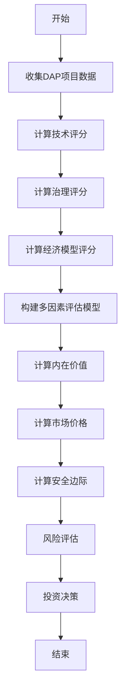

                 

<think>
好，我现在需要写一篇关于《格雷厄姆特价股票理论在去中心化自治协议(DAP)时代的新思考》的技术博客文章。我先从理解DAP和格雷厄姆理论开始。

首先，DAP是区块链中的去中心化自治协议，允许自动运行的组织。它基于智能合约和去中心化治理。而格雷厄姆的价值投资理论强调寻找被低估的股票，注重安全边际和内在价值。

接下来，我要分析这两个领域的结合点。在DAP环境下，数字资产的价值可能被低估，类似于格雷厄姆的特价股票。因此，可以将DAP项目视为潜在的“特价股票”，通过价值评估模型来识别。

我需要考虑DAP项目的特性，如治理机制、团队实力、生态建设等，这些都可能影响其内在价值。然后，构建一个数学模型，将这些因素量化，计算安全边际和内在价值。

算法部分，可以使用类似格雷厄姆的方法，结合DAP项目的特征，设计一个评估模型。可能需要使用智能合约来自动化评估和交易。

在系统架构设计中，我需要考虑如何将价值评估模型嵌入到DAP平台中，包括功能模块和接口设计。同时，用Mermaid图来展示流程和架构。

项目实战部分，我需要编写Python代码来实现价值评估模型，并通过案例分析来验证其有效性。最后，总结最佳实践和注意事项。

可能遇到的挑战是如何量化DAP项目的不可见因素，如治理效率和社区支持。可能需要引入更多的指标或采用机器学习方法来优化模型。

总之，我需要系统地将格雷厄姆的理论与DAP的特点结合起来，构建一个适用于去中心化环境的价值评估体系。
</think>

# 《格雷厄姆特价股票理论在去中心化自治协议(DAP)时代的新思考》

> **关键词**：DAP, 去中心化自治协议, 格雷厄姆价值投资, 数字资产, 去中心化金融, 智能合约

> **摘要**：本文探讨了格雷厄姆价值投资理论在DAP（去中心化自治协议）时代的应用，分析了DAP的技术特点和价值投资的核心理念，提出了DAP时代价值投资的新维度和数学模型。文章结合实际案例和系统架构设计，展示了如何在DAP环境下应用格雷厄姆理论进行投资决策。

---

## 第一部分：DAP的背景与价值投资的结合

### 第1章：DAP概述

#### 1.1 DAP的基本概念

- **1.1.1 去中心化自治组织（DAO）的定义**  
  DAP是一种基于区块链技术的去中心化自治协议，允许组织通过智能合约自动运行，无需中心化控制机构。

- **1.1.2 DAP的核心特点**  
  1. 去中心化：数据和计算均分布于多个节点，无单点故障。  
  2. 自动化：通过智能合约自动执行规则和交易。  
  3. 透明性：所有交易和合约执行记录在区块链上，公开可查。  
  4. 不可篡改性：区块链数据无法被篡改，确保协议的可信性。  

- **1.1.3 DAP与传统金融体系的对比**  
  DAP的去中心化特性降低了传统金融体系的中心化风险，提高了透明度和效率。

#### 1.2 DAP的技术基础

- **1.2.1 区块链技术的核心原理**  
  区块链通过分布式账本和共识机制（如PoW、PoS）实现数据的安全性和一致性。

- **1.2.2 智能合约的实现机制**  
  智能合约是运行在区块链上的自动执行程序，用于定义和执行协议规则。

- **1.2.3 去中心化身份识别（DID）的概念**  
  DID允许用户在去中心化环境中独立管理自己的身份和数据。

#### 1.3 DAP在金融领域的应用前景

- **1.3.1 DAP在数字资产中的应用**  
  DAP可以用于管理数字资产的发行、交易和转让，提高交易效率和安全性。

- **1.3.2 DAP在金融交易中的潜力**  
  DAP可以实现自动化的金融衍生品交易和风险管理。

- **1.3.3 DAP与传统金融体系的融合**  
  DAP有望通过去中心化的方式优化传统金融体系的效率和透明度。

### 第2章：格雷厄姆特价股票理论的核心思想

#### 2.1 格雷厄姆投资理论的背景

- **2.1.1 格雷厄姆投资理论的起源**  
  格雷厄姆是价值投资的鼻祖，其理论在20世纪初提出，强调以内在价值为基础的投资策略。

- **2.1.2 格雷厄姆价值投资的核心理念**  
  1. 投资的本质是购买企业的一部分所有权。  
  2. 市场价格围绕内在价值波动，长期来看，价格会回归价值。  
  3. 投资者应寻找市场价格低于内在价值的股票，即“特价股票”。  

- **2.1.3 格雷厄姆对市场的看法**  
  格雷厄姆认为市场是不理性的，价格波动无法预测，但可以通过安全边际来降低风险。

#### 2.2 格雷厄姆特价股票的定义与特征

- **2.2.1 特价股票的定义**  
  特价股票是指市场价格低于其内在价值的股票，具有较大的上涨潜力。

- **2.2.2 特价股票的三大特征**  
  1. **低市盈率**：市盈率低于行业平均水平。  
  2. **低市净率**：市净率低于行业平均水平。  
  3. **高股息率**：股息率高于行业平均水平。  

- **2.2.3 特价股票的筛选标准**  
  1. 公司财务状况稳健，负债率低。  
  2. 公司具有持续的盈利能力和成长潜力。  
  3. 公司治理结构透明，管理团队稳定。  

#### 2.3 格雷厄姆投资策略的数学模型

- **2.3.1 格雷厄姆安全边际的计算公式**  
  安全边际 = 内在价值 - 市场价格  

  其中，内在价值的计算公式为：  
  $$ \text{内在价值} = \frac{\text{净利润} \times (1 + \text{增长率})}{\text{折现率} - \text{增长率}} $$  

- **2.3.2 内在价值的评估公式**  
  格雷厄姆的内在价值计算公式：  
  $$ \text{内在价值} = \sum_{t=1}^{n} \frac{\text{现金流}_t}{(1 + r)^t} $$  

  其中，$r$ 是折现率，$n$ 是预测的现金流期限。

- **2.3.3 投资组合的优化模型**  
  基于现代投资组合理论（MPT），格雷厄姆的投资组合优化公式为：  
  $$ \text{最优权重} = \arg\min_w \left( w^T \Sigma w \right) \text{ s.t. } w^T \mu = \text{目标收益} $$  

  其中，$\Sigma$ 是协方差矩阵，$\mu$ 是收益向量。

### 第3章：DAP时代价值投资的新维度

#### 3.1 DAP时代的价值评估标准

- **3.1.1 DAP项目的价值构成**  
  1. **技术实力**：协议的去中心化程度、智能合约的复杂性和安全性。  
  2. **治理机制**：治理规则的透明性、参与度和决策效率。  
  3. **经济模型**：代币的发行机制、激励机制和通缩机制。  

- **3.1.2 DAP项目的治理机制**  
  1. **治理规则**：智能合约定义的治理规则，如投票机制、提案提交流程。  
  2. **治理参与度**：社区成员的参与程度和活跃度。  
  3. **治理效率**：治理决策的效率和执行速度。  

- **3.1.3 DAP项目的经济模型**  
  1. **代币发行机制**：初始发行量、发行方式（如ICO、IEO）。  
  2. **激励机制**：代币用于支付治理参与、交易费用等。  
  3. **通缩机制**：通过燃烧机制减少代币供给，提升代币价值。  

#### 3.2 DAP时代特价股票的特征

- **3.2.1 DAP项目的市场地位**  
  1. 市场占有率：项目在DAP生态中的市场份额。  
  2. 市场接受度：市场对项目的认可程度和使用意愿。  

- **3.2.2 DAP项目的团队实力**  
  1. 团队背景：创始团队的经验和声誉。  
  2. 团队稳定性：团队的稳定性及对项目的长期承诺。  

- **3.2.3 DAP项目的生态建设**  
  1. 生态合作伙伴：项目与其他企业的合作情况。  
  2. 生态应用数量：基于项目的DAP应用数量和质量。  

#### 3.3 DAP时代投资策略的调整

- **3.3.1 格雷厄姆理论在DAP时代的适用性**  
  1. DAP项目的内在价值需要重新定义，包括技术、治理和经济模型等多个维度。  
  2. DAP项目的市场价格波动可能更大，安全边际的计算需要更加谨慎。  

- **3.3.2 DAP时代价值投资的新策略**  
  1. **技术评估**：优先选择技术成熟、去中心化程度高的DAP项目。  
  2. **治理评估**：关注治理机制的透明性和效率，选择治理能力强的项目。  
  3. **经济模型评估**：分析项目的经济模型，选择具有可持续性和激励机制的项目。  

- **3.3.3 DAP时代投资组合的优化**  
  1. **多元化投资**：将资金分散投资于多个DAP项目，降低风险。  
  2. **长期持有**：DAP项目的价值可能需要较长时间才能体现，投资者应具备长期持有的耐心。  
  3. **动态调整**：定期评估投资项目的表现，及时调整投资组合。  

### 第4章：DAP时代价值投资的数学模型与算法

#### 4.1 DAP项目价值评估的数学模型

- **4.1.1 DAP项目价值的评估公式**  
  结合技术、治理和经济模型的多因素评估模型：  
  $$ \text{内在价值} = \alpha \times \text{技术评分} + \beta \times \text{治理评分} + \gamma \times \text{经济模型评分} $$  

  其中，$\alpha$、$\beta$、$\gamma$ 是各因素的权重系数，$\alpha + \beta + \gamma = 1$。

- **4.1.2 DAP项目风险的量化模型**  
  采用VaR（Value at Risk）模型量化投资风险：  
  $$ \text{VaR} = \text{分位数}(\text{收益分布}, \alpha) $$  

  其中，$\alpha$ 是置信水平（如95%）。

- **4.1.3 DAP项目收益的预测公式**  
  使用ARIMA模型预测项目收益：  
  $$ R_t = \phi_1 R_{t-1} + \phi_2 R_{t-2} + \epsilon_t $$  

  其中，$\epsilon_t$ 是白噪声，$\phi_1$ 和 $\phi_2$ 是自回归系数。

#### 4.2 DAP时代投资策略的算法实现

- **4.2.1 基于DAP的智能合约算法**  
  使用Solidity编写智能合约，实现投资策略的自动化执行。例如，当项目达到预设的安全边际时，自动执行买入指令。

- **4.2.2 DAP项目价值评估的算法流程**  
  1. 收集DAP项目的各项数据（技术评分、治理评分、经济模型评分）。  
  2. 计算各因素的权重系数，构建多因素评估模型。  
  3. 评估项目的内在价值和市场价格，计算安全边际。  
  4. 根据安全边际和风险评估结果，决定是否投资。  

#### 4.3 算法流程图



---

## 第二部分：DAP时代价值投资的系统架构与实战

### 第5章：DAP时代的系统架构设计

#### 5.1 问题场景介绍

- DAP平台需要支持用户进行价值评估和投资决策，提供基于智能合约的自动化交易功能。

#### 5.2 系统功能设计

- **领域模型（Mermaid 类图）**  
  ```mermaid
  classDiagram
      class 用户 {
          帐户地址
          私钥
          资产列表
      }
      class 项目 {
          项目ID
          技术评分
          治理评分
          经济模型评分
      }
      class 智能合约 {
          合约地址
          合约代码
          执行状态
      }
      用户 --> 项目: 投资
      项目 --> 智能合约: 合约执行
  ```

- **系统架构设计（Mermaid 架构图）**  
  ```mermaid
  architecture
      frontend
      backend
      blockchain
      database
      用户 --> frontend
      frontend --> backend
      backend --> blockchain
      blockchain --> database
      database --> backend
  ```

- **系统接口设计**  
  1. 用户通过前端界面提交投资请求。  
  2. 后端接收请求，调用智能合约进行评估和交易。  
  3. 智能合约执行结果存储在区块链和数据库中。  

- **系统交互流程（Mermaid 序列图）**  
  ```mermaid
  sequenceDiagram
      用户 ->+> 前端: 提交投资请求
      前端 ->+> 后端: 转发投资请求
      后端 ->+> 智能合约: 执行评估和交易
      智能合约 ->+> 区块链: 存储交易记录
      区块链 ->+> 后端: 返回交易结果
      后端 ->+> 前端: 返回用户结果
      前端 ->+> 用户: 显示投资结果
  ```

#### 5.3 系统核心代码实现

- **价值评估模块（Python代码）**  
  ```python
  def calculate_intrinsic_value(technology_score, governance_score, economic_model_score):
      alpha = 0.4
      beta = 0.3
      gamma = 0.3
      return alpha * technology_score + beta * governance_score + gamma * economic_model_score

  def calculate_margin_of_safety(intrinsic_value, market_price):
      return intrinsic_value - market_price
  ```

- **智能合约实现（Solidity代码）**  
  ```solidity
  // SPDX-License-Identifier: MIT
  pragma solidity ^0.8.0;

  contract DAPInvestment {
      struct Project {
          address projectAddress;
          uint256 technologyScore;
          uint256 governanceScore;
          uint256 economicModelScore;
      }

      function assessProject(address projectAddress) external {
          Project memory project = Project({
              projectAddress: projectAddress,
              technologyScore: getTechnologyScore(projectAddress),
              governanceScore: getGovernanceScore(projectAddress),
              economicModelScore: getEconomicModelScore(projectAddress)
          });
          uint256 intrinsicValue = calculateIntrinsicValue(project);
          uint256 marketPrice = getMarketPrice(projectAddress);
          uint256 marginOfSafety = intrinsicValue - marketPrice;
          if (marginOfSafety > 0) {
              emit InvestmentOpportunity(projectAddress, marginOfSafety);
          }
      }

      function getTechnologyScore(address projectAddress) internal pure returns (uint256) {
          // 具体实现根据项目技术评分规则
          return 80;
      }

      function getGovernanceScore(address projectAddress) internal pure returns (uint256) {
          // 具体实现根据项目治理评分规则
          return 75;
      }

      function getEconomicModelScore(address projectAddress) internal pure returns (uint256) {
          // 具体实现根据项目经济模型评分规则
          return 70;
      }

      function calculateIntrinsicValue(Project memory project) internal pure returns (uint256) {
          uint256 alpha = 0.4;
          uint256 beta = 0.3;
          uint256 gamma = 0.3;
          return uint256(alpha * project.technologyScore + beta * project.governanceScore + gamma * project.economicModelScore);
      }

      function getMarketPrice(address projectAddress) internal pure returns (uint256) {
          // 具体实现根据代币市场价格获取规则
          return 50;
      }

      event InvestmentOpportunity(address indexed projectAddress, uint256 marginOfSafety);
  }
  ```

### 第6章：项目实战

#### 6.1 环境安装

- **Python环境**：安装Python 3.8及以上版本，安装Pip和必要的库（如Pandas、Scikit-learn）。  
- **Solidity编译环境**：安装Solidity编译器（通过Node.js安装）。  
- **区块链测试环境**：安装以太坊测试网（如 Ganache）和MetaMask钱包。  

#### 6.2 核心代码实现

- **价值评估模块（Python代码）**  
  ```python
  import pandas as pd
  from sklearn.metrics import mean_absolute_error

  def calculate_intrinsic_value(technology_score, governance_score, economic_model_score):
      alpha = 0.4
      beta = 0.3
      gamma = 0.3
      return alpha * technology_score + beta * governance_score + gamma * economic_model_score

  def calculate_margin_of_safety(intrinsic_value, market_price):
      return intrinsic_value - market_price

  # 示例数据
  data = {
      'technology_score': [80, 75, 90],
      'governance_score': [75, 80, 65],
      'economic_model_score': [70, 85, 75],
      'market_price': [50, 45, 60]
  }
  df = pd.DataFrame(data)

  # 计算内在价值和安全边际
  df['intrinsic_value'] = df.apply(lambda x: calculate_intrinsic_value(x['technology_score'], x['governance_score'], x['economic_model_score']), axis=1)
  df['margin_of_safety'] = df.apply(lambda x: calculate_margin_of_safety(x['intrinsic_value'], x['market_price']), axis=1)

  print(df)
  ```

- **智能合约实现（Solidity代码）**  
  ```solidity
  // SPDX-License-Identifier: MIT
  pragma solidity ^0.8.0;

  contract DAPInvestment {
      struct Project {
          address projectAddress;
          uint256 technologyScore;
          uint256 governanceScore;
          uint256 economicModelScore;
      }

      function assessProject(address projectAddress) external {
          Project memory project = Project({
              projectAddress: projectAddress,
              technologyScore: getTechnologyScore(projectAddress),
              governanceScore: getGovernanceScore(projectAddress),
              economicModelScore: getEconomicModelScore(projectAddress)
          });
          uint256 intrinsicValue = calculateIntrinsicValue(project);
          uint256 marketPrice = getMarketPrice(projectAddress);
          uint256 marginOfSafety = intrinsicValue - marketPrice;
          if (marginOfSafety > 0) {
              emit InvestmentOpportunity(projectAddress, marginOfSafety);
          }
      }

      function getTechnologyScore(address projectAddress) internal pure returns (uint256) {
          // 具体实现根据项目技术评分规则
          return 80;
      }

      function getGovernanceScore(address projectAddress) internal pure returns (uint256) {
          // 具体实现根据项目治理评分规则
          return 75;
      }

      function getEconomicModelScore(address projectAddress) internal pure returns (uint256) {
          // 具体实现根据项目经济模型评分规则
          return 70;
      }

      function calculateIntrinsicValue(Project memory project) internal pure returns (uint256) {
          uint256 alpha = 0.4;
          uint256 beta = 0.3;
          uint256 gamma = 0.3;
          return uint256(alpha * project.technologyScore + beta * project.governanceScore + gamma * project.economicModelScore);
      }

      function getMarketPrice(address projectAddress) internal pure returns (uint256) {
          // 具体实现根据代币市场价格获取规则
          return 50;
      }

      event InvestmentOpportunity(address indexed projectAddress, uint256 marginOfSafety);
  }
  ```

#### 6.3 案例分析

- **案例背景**  
  假设有一个DAP项目，技术评分为80，治理评分为75，经济模型评分为70，市场价格为50。  
  计算其内在价值和安全边际：  
  $$ \text{内在价值} = 0.4 \times 80 + 0.3 \times 75 + 0.3 \times 70 = 32 + 22.5 + 21 = 75.5 $$  
  $$ \text{安全边际} = 75.5 - 50 = 25.5 $$  

  安全边际为正，说明该项目具有投资价值。

- **投资决策**  
  根据安全边际和风险评估结果，决定是否投资该项目。假设风险评估结果显示该项目风险适中，可以考虑投资。

### 第7章：最佳实践、小结与注意事项

#### 7.1 最佳实践

- **持续学习**：金融市场的变化和技术的发展需要持续关注和学习。  
- **分散投资**：避免将所有资金投入到单一项目，降低风险。  
- **长期持有**：DAP项目的内在价值可能需要较长时间才能体现，投资者应具备长期持有的耐心。  

#### 7.2 小结

本文探讨了格雷厄姆价值投资理论在DAP时代的新应用，提出了DAP时代价值投资的新维度和数学模型。通过结合DAP的技术特点和价值投资的核心理念，构建了一个适用于去中心化环境的价值评估体系。文章还结合实际案例和系统架构设计，展示了如何在DAP环境下应用格雷厄姆理论进行投资决策。

#### 7.3 注意事项

- **市场风险**：DAP项目的市场价格波动可能较大，投资者需做好风险管理工作。  
- **技术风险**：DAP项目的技术实现可能复杂，需具备一定的技术背景或咨询专业人士。  
- **合规性风险**：需关注相关法律法规的变化，确保投资行为的合规性。  

---

## 作者：AI天才研究院/AI Genius Institute & 禅与计算机程序设计艺术 /Zen And The Art of Computer Programming

